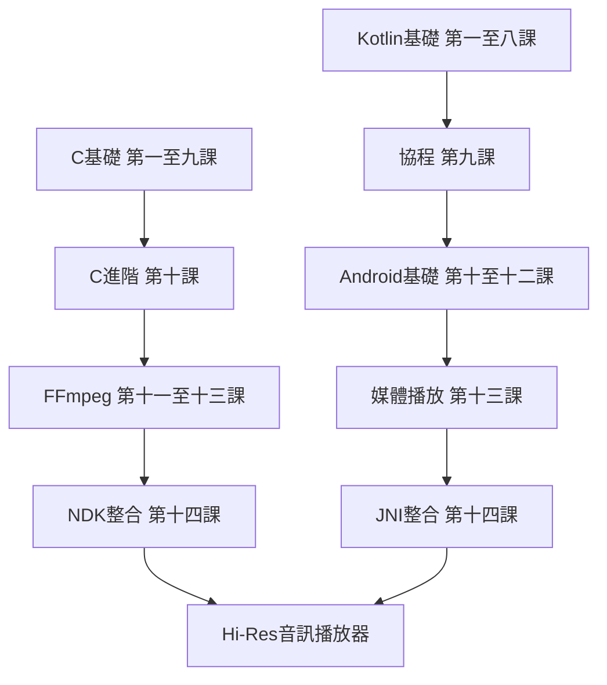

# C/Kotlin從入門到精通：打造Hi-Res FFmpeg音樂播放器

> 完整指南：Android NDK與FFmpeg高解析度音訊開發（24-bit/192kHz FLAC/WAV）

## 關於本書

本書專為Android開發者設計，從C語言基礎到Kotlin進階特性，深入探討如何使用FFmpeg實現Hi-Res音訊播放（24-bit/192kHz FLAC/WAV）。每一課包含學習目標、理論解釋、程式碼範例、常見錯誤和練習題。

### 目標讀者
- 想要掌握NDK和JNI的Android開發者
- 實現Hi-Res音訊處理的音訊開發者
- 從Java/Kotlin轉向C/C++的開發者

---

## 目錄

### 第一部分：C語言基礎到進階

| 課程 | 主題 | 描述 |
|------|------|------|
| [第一課](c/lesson-01-entry/README.md) | Hello World與編譯流程 | gcc/clang/NDK編譯、預處理器、#include |
| [第二課](c/lesson-02-types/README.md) | 基本型別 | typedef、列舉、const/volatile、sizeof/alignof |
| [第三課](c/lesson-03-control/README.md) | 控制流程 | if/switch、迴圈、goto、條件運算子 |
| [第四課](c/lesson-04-functions/README.md) | 函數 | 定義/宣告、可變參數、遞迴、static inline |
| [第五課](c/lesson-05-pointers/README.md) | 指標 | 指標算術、陣列退化、多維陣列、函數指標 |
| [第六課](c/lesson-06-memory/README.md) | 記憶體管理 | malloc/free、calloc/realloc、記憶體對齊、緩衝區溢位 |
| [第七課](c/lesson-07-strings/README.md) | 字串處理 | 字元陣列、str*函數、空終止字串 |
| [第八課](c/lesson-08-structs/README.md) | 結構體 | struct/union、位元欄位、自引用結構 |
| [第九課](c/lesson-09-fileio/README.md) | 檔案I/O | stdio、二進位I/O、errno錯誤處理 |
| [第十課](c/lesson-10-advanced/README.md) | 進階特性 | C11執行緒、原子操作、可變參數、_Generic |
| [第十一課](c/lesson-11-ffmpeg-basics/README.md) | FFmpeg基礎 | libavformat、AVFormatContext、封包讀取 |
| [第十二課](c/lesson-12-ffmpeg-decode/README.md) | FFmpeg解碼 | AVCodecContext、解碼管道、幀處理 |
| [第十三課](c/lesson-13-ffmpeg-resample/README.md) | FFmpeg重取樣 | SwrContext、192kHz/24-bit hi-res、通道佈局 |
| [第十四課](c/lesson-14-ndk-ffmpeg/README.md) | NDK整合 | Android.mk/CMake、JNI、音訊管道 |

### 第二部分：Kotlin語言與Android開發

| 課程 | 主題 | 描述 |
|------|------|------|
| [第一課](kotlin/lesson-01-entry/README.md) | Hello World | Android Studio、package/main、REPL |
| [第二課](kotlin/lesson-02-types/README.md) | 型別系統 | val/var、型別推斷、可空型別 |
| [第三課](kotlin/lesson-03-control/README.md) | 控制流程 | if/when、範圍、標籤跳轉 |
| [第四課](kotlin/lesson-04-functions/README.md) | 進階函數 | 高階函數、lambda、inline、tailrec |
| [第五課](kotlin/lesson-05-nullsafety/README.md) | 空值安全 | ?運算子、!!、安全呼叫、作用域函數 |
| [第六課](kotlin/lesson-06-collections/README.md) | 集合 | List/Map/Set、map/filter/fold操作 |
| [第七課](kotlin/lesson-07-oop-basics/README.md) | OOP基礎 | 類別、建構子、繼承 |
| [第八課](kotlin/lesson-08-oop-advanced/README.md) | OOP進階 | 資料類別、密封類別、擴展函數 |
| [第九課](kotlin/lesson-09-coroutines/README.md) | 協程 | 掛起函數、CoroutineScope、Flow |
| [第十課](kotlin/lesson-10-generics/README.md) | 泛型 | 變異、reified、星投影 |
| [第十一課](kotlin/lesson-11-fileio/README.md) | 檔案處理 | java.io、kotlinx.serialization |
| [第十二課](kotlin/lesson-12-android-basics/README.md) | Android基礎 | Activity/Fragment、Intent、生命週期 |
| [第十三課](kotlin/lesson-13-media-audio/README.md) | 媒體播放 | MediaPlayer、AudioTrack、ExoPlayer |
| [第十四課](kotlin/lesson-14-jni-ffmpeg/README.md) | JNI整合 | 呼叫C FFmpeg、@Native、緩衝區傳遞 |

---

## 專案結構

```
bibichan-Android-Playground/
├── index.md              # 書籍索引（本檔案）
├── c/                    # C語言課程
│   ├── lesson-01-entry/
│   │   ├── README.md     # 課程內容
│   │   └── examples/     # 程式碼範例
│   ├── lesson-02-types/
│   └── ...
├── kotlin/               # Kotlin語言課程
│   ├── lesson-01-entry/
│   │   ├── README.md
│   │   └── examples/
│   └── ...
└── prompt.txt            # 書籍規格
```

---

## 學習路徑



---

## Hi-Res音訊專案

本書的最終目標是構建一個完整的Hi-Res音訊播放器：

- **支援格式**：FLAC、WAV、ALAC、DSD
- **取樣率**：最高384kHz
- **位元深度**：16/24/32 bit
- **架構**：
  - C層：FFmpeg解碼 + SwrContext重取樣
  - JNI層：音訊緩衝區傳遞
  - Kotlin層：ExoPlayer/AudioTrack播放

### 技術架構

```
┌─────────────────────────────────────────────────────────┐
│                    Kotlin/Android層                      │
│  ┌─────────────┐  ┌─────────────┐  ┌─────────────────┐  │
│  │  Compose UI │  │  ViewModel  │  │   MediaSession  │  │
│  └─────────────┘  └─────────────┘  └─────────────────┘  │
│                          │                               │
│                    ┌─────▼─────┐                         │
│                    │ AudioTrack│                         │
│                    └─────┬─────┘                         │
└──────────────────────────┼──────────────────────────────┘
                           │ JNI
┌──────────────────────────▼──────────────────────────────┐
│                      C/NDK層                             │
│  ┌─────────────┐  ┌─────────────┐  ┌─────────────────┐  │
│  │ FFmpeg解碼  │  │ SwrContext  │  │   JNI介面       │  │
│  │ avcodec     │  │ 重取樣      │  │   JNIEXPORT     │  │
│  └─────────────┘  └─────────────┘  └─────────────────┘  │
│                          │                               │
│                    ┌─────▼─────┐                         │
│                    │ 音訊緩衝區│                         │
│                    └───────────┘                         │
└─────────────────────────────────────────────────────────┘
```

---

## FFmpeg API涵蓋範圍

本書涵蓋以下FFmpeg API：

### libavformat（封裝格式處理）
- `AVFormatContext` - 格式上下文
- `avformat_open_input()` - 開啟輸入檔案
- `avformat_find_stream_info()` - 尋找流資訊
- `av_read_frame()` - 讀取封包
- `avformat_close_input()` - 關閉輸入

### libavcodec（編解碼處理）
- `AVCodecContext` - 編解碼上下文
- `AVCodec` - 編解碼器
- `avcodec_find_decoder()` - 尋找解碼器
- `avcodec_open2()` - 開啟編解碼器
- `avcodec_send_packet()` - 發送封包
- `avcodec_receive_frame()` - 接收幀

### libswresample（重取樣）
- `SwrContext` - 重取樣上下文
- `swr_alloc()` - 分配上下文
- `swr_init()` - 初始化
- `swr_convert()` - 轉換樣本
- `swr_free()` - 釋放上下文

### libavutil（工具函數）
- `AVFrame` - 音訊/視訊幀
- `AVPacket` - 壓縮資料封包
- `av_frame_alloc()` - 分配幀
- `av_packet_alloc()` - 分配封包
- `av_opt_set_int()` - 設定選項

---

## Android組件涵蓋範圍

本書涵蓋以下Android API：

### 媒體播放
- `MediaPlayer` - 基礎媒體播放
- `AudioTrack` - 原始音訊播放
- `ExoPlayer` / `Media3` - 進階媒體播放器

### 音訊配置
- `AudioFormat` - 音訊格式配置
- `AudioManager` - 音訊管理
- `AudioAttributes` - 音訊屬性

### JNI整合
- `native`關鍵字 - 宣告原生方法
- `JNI_OnLoad` - 原生庫載入
- `JNIEnv` - JNI環境指標
- `jbyteArray` / `jintArray` - JNI陣列型別

### Jetpack Compose
- `@Composable` - 可組合函數
- `State` / `MutableState` - 狀態管理
- `LaunchedEffect` - 副作用處理
- `Flow` - 資料流

---

## 開發環境設置

### 必要工具

1. **Android Studio** - Hedgehog (2023.1.1) 或更新版本
2. **Android NDK** - r25c 或更新版本
3. **CMake** - 3.22.1 或更新版本
4. **FFmpeg** - 6.0 或更新版本

### FFmpeg編譯（Android）

```bash
# 下載FFmpeg原始碼
git clone https://git.ffmpeg.org/ffmpeg.git

# 設定NDK路徑
export NDK=/path/to/android-ndk

# 編譯ARM64版本
./configure \
  --target-os=android \
  --arch=aarch64 \
  --cpu=armv8-a \
  --enable-cross-compile \
  --cc=$NDK/toolchains/llvm/prebuilt/linux-x86_64/bin/clang \
  --enable-shared \
  --disable-static \
  --disable-programs \
  --disable-doc \
  --enable-decoder=flac,aac,pcm_s16le,pcm_s24le \
  --enable-demuxer=flac,wav,aac \
  --enable-parser=flac,aac \
  --prefix=/usr/local

make -j$(nproc)
make install
```

---

## 授權

本書以 [CC BY-NC-SA 4.0](LICENSE) 授權發布。

---

*最後更新：2026-04-03*
