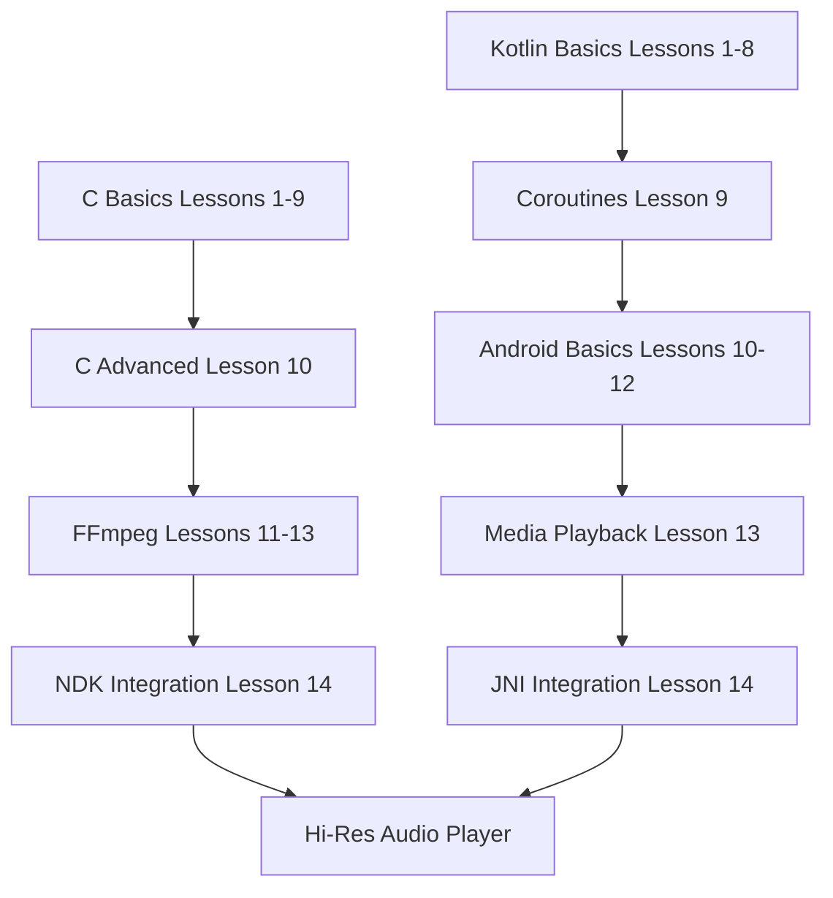

# C/Kotlin from Beginner to Master: Building Hi-Res FFmpeg Music Player

> Complete Guide: Android NDK and FFmpeg High-Resolution Audio Development (24-bit/192kHz FLAC/WAV)

## About This Book

This book is designed for Android developers, covering C language fundamentals to Kotlin advanced features, with deep exploration of Hi-Res audio playback using FFmpeg (24-bit/192kHz FLAC/WAV). Each lesson includes learning objectives, theoretical explanations, code examples, common errors, and exercises.

### Target Audience
- Android developers wanting to master NDK and JNI
- Audio developers implementing Hi-Res audio processing
- Developers transitioning from Java/Kotlin to C/C++

---

## Table of Contents

### Part 1: C Language Fundamentals to Advanced

| Lesson | Topic | Description |
|--------|-------|-------------|
| [Lesson 01](c/lesson-01-entry/README.md) | Hello World & Compilation | gcc/clang/NDK compilation, preprocessor, #include |
| [Lesson 02](c/lesson-02-types/README.md) | Basic Types | typedef, enum, const/volatile, sizeof/alignof |
| [Lesson 03](c/lesson-03-control/README.md) | Control Flow | if/switch, loops, goto, conditional operator |
| [Lesson 04](c/lesson-04-functions/README.md) | Functions | Definition/declaration, variadic, recursion, static inline |
| [Lesson 05](c/lesson-05-pointers/README.md) | Pointers | Pointer arithmetic, array decay, multidimensional arrays, function pointers |
| [Lesson 06](c/lesson-06-memory/README.md) | Memory Management | malloc/free, calloc/realloc, memory alignment, buffer overflow |
| [Lesson 07](c/lesson-07-strings/README.md) | String Handling | Character arrays, str* functions, null-terminated strings |
| [Lesson 08](c/lesson-08-structs/README.md) | Structures | struct/union, bit fields, self-referential structures |
| [Lesson 09](c/lesson-09-fileio/README.md) | File I/O | stdio, binary I/O, errno error handling |
| [Lesson 10](c/lesson-10-advanced/README.md) | Advanced Features | C11 threads, atomic operations, variadic, _Generic |
| [Lesson 11](c/lesson-11-ffmpeg-basics/README.md) | FFmpeg Basics | libavformat, AVFormatContext, packet reading |
| [Lesson 12](c/lesson-12-ffmpeg-decode/README.md) | FFmpeg Decoding | AVCodecContext, decode pipeline, frame processing |
| [Lesson 13](c/lesson-13-ffmpeg-resample/README.md) | FFmpeg Resampling | SwrContext, 192kHz/24-bit hi-res, channel layout |
| [Lesson 14](c/lesson-14-ndk-ffmpeg/README.md) | NDK Integration | Android.mk/CMake, JNI, audio pipeline |

### Part 2: Kotlin Language & Android Development

| Lesson | Topic | Description |
|--------|-------|-------------|
| [Lesson 01](kotlin/lesson-01-entry/README.md) | Hello World | Android Studio, package/main, REPL |
| [Lesson 02](kotlin/lesson-02-types/README.md) | Type System | val/var, type inference, nullable types |
| [Lesson 03](kotlin/lesson-03-control/README.md) | Control Flow | if/when, ranges, label jumps |
| [Lesson 04](kotlin/lesson-04-functions/README.md) | Advanced Functions | Higher-order functions, lambda, inline, tailrec |
| [Lesson 05](kotlin/lesson-05-nullsafety/README.md) | Null Safety | ? operator, !!, safe calls, scope functions |
| [Lesson 06](kotlin/lesson-06-collections/README.md) | Collections | List/Map/Set, map/filter/fold operations |
| [Lesson 07](kotlin/lesson-07-oop-basics/README.md) | OOP Basics | Classes, constructors, inheritance |
| [Lesson 08](kotlin/lesson-08-oop-advanced/README.md) | OOP Advanced | Data classes, sealed classes, extension functions |
| [Lesson 09](kotlin/lesson-09-coroutines/README.md) | Coroutines | Suspend functions, CoroutineScope, Flow |
| [Lesson 10](kotlin/lesson-10-generics/README.md) | Generics | Variance, reified, star projection |
| [Lesson 11](kotlin/lesson-11-fileio/README.md) | File Handling | java.io, kotlinx.serialization |
| [Lesson 12](kotlin/lesson-12-android-basics/README.md) | Android Basics | Activity/Fragment, Intent, lifecycle |
| [Lesson 13](kotlin/lesson-13-media-audio/README.md) | Media Playback | MediaPlayer, AudioTrack, ExoPlayer |
| [Lesson 14](kotlin/lesson-14-jni-ffmpeg/README.md) | JNI Integration | Call C FFmpeg, @Native, buffer passing |

---

## Project Structure

```
bibichan-Android-Playground/
├── README.md           # Book index (this file)
├── c/                  # C language lessons
│   ├── lesson-01-entry/
│   │   ├── README.md   # Lesson content
│   │   └── examples/   # Code examples
│   ├── lesson-02-types/
│   └── ...
├── kotlin/             # Kotlin language lessons
│   ├── lesson-01-entry/
│   │   ├── README.md
│   │   └── examples/
│   └── ...
└── prompt.md           # Book specifications
```

---

## Learning Path



---

## Hi-Res Audio Project

The ultimate goal of this book is to build a complete Hi-Res audio player:

- **Supported Formats**: FLAC, WAV, ALAC, DSD
- **Sample Rates**: Up to 384kHz
- **Bit Depths**: 16/24/32 bit
- **Architecture**:
  - C Layer: FFmpeg decoding + SwrContext resampling
  - JNI Layer: Audio buffer passing
  - Kotlin Layer: ExoPlayer/AudioTrack playback

### Technical Architecture

```
┌─────────────────────────────────────────────────────────┐
│ Kotlin/Android Layer                                    │
│ ┌─────────────┐ ┌─────────────┐ ┌─────────────────┐    │
│ │ Compose UI  │ │ ViewModel   │ │ MediaSession    │    │
│ └─────────────┘ └─────────────┘ └─────────────────┘    │
│                         │                               │
│                   ┌─────▼─────┐                         │
│                   │ AudioTrack│                         │
│                   └─────┬─────┘                         │
└──────────────────────────┼──────────────────────────────┘
                           │ JNI
┌──────────────────────────▼──────────────────────────────┐
│ C/NDK Layer                                             │
│ ┌─────────────┐ ┌─────────────┐ ┌─────────────────┐    │
│ │ FFmpeg      │ │ SwrContext  │ │ JNI Interface   │    │
│ │ avcodec     │ │ Resampling  │ │ JNIEXPORT       │    │
│ └─────────────┘ └─────────────┘ └─────────────────┘    │
│                         │                               │
│                   ┌─────▼─────┐                         │
│                   │Audio Buffer│                        │
│                   └───────────┘                         │
└─────────────────────────────────────────────────────────┘
```

---

## FFmpeg API Coverage

This book covers the following FFmpeg APIs:

### libavformat (Container Format Handling)
- `AVFormatContext` - Format context
- `avformat_open_input()` - Open input file
- `avformat_find_stream_info()` - Find stream info
- `av_read_frame()` - Read packet
- `avformat_close_input()` - Close input

### libavcodec (Codec Handling)
- `AVCodecContext` - Codec context
- `AVCodec` - Codec
- `avcodec_find_decoder()` - Find decoder
- `avcodec_open2()` - Open codec
- `avcodec_send_packet()` - Send packet
- `avcodec_receive_frame()` - Receive frame

### libswresample (Resampling)
- `SwrContext` - Resampling context
- `swr_alloc()` - Allocate context
- `swr_init()` - Initialize
- `swr_convert()` - Convert samples
- `swr_free()` - Free context

### libavutil (Utility Functions)
- `AVFrame` - Audio/video frame
- `AVPacket` - Compressed data packet
- `av_frame_alloc()` - Allocate frame
- `av_packet_alloc()` - Allocate packet
- `av_opt_set_int()` - Set option

---

## Android Component Coverage

This book covers the following Android APIs:

### Media Playback
- `MediaPlayer` - Basic media playback
- `AudioTrack` - Raw audio playback
- `ExoPlayer` / `Media3` - Advanced media player

### Audio Configuration
- `AudioFormat` - Audio format configuration
- `AudioManager` - Audio management
- `AudioAttributes` - Audio attributes

### JNI Integration
- `native` keyword - Declare native methods
- `JNI_OnLoad` - Native library loading
- `JNIEnv` - JNI environment pointer
- `jbyteArray` / `jintArray` - JNI array types

### Jetpack Compose
- `@Composable` - Composable functions
- `State` / `MutableState` - State management
- `LaunchedEffect` - Side effect handling
- `Flow` - Data stream

---

## Development Environment Setup

### Required Tools

1. **Android Studio** - Hedgehog (2023.1.1) or later
2. **Android NDK** - r25c or later
3. **CMake** - 3.22.1 or later
4. **FFmpeg** - 6.0 or later

### FFmpeg Compilation (Android)

```bash
# Download FFmpeg source
git clone https://git.ffmpeg.org/ffmpeg.git

# Set NDK path
export NDK=/path/to/android-ndk

# Compile ARM64 version
./configure \
  --target-os=android \
  --arch=aarch64 \
  --cpu=armv8-a \
  --enable-cross-compile \
  --cc=$NDK/toolchains/llvm/prebuilt/linux-x86_64/bin/clang \
  --enable-shared \
  --disable-static \
  --disable-programs \
  --disable-doc \
  --enable-decoder=flac,aac,pcm_s16le,pcm_s24le \
  --enable-demuxer=flac,wav,aac \
  --enable-parser=flac,aac \
  --prefix=/usr/local

make -j$(nproc)
make install
```

---

## License

This book is published under [CC BY-NC-SA 4.0](LICENSE).

---

*Last updated: 2026-04-03*
