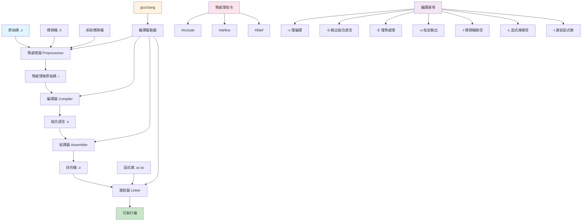

# 第一課：Hello World 與編譯流程

## 一、課程定位

### 1.1 本課在整本書的位置

本課是「C/Kotlin從入門到精通：打造Hi-Res FFmpeg音樂播放器」的第一課，也是C語言部分的入門課。作為整本書的基石，本課將帶領讀者從零開始理解C語言程式的誕生過程——從原始碼到可執行檔案的完整編譯鏈。

在整個學習路徑中，本課扮演著「地基」的角色。後續所有課程（變數型別、控制流程、指標操作、記憶體管理、FFmpeg整合）都建立在本課所建立的編譯流程理解之上。若不理解編譯流程，後續在處理FFmpeg跨平台編譯、NDK工具鏈配置、連結第三方函式庫時將會處處碰壁。

### 1.2 前置知識清單

本課假設讀者具備以下基礎知識：

1. **基本電腦操作能力**：能夠使用終端機（Terminal/Command Prompt）執行命令
2. **檔案系統概念**：理解目錄、檔案路徑、檔案權限等基本概念
3. **文字編輯器使用**：能夠使用任意文字編輯器（VS Code、Vim、Nano等）編輯程式碼
4. **基礎英語閱讀**：能夠閱讀簡單的英文錯誤訊息（程式設計領域的通用語言）

**不需要**具備的知識：
- 任何程式設計經驗（本課從零開始）
- 組合語言或電腦架構知識
- 作業系統內部原理

### 1.3 學完本課後能解決的實際問題

完成本課學習後，讀者將能夠：

1. **獨立編譯C程式**：使用gcc、clang或Android NDK編譯簡單的C程式
2. **理解編譯錯誤訊息**：當編譯失敗時，能夠解讀錯誤訊息並定位問題
3. **管理多檔案專案**：理解標頭檔與原始檔的關係，能夠組織多檔案C專案
4. **使用Makefile自動化編譯**：撰寫簡單的Makefile來自動化編譯流程
5. **為FFmpeg開發做準備**：理解FFmpeg專案的編譯系統結構，為後續課程鋪路

---

## 二、核心概念地圖



上圖展示了C程式從原始碼到可執行檔案的完整流程。這個流程涉及四個主要階段：預處理（Preprocessing）、編譯（Compilation）、組譯（Assembly）、連結（Linking）。每個階段都有特定的輸入和輸出，理解這些階段對於後續處理FFmpeg這類大型專案的編譯問題至關重要。

---

## 三、概念深度解析

### 3.1 預處理器（Preprocessor）

**定義**：預處理器是C編譯系統的第一個階段，它在實際編譯之前處理原始碼中的預處理指令（以#開头的指令）。預處理器不是編譯器，它是一個文字替換工具。

**內部原理**：預處理器的工作方式是「文字替換」。當它遇到`#include <stdio.h>`時，它會將stdio.h檔案的完整內容「貼上」到原始碼中。當它遇到`#define PI 3.14`時，它會將原始碼中所有出現PI的地方替換為3.14。這個過程是機械式的，不進行任何語法檢查。

**限制**：
- 預處理器不理解C語法，只做文字替換
- 巨集定義沒有型別檢查，容易產生難以發現的錯誤
- 遞迴包含可能導致無限迴圈（需要使用標頭檔防護）
- 預處理後的程式碼可能比原始碼大很多倍

**編譯器行為**：gcc使用`cpp`（C Preprocessor）作為預處理器。當執行`gcc -E hello.c -o hello.i`時，gcc會呼叫cpp進行預處理，輸出結果到hello.i檔案。

**組合語言視角**：預處理階段不產生組合語言，它只產生預處理後的C原始碼。但預處理器的輸出會直接影響後續編譯階段產生的組合語言程式碼。

### 3.2 編譯器（Compiler）

**定義**：編譯器是將高階程式語言（如C）轉換為低階語言（如組合語言或機器碼）的程式。C編譯器將預處理後的C原始碼轉換為組合語言。

**內部原理**：編譯器的工作分為多個階段：
1. **詞法分析（Lexical Analysis）**：將原始碼分解為token序列
2. **語法分析（Syntax Analysis）**：根據語法規則建立抽象語法樹（AST）
3. **語意分析（Semantic Analysis）**：檢查型別、作用域等語意規則
4. **中間碼生成（IR Generation）**：生成與平台無關的中間表示
5. **優化（Optimization）**：對中間碼進行各種優化
6. **程式碼生成（Code Generation）**：生成目標平台的組合語言

**限制**：
- 編譯器只能檢查語法錯誤，無法檢查邏輯錯誤
- 優化可能改變程式行為（特別是涉及未定義行為時）
- 不同編譯器可能有不同的擴充功能

**編譯器行為**：gcc使用`cc1`作為實際的編譯器。當執行`gcc -S hello.i -o hello.s`時，gcc會呼叫cc1將預處理後的原始碼編譯為組合語言。

**組合語言視角**：編譯器的輸出就是組合語言。透過查看組合語言輸出，可以理解編譯器如何將C程式碼轉換為機器指令。例如，一個簡單的`return a + b;`可能被編譯為：
```asm
movl -4(%rbp), %eax    ; Load a into eax
addl -8(%rbp), %eax    ; Add b to eax
```

### 3.3 組譯器（Assembler）

**定義**：組譯器將組合語言轉換為機器碼，生成目的檔（Object File）。目的檔包含機器指令和符號表，但還不能直接執行。

**內部原理**：組譯器的工作包括：
1. **解析組合指令**：將助記符（如mov、add）轉換為對應的機器碼
2. **處理標籤和符號**：記錄符號的位置，為連結做準備
3. **生成區段**：將程式碼和資料分別放入.text和.data區段
4. **生成重定位資訊**：記錄需要連結器修正的位址

**限制**：
- 組譯器不處理外部符號的解析
- 目的檔中的位址是相對的，需要連結器修正
- 不同平台的目的檔格式不同（ELF、Mach-O、PE）

**編譯器行為**：gcc使用`as`（GNU Assembler）作為組譯器。當執行`gcc -c hello.s -o hello.o`時，gcc會呼叫as將組合語言組譯為目的檔。

**組合語言視角**：組譯器是組合語言的最終消費者。它將人類可讀的組合語言轉換為機器可執行的二進位指令。

### 3.4 連結器（Linker）

**定義**：連結器將一個或多個目的檔和函式庫合併，生成最終的可執行檔。連結器解析外部符號引用，將分散的目的檔組合成完整的程式。

**內部原理**：連結器的工作包括：
1. **符號解析**：將每個符號引用與其定義關聯起來
2. **重定位**：修正目的檔中的相對位址，使其指向正確的絕對位址
3. **區段合併**：將所有目的檔的相同區段（.text、.data等）合併
4. **生成最終可執行檔**：添加作業系統需要的元資料（如ELF標頭）

**限制**：
- 連結器無法解決型別不匹配問題（C語言的歷史遺留問題）
- 靜態連結會增加可執行檔大小
- 動態連結依賴系統上安裝的函式庫版本

**編譯器行為**：gcc使用`ld`（GNU Linker）作為連結器。當執行`gcc hello.o -o hello`時，gcc會呼叫ld將目的檔連結為可執行檔。

**組合語言視角**：連結器修正組合語言中的符號引用。例如，呼叫`printf`時，組合語言中只記錄了`call printf`，連結器會將其修正為printf函式在libc中的實際位址。

### 3.5 gcc編譯驅動器

**定義**：gcc本身不是編譯器，而是一個「編譯驅動器」（compiler driver）。它協調預處理器、編譯器、組譯器和連結器的工作，根據輸入檔案的副檔名決定呼叫哪些工具。

**內部原理**：gcc根據輸入檔案的副檔名決定處理方式：
- `.c`檔案：執行完整編譯流程（預處理→編譯→組譯→連結）
- `.i`檔案：跳過預處理，直接編譯
- `.s`檔案：跳過預處理和編譯，直接組譯
- `.o`檔案：跳過前三個階段，直接連結

**限制**：
- gcc的行為可能因版本和平台而異
- 某些選項可能被靜默忽略
- 錯誤訊息可能來自不同的工具，格式不一致

**編譯器行為**：可以使用`-v`選項查看gcc實際執行的命令：
```bash
gcc -v hello.c -o hello
```
這會顯示gcc呼叫的所有子程式及其參數。

**組合語言視角**：gcc透過`-S`選項可以讓編譯器在生成組合語言後停止，方便查看編譯器生成的組合語言程式碼。

---

## 四、語法完整規格

### 4.1 #include指令

**BNF語法**：
```
include-line ::= "#include" ("<" header-name ">" | '"' header-name '"')
header-name ::= path-char-sequence
path-char-sequence ::= path-char | path-char-sequence path-char
path-char ::= any-character-except-newline-and-greater-than
```

**語法說明**：
- `#include <file>`：在系統標頭檔目錄中搜尋檔案
- `#include "file"`：先在原始檔所在目錄搜尋，找不到再搜尋系統目錄

**邊界條件**：
- 標頭檔不存在：預處理器報錯
- 標頭檔包含循環引用：需要使用標頭檔防護
- 路徑包含空格：需要使用引號，可能需要轉義

**未定義行為**：
- `#include`後面沒有換行符
- 標頭檔內容不完整（如缺少結尾的`#endif`）

**最佳實踐**：
```c
// 系統標頭檔使用角括號
#include <stdio.h>
#include <stdlib.h>
#include <string.h>

// 專案內標頭檔使用引號
#include "myheader.h"
#include "audio/decoder.h"

// 標頭檔防護（Header Guard）
#ifndef MYHEADER_H
#define MYHEADER_H

// 標頭檔內容...

#endif // MYHEADER_H
```

### 4.2 #define指令

**BNF語法**：
```
define-line ::= "#define" identifier replacement-list(opt)
              | "#define" identifier "(" identifier-list(opt) ")" replacement-list(opt)
replacement-list ::= preprocessing-token | replacement-list preprocessing-token
identifier-list ::= identifier | identifier-list "," identifier
```

**語法說明**：
- 無參數巨集：`#define NAME value`
- 有參數巨集：`#define FUNC(x) ((x) * 2)`
- 空巨集：`#define NAME`（用於條件編譯）

**邊界條件**：
- 巨集名稱與已存在的巨集衝突：產生警告或錯誤
- 巨集參數沒有正確括號：可能導致運算優先級問題
- 巨集定義跨越多行：需要使用反斜線續行

**未定義行為**：
- 巨集遞迴定義：`#define FOO FOO`（某些編譯器可能無限迴圈）
- 巨集參數包含副作用：`#define SQUARE(x) ((x) * (x))`，呼叫`SQUARE(i++)`會導致i遞增兩次

**最佳實踐**：
```c
// 常數定義：使用全大寫命名
#define MAX_BUFFER_SIZE 4096
#define SAMPLE_RATE 48000

// 巨集函數：每個參數和整體都要加括號
#define MAX(a, b) ((a) > (b) ? (a) : (b))
#define MIN(a, b) ((a) < (b) ? (a) : (b))
#define ARRAY_SIZE(arr) (sizeof(arr) / sizeof((arr)[0]))

// 多行巨集：使用反斜線續行，使用do-while(0)包裹
#define LOG_ERROR(msg) do { \
    fprintf(stderr, "Error: %s\n", msg); \
    exit(1); \
} while(0)

// 避免使用：優先使用const和inline函數
// 不好的做法
#define DOUBLE(x) ((x) + (x))
// 好的做法
static inline int double_value(int x) { return x + x; }
```

### 4.3 main函數

**BNF語法**：
```
main-definition ::= type-specifier "main" "(" parameter-list(opt) ")" compound-statement
type-specifier ::= "int"
parameter-list ::= "void"
                 | "int" "argc" "," "char" "*" "argv" "[" "]"
                 | "int" "argc" "," "char" "**" "argv"
```

**標準簽名**：
```c
// 標準形式1：無參數
int main(void);

// 標準形式2：帶命令列參數
int main(int argc, char *argv[]);
// 或等價形式
int main(int argc, char **argv);

// 非標準但常見（不推薦）
int main(int argc, char *argv[], char *envp[]);
```

**邊界條件**：
- `argc`至少為1（程式名稱）
- `argv[argc]`為NULL
- `argv[0]`是程式名稱（但不可靠）
- 返回值應該是`int`，範圍0-255（實際上可能更大）

**未定義行為**：
- 返回非int型別
- 返回值超過INT_MAX
- 修改`argv`指向的字串（某些系統允許，某些不允許）

**最佳實踐**：
```c
#include <stdio.h>
#include <stdlib.h>

int main(int argc, char *argv[]) {
    // 檢查參數數量
    if (argc < 2) {
        fprintf(stderr, "Usage: %s <filename>\n", argv[0]);
        return EXIT_FAILURE;
    }
    
    // 主程式邏輯...
    
    return EXIT_SUCCESS;
}
```

### 4.4 printf函數

**BNF語法**：
```
printf-call ::= "printf" "(" format-string ("," argument-list)? ")"
format-string ::= string-literal
argument-list ::= expression | argument-list "," expression
```

**格式說明符**：
| 說明符 | 型別 | 描述 |
|--------|------|------|
| `%d` | int | 十進位整數 |
| `%u` | unsigned int | 無符號十進位整數 |
| `%x` | unsigned int | 十六進位整數（小寫） |
| `%X` | unsigned int | 十六進位整數（大寫） |
| `%f` | double | 浮點數 |
| `%s` | char* | 字串 |
| `%c` | int | 字元 |
| `%p` | void* | 指標位址 |
| `%%` | - | 百分比符號 |

**邊界條件**：
- 格式字串與參數型別不匹配：未定義行為
- 參數數量少於格式說明符：未定義行為
- 參數數量多於格式說明符：多餘參數被忽略
- 格式字串為NULL：未定義行為

**未定義行為**：
- `%s`參數不是有效的字串指標
- `%s`參數指向的字串沒有終止符
- 緩衝區溢位（使用`%n`或超長字串）

**最佳實踐**：
```c
// 基本輸出
printf("Hello, World!\n");

// 格式化輸出
int count = 42;
double ratio = 3.14159;
const char *name = "Audio";

printf("Count: %d, Ratio: %.2f, Name: %s\n", count, ratio, name);

// 寬度和精度控制
printf("%10d\n", count);      // 寬度10，右對齊
printf("%-10d\n", count);     // 寬度10，左對齊
printf("%.2f\n", ratio);      // 精度2位小數
printf("%10.2f\n", ratio);    // 寬度10，精度2位

// 安全版本（防止緩衝區溢位）
char buffer[100];
snprintf(buffer, sizeof(buffer), "Value: %d", count);
```

---

## 五、範例逐行註解

### 5.1 範例一：hello_basic.c

```c
// File: hello_basic.c
// Purpose: Basic Hello World program demonstrating minimal C program structure
// Compile: gcc hello_basic.c -o hello_basic
// Run:     ./hello_basic

#include <stdio.h>  // Include standard I/O library for printf function

// Main function: program entry point
// Return type: int (exit status to operating system)
int main(void) {    // void indicates no parameters
    // printf: formatted print to stdout
    // "\n": newline character (line break)
    printf("Hello, World!\n");
    
    // Return 0 to indicate successful execution
    // Non-zero values indicate errors
    return 0;
}
```

**逐行解析**：

**第1-4行**：註解區塊。C語言支援兩種註解：
- `//`：單行註解（C99標準引入）
- `/* */`：多行註解（傳統C標準）

這些註解記錄了檔案名稱、用途、編譯指令和執行指令。這是良好的程式設計習慣，特別是在大型專案中。

**第5行**：`#include <stdio.h>`

這是預處理指令。`#include`告訴預處理器將指定的標頭檔內容插入到此位置。`<stdio.h>`是標準輸入輸出標頭檔，包含：
- `printf`函數宣告
- `scanf`函數宣告
- `FILE`型別定義
- 標準輸入輸出宏（`stdin`、`stdout`、`stderr`）

角括號`<>`表示在系統標頭檔目錄中搜尋（如`/usr/include`）。

**第8行**：`int main(void) {`

這是主函數的定義。`int`是返回型別，表示函數返回一個整數。`main`是函數名稱，C標準規定程式入口點必須命名為`main`。`(void)`表示函數不接受任何參數。`{`標記函數體的開始。

**第11行**：`printf("Hello, World!\n");`

`printf`函數將格式化字串輸出到標準輸出（stdout）。`"Hello, World!\n"`是格式字串：
- `Hello, World!`：要輸出的文字
- `\n`：換行符（ASCII碼10），使游標移到下一行開頭

分號`;`標記語句的結束。C語言中，每個語句必須以分號結束。

**第14行**：`return 0;`

`return`語句結束函數執行並返回一個值給呼叫者。對於`main`函數，返回值會傳遞給作業系統：
- `0`：表示程式成功執行（`EXIT_SUCCESS`）
- 非零值：表示程式發生錯誤（`EXIT_FAILURE`）

**第15行**：`}`

右大括號標記函數體的結束。

### 5.2 範例二：hello_args.c

```c
// File: hello_args.c
// Purpose: Demonstrate command-line argument handling
// Compile: gcc hello_args.c -o hello_args
// Run:     ./hello_args arg1 arg2 arg3

#include <stdio.h>  // printf, fprintf
#include <stdlib.h> // EXIT_SUCCESS, EXIT_FAILURE

int main(int argc, char *argv[]) {
    // argc: argument count (includes program name)
    // argv: argument vector (array of strings)
    // argv[0]: program name (may be empty or path)
    // argv[1] to argv[argc-1]: command-line arguments
    // argv[argc]: always NULL (sentinel)
    // argc: argument count (includes program name)
    // argv: argument vector (array of strings)
    // argv[0]: program name (may be empty or path)
    // argv[1] to argv[argc-1]: command-line arguments
    // argv[argc]: always NULL (sentinel)
    
    printf("Program name: %s\n", argv[0]);
    printf("Argument count: %d\n", argc);
    
    // Loop through all arguments
    for (int i = 1; i < argc; i++) {
        printf("argv[%d]: %s\n", i, argv[i]);
    }
    
    // Check if user provided enough arguments
    if (argc < 2) {
        fprintf(stderr, "Usage: %s <name>\n", argv[0]);
        return EXIT_FAILURE;
    }
    
    printf("Hello, %s!\n", argv[1]);
    
    return EXIT_SUCCESS;
}
```

**逐行解析**：

**第6行**：`#include <stdlib.h>`

包含標準函式庫標頭檔，提供：
- `EXIT_SUCCESS`：成功返回值（通常為0）
- `EXIT_FAILURE`：失敗返回值（通常為1）
- `malloc`、`free`等記憶體管理函數
- `atoi`、`atof`等字串轉換函數

**第8行**：`int main(int argc, char *argv[]) {`

這是`main`函數的另一種標準形式。參數說明：
- `argc`（argument count）：命令列參數的數量，包括程式名稱本身
- `argv`（argument vector）：指向參數字串的指標陣列

`char *argv[]`和`char **argv`在函數參數中是等價的。

**第9-14行**：註解區塊

詳細說明了`argc`和`argv`的結構。這是理解命令列參數處理的關鍵。

**第16行**：`printf("Program name: %s\n", argv[0]);`

輸出程式名稱。`argv[0]`通常是執行程式時使用的名稱或路徑。注意：`argv[0]`的值不可靠：
- 可能是空字串
- 可能是相對路徑
- 可能是絕對路徑
- 可能被使用者修改

**第17行**：`printf("Argument count: %d\n", argc);`

輸出參數數量。`argc`至少為1（因為包含程式名稱）。

**第20-22行**：for迴圈

```c
for (int i = 1; i < argc; i++) {
    printf("argv[%d]: %s\n", i, argv[i]);
}
```

這個迴圈遍歷所有命令列參數（從索引1開始，跳過程式名稱）。迴圈變數`i`在C99中可以在for語句中宣告。

**第25-28行**：參數檢查

```c
if (argc < 2) {
    fprintf(stderr, "Usage: %s <name>\n", argv[0]);
    return EXIT_FAILURE;
}
```

檢查使用者是否提供了足夠的參數。如果沒有，輸出使用說明到標準錯誤（stderr）並返回失敗狀態。`fprintf(stderr, ...)`將錯誤訊息輸出到標準錯誤流，而不是標準輸出。這是良好的實踐，因為：
- 錯誤訊息不會被重定向到檔案
- 使用者可以立即看到錯誤
- 程式可以正確地與管道和重定向配合使用

**第30行**：`printf("Hello, %s!\n", argv[1]);`

使用第一個參數作為名稱輸出問候語。`%s`格式說明符用於輸出字串。

### 5.3 範例三：compilation_phases.c

```c
// File: compilation_phases.c
// Purpose: Demonstrate compilation phases with preprocessor directives
// Compile: gcc -E compilation_phases.c -o compilation_phases.i  (preprocess)
//          gcc -S compilation_phases.i -o compilation_phases.s  (compile)
//          gcc -c compilation_phases.s -o compilation_phases.o  (assemble)
//          gcc compilation_phases.o -o compilation_phases       (link)
// Or all at once: gcc compilation_phases.c -o compilation_phases

#include <stdio.h>   // Standard I/O functions
#define MESSAGE "Hello from macro!"  // Object-like macro
#define SQUARE(x) ((x) * (x))        // Function-like macro

// Conditional compilation
#ifdef DEBUG
#define LOG(msg) printf("[DEBUG] %s\n", msg)
#else
#define LOG(msg) /* no-op */
#endif

int main(void) {
    printf("%s\n", MESSAGE);
    
    int num = 5;
    printf("Square of %d is %d\n", num, SQUARE(num));
    
    LOG("This is a debug message");
    
    return 0;
}
```

**逐行解析**：

**第7行**：`#define MESSAGE "Hello from macro!"`

定義一個物件式巨集（object-like macro）。預處理器會將原始碼中所有`MESSAGE`替換為`"Hello from macro!"`。這種巨集常用於定義常數，但現代C程式設計更推薦使用`const`變數或列舉。

**第8行**：`#define SQUARE(x) ((x) * (x))`

定義一個函數式巨集（function-like macro）。注意每個參數和整體都使用括號包裹，這是為了避免運算優先級問題。例如：
```c
SQUARE(2 + 3)  // 展開為 ((2 + 3) * (2 + 3)) = 25，正確
// 如果沒有括號：#define SQUARE(x) x * x
// SQUARE(2 + 3)  // 展開為 2 + 3 * 2 + 3 = 11，錯誤！
```

**第11-15行**：條件編譯

```c
#ifdef DEBUG
#define LOG(msg) printf("[DEBUG] %s\n", msg)
#else
#define LOG(msg) /* no-op */
#endif
```

這是一個常見的除錯日誌模式：
- 如果定義了`DEBUG`巨集，`LOG`巨集會輸出除錯訊息
- 如果沒有定義`DEBUG`，`LOG`巨集什麼都不做

可以透過編譯選項控制：
```bash
# 啟用除錯輸出
gcc -DDEBUG compilation_phases.c -o compilation_phases

# 停用除錯輸出（預設）
gcc compilation_phases.c -o compilation_phases
```

### 5.4 範例四：preprocessor_demo.c

```c
// File: preprocessor_demo.c
// Purpose: Advanced preprocessor features demonstration
// Compile: gcc -E preprocessor_demo.c -o preprocessor_demo.i
//          gcc preprocessor_demo.c -o preprocessor_demo

#include <stdio.h>
#include <string.h>

// Stringizing operator (#)
#define STRINGIFY(x) #x
#define TOSTRING(x) STRINGIFY(x)

// Token pasting operator (##)
#define CONCAT(a, b) a ## b
#define MAKE_FUNC(name) void func_ ## name() { printf(#name "\n"); }

// Variadic macro
#define DEBUG_PRINT(fmt, ...) \
    fprintf(stderr, "[DEBUG] %s:%d: " fmt "\n", \
            __FILE__, __LINE__, ##__VA_ARGS__)

// Conditional compilation with value checking
#define VERSION 2
#if VERSION >= 2
#define FEATURE_NEW_API 1
#else
#define FEATURE_NEW_API 0
#endif

// Generate functions using macros
MAKE_FUNC(alpha)
MAKE_FUNC(beta)

int main(void) {
    // Stringizing demonstration
    printf("Stringify test: %s\n", STRINGIFY(hello));
    printf("Value to string: %s\n", TOSTRING(VERSION));
    
    // Token pasting demonstration
    int CONCAT(my, var) = 42;  // Creates: int myvar = 42;
    printf("myvar = %d\n", myvar);
    
    // Generated functions
    func_alpha();
    func_beta();
    
    // Debug print
    DEBUG_PRINT("Starting program");
    DEBUG_PRINT("Value: %d", 100);
    
    // Conditional feature
    #if FEATURE_NEW_API
    printf("Using new API\n");
    #else
    printf("Using old API\n");
    #endif
    
    return 0;
}
```

**逐行解析**：

**第9行**：`#define STRINGIFY(x) #x`

字串化運算子（Stringizing Operator）`#`將巨集參數轉換為字串字面值。例如：
```c
STRINGIFY(hello)  // 展開為 "hello"
```

**第10行**：`#define TOSTRING(x) STRINGIFY(x)`

這是一個間接層，用於將巨集的值（而不是名稱）轉換為字串。例如：
```c
#define VERSION 2
TOSTRING(VERSION)  // 展開為 STRINGIFY(2)，再展開為 "2"
// 如果直接使用 STRINGIFY(VERSION)，會得到 "VERSION"
```

**第13行**：`#define CONCAT(a, b) a ## b`

標記粘合運算子（Token Pasting Operator）`##`將兩個標記連接成一個。例如：
```c
CONCAT(my, var)  // 展開為 myvar
```

**第14行**：`#define MAKE_FUNC(name) void func_ ## name() { printf(#name "\n"); }`

結合使用標記粘合和字串化運算子來生成函數。這是一個強大的程式碼生成技術，常用於減少重複程式碼。

**第18-19行**：可變參數巨集

```c
#define DEBUG_PRINT(fmt, ...) \
    fprintf(stderr, "[DEBUG] %s:%d: " fmt "\n", \
            __FILE__, __LINE__, ##__VA_ARGS__)
```

`...`表示可變參數，`__VA_ARGS__`在展開時被替換為實際傳遞的參數。`##__VA_ARGS__`是GCC擴展，當沒有可變參數時，會刪除前面的逗號。

**第22-27行**：條件編譯

```c
#define VERSION 2
#if VERSION >= 2
#define FEATURE_NEW_API 1
#else
#define FEATURE_NEW_API 0
#endif
```

`#if`可以進行數值比較，而不僅僅是檢查是否定義。這對於版本控制非常有用。

### 5.5 範例五：ndk_audio_info.c

```c
// File: ndk_audio_info.c
// Purpose: Display audio format information relevant to NDK development
// Compile: gcc ndk_audio_info.c -o ndk_audio_info
// NDK:     $NDK/toolchains/llvm/prebuilt/linux-x86_64/bin/clang \
//          --target=aarch64-linux-android21 ndk_audio_info.c -o ndk_audio_info

#include <stdio.h>
#include <stdint.h>   // Fixed-width integer types
#include <limits.h>   // INT_MAX, etc.

// Audio format constants (relevant to Hi-Res audio)
#define SAMPLE_RATE_CD        44100
#define SAMPLE_RATE_HIRES     192000
#define SAMPLE_RATE_STUDIO    384000
#define BIT_DEPTH_CD          16
#define BIT_DEPTH_HIRES       24
#define BIT_DEPTH_FLOAT       32

// Calculate data rate
#define CALC_DATA_RATE(rate, depth, channels) ((rate) * (depth) * (channels) / 8)

int main(void) {
    printf("=== Audio Format Information ===\n\n");
    
    // CD Quality
    printf("CD Quality:\n");
    printf("  Sample Rate: %d Hz\n", SAMPLE_RATE_CD);
    printf("  Bit Depth: %d bits\n", BIT_DEPTH_CD);
    printf("  Data Rate (stereo): %d bytes/sec\n", 
           CALC_DATA_RATE(SAMPLE_RATE_CD, BIT_DEPTH_CD, 2));
    printf("  File size for 1 minute: %d bytes\n\n",
           CALC_DATA_RATE(SAMPLE_RATE_CD, BIT_DEPTH_CD, 2) * 60);
    
    // Hi-Res Quality
    printf("Hi-Res Quality (192kHz/24bit):\n");
    printf("  Sample Rate: %d Hz\n", SAMPLE_RATE_HIRES);
    printf("  Bit Depth: %d bits\n", BIT_DEPTH_HIRES);
    printf("  Data Rate (stereo): %d bytes/sec\n",
           CALC_DATA_RATE(SAMPLE_RATE_HIRES, BIT_DEPTH_HIRES, 2));
    printf("  File size for 1 minute: %d bytes\n\n",
           CALC_DATA_RATE(SAMPLE_RATE_HIRES, BIT_DEPTH_HIRES, 2) * 60);
    
    // Fixed-width types (important for NDK/JNI)
    printf("Fixed-width integer types (for NDK/JNI compatibility):\n");
    printf("  int8_t:   %zu bytes\n", sizeof(int8_t));
    printf("  int16_t:  %zu bytes\n", sizeof(int16_t));
    printf("  int32_t:  %zu bytes\n", sizeof(int32_t));
    printf("  int64_t:  %zu bytes\n", sizeof(int64_t));
    printf("  float:    %zu bytes\n", sizeof(float));
    printf("  double:   %zu bytes\n\n", sizeof(double));
    
    // Buffer size calculations
    printf("Buffer size recommendations:\n");
    int buffer_ms = 100;  // 100ms buffer
    int cd_buffer = CALC_DATA_RATE(SAMPLE_RATE_CD, BIT_DEPTH_CD, 2) * buffer_ms / 1000;
    int hires_buffer = CALC_DATA_RATE(SAMPLE_RATE_HIRES, BIT_DEPTH_HIRES, 2) * buffer_ms / 1000;
    printf("  CD 100ms buffer: %d bytes\n", cd_buffer);
    printf("  Hi-Res 100ms buffer: %d bytes\n", hires_buffer);
    
    return 0;
}
```

**逐行解析**：

**第8行**：`#include <stdint.h>`

包含固定寬度整數型別標頭檔。這在NDK開發中非常重要，因為：
- JNI需要精確的型別匹配
- 不同平台的基本型別大小可能不同
- 固定寬度型別確保跨平台一致性

**第9行**：`#include <limits.h>`

包含整數限制標頭檔，提供：
- `INT_MAX`、`INT_MIN`：int的最大最小值
- `CHAR_BIT`：一個位元組的位元數
- `SIZE_MAX`：size_t的最大值

**第12-17行**：音訊格式常數

定義了CD品質、Hi-Res品質和錄音室品質的取樣率和位元深度。這些常數在後續FFmpeg課程中會經常使用。

**第20行**：`#define CALC_DATA_RATE(rate, depth, channels) ((rate) * (depth) * (channels) / 8)`

計算音訊資料率的巨集。這個巨集展示了巨集在音訊計算中的實際應用。

**第55-60行**：固定寬度型別大小

使用`sizeof`運算子和`%zu`格式說明符（C99）輸出各種型別的大小。這對於理解JNI型別映射非常重要。

---

## 六、錯誤案例對照表

### 6.1 編譯錯誤案例

| 錯誤程式碼 | 錯誤訊息 | 根本原因 | 正確寫法 |
|-----------|---------|---------|---------|
| `#include <stdio.h` | `error: missing terminating > character` | 標頭檔名稱缺少結束的`>` | `#include <stdio.h>` |
| `int main() { printf("Hi") }` | `error: expected ';' before '}'` | 語句缺少分號 | `printf("Hi");` |
| `printf("Value: %d\n");` | `warning: format '%d' expects argument` | 格式說明符缺少對應參數 | `printf("Value: %d\n", 42);` |
| `#include <nonexistent.h>` | `fatal error: nonexistent.h: No such file` | 標頭檔不存在 | 檢查檔案路徑或安裝對應套件 |
| `main() { return 0; }` | `warning: return type defaults to 'int'` | C99後main需要明確返回型別 | `int main(void) { return 0; }` |

### 6.2 預處理錯誤案例

| 錯誤程式碼 | 錯誤訊息 | 根本原因 | 正確寫法 |
|-----------|---------|---------|---------|
| `#define MAX(a, b) a > b ? a : b` | 無編譯錯誤，但`MAX(1+2, 3+4)`結果錯誤 | 巨集參數缺少括號 | `#define MAX(a, b) ((a) > (b) ? (a) : (b))` |
| `#define SQUARE(x) ((x) * (x))` `SQUARE(i++)` | 無編譯錯誤，但i遞增兩次 | 巨集參數有副作用 | 使用inline函數代替 |
| `#include "myheader.h"`（檔案不存在） | `fatal error: myheader.h: No such file` | 標頭檔路徑錯誤 | 使用正確路徑或`-I`選項 |
| `#ifdef DEBUG` `#endif` `#endif` | `error: #endif without #if` | 標頭檔防護不匹配 | 檢查`#if`/`#endif`配對 |

### 6.3 連結錯誤案例

| 錯誤程式碼 | 錯誤訊息 | 根本原因 | 正確寫法 |
|-----------|---------|---------|---------|
| `gcc main.c`（使用`sqrt`但未連結數學庫） | `undefined reference to 'sqrt'` | 數學函數需要顯式連結 | `gcc main.c -lm` |
| `gcc main.c`（使用pthread） | `undefined reference to 'pthread_create'` | pthread需要顯式連結 | `gcc main.c -lpthread` |
| 多個main函數 | `multiple definition of 'main'` | 一個專案只能有一個main | 重新命名或移除多餘的main |

### 6.4 執行時錯誤案例

| 錯誤程式碼 | 錯誤訊息 | 根本原因 | 正確寫法 |
|-----------|---------|---------|---------|
| `printf("%s\n", NULL);` | `Segmentation fault`（或輸出`(null)`） | 傳遞NULL給%s | 檢查指標是否為NULL |
| `printf(123);` | `Segmentation fault` | 格式字串不是字串指標 | `printf("%d\n", 123);` |
| `return;`（在main中） | `warning: 'return' with no value` | main返回int，不能返回void | `return 0;` |

---

## 七、效能與記憶體分析

### 7.1 編譯階段的效能影響

**預處理階段**：
- 時間複雜度：O(n)，其中n是原始碼和標頭檔的總行數
- 記憶體使用：與標頭檔大小成正比
- FFmpeg情境：FFmpeg的標頭檔非常大，預處理可能需要數秒

**編譯階段**：
- 時間複雜度：O(n²)到O(n³)，取決於優化級別
- 記憶體使用：與函數複雜度成正比
- FFmpeg情境：大型函數可能需要大量記憶體編譯

**連結階段**：
- 時間複雜度：O(n)，其中n是目的檔數量
- 記憶體使用：與符號表大小成正比
- FFmpeg情境：FFmpeg連結數百個函式庫，連結時間可能很長

### 7.2 記憶體佈局

```
+------------------+ 高位址
|     Stack        | ← 區域變數、函數返回位址
|        ↓         |
|                  |
|        ↑         |
|     Heap         | ← malloc分配的記憶體
+------------------+
|     BSS          | ← 未初始化的全域變數
+------------------+
|     Data         | ← 已初始化的全域變數
+------------------+
|     Text         | ← 程式碼（唯讀）
+------------------+ 低位址
```

**各區段說明**：

| 區段 | 內容 | 特性 |
|------|------|------|
| Text | 程式碼 | 唯讀、可執行、可共享 |
| Data | 已初始化全域變數 | 可讀寫 |
| BSS | 未初始化全域變數 | 可讀寫、啟動時清零 |
| Heap | 動態分配記憶體 | 可讀寫、向上增長 |
| Stack | 區域變數、呼叫幀 | 可讀寫、向下增長 |

### 7.3 Cache效能考量

**指令快取**：
- 程式碼大小影響指令快取命中率
- 緊湊的程式碼有更好的快取效能
- FFmpeg情境：熱點函數應該保持緊湊

**資料快取**：
- 記憶體存取模式影響快取效率
- 順序存取比隨機存取更友善
- FFmpeg情境：音訊緩衝區應該順序處理

**快取行（Cache Line）**：
- 典型大小：64位元組
- 對齊到快取行可以提高效能
- FFmpeg情境：音訊緩衝區對齊到64位元組邊界

### 7.4 FFmpeg編譯效能考量

**優化級別**：

| 級別 | 編譯時間 | 執行速度 | 程式碼大小 | 適用場景 |
|------|---------|---------|-----------|---------|
| `-O0` | 最快 | 最慢 | 最大 | 除錯 |
| `-O1` | 較快 | 較快 | 較大 | 開發 |
| `-O2` | 中等 | 快 | 中等 | 發布 |
| `-O3` | 較慢 | 最快 | 較大 | 效能關鍵 |
| `-Os` | 較快 | 中等 | 最小 | 嵌入式 |
| `-Ofast` | 最慢 | 極快 | 最大 | 科學計算 |

**FFmpeg推薦編譯選項**：
```bash
# 一般用途
./configure --enable-shared --disable-static --prefix=/usr/local
make -j$(nproc)

# 效能優化
./configure --enable-shared --disable-static \
    --enable-optimizations \
    --enable-hardcoded-tables \
    --prefix=/usr/local
make -j$(nproc)

# Android NDK
./configure --target-os=android \
    --arch=aarch64 \
    --cpu=armv8-a \
    --enable-cross-compile \
    --cc=$NDK/toolchains/llvm/prebuilt/linux-x86_64/bin/clang \
    --enable-shared \
    --disable-static
```

---

## 八、Hi-Res音訊實戰連結

### 8.1 編譯流程在FFmpeg中的應用

FFmpeg是一個大型C專案，其編譯系統展示了本課所學概念的實際應用：

**預處理階段**：
- FFmpeg使用大量條件編譯來支援多種編解碼器
- `./configure`腳本生成`config.h`，控制哪些功能被編譯
- 範例：`#if CONFIG_LIBFDK_AAC`決定是否編譯AAC編碼器

**編譯階段**：
- FFmpeg使用`-O3`優化級別
- 針對特定CPU架構使用`-march`和`-mtune`選項
- 範例：`-march=armv8-a+crypto`啟用ARM NEON指令集

**連結階段**：
- FFmpeg支援靜態和動態連結
- 使用`pkg-config`管理外部函式庫依賴
- 範例：`pkg-config --libs libx264`獲取x264連結選項

### 8.2 NDK編譯流程

Android NDK使用Clang編譯器，編譯流程與gcc類似：

```bash
# 設定NDK路徑
export NDK=/path/to/android-ndk

# 設定工具鏈
export TOOLCHAIN=$NDK/toolchains/llvm/prebuilt/linux-x86_64

# 編譯ARM64程式
$TOOLCHAIN/bin/clang \
    --target=aarch64-linux-android21 \
    -I$NDK/sysroot/usr/include \
    -L$NDK/sysroot/usr/lib \
    hello.c -o hello

# 使用CMake（推薦方式）
cmake -DCMAKE_TOOLCHAIN_FILE=$NDK/build/cmake/android.toolchain.cmake \
    -DANDROID_ABI=arm64-v8a \
    -DANDROID_PLATFORM=android-21 \
    ..
make
```

### 8.3 FFmpeg解碼管道概述

FFmpeg的解碼管道涉及本課所學的多個概念：

```
輸入檔案 → avformat_open_input() → AVFormatContext
    ↓
avformat_find_stream_info() → 找到音訊流
    ↓
avcodec_find_decoder() → 找到解碼器
    ↓
avcodec_open2() → AVCodecContext
    ↓
av_read_frame() → AVPacket
    ↓
avcodec_send_packet() → 發送封包到解碼器
    ↓
avcodec_receive_frame() → AVFrame（解碼後的音訊）
    ↓
swr_convert() → 重取樣（如192kHz→48kHz）
    ↓
AudioTrack/JNI → 播放
```

### 8.4 JNI整合概述

JNI（Java Native Interface）是Java/Kotlin呼叫C程式碼的橋樑：

```c
// native-lib.c
#include <jni.h>
#include <android/log.h>

#define LOG_TAG "NativeLib"
#define LOGI(...) __android_log_print(ANDROID_LOG_INFO, LOG_TAG, __VA_ARGS__)

// JNI函數命名規則：Java_包名_類名_方法名
JNIEXPORT jstring JNICALL
Java_com_example_audio_AudioDecoder_nativeGetVersion(JNIEnv *env, jobject thiz) {
    return (*env)->NewStringUTF(env, "1.0.0");
}

// 傳遞音訊資料
JNIEXPORT jint JNICALL
Java_com_example_audio_AudioDecoder_nativeDecode(
    JNIEnv *env, 
    jobject thiz,
    jbyteArray input_data,
    jint input_size,
    jbyteArray output_data,
    jint output_size
) {
    jbyte *input = (*env)->GetByteArrayElements(env, input_data, NULL);
    jbyte *output = (*env)->GetByteArrayElements(env, output_data, NULL);
    
    // 處理音訊資料...
    
    (*env)->ReleaseByteArrayElements(env, input_data, input, 0);
    (*env)->ReleaseByteArrayElements(env, output_data, output, 0);
    
    return processed_samples;
}
```

---

## 九、練習題與解答

### 9.1 基礎練習

**題目**：撰寫一個C程式，接受命令列參數作為使用者名稱，輸出「Hello, [name]!」。如果沒有提供參數，輸出使用說明並返回錯誤狀態。

**解答**：
```c
// File: exercise_01.c
// Purpose: Basic command-line argument handling
// Compile: gcc exercise_01.c -o exercise_01
// Run:     ./exercise_01 World

#include <stdio.h>
#include <stdlib.h>

int main(int argc, char *argv[]) {
    // Check if user provided a name
    if (argc < 2) {
        fprintf(stderr, "Usage: %s <name>\n", argv[0]);
        fprintf(stderr, "Example: %s World\n", argv[0]);
        return EXIT_FAILURE;
    }
    
    // Greet the user
    printf("Hello, %s!\n", argv[1]);
    
    return EXIT_SUCCESS;
}
```

### 9.2 進階練習

**題目**：撰寫一個C程式，使用巨集計算音訊緩衝區大小。程式應該接受取樣率、位元深度和通道數作為命令列參數，輸出指定時長（毫秒）的緩衝區大小。

**解答**：
```c
// File: exercise_02.c
// Purpose: Audio buffer size calculation using macros
// Compile: gcc exercise_02.c -o exercise_02
// Run:     ./exercise_02 192000 24 2 100

#include <stdio.h>
#include <stdlib.h>

// Calculate bytes per sample
#define BYTES_PER_SAMPLE(depth) ((depth) / 8)

// Calculate bytes per frame (all channels)
#define BYTES_PER_FRAME(depth, channels) (BYTES_PER_SAMPLE(depth) * (channels))

// Calculate data rate (bytes per second)
#define DATA_RATE(rate, depth, channels) ((rate) * BYTES_PER_FRAME(depth, channels))

// Calculate buffer size for given duration (milliseconds)
#define BUFFER_SIZE(rate, depth, channels, ms) \
    (DATA_RATE(rate, depth, channels) * (ms) / 1000)

int main(int argc, char *argv[]) {
    if (argc < 5) {
        fprintf(stderr, "Usage: %s <sample_rate> <bit_depth> <channels> <duration_ms>\n", argv[0]);
        fprintf(stderr, "Example: %s 192000 24 2 100\n", argv[0]);
        fprintf(stderr, "  Calculates buffer size for 100ms of 192kHz/24bit stereo audio\n");
        return EXIT_FAILURE;
    }
    
    // Parse arguments
    int sample_rate = atoi(argv[1]);
    int bit_depth = atoi(argv[2]);
    int channels = atoi(argv[3]);
    int duration_ms = atoi(argv[4]);
    
    // Validate inputs
    if (sample_rate <= 0 || bit_depth <= 0 || channels <= 0 || duration_ms <= 0) {
        fprintf(stderr, "Error: All parameters must be positive integers\n");
        return EXIT_FAILURE;
    }
    
    // Calculate buffer size
    int buffer_size = BUFFER_SIZE(sample_rate, bit_depth, channels, duration_ms);
    
    // Output results
    printf("Audio Parameters:\n");
    printf("  Sample Rate: %d Hz\n", sample_rate);
    printf("  Bit Depth: %d bits\n", bit_depth);
    printf("  Channels: %d\n", channels);
    printf("  Duration: %d ms\n", duration_ms);
    printf("\n");
    printf("Buffer Size: %d bytes\n", buffer_size);
    printf("Buffer Size: %d KB\n", buffer_size / 1024);
    
    return EXIT_SUCCESS;
}
```

### 9.3 FFmpeg實戰練習

**題目**：撰寫一個C程式，使用條件編譯來控制除錯輸出。程式應該能夠在編譯時透過`-DDEBUG`選項啟用詳細的除錯日誌，包括檔案名稱、行號和函數名稱。

**解答**：
```c
// File: exercise_03.c
// Purpose: Conditional compilation for debug logging
// Compile (debug):   gcc -DDEBUG exercise_03.c -o exercise_03_debug
// Compile (release): gcc exercise_03.c -o exercise_03_release
// Run:     ./exercise_03_debug

#include <stdio.h>
#include <stdlib.h>
#include <string.h>

// Debug logging macros
#ifdef DEBUG
    #define DEBUG_LOG(fmt, ...) \
        fprintf(stderr, "[DEBUG] %s:%d:%s(): " fmt "\n", \
                __FILE__, __LINE__, __func__, ##__VA_ARGS__)
    #define DEBUG_ENTER() DEBUG_LOG("Entering function")
    #define DEBUG_EXIT() DEBUG_LOG("Exiting function")
    #define DEBUG_VAR(var) DEBUG_LOG(#var " = %d", var)
#else
    #define DEBUG_LOG(fmt, ...) ((void)0)
    #define DEBUG_ENTER() ((void)0)
    #define DEBUG_EXIT() ((void)0)
    #define DEBUG_VAR(var) ((void)0)
#endif

// Audio format structure
typedef struct {
    int sample_rate;
    int bit_depth;
    int channels;
    int duration_ms;
} AudioFormat;

// Calculate buffer size
int calculate_buffer_size(AudioFormat *fmt) {
    DEBUG_ENTER();
    DEBUG_VAR(fmt->sample_rate);
    DEBUG_VAR(fmt->bit_depth);
    DEBUG_VAR(fmt->channels);
    
    int bytes_per_sample = fmt->bit_depth / 8;
    int bytes_per_frame = bytes_per_sample * fmt->channels;
    int data_rate = fmt->sample_rate * bytes_per_frame;
    int buffer_size = data_rate * fmt->duration_ms / 1000;
    
    DEBUG_VAR(buffer_size);
    DEBUG_EXIT();
    
    return buffer_size;
}

// Validate audio format
int validate_format(AudioFormat *fmt) {
    DEBUG_ENTER();
    
    if (fmt->sample_rate <= 0) {
        DEBUG_LOG("Invalid sample rate: %d", fmt->sample_rate);
        DEBUG_EXIT();
        return 0;
    }
    
    if (fmt->bit_depth != 16 && fmt->bit_depth != 24 && fmt->bit_depth != 32) {
        DEBUG_LOG("Invalid bit depth: %d", fmt->bit_depth);
        DEBUG_EXIT();
        return 0;
    }
    
    if (fmt->channels <= 0 || fmt->channels > 8) {
        DEBUG_LOG("Invalid channel count: %d", fmt->channels);
        DEBUG_EXIT();
        return 0;
    }
    
    DEBUG_LOG("Format validation passed");
    DEBUG_EXIT();
    return 1;
}

int main(int argc, char *argv[]) {
    DEBUG_ENTER();
    
    if (argc < 5) {
        fprintf(stderr, "Usage: %s <sample_rate> <bit_depth> <channels> <duration_ms>\n", argv[0]);
        DEBUG_LOG("Insufficient arguments: argc = %d", argc);
        DEBUG_EXIT();
        return EXIT_FAILURE;
    }
    
    // Parse arguments
    AudioFormat fmt = {
        .sample_rate = atoi(argv[1]),
        .bit_depth = atoi(argv[2]),
        .channels = atoi(argv[3]),
        .duration_ms = atoi(argv[4])
    };
    
    DEBUG_LOG("Parsed arguments: rate=%d, depth=%d, channels=%d, duration=%d",
              fmt.sample_rate, fmt.bit_depth, fmt.channels, fmt.duration_ms);
    
    // Validate format
    if (!validate_format(&fmt)) {
        fprintf(stderr, "Error: Invalid audio format\n");
        DEBUG_LOG("Format validation failed");
        DEBUG_EXIT();
        return EXIT_FAILURE;
    }
    
    // Calculate buffer size
    int buffer_size = calculate_buffer_size(&fmt);
    
    printf("Buffer size: %d bytes\n", buffer_size);
    
    DEBUG_LOG("Program completed successfully");
    DEBUG_EXIT();
    
    return EXIT_SUCCESS;
}
```

---

## 十、下一課銜接橋樑

### 10.1 本課知識在下一課的應用

本課學習的編譯流程和預處理器知識，將在下一課「基本型別」中得到充分應用：

1. **型別定義**：`typedef`關鍵字用於定義新型別，這是預處理階段之後的編譯階段概念
2. **常數定義**：`const`關鍵字與`#define`的對比，理解編譯時常數與執行時常數的區別
3. **型別大小**：`sizeof`運算子在編譯時計算型別大小，這與編譯器的型別系統密切相關
4. **對齊要求**：`alignof`運算子涉及記憶體佈局，這是連結階段的重要考量

### 10.2 預告：下一課核心內容

下一課「基本型別」將深入探討：

- **整數型別**：`char`、`short`、`int`、`long`、`long long`及其無符號變體
- **浮點型別**：`float`、`double`、`long double`
- **固定寬度型別**：`int8_t`、`int16_t`、`int32_t`、`int64_t`（對FFmpeg/JNI至關重要）
- **列舉型別**：`enum`的定義和使用
- **型別限定詞**：`const`、`volatile`、`restrict`
- **型別定義**：`typedef`的各種用法

### 10.3 學習建議

在進入下一課之前，建議讀者：

1. **實際操作**：使用`-E`、`-S`、`-c`選項分別執行各個編譯階段，觀察輸出
2. **閱讀標頭檔**：查看`stdio.h`的內容，理解標準函式庫的結構
3. **練習巨集**：撰寫一些簡單的巨集，理解文字替換的原理
4. **準備工具**：安裝Android NDK，為後續FFmpeg編譯做準備

### 10.4 延伸閱讀

- **C標準文件**：ISO/IEC 9899:2018（C18標準）
- **GCC手冊**：https://gcc.gnu.org/onlinedocs/
- **FFmpeg編譯指南**：https://trac.ffmpeg.org/wiki/CompilationGuide
- **Android NDK**：https://developer.android.com/ndk/guides

---

## 附錄：Makefile範例

```makefile
# File: Makefile
# Purpose: Build automation for lesson 01 examples

# Compiler settings
CC = gcc
CFLAGS = -Wall -Wextra -std=c11 -O2
LDFLAGS =

# Source files
SOURCES = hello_basic.c hello_args.c compilation_phases.c preprocessor_demo.c ndk_audio_info.c
OBJECTS = $(SOURCES:.c=.o)
TARGETS = $(SOURCES:.c=)

# Default target
all: $(TARGETS)

# Pattern rule for compiling C files
%: %.c
	$(CC) $(CFLAGS) $< -o $@ $(LDFLAGS)

# Debug build
debug: CFLAGS += -DDEBUG -g
debug: clean all

# Clean target
clean:
	rm -f $(OBJECTS) $(TARGETS) *.i *.s

# Preprocess only
preprocess: hello_basic.i

hello_basic.i: hello_basic.c
	$(CC) -E $< -o $@

# Assembly output
assembly: hello_basic.s

hello_basic.s: hello_basic.c
	$(CC) -S $< -o $@

# Phony targets
.PHONY: all clean debug preprocess assembly

# Run all programs
run: all
	@echo "=== Running hello_basic ==="
	./hello_basic
	@echo "=== Running hello_args ==="
	./hello_args World
	@echo "=== Running ndk_audio_info ==="
	./ndk_audio_info
```

**使用說明**：
```bash
# 編譯所有程式
make

# 編譯除錯版本
make debug

# 清理所有生成的檔案
make clean

# 生成預處理輸出
make preprocess

# 生成組合語言輸出
make assembly

# 編譯並執行
make run
```
