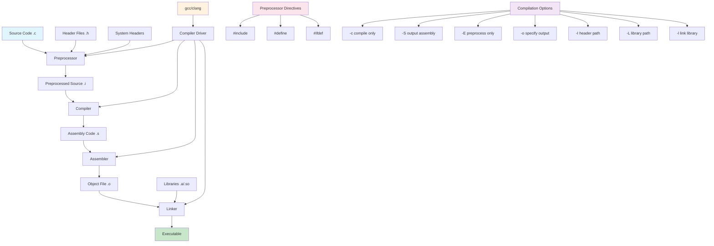

# Lesson 01: Hello World and Compilation Process

## 1. Lesson Positioning

### 1.1 Position in This Book

This lesson is the first in "C/Kotlin from Beginner to Master: Building Hi-Res FFmpeg Music Player" and serves as the entry point for the C language section. As the foundation of the entire book, this lesson guides readers through understanding the birth process of C programs - from source code to executable files through the complete compilation chain.

In the entire learning path, this lesson plays the role of "bedrock". All subsequent lessons (variable types, control flow, pointer operations, memory management, FFmpeg integration) are built upon the understanding of the compilation process established here. Without understanding the compilation process, you will encounter obstacles when handling FFmpeg cross-platform compilation, NDK toolchain configuration, and linking third-party libraries.

### 1.2 Prerequisites

This lesson assumes the reader has the following basic knowledge:

1. **Basic computer operation**: Ability to use terminal/command prompt to execute commands
2. **File system concepts**: Understanding of directories, file paths, file permissions
3. **Text editor usage**: Ability to use any text editor (VS Code, Vim, Nano, etc.) to edit code
4. **Basic English reading**: Ability to read simple English error messages (universal language in programming)

**Not required**:
- Any programming experience (this lesson starts from zero)
- Assembly language or computer architecture knowledge
- Operating system internals

### 1.3 Practical Problems Solved

After completing this lesson, readers will be able to:

1. **Independently compile C programs**: Use gcc, clang, or Android NDK to compile simple C programs
2. **Understand compilation error messages**: When compilation fails, interpret error messages and locate problems
3. **Manage multi-file projects**: Understand the relationship between header files and source files, organize multi-file C projects
4. **Use Makefile for build automation**: Write simple Makefiles to automate the compilation process
5. **Prepare for FFmpeg development**: Understand FFmpeg project's build system structure, paving the way for subsequent lessons

---

## 2. Core Concept Map



The diagram above shows the complete process from C source code to executable file. This process involves four main stages: Preprocessing, Compilation, Assembly, and Linking. Each stage has specific inputs and outputs. Understanding these stages is crucial for handling compilation issues in large projects like FFmpeg.

---

## 3. Concept Deep Dive

### 3.1 Preprocessor

**Definition**: The preprocessor is the first stage of the C compilation system. It processes preprocessor directives (lines starting with #) before actual compilation. The preprocessor is not a compiler; it is a text substitution tool.

**Internal Principles**: The preprocessor works through "text substitution". When it encounters `#include <stdio.h>`, it "pastes" the entire contents of the stdio.h file into the source code. When it encounters `#define PI 3.14`, it replaces all occurrences of PI in the source code with 3.14. This process is mechanical and does not perform any syntax checking.

**Limitations**:
- The preprocessor doesn't understand C syntax, only performs text substitution
- Macro definitions have no type checking, easily producing hard-to-find errors
- Recursive includes can cause infinite loops (need header guards)
- Preprocessed code may be many times larger than the source

**Compiler Behavior**: gcc uses `cpp` (C Preprocessor) as the preprocessor. When executing `gcc -E hello.c -o hello.i`, gcc calls cpp for preprocessing, outputting the result to hello.i file.

**Assembly Perspective**: The preprocessing stage doesn't produce assembly language; it only produces preprocessed C source code. However, the preprocessor's output directly affects the assembly language code produced in subsequent compilation stages.

### 3.2 Compiler

**Definition**: The compiler is a program that converts high-level programming languages (like C) to low-level languages (like assembly or machine code). The C compiler converts preprocessed C source code to assembly language.

**Internal Principles**: The compiler's work is divided into multiple stages:
1. **Lexical Analysis**: Breaks source code into token sequences
2. **Syntax Analysis**: Builds abstract syntax tree (AST) based on grammar rules
3. **Semantic Analysis**: Checks types, scopes, and other semantic rules
4. **IR Generation**: Generates platform-independent intermediate representation
5. **Optimization**: Performs various optimizations on intermediate code
6. **Code Generation**: Generates target platform assembly language

**Limitations**:
- The compiler can only check syntax errors, not logic errors
- Optimization may change program behavior (especially involving undefined behavior)
- Different compilers may have different extensions

**Compiler Behavior**: gcc uses `cc1` as the actual compiler. When executing `gcc -S hello.i -o hello.s`, gcc calls cc1 to compile the preprocessed source code to assembly language.

**Assembly Perspective**: The compiler's output is assembly language. By examining the assembly output, you can understand how the compiler converts C code to machine instructions. For example, a simple `return a + b;` might be compiled to:
```asm
movl -4(%rbp), %eax ; Load a into eax
addl -8(%rbp), %eax ; Add b to eax
```

### 3.3 Assembler

**Definition**: The assembler converts assembly language to machine code, generating object files. Object files contain machine instructions and symbol tables but cannot be directly executed.

**Internal Principles**: The assembler's work includes:
1. **Parse Assembly Instructions**: Converts mnemonics (like mov, add) to corresponding machine code
2. **Process Labels and Symbols**: Records symbol positions, preparing for linking
3. **Generate Sections**: Places code and data into .text and .data sections respectively
4. **Generate Relocation Information**: Records addresses that need linker correction

**Limitations**:
- The assembler doesn't handle external symbol resolution
- Addresses in object files are relative, needing linker correction
- Different platforms have different object file formats (ELF, Mach-O, PE)

**Compiler Behavior**: gcc uses `as` (GNU Assembler) as the assembler. When executing `gcc -c hello.s -o hello.o`, gcc calls as to assemble assembly language to object file.

**Assembly Perspective**: The assembler is the final consumer of assembly language. It converts human-readable assembly language to machine-executable binary instructions.

### 3.4 Linker

**Definition**: The linker combines one or more object files and libraries to generate the final executable. The linker resolves external symbol references, combining scattered object files into a complete program.

**Internal Principles**: The linker's work includes:
1. **Symbol Resolution**: Associates each symbol reference with its definition
2. **Relocation**: Corrects relative addresses in object files to point to correct absolute addresses
3. **Section Merging**: Merges same sections (.text, .data, etc.) from all object files
4. **Generate Final Executable**: Adds metadata needed by the operating system (like ELF header)

**Limitations**:
- The linker cannot resolve type mismatch issues (C language historical legacy)
- Static linking increases executable size
- Dynamic linking depends on library versions installed on the system

**Compiler Behavior**: gcc uses `ld` (GNU Linker) as the linker. When executing `gcc hello.o -o hello`, gcc calls ld to link the object file into an executable.

**Assembly Perspective**: The linker corrects symbol references in assembly language. For example, when calling `printf`, the assembly language only records `call printf`, and the linker corrects it to the actual address of printf in libc.

### 3.5 gcc Compiler Driver

**Definition**: gcc itself is not a compiler, but a "compiler driver". It coordinates the work of preprocessor, compiler, assembler, and linker, deciding which tools to call based on input file extensions.

**Internal Principles**: gcc decides processing based on input file extensions:
- `.c` files: Execute complete compilation process (preprocess → compile → assemble → link)
- `.i` files: Skip preprocessing, compile directly
- `.s` files: Skip preprocessing and compilation, assemble directly
- `.o` files: Skip first three stages, link directly

**Limitations**:
- gcc behavior may vary by version and platform
- Some options may be silently ignored
- Error messages may come from different tools with inconsistent formats

**Compiler Behavior**: You can use the `-v` option to see actual commands executed by gcc:
```bash
gcc -v hello.c -o hello
```
This displays all subprocesses gcc calls and their parameters.

**Assembly Perspective**: gcc can stop after generating assembly language through the `-S` option, making it convenient to examine compiler-generated assembly code.

---

## 4. Complete Syntax Specification

### 4.1 #include Directive

**BNF Syntax**:
```
include-line ::= "#include" ("<" header-name ">" | '"' header-name '"')
header-name ::= path-char-sequence
path-char-sequence ::= path-char | path-char-sequence path-char
path-char ::= any-character-except-newline-and-greater-than
```

**Syntax Explanation**:
- `#include <file>`: Search for file in system header directories
- `#include "file"`: First search in source file directory, then system directories if not found

**Boundary Conditions**:
- Header file doesn't exist: Preprocessor reports error
- Header file contains circular references: Need header guards
- Path contains spaces: Need to use quotes, may need escaping

**Undefined Behavior**:
- No newline after `#include`
- Incomplete header file content (like missing ending `#endif`)

**Best Practices**:
```c
// System headers use angle brackets
#include <stdio.h>
#include <stdlib.h>
#include <string.h>

// Project headers use quotes
#include "myheader.h"
#include "audio/decoder.h"

// Header guard
#ifndef MYHEADER_H
#define MYHEADER_H

// Header content...

#endif // MYHEADER_H
```

### 4.2 #define Directive

**BNF Syntax**:
```
define-line ::= "#define" identifier replacement-list(opt)
              | "#define" identifier "(" identifier-list(opt) ")" replacement-list(opt)
replacement-list ::= preprocessing-token | replacement-list preprocessing-token
identifier-list ::= identifier | identifier-list "," identifier
```

**Syntax Explanation**:
- Parameterless macro: `#define NAME value`
- Parameterized macro: `#define FUNC(x) ((x) * 2)`
- Empty macro: `#define NAME` (used for conditional compilation)

**Boundary Conditions**:
- Macro name conflicts with existing macro: Produces warning or error
- Macro parameters without proper parentheses: May cause operator precedence issues
- Macro definition spanning multiple lines: Need backslash line continuation

**Undefined Behavior**:
- Recursive macro definition: `#define FOO FOO` (some compilers may infinite loop)
- Macro parameters with side effects: `#define SQUARE(x) ((x) * (x))`, calling `SQUARE(i++)` increments i twice

**Best Practices**:
```c
// Constant definition: Use uppercase naming
#define MAX_BUFFER_SIZE 4096
#define SAMPLE_RATE 48000

// Macro functions: Parenthesize each parameter and the whole expression
#define MAX(a, b) ((a) > (b) ? (a) : (b))
#define MIN(a, b) ((a) < (b) ? (a) : (b))
#define ARRAY_SIZE(arr) (sizeof(arr) / sizeof((arr)[0]))

// Multi-line macro: Use backslash continuation, wrap in do-while(0)
#define LOG_ERROR(msg) do { \
    fprintf(stderr, "Error: %s\n", msg); \
    exit(1); \
} while(0)

// Avoid: Prefer const and inline functions
// Bad practice
#define DOUBLE(x) ((x) + (x))
// Good practice
static inline int double_value(int x) { return x + x; }
```

### 4.3 main Function

**BNF Syntax**:
```
main-definition ::= type-specifier "main" "(" parameter-list(opt) ")" compound-statement
type-specifier ::= "int"
parameter-list ::= "void"
                 | "int" "argc" "," "char" "*" "argv" "[" "]"
                 | "int" "argc" "," "char" "**" "argv"
```

**Standard Signatures**:
```c
// Standard form 1: No parameters
int main(void);

// Standard form 2: With command-line arguments
int main(int argc, char *argv[]);
// Or equivalent form
int main(int argc, char **argv);

// Non-standard but common (not recommended)
int main(int argc, char *argv[], char *envp[]);
```

**Boundary Conditions**:
- `argc` is at least 1 (program name)
- `argv[argc]` is NULL
- `argv[0]` is the program name (but unreliable)
- Return value should be `int`, range 0-255 (actually may be larger)

**Undefined Behavior**:
- Returning non-int type
- Return value exceeds INT_MAX
- Modifying strings pointed to by `argv` (some systems allow, some don't)

**Best Practices**:
```c
#include <stdio.h>
#include <stdlib.h>

int main(int argc, char *argv[]) {
    // Check argument count
    if (argc < 2) {
        fprintf(stderr, "Usage: %s <filename>\n", argv[0]);
        return EXIT_FAILURE;
    }

    // Main program logic...

    return EXIT_SUCCESS;
}
```

### 4.4 printf Function

**BNF Syntax**:
```
printf-call ::= "printf" "(" format-string ("," argument-list)? ")"
format-string ::= string-literal
argument-list ::= expression | argument-list "," expression
```

**Format Specifiers**:
| Specifier | Type | Description |
|-----------|------|-------------|
| `%d` | int | Decimal integer |
| `%u` | unsigned int | Unsigned decimal integer |
| `%x` | unsigned int | Hexadecimal integer (lowercase) |
| `%X` | unsigned int | Hexadecimal integer (uppercase) |
| `%f` | double | Floating-point number |
| `%s` | char* | String |
| `%c` | int | Character |
| `%p` | void* | Pointer address |
| `%%` | - | Percent sign |

**Boundary Conditions**:
- Format string type mismatch with arguments: Undefined behavior
- Fewer arguments than format specifiers: Undefined behavior
- More arguments than format specifiers: Extra arguments ignored
- Format string is NULL: Undefined behavior

**Undefined Behavior**:
- `%s` argument is not a valid string pointer
- `%s` argument points to string without terminator
- Buffer overflow (using `%n` or overly long strings)

**Best Practices**:
```c
// Basic output
printf("Hello, World!\n");

// Formatted output
int count = 42;
double ratio = 3.14159;
const char *name = "Audio";

printf("Count: %d, Ratio: %.2f, Name: %s\n", count, ratio, name);

// Width and precision control
printf("%10d\n", count);    // Width 10, right-aligned
printf("%-10d\n", count);   // Width 10, left-aligned
printf("%.2f\n", ratio);    // Precision 2 decimal places
printf("%10.2f\n", ratio);  // Width 10, precision 2

// Safe version (prevent buffer overflow)
char buffer[100];
snprintf(buffer, sizeof(buffer), "Value: %d", count);
```

---

## 5. Example Line-by-Line Commentary

### 5.1 Example 1: hello_basic.c

```c
// File: hello_basic.c
// Purpose: Basic Hello World program demonstrating minimal C program structure
// Compile: gcc hello_basic.c -o hello_basic
// Run: ./hello_basic

#include <stdio.h> // Include standard I/O library for printf function

// Main function: program entry point
// Return type: int (exit status to operating system)
int main(void) { // void indicates no parameters
    // printf: formatted print to stdout
    // "\n": newline character (line break)
    printf("Hello, World!\n");

    // Return 0 to indicate successful execution
    // Non-zero values indicate errors
    return 0;
}
```

**Line-by-Line Analysis**:

**Lines 1-4**: Comment block. C supports two types of comments:
- `//`: Single-line comment (introduced in C99 standard)
- `/* */`: Multi-line comment (traditional C standard)

These comments document the file name, purpose, compile instructions, and run instructions. This is good programming practice, especially in large projects.

**Line 5**: `#include <stdio.h>`

This is a preprocessor directive. `#include` tells the preprocessor to insert the specified header file contents at this location. `<stdio.h>` is the standard input/output header file containing:
- `printf` function declaration
- `scanf` function declaration
- `FILE` type definition
- Standard I/O macros (`stdin`, `stdout`, `stderr`)

Angle brackets `<>` indicate searching in system header directories (like `/usr/include`).

**Line 8**: `int main(void) {`

This is the main function definition. `int` is the return type, indicating the function returns an integer. `main` is the function name; C standard specifies the program entry point must be named `main`. `(void)` indicates the function accepts no parameters. `{` marks the beginning of the function body.

**Line 11**: `printf("Hello, World!\n");`

The `printf` function outputs a formatted string to standard output (stdout). `"Hello, World!\n"` is the format string:
- `Hello, World!`: Text to output
- `\n`: Newline character (ASCII code 10), moves cursor to beginning of next line

The semicolon `;` marks the end of the statement. In C, every statement must end with a semicolon.

**Line 14**: `return 0;`

The `return` statement ends function execution and returns a value to the caller. For the `main` function, the return value is passed to the operating system:
- `0`: Indicates successful program execution (`EXIT_SUCCESS`)
- Non-zero: Indicates program error (`EXIT_FAILURE`)

**Line 15**: `}`

The right brace marks the end of the function body.

### 5.2 Example 2: hello_args.c

```c
// File: hello_args.c
// Purpose: Demonstrate command-line argument handling
// Compile: gcc hello_args.c -o hello_args
// Run: ./hello_args arg1 arg2 arg3

#include <stdio.h> // printf, fprintf
#include <stdlib.h> // EXIT_SUCCESS, EXIT_FAILURE

int main(int argc, char *argv[]) {
    // argc: argument count (includes program name)
    // argv: argument vector (array of strings)
    // argv[0]: program name (may be empty or path)
    // argv[1] to argv[argc-1]: command-line arguments
    // argv[argc]: always NULL (sentinel)

    printf("Program name: %s\n", argv[0]);
    printf("Argument count: %d\n", argc);

    // Loop through all arguments
    for (int i = 1; i < argc; i++) {
        printf("argv[%d]: %s\n", i, argv[i]);
    }

    // Check if user provided enough arguments
    if (argc < 2) {
        fprintf(stderr, "Usage: %s <name>\n", argv[0]);
        return EXIT_FAILURE;
    }

    printf("Hello, %s!\n", argv[1]);

    return EXIT_SUCCESS;
}
```

**Line-by-Line Analysis**:

**Line 6**: `#include <stdlib.h>`

Includes the standard library header file, providing:
- `EXIT_SUCCESS`: Success return value (usually 0)
- `EXIT_FAILURE`: Failure return value (usually 1)
- Memory management functions like `malloc`, `free`
- String conversion functions like `atoi`, `atof`

**Line 8**: `int main(int argc, char *argv[]) {`

This is another standard form of the `main` function. Parameter explanation:
- `argc` (argument count): Number of command-line arguments, including the program name itself
- `argv` (argument vector): Array of pointers to argument strings

`char *argv[]` and `char **argv` are equivalent in function parameters.

**Lines 9-14**: Comment block

Detailed explanation of `argc` and `argv` structure. This is key to understanding command-line argument handling.

**Line 16**: `printf("Program name: %s\n", argv[0]);`

Outputs the program name. `argv[0]` is usually the name or path used when executing the program. Note: `argv[0]` is unreliable:
- May be empty string
- May be relative path
- May be absolute path
- May be modified by user

**Line 17**: `printf("Argument count: %d\n", argc);`

Outputs argument count. `argc` is at least 1 (because it includes the program name).

**Lines 20-22**: for loop

```c
for (int i = 1; i < argc; i++) {
    printf("argv[%d]: %s\n", i, argv[i]);
}
```

This loop iterates through all command-line arguments (starting from index 1, skipping the program name). Loop variable `i` can be declared in the for statement in C99.

**Lines 25-28**: Argument checking

```c
if (argc < 2) {
    fprintf(stderr, "Usage: %s <name>\n", argv[0]);
    return EXIT_FAILURE;
}
```

Checks if user provided enough arguments. If not, outputs usage information to standard error (stderr) and returns failure status. `fprintf(stderr, ...)` outputs error messages to standard error stream instead of standard output. This is good practice because:
- Error messages won't be redirected to files
- User can see errors immediately
- Program can work correctly with pipes and redirections

**Line 30**: `printf("Hello, %s!\n", argv[1]);`

Uses the first argument as the name to output greeting. `%s` format specifier outputs a string.

---

## 6. Error Case Comparison Table

### 6.1 Compilation Errors

| Error Code | Error Message | Root Cause | Correct Approach |
|-----------|---------------|------------|------------------|
| `#include <stdio.h` | `error: missing terminating > character` | Header name missing closing `>` | `#include <stdio.h>` |
| `int main() { printf("Hi") }` | `error: expected ';' before '}'` | Statement missing semicolon | `printf("Hi");` |
| `printf("Value: %d\n");` | `warning: format '%d' expects argument` | Format specifier missing corresponding argument | `printf("Value: %d\n", 42);` |
| `#include <nonexistent.h>` | `fatal error: nonexistent.h: No such file` | Header file doesn't exist | Check file path or install corresponding package |
| `main() { return 0; }` | `warning: return type defaults to 'int'` | C99 requires explicit return type for main | `int main(void) { return 0; }` |

### 6.2 Preprocessing Errors

| Error Code | Error Message | Root Cause | Correct Approach |
|-----------|---------------|------------|------------------|
| `#define MAX(a, b) a > b ? a : b` | No compilation error, but `MAX(1+2, 3+4)` gives wrong result | Macro parameters missing parentheses | `#define MAX(a, b) ((a) > (b) ? (a) : (b))` |
| `#define SQUARE(x) ((x) * (x))` `SQUARE(i++)` | No compilation error, but i increments twice | Macro parameters have side effects | Use inline functions instead |
| `#include "myheader.h"` (file doesn't exist) | `fatal error: myheader.h: No such file` | Header file path error | Use correct path or `-I` option |
| `#ifdef DEBUG` `#endif` `#endif` | `error: #endif without #if` | Header guard mismatch | Check `#if`/`#endif` pairing |

### 6.3 Linking Errors

| Error Code | Error Message | Root Cause | Correct Approach |
|-----------|---------------|------------|------------------|
| `gcc main.c` (uses `sqrt` but doesn't link math library) | `undefined reference to 'sqrt'` | Math functions need explicit linking | `gcc main.c -lm` |
| `gcc main.c` (uses pthread) | `undefined reference to 'pthread_create'` | pthread needs explicit linking | `gcc main.c -lpthread` |
| Multiple main functions | `multiple definition of 'main'` | A project can only have one main | Rename or remove extra main |

### 6.4 Runtime Errors

| Error Code | Error Message | Root Cause | Correct Approach |
|-----------|---------------|------------|------------------|
| `printf("%s\n", NULL);` | `Segmentation fault` (or outputs `(null)`) | Passing NULL to %s | Check if pointer is NULL |
| `printf(123);` | `Segmentation fault` | Format string is not a string pointer | `printf("%d\n", 123);` |
| `return;` (in main) | `warning: 'return' with no value` | main returns int, cannot return void | `return 0;` |

---

## 7. Performance and Memory Analysis

### 7.1 Performance Impact of Compilation Stages

**Preprocessing Stage**:
- Time complexity: O(n), where n is total lines of source code and header files
- Memory usage: Proportional to header file size
- FFmpeg scenario: FFmpeg headers are very large, preprocessing may take several seconds

**Compilation Stage**:
- Time complexity: O(n²) to O(n³), depending on optimization level
- Memory usage: Proportional to function complexity
- FFmpeg scenario: Large functions may require significant memory to compile

**Linking Stage**:
- Time complexity: O(n), where n is number of object files
- Memory usage: Proportional to symbol table size
- FFmpeg scenario: FFmpeg links hundreds of libraries, linking time may be long

### 7.2 Memory Layout

```
+------------------+ High address
| Stack            | ← Local variables, function return addresses
| ↓                |
|                  |
| ↑                |
| Heap             | ← malloc allocated memory
+------------------+
| BSS              | ← Uninitialized global variables
+------------------+
| Data             | ← Initialized global variables
+------------------+
| Text             | ← Code (read-only)
+------------------+ Low address
```

**Section Descriptions**:

| Section | Content | Characteristics |
|---------|---------|-----------------|
| Text | Code | Read-only, executable, shareable |
| Data | Initialized global variables | Read-write |
| BSS | Uninitialized global variables | Read-write, zeroed at startup |
| Heap | Dynamically allocated memory | Read-write, grows upward |
| Stack | Local variables, call frames | Read-write, grows downward |

### 7.3 Cache Performance Considerations

**Instruction Cache**:
- Code size affects instruction cache hit rate
- Compact code has better cache performance
- FFmpeg scenario: Hot functions should remain compact

**Data Cache**:
- Memory access patterns affect cache efficiency
- Sequential access is friendlier than random access
- FFmpeg scenario: Audio buffers should be processed sequentially

**Cache Line**:
- Typical size: 64 bytes
- Aligning to cache lines can improve performance
- FFmpeg scenario: Audio buffers aligned to 64-byte boundaries

### 7.4 FFmpeg Compilation Performance Considerations

**Optimization Levels**:

| Level | Compile Time | Execution Speed | Code Size | Use Case |
|-------|--------------|-----------------|-----------|----------|
| `-O0` | Fastest | Slowest | Largest | Debugging |
| `-O1` | Fast | Fast | Large | Development |
| `-O2` | Medium | Fast | Medium | Release |
| `-O3` | Slow | Fastest | Large | Performance-critical |
| `-Os` | Fast | Medium | Smallest | Embedded |
| `-Ofast` | Slowest | Extremely fast | Largest | Scientific computing |

**FFmpeg Recommended Compilation Options**:
```bash
# General purpose
./configure --enable-shared --disable-static --prefix=/usr/local
make -j$(nproc)

# Performance optimization
./configure --enable-shared --disable-static \
    --enable-optimizations \
    --enable-hardcoded-tables \
    --prefix=/usr/local
make -j$(nproc)

# Android NDK
./configure --target-os=android \
    --arch=aarch64 \
    --cpu=armv8-a \
    --enable-cross-compile \
    --cc=$NDK/toolchains/llvm/prebuilt/linux-x86_64/bin/clang \
    --enable-shared \
    --disable-static
```

---

## 8. Hi-Res Audio Practical Connection

### 8.1 Compilation Process in FFmpeg

FFmpeg is a large C project whose build system demonstrates practical application of concepts learned in this lesson:

**Preprocessing Stage**:
- FFmpeg uses extensive conditional compilation to support multiple codecs
- `./configure` script generates `config.h`, controlling which features are compiled
- Example: `#if CONFIG_LIBFDK_AAC` determines whether to compile AAC encoder

**Compilation Stage**:
- FFmpeg uses `-O3` optimization level
- Uses `-march` and `-mtune` options for specific CPU architectures
- Example: `-march=armv8-a+crypto` enables ARM NEON instruction set

**Linking Stage**:
- FFmpeg supports static and dynamic linking
- Uses `pkg-config` to manage external library dependencies
- Example: `pkg-config --libs libx264` gets x264 linking options

### 8.2 NDK Compilation Process

Android NDK uses Clang compiler, similar compilation process to gcc:

```bash
# Set NDK path
export NDK=/path/to/android-ndk

# Set toolchain
export TOOLCHAIN=$NDK/toolchains/llvm/prebuilt/linux-x86_64

# Compile ARM64 program
$TOOLCHAIN/bin/clang \
    --target=aarch64-linux-android21 \
    -I$NDK/sysroot/usr/include \
    -L$NDK/sysroot/usr/lib \
    hello.c -o hello

# Using CMake (recommended)
cmake -DCMAKE_TOOLCHAIN_FILE=$NDK/build/cmake/android.toolchain.cmake \
      -DANDROID_ABI=arm64-v8a \
      -DANDROID_PLATFORM=android-21 \
      ..
make
```

### 8.3 FFmpeg Decode Pipeline Overview

FFmpeg's decode pipeline involves multiple concepts learned in this lesson:

```
Input File → avformat_open_input() → AVFormatContext
    ↓
avformat_find_stream_info() → Find audio stream
    ↓
avcodec_find_decoder() → Find decoder
    ↓
avcodec_open2() → AVCodecContext
    ↓
av_read_frame() → AVPacket
    ↓
avcodec_send_packet() → Send packet to decoder
    ↓
avcodec_receive_frame() → AVFrame (decoded audio)
    ↓
swr_convert() → Resample (e.g. 192kHz→48kHz)
    ↓
AudioTrack/JNI → Playback
```

### 8.4 JNI Integration Overview

JNI (Java Native Interface) is the bridge for Java/Kotlin to call C code:

```c
// native-lib.c
#include <jni.h>
#include <android/log.h>

#define LOG_TAG "NativeLib"
#define LOGI(...) __android_log_print(ANDROID_LOG_INFO, LOG_TAG, __VA_ARGS__)

// JNI function naming convention: Java_package_class_method
JNIEXPORT jstring JNICALL
Java_com_example_audio_AudioDecoder_nativeGetVersion(JNIEnv *env, jobject thiz) {
    return (*env)->NewStringUTF(env, "1.0.0");
}

// Passing audio data
JNIEXPORT jint JNICALL
Java_com_example_audio_AudioDecoder_nativeDecode(
    JNIEnv *env,
    jobject thiz,
    jbyteArray input_data,
    jint input_size,
    jbyteArray output_data,
    jint output_size
) {
    jbyte *input = (*env)->GetByteArrayElements(env, input_data, NULL);
    jbyte *output = (*env)->GetByteArrayElements(env, output_data, NULL);

    // Process audio data...

    (*env)->ReleaseByteArrayElements(env, input_data, input, 0);
    (*env)->ReleaseByteArrayElements(env, output_data, output, 0);

    return processed_samples;
}
```

---

## 9. Exercises and Solutions

### 9.1 Basic Exercise

**Problem**: Write a C program that accepts a command-line argument as a username and outputs "Hello, [name]!". If no argument is provided, output usage information and return an error status.

**Solution**:
```c
// File: exercise_01.c
// Purpose: Basic command-line argument handling
// Compile: gcc exercise_01.c -o exercise_01
// Run: ./exercise_01 World

#include <stdio.h>
#include <stdlib.h>

int main(int argc, char *argv[]) {
    // Check if user provided a name
    if (argc < 2) {
        fprintf(stderr, "Usage: %s <name>\n", argv[0]);
        fprintf(stderr, "Example: %s World\n", argv[0]);
        return EXIT_FAILURE;
    }

    // Greet the user
    printf("Hello, %s!\n", argv[1]);

    return EXIT_SUCCESS;
}
```

### 9.2 Advanced Exercise

**Problem**: Write a C program using macros to calculate audio buffer size. The program should accept sample rate, bit depth, and channel count as command-line arguments, and output the buffer size for a specified duration (milliseconds).

**Solution**:
```c
// File: exercise_02.c
// Purpose: Audio buffer size calculation using macros
// Compile: gcc exercise_02.c -o exercise_02
// Run: ./exercise_02 192000 24 2 100

#include <stdio.h>
#include <stdlib.h>

// Calculate bytes per sample
#define BYTES_PER_SAMPLE(depth) ((depth) / 8)

// Calculate bytes per frame (all channels)
#define BYTES_PER_FRAME(depth, channels) (BYTES_PER_SAMPLE(depth) * (channels))

// Calculate data rate (bytes per second)
#define DATA_RATE(rate, depth, channels) ((rate) * BYTES_PER_FRAME(depth, channels))

// Calculate buffer size for given duration (milliseconds)
#define BUFFER_SIZE(rate, depth, channels, ms) \
    (DATA_RATE(rate, depth, channels) * (ms) / 1000)

int main(int argc, char *argv[]) {
    if (argc < 5) {
        fprintf(stderr, "Usage: %s <sample_rate> <bit_depth> <channels> <duration_ms>\n", argv[0]);
        fprintf(stderr, "Example: %s 192000 24 2 100\n", argv[0]);
        fprintf(stderr, "  Calculates buffer size for 100ms of 192kHz/24bit stereo audio\n");
        return EXIT_FAILURE;
    }

    // Parse arguments
    int sample_rate = atoi(argv[1]);
    int bit_depth = atoi(argv[2]);
    int channels = atoi(argv[3]);
    int duration_ms = atoi(argv[4]);

    // Validate inputs
    if (sample_rate <= 0 || bit_depth <= 0 || channels <= 0 || duration_ms <= 0) {
        fprintf(stderr, "Error: All parameters must be positive integers\n");
        return EXIT_FAILURE;
    }

    // Calculate buffer size
    int buffer_size = BUFFER_SIZE(sample_rate, bit_depth, channels, duration_ms);

    // Output results
    printf("Audio Parameters:\n");
    printf("  Sample Rate: %d Hz\n", sample_rate);
    printf("  Bit Depth: %d bits\n", bit_depth);
    printf("  Channels: %d\n", channels);
    printf("  Duration: %d ms\n", duration_ms);
    printf("\n");
    printf("Buffer Size: %d bytes\n", buffer_size);
    printf("Buffer Size: %d KB\n", buffer_size / 1024);

    return EXIT_SUCCESS;
}
```

### 9.3 FFmpeg Practical Exercise

**Problem**: Write a C program using conditional compilation to control debug output. The program should enable verbose debug logging at compile time through the `-DDEBUG` option, including file name, line number, and function name.

**Solution**:
```c
// File: exercise_03.c
// Purpose: Conditional compilation for debug logging
// Compile (debug): gcc -DDEBUG exercise_03.c -o exercise_03_debug
// Compile (release): gcc exercise_03.c -o exercise_03_release
// Run: ./exercise_03_debug

#include <stdio.h>
#include <stdlib.h>
#include <string.h>

// Debug logging macros
#ifdef DEBUG
#define DEBUG_LOG(fmt, ...) \
    fprintf(stderr, "[DEBUG] %s:%d:%s(): " fmt "\n", \
            __FILE__, __LINE__, __func__, ##__VA_ARGS__)
#define DEBUG_ENTER() DEBUG_LOG("Entering function")
#define DEBUG_EXIT() DEBUG_LOG("Exiting function")
#define DEBUG_VAR(var) DEBUG_LOG(#var " = %d", var)
#else
#define DEBUG_LOG(fmt, ...) ((void)0)
#define DEBUG_ENTER() ((void)0)
#define DEBUG_EXIT() ((void)0)
#define DEBUG_VAR(var) ((void)0)
#endif

// Audio format structure
typedef struct {
    int sample_rate;
    int bit_depth;
    int channels;
    int duration_ms;
} AudioFormat;

// Calculate buffer size
int calculate_buffer_size(AudioFormat *fmt) {
    DEBUG_ENTER();
    DEBUG_VAR(fmt->sample_rate);
    DEBUG_VAR(fmt->bit_depth);
    DEBUG_VAR(fmt->channels);

    int bytes_per_sample = fmt->bit_depth / 8;
    int bytes_per_frame = bytes_per_sample * fmt->channels;
    int data_rate = fmt->sample_rate * bytes_per_frame;
    int buffer_size = data_rate * fmt->duration_ms / 1000;

    DEBUG_VAR(buffer_size);
    DEBUG_EXIT();

    return buffer_size;
}

// Validate audio format
int validate_format(AudioFormat *fmt) {
    DEBUG_ENTER();

    if (fmt->sample_rate <= 0) {
        DEBUG_LOG("Invalid sample rate: %d", fmt->sample_rate);
        DEBUG_EXIT();
        return 0;
    }

    if (fmt->bit_depth != 16 && fmt->bit_depth != 24 && fmt->bit_depth != 32) {
        DEBUG_LOG("Invalid bit depth: %d", fmt->bit_depth);
        DEBUG_EXIT();
        return 0;
    }

    if (fmt->channels <= 0 || fmt->channels > 8) {
        DEBUG_LOG("Invalid channel count: %d", fmt->channels);
        DEBUG_EXIT();
        return 0;
    }

    DEBUG_LOG("Format validation passed");
    DEBUG_EXIT();
    return 1;
}

int main(int argc, char *argv[]) {
    DEBUG_ENTER();

    if (argc < 5) {
        fprintf(stderr, "Usage: %s <sample_rate> <bit_depth> <channels> <duration_ms>\n", argv[0]);
        DEBUG_LOG("Insufficient arguments: argc = %d", argc);
        DEBUG_EXIT();
        return EXIT_FAILURE;
    }

    // Parse arguments
    AudioFormat fmt = {
        .sample_rate = atoi(argv[1]),
        .bit_depth = atoi(argv[2]),
        .channels = atoi(argv[3]),
        .duration_ms = atoi(argv[4])
    };

    DEBUG_LOG("Parsed arguments: rate=%d, depth=%d, channels=%d, duration=%d",
              fmt.sample_rate, fmt.bit_depth, fmt.channels, fmt.duration_ms);

    // Validate format
    if (!validate_format(&fmt)) {
        fprintf(stderr, "Error: Invalid audio format\n");
        DEBUG_LOG("Format validation failed");
        DEBUG_EXIT();
        return EXIT_FAILURE;
    }

    // Calculate buffer size
    int buffer_size = calculate_buffer_size(&fmt);

    printf("Buffer size: %d bytes\n", buffer_size);

    DEBUG_LOG("Program completed successfully");
    DEBUG_EXIT();

    return EXIT_SUCCESS;
}
```

---

## 10. Next Lesson Bridge

### 10.1 Application in Next Lesson

The compilation process and preprocessor knowledge learned in this lesson will be fully applied in the next lesson "Basic Types":

1. **Type definitions**: `typedef` keyword used to define new types, a compilation stage concept after preprocessing
2. **Constant definitions**: Comparison between `const` keyword and `#define`, understanding compile-time constants vs runtime constants
3. **Type sizes**: `sizeof` operator calculates type size at compile time, closely related to compiler's type system
4. **Alignment requirements**: `alignof` operator involves memory layout, an important consideration in linking stage

### 10.2 Preview: Next Lesson Core Content

The next lesson "Basic Types" will deeply explore:

- **Integer types**: `char`, `short`, `int`, `long`, `long long` and their unsigned variants
- **Floating-point types**: `float`, `double`, `long double`
- **Fixed-width types**: `int8_t`, `int16_t`, `int32_t`, `int64_t` (crucial for FFmpeg/JNI)
- **Enumeration types**: `enum` definition and usage
- **Type qualifiers**: `const`, `volatile`, `restrict`
- **Type definitions**: Various uses of `typedef`

### 10.3 Study Recommendations

Before entering the next lesson, readers are recommended to:

1. **Practice**: Use `-E`, `-S`, `-c` options to execute each compilation stage separately, observe output
2. **Read headers**: Examine contents of `stdio.h`, understand standard library structure
3. **Practice macros**: Write simple macros, understand text substitution principles
4. **Prepare tools**: Install Android NDK, prepare for subsequent FFmpeg compilation

### 10.4 Further Reading

- **C Standard Document**: ISO/IEC 9899:2018 (C18 standard)
- **GCC Manual**: https://gcc.gnu.org/onlinedocs/
- **FFmpeg Compilation Guide**: https://trac.ffmpeg.org/wiki/CompilationGuide
- **Android NDK**: https://developer.android.com/ndk/guides

---

## Appendix: Makefile Example

```makefile
# File: Makefile
# Purpose: Build automation for lesson 01 examples

# Compiler settings
CC = gcc
CFLAGS = -Wall -Wextra -std=c11 -O2
LDFLAGS =

# Source files
SOURCES = hello_basic.c hello_args.c compilation_phases.c preprocessor_demo.c ndk_audio_info.c
OBJECTS = $(SOURCES:.c=.o)
TARGETS = $(SOURCES:.c=)

# Default target
all: $(TARGETS)

# Pattern rule for compiling C files
%: %.c
	$(CC) $(CFLAGS) $< -o $@ $(LDFLAGS)

# Debug build
debug: CFLAGS += -DDEBUG -g
debug: clean all

# Clean target
clean:
	rm -f $(OBJECTS) $(TARGETS) *.i *.s

# Preprocess only
preprocess: hello_basic.i

hello_basic.i: hello_basic.c
	$(CC) -E $< -o $@

# Assembly output
assembly: hello_basic.s

hello_basic.s: hello_basic.c
	$(CC) -S $< -o $@

# Phony targets
.PHONY: all clean debug preprocess assembly

# Run all programs
run: all
	@echo "=== Running hello_basic ==="
	./hello_basic
	@echo "=== Running hello_args ==="
	./hello_args World
	@echo "=== Running ndk_audio_info ==="
	./ndk_audio_info
```

**Usage**:
```bash
# Compile all programs
make

# Compile debug version
make debug

# Clean all generated files
make clean

# Generate preprocessing output
make preprocess

# Generate assembly output
make assembly

# Compile and run
make run
```
