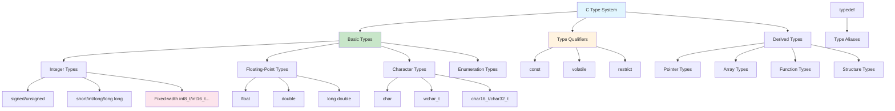

# Lesson 02: Basic Types

## 1. Lesson Positioning

### 1.1 Position in This Book

This lesson "Basic Types" is the second lesson in the C language series, immediately following the compilation process in Lesson 01, diving deep into C's type system. The type system is the core foundation of C language. Understanding types is crucial for subsequent learning of pointers, memory management, and FFmpeg audio processing.

In the entire learning path, this lesson plays the role of "type cornerstone". All subsequent lessons (control flow, functions, pointers, structures) depend on deep understanding of the type system. Especially in FFmpeg development, correct use of fixed-width types (like `int16_t`, `int32_t`) is crucial for cross-platform audio processing.

### 1.2 Prerequisites

This lesson assumes the reader has mastered:

1. **Lesson 01 content**: Understanding compilation process, preprocessor, main function
2. **Basic mathematical concepts**: Binary, hexadecimal representation
3. **Basic memory concepts**: Distinction between bits and bytes

### 1.3 Practical Problems Solved

After completing this lesson, readers will be able to:

1. **Choose correct types**: Select appropriate integer or floating-point types based on data range
2. **Understand type conversion**: Master rules and risks of implicit and explicit type conversion
3. **Use fixed-width types**: Choose cross-platform compatible types for JNI and FFmpeg development
4. **Correctly use const and volatile**: Understand semantics and application scenarios of type qualifiers
5. **Calculate type sizes**: Use `sizeof` and `alignof` for memory calculations

---

## 2. Core Concept Map



The diagram above shows the complete structure of C's type system. For FFmpeg audio development, the most critical aspects are understanding integer types (especially fixed-width types) and type qualifiers (especially `const` and `volatile`).

---

## 3. Concept Deep Dive

### 3.1 Integer Types

**Definition**: Integer types are used to represent numerical values without fractional parts. C provides multiple integer types, primarily distinguished by storage size and whether they have signs.

**Internal Principles**:

Integers are stored in memory in binary form. For signed integers, the C standard allows three representation methods:
1. **Two's Complement**: Used by almost all modern systems
2. **One's Complement**: Historical legacy, rarely used
3. **Sign-Magnitude**: Historical legacy, rarely used

Two's complement representation characteristics:
- Positive numbers: Represented directly in binary
- Negative numbers: Corresponding positive number inverted and incremented by one
- Highest bit is sign bit (0 for positive, 1 for negative)
- Zero has only one representation (all zeros)

**Type Sizes (Typical Values)**:

| Type | Minimum Size | Typical Size (64-bit system) | Range (Typical) |
|------|--------------|------------------------------|-----------------|
| `char` | 1 byte | 1 byte | -128 ~ 127 or 0 ~ 255 |
| `short` | 2 bytes | 2 bytes | -32,768 ~ 32,767 |
| `int` | 2 bytes | 4 bytes | -2,147,483,648 ~ 2,147,483,647 |
| `long` | 4 bytes | 8 bytes | ±9.2 × 10¹⁸ |
| `long long` | 8 bytes | 8 bytes | ±9.2 × 10¹⁸ |

**Limitations**:
- Type sizes vary by platform, cannot assume fixed sizes
- Integer overflow is undefined behavior (signed) or wraparound (unsigned)
- Arithmetic conversions may cause unexpected results

**Compiler Behavior**:
- GCC uses `-Woverflow` to warn about integer overflow
- Optimization may assume signed integers don't overflow
- Use `-fwrapv` option to force overflow wraparound behavior

**Assembly Perspective**:

```c
int a = 42;
int b = -1;
int c = a + b;
```

Corresponding x86-64 assembly:
```asm
movl $42, -4(%rbp)    ; a = 42
movl $-1, -8(%rbp)    ; b = -1 (0xFFFFFFFF in two's complement)
movl -4(%rbp), %eax   ; load a into eax
addl -8(%rbp), %eax   ; add b to eax: 42 + (-1) = 41
movl %eax, -12(%rbp)  ; store result in c
```

### 3.2 Fixed-Width Integer Types

**Definition**: Integer types introduced in C99 standard that guarantee exact bit widths, defined in `<stdint.h>` header file.

**Internal Principles**:

Fixed-width types are defined through `typedef`, mapping to appropriate basic types provided by the compiler. For example:
```c
// Typical definition (64-bit system)
typedef signed char int8_t;
typedef short int16_t;
typedef int int32_t;
typedef long long int64_t;
```

**Type Classification**:

| Type | Width | Usage |
|------|-------|-------|
| `int8_t` | 8 bits | Audio 8-bit samples |
| `int16_t` | 16 bits | CD audio samples |
| `int32_t` | 32 bits | High-resolution audio, JNI |
| `int64_t` | 64 bits | Large files, timestamps |
| `uint8_t` | 8 bits | Byte data |
| `uint16_t` | 16 bits | Unsigned audio |
| `uint32_t` | 32 bits | Sample rates, buffer sizes |
| `uint64_t` | 64 bits | File sizes |

**FFmpeg Application**:

FFmpeg extensively uses fixed-width types:
```c
// Typical usage in FFmpeg
int64_t duration;     // Duration (microseconds)
int32_t sample_rate;  // Sample rate
int16_t *samples;     // Audio samples
uint8_t *data;        // Byte data
```

**Limitations**:
- Some platforms may not provide types of all widths
- `int8_t` etc. may not exist (if `char` is not 8 bits)
- Use `int_leastN_t` or `int_fastN_t` as fallback

**Best Practices**:
```c
// Use fixed-width types for JNI transfer
JNIEXPORT jint JNICALL Java_com_example_audio_process(
    JNIEnv *env,
    jobject thiz,
    jbyteArray data  // corresponds to int8_t* or uint8_t*
) {
    jbyte *buffer = (*env)->GetByteArrayElements(env, data, NULL);
    // buffer can be safely cast to int8_t* or uint8_t*
    int8_t *samples = (int8_t *)buffer;
    // ...
}
```

### 3.3 Floating-Point Types

**Definition**: Floating-point types are used to represent numerical values with fractional parts, following IEEE 754 standard.

**Internal Principles**:

IEEE 754 floating-point representation:
```
Sign bit (1 bit) | Exponent (8/11 bits) | Mantissa (23/52 bits)
```

| Type | Total Bits | Sign | Exponent | Mantissa | Significant Digits |
|------|------------|------|----------|----------|-------------------|
| `float` | 32 | 1 | 8 | 23 | ~7 digits |
| `double` | 64 | 1 | 11 | 52 | ~15 digits |
| `long double` | 80-128 | 1 | 15 | 64+ | ~18+ digits |

**Special Values**:
- Positive/negative zero: `+0.0`, `-0.0`
- Positive/negative infinity: `INFINITY`, `-INFINITY`
- NaN (Not a Number): `NAN`
- Normalized numbers, denormalized numbers

**Limitations**:
- Limited precision, cannot exactly represent all decimal fractions
- Comparing equality needs to consider error
- Some operations may produce NaN or infinity

**Compiler Behavior**:
- Using `-ffast-math` may change IEEE 754 behavior
- Using `-fno-math-errno` can improve performance
- Intermediate results may use higher precision

**FFmpeg Application**:

```c
// Floating-point operations in audio processing
float sample = 0.5f;  // f suffix indicates float
double normalized = sample / INT16_MAX;  // Normalize to [-1, 1]

// FFT operations (use double for precision)
void fft(double *real, double *imag, int n) {
    // Complex number operations...
}
```

### 3.4 Character Types

**Definition**: Character types are used to represent characters and strings, essentially special cases of integer types.

**Internal Principles**:

Details of `char` type:
- Size fixed at 1 byte (defined by `CHAR_BIT`, typically 8)
- Can be `signed char` or `unsigned char` (compiler decides)
- Used to store ASCII characters or byte data

**Character Encoding**:
| Encoding | Type | Description |
|----------|------|-------------|
| ASCII | `char` | 7-bit encoding, 0-127 |
| Extended ASCII | `char` | 8-bit encoding, 0-255 |
| UTF-8 | `char` | Variable-length encoding, 1-4 bytes |
| UTF-16 | `char16_t` | Variable-length encoding, 2-4 bytes |
| UTF-32 | `char32_t` | Fixed encoding, 4 bytes |

**Limitations**:
- Signedness of `char` varies by platform
- Multi-byte characters need special handling
- Wide characters (`wchar_t`) size varies by platform

**Best Practices**:
```c
// Explicitly use signed or unsigned
unsigned char byte_data = 0xFF;      // Byte data
signed char audio_sample = -128;     // 8-bit audio sample

// String handling
const char *filename = "audio.flac"; // UTF-8 string
```

### 3.5 Enumeration Types

**Definition**: Enumeration types define a set of named integer constants, improving code readability.

**Internal Principles**:

```c
enum codec_type {
    CODEC_NONE = 0,
    CODEC_MP3,
    CODEC_AAC,
    CODEC_FLAC,
    CODEC_WAV
};
```

Compiler converts enumeration constants to integers:
- `CODEC_NONE` = 0
- `CODEC_MP3` = 1
- `CODEC_AAC` = 2
- `CODEC_FLAC` = 3
- `CODEC_WAV` = 4

**Limitations**:
- Enumeration types are actually integer types
- Can be assigned any integer value (no range checking)
- Enumeration values may conflict with other enumerations

**FFmpeg Application**:

```c
// Enumeration definition in FFmpeg
enum AVCodecID {
    AV_CODEC_ID_NONE = 0,
    AV_CODEC_ID_MPEG1VIDEO,
    AV_CODEC_ID_MPEG2VIDEO,
    // ...
    AV_CODEC_ID_FLAC,
    AV_CODEC_ID_AAC,
    // ...
};

// Using enumeration
enum AVCodecID codec_id = AV_CODEC_ID_FLAC;
```

### 3.6 typedef Keyword

**Definition**: `typedef` is used to create aliases for existing types, improving code readability and portability.

**Internal Principles**:

`typedef` doesn't create new types, only creates aliases:
```c
typedef int audio_sample_t;  // audio_sample_t is an alias for int
audio_sample_t sample = 42;  // Equivalent to int sample = 42;
```

**Common Usage**:

```c
// 1. Simplify complex types
typedef void (*callback_t)(int, const char*);
callback_t on_complete = my_callback;

// 2. Improve portability
typedef uint32_t sample_rate_t;  // Can change underlying type on different platforms

// 3. Structure aliases
typedef struct AudioFormat {
    int sample_rate;
    int channels;
    int bit_depth;
} AudioFormat;

// 4. Pointer types
typedef struct AVFormatContext AVFormatContext;
typedef struct AVCodecContext AVCodecContext;
```

**FFmpeg Application**:

FFmpeg heavily uses `typedef` to hide implementation details:
```c
// Opaque pointers in FFmpeg
typedef struct AVFormatContext AVFormatContext;
typedef struct AVCodecContext AVCodecContext;
typedef struct AVFrame AVFrame;
typedef struct AVPacket AVPacket;

// Users don't need to know structure internals
AVFormatContext *ctx = avformat_alloc_context();
```

### 3.7 const Qualifier

**Definition**: `const` qualifier indicates that a variable's value cannot be modified (read-only).

**Internal Principles**:

`const` variables are marked as read-only at compile time. Attempting to modify causes compilation error:
```c
const int max_samples = 192000;
max_samples = 44100;  // Error: cannot modify const variable
```

**Pointers and const**:

```c
// 1. Pointer to constant (low-level const)
const int *p1;  // Cannot modify value pointed to through p1
int const *p2;  // Equivalent form

// 2. Constant pointer (top-level const)
int * const p3 = &x;  // p3 itself cannot be modified, must initialize

// 3. Constant pointer to constant
const int * const p4 = &x;  // Neither can be modified
```

**FFmpeg Application**:

```c
// const usage in FFmpeg API
const char *avcodec_get_name(enum AVCodecID id);
int avformat_open_input(AVFormatContext **ps, const char *url, ...);

// String parameter uses const, indicating function won't modify string
void process_filename(const char *filename) {
    // filename[0] = 'x';  // Error
    printf("%s\n", filename);  // OK
}
```

**Best Practices**:
```c
// Use const for parameters to indicate intent
size_t calculate_buffer_size(const AudioFormat *fmt);

// Return const pointer to prevent modification
const char *get_codec_name(int codec_id);

// Use const for constants instead of #define
const int MAX_CHANNELS = 8;  // Has type checking
```

### 3.8 volatile Qualifier

**Definition**: `volatile` qualifier tells the compiler that a variable's value may change in ways the compiler cannot predict.

**Internal Principles**:

`volatile` prohibits compiler from performing certain optimizations on the variable:
- Cannot cache in registers
- Cannot omit read operations
- Cannot reorder access sequences

**Use Cases**:

1. **Hardware Registers**:
```c
volatile uint32_t *hardware_reg = (volatile uint32_t *)0xFFFF0000;
*hardware_reg = 0x01;  // Write to hardware
```

2. **Multi-threaded Shared Variables**:
```c
volatile int running = 1;
void signal_handler(int sig) {
    running = 0;  // Signal handler modifies
}
```

3. **JNI Callbacks**:
```c
volatile int callback_done = 0;
// Java layer may modify this variable at any time
```

**FFmpeg Application**:

```c
// volatile usage in FFmpeg
volatile int interrupt_flag = 0;

// Check interrupt flag during I/O operations
while (!interrupt_flag && more_data) {
    // Read data...
}
```

**Limitations**:
- `volatile` doesn't guarantee atomicity
- Multi-threaded environments should use atomic operations or mutexes
- Overuse affects performance

---

## 4. Complete Syntax Specification

### 4.1 Integer Type Declaration

**BNF Syntax**:
```
integer-declaration ::= declaration-specifiers init-declarator-list(opt) ';'
declaration-specifiers ::= storage-class-specifier(opt) type-specifier type-qualifier(opt)
type-specifier ::= 'char' | 'short' | 'int' | 'long' | 'long long'
                  | 'signed' | 'unsigned'
                  | typedef-name
init-declarator-list ::= init-declarator | init-declarator-list ',' init-declarator
init-declarator ::= declarator | declarator '=' initializer
```

**Syntax Explanation**:

```c
// Basic integer types
int a;                   // Signed integer
unsigned int b;          // Unsigned integer
long long c;             // Long integer
unsigned long long d;    // Unsigned long integer

// Shorthand forms
short e;                 // Equivalent to short int
long f;                  // Equivalent to long int
unsigned g;              // Equivalent to unsigned int

// Fixed-width types (requires <stdint.h>)
int8_t h;                // 8-bit signed
uint16_t i;              // 16-bit unsigned
int32_t j;               // 32-bit signed
int64_t k;               // 64-bit signed
```

**Boundary Conditions**:

| Type | Minimum Range | Typical Range (64-bit) |
|------|---------------|------------------------|
| `char` | -127 ~ 127 or 0 ~ 255 | Same |
| `signed char` | -127 ~ 127 | -128 ~ 127 |
| `unsigned char` | 0 ~ 255 | 0 ~ 255 |
| `short` | -32767 ~ 32767 | -32768 ~ 32767 |
| `unsigned short` | 0 ~ 65535 | 0 ~ 65535 |
| `int` | -32767 ~ 32767 | -2147483648 ~ 2147483647 |
| `unsigned int` | 0 ~ 65535 | 0 ~ 4294967295 |
| `long` | -2147483647 ~ 2147483647 | Larger |
| `long long` | -9223372036854775807 ~ 9223372036854775807 | Same |

**Undefined Behavior**:
- Signed integer overflow
- Division by zero
- Shifting beyond type width

**Best Practices**:
```c
// Use fixed-width types for cross-platform development
#include <stdint.h>

int32_t sample_rate = 192000;    // Explicit 32-bit
int16_t sample = -32768;         // 16-bit audio sample
uint64_t file_size = 1073741824; // Large file size

// Use size_t for sizes
size_t buffer_size = 4096;

// Use ptrdiff_t for pointer differences
ptrdiff_t offset = p2 - p1;
```

### 4.2 Floating-Point Type Declaration

**BNF Syntax**:
```
floating-declaration ::= declaration-specifiers init-declarator-list(opt) ';'
type-specifier ::= 'float' | 'double' | 'long double'
```

**Syntax Explanation**:

```c
float a = 3.14f;              // Single precision, f suffix
double b = 3.141592653589793; // Double precision (default)
long double c = 3.14159265358979323846L; // Extended precision, L suffix

// Scientific notation
float d = 1.92e5f;   // 192000.0
double e = 1.0e-10;  // 0.0000000001
```

**Boundary Conditions**:

| Constant | Description |
|----------|-------------|
| `FLT_MIN` | Minimum normalized float |
| `FLT_MAX` | Maximum float |
| `FLT_EPSILON` | Minimum float precision difference |
| `DBL_MIN` | Minimum normalized double |
| `DBL_MAX` | Maximum double |
| `DBL_EPSILON` | Minimum double precision difference |

**Undefined Behavior**:
- Floating-point division by zero (may produce infinity or NaN)
- Comparing NaN

**Best Practices**:
```c
#include <math.h>
#include <float.h>

// Compare floating-point numbers
int float_equal(float a, float b, float epsilon) {
    return fabsf(a - b) < epsilon;
}

// Check special values
if (isnan(x)) { /* Handle NaN */ }
if (isinf(x)) { /* Handle infinity */ }
if (x == 0.0f) { /* Check zero */ }

// Audio normalization
float normalize(int16_t sample) {
    return (float)sample / 32768.0f;  // Range [-1, 1)
}
```

---

## 5. Example Line-by-Line Commentary

### 5.1 Example 1: type_sizes.c

```c
// File: type_sizes.c
// Purpose: Display sizes and ranges of various C types
// Compile: gcc type_sizes.c -o type_sizes
// Run: ./type_sizes

#include <stdio.h>
#include <stdint.h>  // Fixed-width types
#include <limits.h>  // Integer limits
#include <float.h>   // Floating-point limits

int main(void) {
    printf("=== Integer Type Sizes ===\n\n");

    // Basic integer types
    printf("Basic types:\n");
    printf("  char: %2zu bytes, range: %d to %d\n",
           sizeof(char), CHAR_MIN, CHAR_MAX);
    printf("  short: %2zu bytes, range: %d to %d\n",
           sizeof(short), SHRT_MIN, SHRT_MAX);
    printf("  int: %2zu bytes, range: %d to %d\n",
           sizeof(int), INT_MIN, INT_MAX);
    printf("  long: %2zu bytes, range: %ld to %ld\n",
           sizeof(long), LONG_MIN, LONG_MAX);
    printf("  long long: %2zu bytes, range: %lld to %lld\n",
           sizeof(long long), LLONG_MIN, LLONG_MAX);

    printf("\nUnsigned types:\n");
    printf("  unsigned char: %2zu bytes, max: %u\n",
           sizeof(unsigned char), UCHAR_MAX);
    printf("  unsigned short: %2zu bytes, max: %u\n",
           sizeof(unsigned short), USHRT_MAX);
    printf("  unsigned int: %2zu bytes, max: %u\n",
           sizeof(unsigned int), UINT_MAX);
    printf("  unsigned long: %2zu bytes, max: %lu\n",
           sizeof(unsigned long), ULONG_MAX);
    printf("  unsigned long long: %2zu bytes, max: %llu\n",
           sizeof(unsigned long long), ULLONG_MAX);

    printf("\n=== Fixed-Width Types ===\n\n");

    printf("Signed fixed-width:\n");
    printf("  int8_t: %zu bytes, range: %d to %d\n",
           sizeof(int8_t), INT8_MIN, INT8_MAX);
    printf("  int16_t: %zu bytes, range: %d to %d\n",
           sizeof(int16_t), INT16_MIN, INT16_MAX);
    printf("  int32_t: %zu bytes, range: %d to %d\n",
           sizeof(int32_t), INT32_MIN, INT32_MAX);
    printf("  int64_t: %zu bytes, range: %lld to %lld\n",
           sizeof(int64_t), INT64_MIN, INT64_MAX);

    printf("\nUnsigned fixed-width:\n");
    printf("  uint8_t: %zu bytes, max: %u\n", sizeof(uint8_t), UINT8_MAX);
    printf("  uint16_t: %zu bytes, max: %u\n", sizeof(uint16_t), UINT16_MAX);
    printf("  uint32_t: %zu bytes, max: %u\n", sizeof(uint32_t), UINT32_MAX);
    printf("  uint64_t: %zu bytes, max: %llu\n", sizeof(uint64_t), UINT64_MAX);

    printf("\n=== Floating-Point Types ===\n\n");

    printf("  float: %zu bytes, range: %e to %e, precision: %d digits\n",
           sizeof(float), FLT_MIN, FLT_MAX, FLT_DIG);
    printf("  double: %zu bytes, range: %e to %e, precision: %d digits\n",
           sizeof(double), DBL_MIN, DBL_MAX, DBL_DIG);
    printf("  long double: %zu bytes, range: %Le to %Le, precision: %d digits\n",
           sizeof(long double), LDBL_MIN, LDBL_MAX, LDBL_DIG);

    printf("\n=== Audio-Relevant Calculations ===\n\n");

    // CD Quality
    int32_t cd_samples = 44100 * 2 * 60;  // 1 minute of CD audio
    size_t cd_bytes = cd_samples * sizeof(int16_t);
    printf("CD Quality (44.1kHz, 16-bit, stereo, 1 min):\n");
    printf("  Samples: %d\n", cd_samples);
    printf("  Bytes: %zu (%.2f KB)\n", cd_bytes, cd_bytes / 1024.0);

    // Hi-Res Quality
    int64_t hires_samples = 192000LL * 2 * 60;  // 1 minute of Hi-Res
    size_t hires_bytes = hires_samples * sizeof(int32_t);  // 24-bit in 32-bit
    printf("\nHi-Res Quality (192kHz, 24-bit, stereo, 1 min):\n");
    printf("  Samples: %lld\n", hires_samples);
    printf("  Bytes: %zu (%.2f MB)\n", hires_bytes, hires_bytes / (1024.0 * 1024.0));

    return 0;
}
```

**Line-by-Line Analysis**:

**Lines 6-8**: Include necessary header files
- `<stdint.h>`: Provides fixed-width integer types
- `<limits.h>`: Provides integer type limit constants
- `<float.h>`: Provides floating-point type limit constants

**Lines 12-23**: Output basic integer type sizes and ranges
- Use `sizeof` operator to get type size
- Use constants like `CHAR_MIN`, `CHAR_MAX` to get ranges
- `%zu` format specifier for `size_t` type

**Lines 25-33**: Output unsigned integer types
- Minimum value of unsigned types is always 0
- Use constants like `UCHAR_MAX` to get maximum values

**Lines 37-50**: Output fixed-width types
- Fixed-width types guarantee cross-platform consistency
- Types like `int8_t`, `int16_t` are very important in audio processing

**Lines 54-59**: Output floating-point types
- Use constants like `FLT_MIN`, `FLT_MAX`
- `FLT_DIG` indicates significant digit count

**Lines 63-76**: Audio-related calculations
- Calculate data volume for CD quality and Hi-Res quality
- Use `int32_t` and `int64_t` to ensure sufficient range

---

## 6. Error Case Comparison Table

### 6.1 Integer Overflow Errors

| Error Code | Error Message/Behavior | Root Cause | Correct Approach |
|-----------|------------------------|------------|------------------|
| `int16_t x = 32768;` | Compile warning or runtime error | Exceeds `int16_t` range | `int32_t x = 32768;` |
| `int x = INT_MAX + 1;` | Undefined behavior | Signed integer overflow | `long x = (long)INT_MAX + 1;` |
| `unsigned int x = -1;` | x = UINT_MAX | Negative converts to unsigned | `unsigned int x = 0;` |
| `int x = 0xFFFF;` | x = 65535 (possibly) | Hexadecimal constant type | `int x = 65535; // Explicit value` |

### 6.2 Type Conversion Errors

| Error Code | Error Message/Behavior | Root Cause | Correct Approach |
|-----------|------------------------|------------|------------------|
| `int *p = malloc(n);` | Warning: implicit declaration | Missing `<stdlib.h>` | `int *p = malloc(n * sizeof(*p));` |
| `float f = 3.14;` | Possible precision warning | double assigned to float | `float f = 3.14f;` |
| `int x = 3.14;` | x = 3 | Floating-point to integer truncation | `int x = (int)3.14; // Explicit conversion` |
| `char c = 256;` | c = 0 (possibly) | Exceeds char range | `int c = 256;` |

### 6.3 const/volatile Errors

| Error Code | Error Message | Root Cause | Correct Approach |
|-----------|---------------|------------|------------------|
| `const int x; x = 5;` | Error: read-only variable | Modifying const variable | `const int x = 5;` |
| `int *p = &const_var;` | Warning: discarding const | Assigning const pointer to non-const | `const int *p = &const_var;` |
| `volatile int *p; *p = *p;` | No error, but potential issue | Multiple reads of volatile | `int tmp = *p; *p = tmp;` |

---

## 7. Performance and Memory Analysis

### 7.1 Type Selection Impact on Performance

**Integer Operation Performance**:

| Type | Relative Performance | Description |
|------|---------------------|-------------|
| `int` | Fastest | Usually machine native word length |
| `int32_t` | Fast | Fixed-width, may need extra instructions |
| `int64_t` | Slower on 32-bit systems | Needs two registers |
| `int8_t` | Possibly slower | Needs sign extension |

**Floating-Point Operation Performance**:

| Type | Relative Performance | Description |
|------|---------------------|-------------|
| `float` | Fast | Single precision, suitable for SIMD |
| `double` | Medium | Double precision, more operations |
| `long double` | Slow | May use software emulation |

### 7.2 Memory Alignment Impact

```
Unaligned structure:
+------+------+----------+------+
| char | pad  | int      | short|
+------+------+----------+------+
1      3     4          2      = 10 bytes (with padding)

Aligned structure (reordered):
+----------+------+------+
| int      | short| char |
+----------+------+------+
4          2      1      = 8 bytes (with 1 byte padding)
```

**Best Practices**:
```c
// Bad arrangement
struct Bad {
    char a;   // 1 byte + 3 padding
    int b;    // 4 bytes
    char c;   // 1 byte + 3 padding
};  // Total: 12 bytes

// Good arrangement
struct Good {
    int b;    // 4 bytes
    char a;   // 1 byte
    char c;   // 1 byte + 2 padding
};  // Total: 8 bytes
```

### 7.3 Type Usage in FFmpeg

**FFmpeg Commonly Used Types**:

```c
// Time-related
int64_t pts;           // Timestamp (microseconds)
int64_t duration;      // Duration length

// Audio-related
int sample_rate;       // Sample rate (int sufficient)
int channels;          // Channel count
int frame_size;        // Frame size
int format;            // Sample format (enum)

// Buffer-related
uint8_t *data;         // Data pointer
int size;              // Data size
int capacity;          // Buffer capacity

// Error codes
int ret;               // Return value (negative indicates error)
```

### 7.4 JNI Type Mapping

| Java Type | C/JNI Type | Description |
|-----------|-----------|-------------|
| `byte` | `jbyte` (int8_t) | 8-bit signed |
| `short` | `jshort` (int16_t) | 16-bit signed |
| `int` | `jint` (int32_t) | 32-bit signed |
| `long` | `jlong` (int64_t) | 64-bit signed |
| `float` | `jfloat` (float) | Single-precision float |
| `double` | `jdouble` (double) | Double-precision float |

---

## 8. Hi-Res Audio Practical Connection

### 8.1 Audio Sample Type Selection

**CD Quality (16-bit)**:
```c
#include <stdint.h>

typedef int16_t cd_sample_t;
#define CD_SAMPLE_MIN (-32768)
#define CD_SAMPLE_MAX (32767)

// Process CD audio
void process_cd_audio(cd_sample_t *samples, size_t count) {
    for (size_t i = 0; i < count; i++) {
        // Sample range: -32768 to 32767
        samples[i] = samples[i] * 2 / 3;  // Simple volume adjustment
    }
}
```

**Hi-Res Quality (24-bit)**:
```c
// 24-bit samples usually stored in 32-bit integers
typedef int32_t hires_sample_t;
#define HIRES_SAMPLE_MIN (-8388608)
#define HIRES_SAMPLE_MAX (8388607)

// Process Hi-Res audio
void process_hires_audio(hires_sample_t *samples, size_t count) {
    for (size_t i = 0; i < count; i++) {
        // Sample range: -8388608 to 8388607
        // Note: Only lower 24 bits valid
        samples[i] &= 0xFFFFFF;  // Ensure 24-bit
    }
}
```

### 8.2 FFmpeg Sample Formats

```c
// Sample formats in FFmpeg
enum AVSampleFormat {
    AV_SAMPLE_FMT_NONE = -1,
    AV_SAMPLE_FMT_U8,    ///< unsigned 8 bits
    AV_SAMPLE_FMT_S16,   ///< signed 16 bits
    AV_SAMPLE_FMT_S32,   ///< signed 32 bits
    AV_SAMPLE_FMT_FLT,   ///< float
    AV_SAMPLE_FMT_DBL,   ///< double

    AV_SAMPLE_FMT_U8P,   ///< unsigned 8 bits, planar
    AV_SAMPLE_FMT_S16P,  ///< signed 16 bits, planar
    AV_SAMPLE_FMT_S32P,  ///< signed 32 bits, planar
    AV_SAMPLE_FMT_FLTP,  ///< float, planar
    AV_SAMPLE_FMT_DBLP,  ///< double, planar
};

// Get sample size
int bytes_per_sample = av_get_bytes_per_sample(AV_SAMPLE_FMT_S16);
// bytes_per_sample = 2
```

---

## 9. Exercises and Solutions

### 9.1 Basic Exercise

**Problem**: Write a program that calculates and outputs data rates (bytes/sec) for various audio formats.

**Solution**:
```c
// File: exercise_01.c
// Purpose: Calculate data rates for various audio formats
// Compile: gcc exercise_01.c -o exercise_01

#include <stdio.h>
#include <stdint.h>

typedef struct {
    const char *name;
    uint32_t sample_rate;
    uint8_t bit_depth;
    uint8_t channels;
} AudioFormat;

uint64_t calculate_data_rate(const AudioFormat *fmt) {
    return (uint64_t)fmt->sample_rate * fmt->bit_depth * fmt->channels / 8;
}

int main(void) {
    AudioFormat formats[] = {
        {"CD Quality", 44100, 16, 2},
        {"DVD Quality", 48000, 24, 6},
        {"Hi-Res 96kHz", 96000, 24, 2},
        {"Hi-Res 192kHz", 192000, 24, 2},
        {"Studio 384kHz", 384000, 32, 2}
    };

    printf("Audio Format Data Rates:\n");
    printf("%-20s %10s %8s %8s %15s\n",
           "Format", "Rate", "Bits", "Ch", "Bytes/sec");
    printf("%-20s %10s %8s %8s %15s\n",
           "------", "----", "----", "--", "---------");

    for (size_t i = 0; i < sizeof(formats)/sizeof(formats[0]); i++) {
        uint64_t rate = calculate_data_rate(&formats[i]);
        printf("%-20s %10u %8u %8u %15lu\n",
               formats[i].name,
               formats[i].sample_rate,
               formats[i].bit_depth,
               formats[i].channels,
               rate);
    }

    return 0;
}
```

### 9.2 Advanced Exercise

**Problem**: Implement a type-safe audio buffer structure using typedef and const qualifiers.

**Solution**:
```c
// File: exercise_02.c
// Purpose: Type-safe audio buffer implementation
// Compile: gcc exercise_02.c -o exercise_02

#include <stdio.h>
#include <stdint.h>
#include <stdlib.h>
#include <string.h>

// Type definitions for audio
typedef int16_t sample_t;
typedef size_t buffer_size_t;
typedef uint32_t sample_rate_t;
typedef uint8_t channel_count_t;

// Error codes
typedef enum {
    BUFFER_OK = 0,
    BUFFER_ERROR_NULL = -1,
    BUFFER_ERROR_MEMORY = -2,
    BUFFER_ERROR_SIZE = -3
} BufferError;

// Audio buffer structure
typedef struct {
    sample_t *data;
    buffer_size_t size;
    buffer_size_t capacity;
    sample_rate_t sample_rate;
    channel_count_t channels;
} AudioBuffer;

// Create buffer
AudioBuffer *buffer_create(buffer_size_t capacity,
                           sample_rate_t rate,
                           channel_count_t channels) {
    AudioBuffer *buf = malloc(sizeof(AudioBuffer));
    if (!buf) return NULL;

    buf->data = malloc(capacity * sizeof(sample_t));
    if (!buf->data) {
        free(buf);
        return NULL;
    }

    buf->capacity = capacity;
    buf->size = 0;
    buf->sample_rate = rate;
    buf->channels = channels;

    return buf;
}

// Free buffer
void buffer_free(AudioBuffer *buf) {
    if (buf) {
        free(buf->data);
        free(buf);
    }
}

// Get sample (const access)
const sample_t *buffer_get_sample(const AudioBuffer *buf, buffer_size_t index) {
    if (!buf || index >= buf->size) return NULL;
    return &buf->data[index];
}

// Set sample
BufferError buffer_set_sample(AudioBuffer *buf, buffer_size_t index, sample_t value) {
    if (!buf) return BUFFER_ERROR_NULL;
    if (index >= buf->capacity) return BUFFER_ERROR_SIZE;

    buf->data[index] = value;
    if (index >= buf->size) buf->size = index + 1;

    return BUFFER_OK;
}

// Process buffer (read-only access)
BufferError buffer_process(const AudioBuffer *input, AudioBuffer *output) {
    if (!input || !output) return BUFFER_ERROR_NULL;
    if (input->size > output->capacity) return BUFFER_ERROR_SIZE;

    // Simple copy with gain reduction
    for (buffer_size_t i = 0; i < input->size; i++) {
        output->data[i] = input->data[i] / 2;
    }
    output->size = input->size;

    return BUFFER_OK;
}

int main(void) {
    // Create buffers
    AudioBuffer *input = buffer_create(1024, 192000, 2);
    AudioBuffer *output = buffer_create(1024, 192000, 2);

    if (!input || !output) {
        printf("Failed to create buffers\n");
        return 1;
    }

    // Fill input buffer
    for (buffer_size_t i = 0; i < 100; i++) {
        buffer_set_sample(input, i, (sample_t)(i - 50));
    }

    // Process
    BufferError err = buffer_process(input, output);
    if (err != BUFFER_OK) {
        printf("Processing error: %d\n", err);
        return 1;
    }

    // Print results
    printf("Input samples: %zu\n", input->size);
    printf("Output samples: %zu\n", output->size);
    printf("Sample comparison:\n");
    for (buffer_size_t i = 0; i < 5; i++) {
        const sample_t *in_sample = buffer_get_sample(input, i);
        const sample_t *out_sample = buffer_get_sample(output, i);
        printf("  [%zu] in=%d, out=%d\n", i, *in_sample, *out_sample);
    }

    // Cleanup
    buffer_free(input);
    buffer_free(output);

    return 0;
}
```

### 9.3 FFmpeg Practical Exercise

**Problem**: Write a program using FFmpeg type definitions to describe audio formats.

**Solution**:
```c
// File: exercise_03.c
// Purpose: FFmpeg-style audio format description
// Compile: gcc exercise_03.c -o exercise_03

#include <stdio.h>
#include <stdint.h>
#include <string.h>

// FFmpeg-style type definitions
typedef enum {
    AV_SAMPLE_FMT_NONE = -1,
    AV_SAMPLE_FMT_U8,   ///< unsigned 8 bits
    AV_SAMPLE_FMT_S16,  ///< signed 16 bits
    AV_SAMPLE_FMT_S32,  ///< signed 32 bits
    AV_SAMPLE_FMT_FLT,  ///< float
    AV_SAMPLE_FMT_DBL,  ///< double
    AV_SAMPLE_FMT_U8P,  ///< unsigned 8 bits, planar
    AV_SAMPLE_FMT_S16P, ///< signed 16 bits, planar
    AV_SAMPLE_FMT_S32P, ///< signed 32 bits, planar
    AV_SAMPLE_FMT_FLTP, ///< float, planar
    AV_SAMPLE_FMT_DBLP, ///< double, planar
    AV_SAMPLE_FMT_NB    ///< Number of sample formats
} AVSampleFormat;

typedef struct AVChannelLayout {
    uint64_t order;      ///< channel order
    int nb_channels;     ///< number of channels
} AVChannelLayout;

// Audio format description
typedef struct AudioFormatDesc {
    AVSampleFormat format;
    int sample_rate;
    AVChannelLayout ch_layout;
    const char *codec_name;
} AudioFormatDesc;

// Helper functions
const char *sample_format_name(AVSampleFormat fmt) {
    static const char *names[] = {
        "u8", "s16", "s32", "flt", "dbl",
        "u8p", "s16p", "s32p", "fltp", "dblp"
    };
    if (fmt < 0 || fmt >= AV_SAMPLE_FMT_NB) return "unknown";
    return names[fmt];
}

int bytes_per_sample(AVSampleFormat fmt) {
    static const int sizes[] = {1, 2, 4, 4, 8, 1, 2, 4, 4, 8};
    if (fmt < 0 || fmt >= AV_SAMPLE_FMT_NB) return 0;
    return sizes[fmt];
}

int is_planar(AVSampleFormat fmt) {
    return fmt >= AV_SAMPLE_FMT_U8P;
}

uint64_t calculate_bitrate(const AudioFormatDesc *desc) {
    int bps = bytes_per_sample(desc->format);
    return (uint64_t)desc->sample_rate * desc->ch_layout.nb_channels * bps * 8;
}

void print_format_info(const AudioFormatDesc *desc) {
    printf("Audio Format Information:\n");
    printf("  Format: %s (%d bytes/sample)\n",
           sample_format_name(desc->format),
           bytes_per_sample(desc->format));
    printf("  Planar: %s\n", is_planar(desc->format) ? "Yes" : "No");
    printf("  Sample Rate: %d Hz\n", desc->sample_rate);
    printf("  Channels: %d\n", desc->ch_layout.nb_channels);
    printf("  Codec: %s\n", desc->codec_name);
    printf("  Bit Rate: %lu bps (%.2f Mbps)\n",
           calculate_bitrate(desc),
           calculate_bitrate(desc) / 1000000.0);
}

int main(void) {
    printf("=== FFmpeg Audio Format Demo ===\n\n");

    // CD Quality
    AudioFormatDesc cd = {
        .format = AV_SAMPLE_FMT_S16,
        .sample_rate = 44100,
        .ch_layout = {.nb_channels = 2},
        .codec_name = "PCM"
    };
    printf("CD Quality:\n");
    print_format_info(&cd);

    printf("\n");

    // Hi-Res Quality
    AudioFormatDesc hires = {
        .format = AV_SAMPLE_FMT_S32,
        .sample_rate = 192000,
        .ch_layout = {.nb_channels = 2},
        .codec_name = "FLAC"
    };
    printf("Hi-Res Quality:\n");
    print_format_info(&hires);

    printf("\n");

    // Studio Quality
    AudioFormatDesc studio = {
        .format = AV_SAMPLE_FMT_FLTP,
        .sample_rate = 384000,
        .ch_layout = {.nb_channels = 2},
        .codec_name = "PCM Float"
    };
    printf("Studio Quality:\n");
    print_format_info(&studio);

    return 0;
}
```

---

## 10. Next Lesson Bridge

### 10.1 Application in Next Lesson

The type system knowledge learned in this lesson will be applied in the next lesson "Control Flow":

1. **Conditional judgment**: `if` statement uses integer types as conditions
2. **Loop counting**: `for` loop uses integer types for counting
3. **switch statement**: Uses integer types (including enumerations) as judgment values
4. **Operation results**: Arithmetic operations involve type conversion and overflow

### 10.2 Preview: Next Lesson Core Content

The next lesson "Control Flow" will deeply explore:

- **Conditional statements**: `if`, `else if`, `else`, `switch`
- **Loop statements**: `for`, `while`, `do-while`
- **Jump statements**: `break`, `continue`, `goto`, `return`
- **Conditional operator**: Ternary operator `?:`
- **Logical operations**: `&&`, `||`, `!`

### 10.3 Study Recommendations

Before entering the next lesson, readers are recommended to:

1. **Review type ranges**: Remember ranges of various integer types
2. **Practice sizeof**: Use `sizeof` to calculate sizes of various types
3. **Understand alignment**: Observe memory layout of structures
4. **Read FFmpeg headers**: See how FFmpeg defines types

### 10.4 Further Reading

- **C Standard Document**: ISO/IEC 9899:2018 Section 6.2.5 (Types)
- **stdint.h**: Fixed-width integer type standard
- **FFmpeg Documentation**: https://ffmpeg.org/doxygen/trunk/
