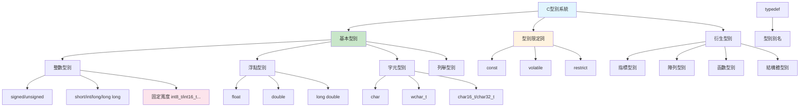

# 第二課：基本型別

## 一、課程定位

### 1.1 本課在整本書的位置

本課「基本型別」是C語言系列的第二課，緊接著第一課的編譯流程，深入探討C語言的型別系統。型別系統是C語言的核心基礎，理解型別對於後續學習指標、記憶體管理、以及FFmpeg音訊處理至關重要。

在整個學習路徑中，本課扮演著「型別基石」的角色。後續課程（控制流程、函數、指標、結構體）都依賴於對型別系統的深入理解。特別是在FFmpeg開發中，正確使用固定寬度型別（如`int16_t`、`int32_t`）對於跨平台音訊處理至關重要。

### 1.2 前置知識清單

本課假設讀者已經掌握：

1. **第一課內容**：理解編譯流程、預處理器、main函數
2. **基本數學概念**：二進位、十六進位表示法
3. **記憶體基本概念**：位元（bit）和位元組（byte）的區別

### 1.3 學完本課後能解決的實際問題

完成本課學習後，讀者將能夠：

1. **選擇正確的型別**：根據資料範圍選擇適當的整數或浮點型別
2. **理解型別轉換**：掌握隱式和顯式型別轉換的規則和風險
3. **使用固定寬度型別**：為JNI和FFmpeg開發選擇跨平台相容的型別
4. **正確使用const和volatile**：理解型別限定詞的語意和應用場景
5. **計算型別大小**：使用`sizeof`和`alignof`進行記憶體計算

---

## 二、核心概念地圖



上圖展示了C語言型別系統的完整結構。對於FFmpeg音訊開發，最關鍵的是理解整數型別（特別是固定寬度型別）和型別限定詞（特別是`const`和`volatile`）。

---

## 三、概念深度解析

### 3.1 整數型別（Integer Types）

**定義**：整數型別用於表示沒有小數部分的數值。C語言提供多種整數型別，主要區別在於儲存大小和是否有符號。

**內部原理**：

整數在記憶體中以二進位形式儲存。對於有符號整數，C標準允許三種表示方式：
1. **二補數（Two's Complement）**：現代系統幾乎都使用此方式
2. **一補數（One's Complement）**：歷史遺留，極少使用
3. **符號大小（Sign-Magnitude）**：歷史遺留，極少使用

二補數表示法的特點：
- 正數：直接以二進位表示
- 負數：將對應正數取反加一
- 最高位為符號位（0為正，1為負）
- 零只有一種表示法（全零）

**型別大小（典型值）**：

| 型別 | 最小大小 | 典型大小（64位元系統） | 範圍（典型） |
|------|---------|----------------------|-------------|
| `char` | 1 byte | 1 byte | -128 ~ 127 或 0 ~ 255 |
| `short` | 2 bytes | 2 bytes | -32,768 ~ 32,767 |
| `int` | 2 bytes | 4 bytes | -2,147,483,648 ~ 2,147,483,647 |
| `long` | 4 bytes | 8 bytes | ±9.2 × 10¹⁸ |
| `long long` | 8 bytes | 8 bytes | ±9.2 × 10¹⁸ |

**限制**：
- 型別大小因平台而異，不能假設固定大小
- 整數溢位是未定義行為（有符號）或回繞（無符號）
- 算術轉換可能導致意外結果

**編譯器行為**：
- GCC使用`-Woverflow`警告整數溢位
- 最佳化可能假設有符號整數不溢位
- 使用`-fwrapv`選項強制溢位回繞行為

**組合語言視角**：

```c
int a = 42;
int b = -1;
int c = a + b;
```

對應的x86-64組合語言：
```asm
movl $42, -4(%rbp)    ; a = 42
movl $-1, -8(%rbp)    ; b = -1 (0xFFFFFFFF in two's complement)
movl -4(%rbp), %eax   ; load a into eax
addl -8(%rbp), %eax   ; add b to eax: 42 + (-1) = 41
movl %eax, -12(%rbp)  ; store result in c
```

### 3.2 固定寬度整數型別（Fixed-Width Integer Types）

**定義**：C99標準引入的整數型別，保證精確的位元寬度，定義在`<stdint.h>`標頭檔中。

**內部原理**：

固定寬度型別透過`typedef`定義，映射到編譯器提供的適當基本型別。例如：
```c
// 典型定義（64位元系統）
typedef signed char int8_t;
typedef short int16_t;
typedef int int32_t;
typedef long long int64_t;
```

**型別分類**：

| 型別 | 寬度 | 用途 |
|------|------|------|
| `int8_t` | 8 bits | 音訊8位元樣本 |
| `int16_t` | 16 bits | CD音訊樣本 |
| `int32_t` | 32 bits | 高解析度音訊、JNI |
| `int64_t` | 64 bits | 大檔案、時間戳 |
| `uint8_t` | 8 bits | 位元組資料 |
| `uint16_t` | 16 bits | 無符號音訊 |
| `uint32_t` | 32 bits | 取樣率、緩衝區大小 |
| `uint64_t` | 64 bits | 檔案大小 |

**FFmpeg應用**：

FFmpeg廣泛使用固定寬度型別：
```c
// FFmpeg中的典型用法
int64_t duration;        // 時間長度（微秒）
int32_t sample_rate;     // 取樣率
int16_t *samples;        // 音訊樣本
uint8_t *data;           // 位元組資料
```

**限制**：
- 某些平台可能不提供所有寬度的型別
- `int8_t`等型別可能不存在（如果`char`不是8位元）
- 使用`int_leastN_t`或`int_fastN_t`作為後備

**最佳實踐**：
```c
// 使用固定寬度型別進行JNI傳輸
JNIEXPORT jint JNICALL Java_com_example_audio_process(
    JNIEnv *env,
    jobject thiz,
    jbyteArray data  // 對應 int8_t* 或 uint8_t*
) {
    jbyte *buffer = (*env)->GetByteArrayElements(env, data, NULL);
    // buffer 可以安全地轉換為 int8_t* 或 uint8_t*
    int8_t *samples = (int8_t *)buffer;
    // ...
}
```

### 3.3 浮點型別（Floating-Point Types）

**定義**：浮點型別用於表示帶有小數部分的數值，遵循IEEE 754標準。

**內部原理**：

IEEE 754浮點數表示法：
```
符號位 (1 bit) | 指數 (8/11 bits) | 尾數 (23/52 bits)
```

| 型別 | 總位元 | 符號 | 指數 | 尾數 | 有效數字 |
|------|--------|------|------|------|---------|
| `float` | 32 | 1 | 8 | 23 | ~7位 |
| `double` | 64 | 1 | 11 | 52 | ~15位 |
| `long double` | 80-128 | 1 | 15 | 64+ | ~18位+ |

**特殊值**：
- 正零/負零：`+0.0`、`-0.0`
- 正無窮/負無窮：`INFINITY`、`-INFINITY`
- NaN（Not a Number）：`NAN`
- 正規化數、次正規化數

**限制**：
- 精度有限，不能精確表示所有十進位小數
- 比較相等性需要考慮誤差
- 某些運算可能產生NaN或無窮

**編譯器行為**：
- 使用`-ffast-math`可能改變IEEE 754行為
- 使用`-fno-math-errno`可以提高效能
- 中間結果可能使用更高精度

**FFmpeg應用**：

```c
// 音訊處理中的浮點運算
float sample = 0.5f;  // f後綴表示float
double normalized = sample / INT16_MAX;  // 歸一化到[-1, 1]

// FFT運算（使用double保證精度）
void fft(double *real, double *imag, int n) {
    // 複數運算...
}
```

### 3.4 字元型別（Character Types）

**定義**：字元型別用於表示字元和字串，本質上是整數型別的特例。

**內部原理**：

`char`型別的細節：
- 大小固定為1位元組（由`CHAR_BIT`定義，通常為8）
- 可以是`signed char`或`unsigned char`（編譯器決定）
- 用於儲存ASCII字元或位元組資料

**字元編碼**：
| 編碼 | 型別 | 說明 |
|------|------|------|
| ASCII | `char` | 7位元編碼，0-127 |
| 擴充ASCII | `char` | 8位元編碼，0-255 |
| UTF-8 | `char` | 變長編碼，1-4位元組 |
| UTF-16 | `char16_t` | 變長編碼，2-4位元組 |
| UTF-32 | `char32_t` | 固定編碼，4位元組 |

**限制**：
- `char`的符號性因平台而異
- 多位元組字元需要特殊處理
- 寬字元（`wchar_t`）大小因平台而異

**最佳實踐**：
```c
// 明確使用signed或unsigned
unsigned char byte_data = 0xFF;  // 位元組資料
signed char audio_sample = -128; // 8位元音訊樣本

// 字串處理
const char *filename = "audio.flac";  // UTF-8字串
```

### 3.5 列舉型別（Enumeration Types）

**定義**：列舉型別定義一組命名的整數常數，提高程式碼可讀性。

**內部原理**：

```c
enum codec_type {
    CODEC_NONE = 0,
    CODEC_MP3,
    CODEC_AAC,
    CODEC_FLAC,
    CODEC_WAV
};
```

編譯器將列舉常數轉換為整數：
- `CODEC_NONE` = 0
- `CODEC_MP3` = 1
- `CODEC_AAC` = 2
- `CODEC_FLAC` = 3
- `CODEC_WAV` = 4

**限制**：
- 列舉型別實際上是整數型別
- 可以賦予任意整數值（不進行範圍檢查）
- 列舉值可能與其他列舉衝突

**FFmpeg應用**：

```c
// FFmpeg中的列舉定義
enum AVCodecID {
    AV_CODEC_ID_NONE = 0,
    AV_CODEC_ID_MPEG1VIDEO,
    AV_CODEC_ID_MPEG2VIDEO,
    // ...
    AV_CODEC_ID_FLAC,
    AV_CODEC_ID_AAC,
    // ...
};

// 使用列舉
enum AVCodecID codec_id = AV_CODEC_ID_FLAC;
```

### 3.6 typedef關鍵字

**定義**：`typedef`用於為現有型別建立別名，提高程式碼可讀性和可移植性。

**內部原理**：

`typedef`不創建新型別，只是創建別名：
```c
typedef int audio_sample_t;  // audio_sample_t 是 int 的別名
audio_sample_t sample = 42;  // 等價於 int sample = 42;
```

**常見用法**：

```c
// 1. 簡化複雜型別
typedef void (*callback_t)(int, const char*);
callback_t on_complete = my_callback;

// 2. 提高可移植性
typedef uint32_t sample_rate_t;  // 可以在不同平台更改底層型別

// 3. 結構體別名
typedef struct AudioFormat {
    int sample_rate;
    int channels;
    int bit_depth;
} AudioFormat;

// 4. 指標型別
typedef struct AVFormatContext AVFormatContext;
typedef struct AVCodecContext AVCodecContext;
```

**FFmpeg應用**：

FFmpeg大量使用`typedef`來隱藏實現細節：
```c
// FFmpeg中的不透明指標
typedef struct AVFormatContext AVFormatContext;
typedef struct AVCodecContext AVCodecContext;
typedef struct AVFrame AVFrame;
typedef struct AVPacket AVPacket;

// 使用者不需要知道結構體內部定義
AVFormatContext *ctx = avformat_alloc_context();
```

### 3.7 const限定詞

**定義**：`const`限定詞表示變數的值不能被修改（唯讀）。

**內部原理**：

`const`變數在編譯時被標記為唯讀，嘗試修改會導致編譯錯誤：
```c
const int max_samples = 192000;
max_samples = 44100;  // 錯誤：不能修改const變數
```

**指標與const**：

```c
// 1. 指向常數的指標（底層const）
const int *p1;        // 不能通過p1修改指向的值
int const *p2;        // 等價寫法

// 2. 常數指標（頂層const）
int * const p3 = &x;  // p3本身不能修改，必須初始化

// 3. 指向常數的常數指標
const int * const p4 = &x;  // 都不能修改
```

**FFmpeg應用**：

```c
// FFmpeg API中的const使用
const char *avcodec_get_name(enum AVCodecID id);
int avformat_open_input(AVFormatContext **ps, const char *url, ...);

// 字串參數使用const，表示函數不會修改字串
void process_filename(const char *filename) {
    // filename[0] = 'x';  // 錯誤
    printf("%s\n", filename);  // 正確
}
```

**最佳實踐**：
```c
// 參數使用const表示意圖
size_t calculate_buffer_size(const AudioFormat *fmt);

// 返回const指標防止修改
const char *get_codec_name(int codec_id);

// 常數定義使用const而非#define
const int MAX_CHANNELS = 8;  // 有型別檢查
```

### 3.8 volatile限定詞

**定義**：`volatile`限定詞告訴編譯器變數的值可能以編譯器無法預測的方式改變。

**內部原理**：

`volatile`禁止編譯器對該變數進行某些優化：
- 不能快取在暫存器中
- 不能省略讀取操作
- 不能重排序存取順序

**使用場景**：

1. **硬體暫存器**：
```c
volatile uint32_t *hardware_reg = (volatile uint32_t *)0xFFFF0000;
*hardware_reg = 0x01;  // 寫入硬體
```

2. **多執行緒共享變數**：
```c
volatile int running = 1;
void signal_handler(int sig) {
    running = 0;  // 訊號處理函數修改
}
```

3. **JNI回呼**：
```c
volatile int callback_done = 0;
// Java層可能隨時修改此變數
```

**FFmpeg應用**：

```c
// FFmpeg中的volatile使用
volatile int interrupt_flag = 0;

// 在I/O操作中檢查中斷標誌
while (!interrupt_flag && more_data) {
    // 讀取資料...
}
```

**限制**：
- `volatile`不保證原子性
- 多執行緒環境應使用原子操作或互斥鎖
- 過度使用會影響效能

---

## 四、語法完整規格

### 4.1 整數型別宣告

**BNF語法**：
```
integer-declaration ::= declaration-specifiers init-declarator-list(opt) ';'
declaration-specifiers ::= storage-class-specifier(opt) type-specifier type-qualifier(opt)
type-specifier ::= 'char' | 'short' | 'int' | 'long' | 'long long'
                  | 'signed' | 'unsigned'
                  | typedef-name
init-declarator-list ::= init-declarator | init-declarator-list ',' init-declarator
init-declarator ::= declarator | declarator '=' initializer
```

**語法說明**：

```c
// 基本整數型別
int a;                    // 有符號整數
unsigned int b;           // 無符號整數
long long c;              // 長整數
unsigned long long d;     // 無符號長整數

// 簡寫形式
short e;                  // 等價於 short int
long f;                   // 等價於 long int
unsigned g;               // 等價於 unsigned int

// 固定寬度型別（需要<stdint.h>）
int8_t h;                 // 8位元有符號
uint16_t i;               // 16位元無符號
int32_t j;                // 32位元有符號
int64_t k;                // 64位元有符號
```

**邊界條件**：

| 型別 | 最小範圍 | 典型範圍（64位元） |
|------|---------|-------------------|
| `char` | -127 ~ 127 或 0 ~ 255 | 同左 |
| `signed char` | -127 ~ 127 | -128 ~ 127 |
| `unsigned char` | 0 ~ 255 | 0 ~ 255 |
| `short` | -32767 ~ 32767 | -32768 ~ 32767 |
| `unsigned short` | 0 ~ 65535 | 0 ~ 65535 |
| `int` | -32767 ~ 32767 | -2147483648 ~ 2147483647 |
| `unsigned int` | 0 ~ 65535 | 0 ~ 4294967295 |
| `long` | -2147483647 ~ 2147483647 | 更大 |
| `long long` | -9223372036854775807 ~ 9223372036854775807 | 同左 |

**未定義行為**：
- 有符號整數溢位
- 除以零
- 移位超過型別寬度

**最佳實踐**：
```c
// 使用固定寬度型別進行跨平台開發
#include <stdint.h>

int32_t sample_rate = 192000;    // 明確32位元
int16_t sample = -32768;         // 16位元音訊樣本
uint64_t file_size = 1073741824; // 大檔案大小

// 使用size_t表示大小
size_t buffer_size = 4096;

// 使用ptrdiff_t表示指標差
ptrdiff_t offset = p2 - p1;
```

### 4.2 浮點型別宣告

**BNF語法**：
```
floating-declaration ::= declaration-specifiers init-declarator-list(opt) ';'
type-specifier ::= 'float' | 'double' | 'long double'
```

**語法說明**：

```c
float a = 3.14f;          // 單精度，f後綴
double b = 3.141592653589793;  // 雙精度（預設）
long double c = 3.14159265358979323846L;  // 擴充精度，L後綴

// 科學記號
float d = 1.92e5f;        // 192000.0
double e = 1.0e-10;       // 0.0000000001
```

**邊界條件**：

| 常數 | 描述 |
|------|------|
| `FLT_MIN` | 最小正規化float |
| `FLT_MAX` | 最大float |
| `FLT_EPSILON` | float最小精度差 |
| `DBL_MIN` | 最小正規化double |
| `DBL_MAX` | 最大double |
| `DBL_EPSILON` | double最小精度差 |

**未定義行為**：
- 浮點數除以零（可能產生無窮或NaN）
- 對NaN進行比較

**最佳實踐**：
```c
#include <math.h>
#include <float.h>

// 比較浮點數
int float_equal(float a, float b, float epsilon) {
    return fabsf(a - b) < epsilon;
}

// 檢查特殊值
if (isnan(x)) { /* 處理NaN */ }
if (isinf(x)) { /* 處理無窮 */ }
if (x == 0.0f) { /* 檢查零 */ }

// 音訊歸一化
float normalize(int16_t sample) {
    return (float)sample / 32768.0f;  // 範圍[-1, 1)
}
```

### 4.3 列舉型別宣告

**BNF語法**：
```
enum-specifier ::= 'enum' identifier(opt) '{' enumerator-list '}'
                  | 'enum' identifier '{' enumerator-list ','
                  | 'enum' identifier
enumerator-list ::= enumerator | enumerator-list ',' enumerator
enumerator ::= enumeration-constant | enumeration-constant '=' constant-expression
```

**語法說明**：

```c
// 基本列舉
enum color {
    RED,      // 0
    GREEN,    // 1
    BLUE      // 2
};

// 指定值
enum codec {
    CODEC_NONE = 0,
    CODEC_MP3 = 1,
    CODEC_AAC = 2,
    CODEC_FLAC = 10,
    CODEC_WAV = 11
};

// typedef列舉
typedef enum {
    SAMPLE_RATE_44100 = 44100,
    SAMPLE_RATE_48000 = 48000,
    SAMPLE_RATE_96000 = 96000,
    SAMPLE_RATE_192000 = 192000
} SampleRate;
```

**邊界條件**：
- 列舉常數必須是整數常數表達式
- 列舉型別與`int`相容
- 可以賦予超出列舉範圍的值

**最佳實踐**：
```c
// 使用列舉代替魔術數字
enum {
    BUFFER_SIZE_CD = 44100 * 2 * 2,    // CD: 44.1kHz, 16bit, stereo
    BUFFER_SIZE_HIRES = 192000 * 3 * 2 // Hi-Res: 192kHz, 24bit, stereo
};

// FFmpeg風格的錯誤碼
typedef enum {
    AUDIO_OK = 0,
    AUDIO_ERROR_INVALID_PARAM = -1,
    AUDIO_ERROR_NO_MEMORY = -2,
    AUDIO_ERROR_IO = -3,
    AUDIO_ERROR_DECODE = -4
} AudioError;
```

### 4.4 typedef宣告

**BNF語法**：
```
typedef-declaration ::= 'typedef' declaration-specifiers init-declarator-list ';'
```

**語法說明**：

```c
// 基本型別別名
typedef int sample_t;
typedef unsigned int uint;

// 指標型別別名
typedef char *string_t;
typedef const char *cstring_t;

// 函數指標別名
typedef int (*compare_func_t)(const void *, const void *);
typedef void (*callback_t)(int, const char *);

// 結構體別名
typedef struct Node {
    int value;
    struct Node *next;
} Node;

// 不透明指標（隱藏實現）
typedef struct AudioContext AudioContext;
```

**最佳實踐**：
```c
// 音訊型別定義
typedef int16_t sample16_t;
typedef int32_t sample32_t;
typedef float sample_float_t;

typedef struct AudioBuffer {
    sample16_t *data;
    size_t size;
    size_t capacity;
} AudioBuffer;

// 回呼函數型別
typedef void (*AudioCallback)(void *userdata, sample16_t *samples, size_t count);
```

---

## 五、範例逐行註解

### 5.1 範例一：type_sizes.c

```c
// File: type_sizes.c
// Purpose: Display sizes and ranges of various C types
// Compile: gcc type_sizes.c -o type_sizes
// Run:     ./type_sizes

#include <stdio.h>
#include <stdint.h>    // Fixed-width types
#include <limits.h>    // Integer limits
#include <float.h>     // Floating-point limits

int main(void) {
    printf("=== Integer Type Sizes ===\n\n");
    
    // Basic integer types
    printf("Basic types:\n");
    printf("  char:       %2zu bytes, range: %d to %d\n", 
           sizeof(char), CHAR_MIN, CHAR_MAX);
    printf("  short:      %2zu bytes, range: %d to %d\n", 
           sizeof(short), SHRT_MIN, SHRT_MAX);
    printf("  int:        %2zu bytes, range: %d to %d\n", 
           sizeof(int), INT_MIN, INT_MAX);
    printf("  long:       %2zu bytes, range: %ld to %ld\n", 
           sizeof(long), LONG_MIN, LONG_MAX);
    printf("  long long:  %2zu bytes, range: %lld to %lld\n", 
           sizeof(long long), LLONG_MIN, LLONG_MAX);
    
    printf("\nUnsigned types:\n");
    printf("  unsigned char:      %2zu bytes, max: %u\n", 
           sizeof(unsigned char), UCHAR_MAX);
    printf("  unsigned short:     %2zu bytes, max: %u\n", 
           sizeof(unsigned short), USHRT_MAX);
    printf("  unsigned int:       %2zu bytes, max: %u\n", 
           sizeof(unsigned int), UINT_MAX);
    printf("  unsigned long:      %2zu bytes, max: %lu\n", 
           sizeof(unsigned long), ULONG_MAX);
    printf("  unsigned long long: %2zu bytes, max: %llu\n", 
           sizeof(unsigned long long), ULLONG_MAX);
    
    printf("\n=== Fixed-Width Types ===\n\n");
    
    printf("Signed fixed-width:\n");
    printf("  int8_t:   %zu bytes, range: %d to %d\n", 
           sizeof(int8_t), INT8_MIN, INT8_MAX);
    printf("  int16_t:  %zu bytes, range: %d to %d\n", 
           sizeof(int16_t), INT16_MIN, INT16_MAX);
    printf("  int32_t:  %zu bytes, range: %d to %d\n", 
           sizeof(int32_t), INT32_MIN, INT32_MAX);
    printf("  int64_t:  %zu bytes, range: %lld to %lld\n", 
           sizeof(int64_t), INT64_MIN, INT64_MAX);
    
    printf("\nUnsigned fixed-width:\n");
    printf("  uint8_t:  %zu bytes, max: %u\n", sizeof(uint8_t), UINT8_MAX);
    printf("  uint16_t: %zu bytes, max: %u\n", sizeof(uint16_t), UINT16_MAX);
    printf("  uint32_t: %zu bytes, max: %u\n", sizeof(uint32_t), UINT32_MAX);
    printf("  uint64_t: %zu bytes, max: %llu\n", sizeof(uint64_t), UINT64_MAX);
    
    printf("\n=== Floating-Point Types ===\n\n");
    
    printf("  float:       %zu bytes, range: %e to %e, precision: %d digits\n", 
           sizeof(float), FLT_MIN, FLT_MAX, FLT_DIG);
    printf("  double:      %zu bytes, range: %e to %e, precision: %d digits\n", 
           sizeof(double), DBL_MIN, DBL_MAX, DBL_DIG);
    printf("  long double: %zu bytes, range: %Le to %Le, precision: %d digits\n", 
           sizeof(long double), LDBL_MIN, LDBL_MAX, LDBL_DIG);
    
    printf("\n=== Audio-Relevant Calculations ===\n\n");
    
    // CD Quality
    int32_t cd_samples = 44100 * 2 * 60;  // 1 minute of CD audio
    size_t cd_bytes = cd_samples * sizeof(int16_t);
    printf("CD Quality (44.1kHz, 16-bit, stereo, 1 min):\n");
    printf("  Samples: %d\n", cd_samples);
    printf("  Bytes: %zu (%.2f KB)\n", cd_bytes, cd_bytes / 1024.0);
    
    // Hi-Res Quality
    int64_t hires_samples = 192000LL * 2 * 60;  // 1 minute of Hi-Res
    size_t hires_bytes = hires_samples * sizeof(int32_t);  // 24-bit in 32-bit
    printf("\nHi-Res Quality (192kHz, 24-bit, stereo, 1 min):\n");
    printf("  Samples: %lld\n", hires_samples);
    printf("  Bytes: %zu (%.2f MB)\n", hires_bytes, hires_bytes / (1024.0 * 1024.0));
    
    return 0;
}
```

**逐行解析**：

**第6-8行**：包含必要的標頭檔
- `<stdint.h>`：提供固定寬度整數型別
- `<limits.h>`：提供整數型別的限制常數
- `<float.h>`：提供浮點型別的限制常數

**第12-23行**：輸出基本整數型別的大小和範圍
- 使用`sizeof`運算子獲取型別大小
- 使用`CHAR_MIN`、`CHAR_MAX`等常數獲取範圍
- `%zu`格式說明符用於`size_t`型別

**第25-33行**：輸出無符號整數型別
- 無符號型別的最小值都是0
- 使用`UCHAR_MAX`等常數獲取最大值

**第37-50行**：輸出固定寬度型別
- 固定寬度型別保證跨平台一致性
- `int8_t`、`int16_t`等型別在音訊處理中非常重要

**第54-59行**：輸出浮點型別
- 使用`FLT_MIN`、`FLT_MAX`等常數
- `FLT_DIG`表示有效數字位數

**第63-76行**：音訊相關計算
- 計算CD品質和Hi-Res品質的資料量
- 使用`int32_t`和`int64_t`確保足夠的範圍

### 5.2 範例二：const_volatile.c

```c
// File: const_volatile.c
// Purpose: Demonstrate const and volatile type qualifiers
// Compile: gcc const_volatile.c -o const_volatile
// Run:     ./const_volatile

#include <stdio.h>
#include <stdint.h>
#include <signal.h>

// const: read-only variables
const int MAX_SAMPLE_RATE = 192000;
const char *CODEC_NAME = "FLAC";

// volatile: may change unexpectedly
volatile sig_atomic_t interrupted = 0;

// Signal handler (can be called asynchronously)
void signal_handler(int sig) {
    (void)sig;
    interrupted = 1;  // Must be volatile for signal safety
}

// const pointer vs pointer to const
void demonstrate_pointers(void) {
    int value = 42;
    int other = 100;
    
    // Pointer to const: cannot modify pointed value
    const int *ptr_to_const = &value;
    // *ptr_to_const = 50;  // Error: cannot modify
    ptr_to_const = &other;   // OK: can change pointer
    
    // Const pointer: cannot change pointer
    int * const const_ptr = &value;
    *const_ptr = 50;         // OK: can modify value
    // const_ptr = &other;   // Error: cannot change pointer
    
    // Const pointer to const: cannot change either
    const int * const const_ptr_to_const = &value;
    // *const_ptr_to_const = 50;  // Error
    // const_ptr_to_const = &other;  // Error
    
    (void)ptr_to_const;
    (void)const_ptr_to_const;
}

// const in function parameters
int process_audio(const int16_t *samples, size_t count) {
    // samples[0] = 0;  // Error: cannot modify
    int sum = 0;
    for (size_t i = 0; i < count; i++) {
        sum += samples[i];  // OK: can read
    }
    return sum;
}

// const return value
const char *get_codec_name(void) {
    return CODEC_NAME;  // Returns pointer to const string
}

int main(void) {
    printf("=== const Demo ===\n\n");
    
    // const variables
    printf("Max sample rate: %d\n", MAX_SAMPLE_RATE);
    printf("Codec name: %s\n", CODEC_NAME);
    // MAX_SAMPLE_RATE = 44100;  // Error: cannot modify const
    
    // const arrays
    const int channels[] = {1, 2, 6, 8};
    printf("Channel counts: %d, %d, %d, %d\n", 
           channels[0], channels[1], channels[2], channels[3]);
    
    printf("\n=== volatile Demo ===\n\n");
    
    // Setup signal handler
    signal(SIGINT, signal_handler);
    
    printf("Running... Press Ctrl+C to interrupt\n");
    
    // Simulate processing loop
    for (int i = 0; i < 10 && !interrupted; i++) {
        printf("Processing sample %d\n", i);
    }
    
    if (interrupted) {
        printf("Interrupted by signal!\n");
    }
    
    printf("\n=== Pointer const Demo ===\n\n");
    demonstrate_pointers();
    printf("Pointer demonstrations completed\n");
    
    return 0;
}
```

**逐行解析**：

**第10-11行**：const變數定義
- `const int MAX_SAMPLE_RATE = 192000;`定義一個唯讀變數
- 任何嘗試修改的程式碼都會產生編譯錯誤

**第14行**：volatile變數定義
- `volatile sig_atomic_t interrupted = 0;`
- `sig_atomic_t`是訊號處理中使用的整數型別
- `volatile`確保每次都從記憶體讀取，不使用快取值

**第17-21行**：訊號處理函數
- 訊號處理函數可能隨時被呼叫（非同步）
- 修改的變數必須是`volatile`

**第24-42行**：指標與const的組合
- `const int *ptr`：指向常數的指標（底層const）
- `int * const ptr`：常數指標（頂層const）
- `const int * const ptr`：兩者都是常數

**第46-54行**：const在函數參數中的使用
- `const int16_t *samples`表示函數不會修改傳入的資料
- 這是一種契約，告訴呼叫者資料是安全的

### 5.3 範例三：enum_demo.c

```c
// File: enum_demo.c
// Purpose: Demonstrate enumeration types for audio codecs
// Compile: gcc enum_demo.c -o enum_demo
// Run:     ./enum_demo

#include <stdio.h>
#include <stdint.h>

// Basic enumeration
enum audio_format {
    FORMAT_NONE = 0,
    FORMAT_MP3,
    FORMAT_AAC,
    FORMAT_FLAC,
    FORMAT_WAV,
    FORMAT_ALAC,
    FORMAT_DSD
};

// Enumeration with specific values
enum sample_rate {
    SAMPLE_RATE_44100  = 44100,
    SAMPLE_RATE_48000  = 48000,
    SAMPLE_RATE_96000  = 96000,
    SAMPLE_RATE_192000 = 192000,
    SAMPLE_RATE_384000 = 384000
};

// Enumeration for bit depth
enum bit_depth {
    BIT_DEPTH_16 = 16,
    BIT_DEPTH_24 = 24,
    BIT_DEPTH_32 = 32
};

// Typedeffed enumeration
typedef enum {
    CHANNEL_MONO   = 1,
    CHANNEL_STEREO = 2,
    CHANNEL_5_1    = 6,
    CHANNEL_7_1    = 8
} ChannelConfig;

// Function using enumeration
const char *get_format_name(enum audio_format fmt) {
    switch (fmt) {
        case FORMAT_MP3:  return "MP3";
        case FORMAT_AAC:  return "AAC";
        case FORMAT_FLAC: return "FLAC";
        case FORMAT_WAV:  return "WAV";
        case FORMAT_ALAC: return "ALAC";
        case FORMAT_DSD:  return "DSD";
        default:          return "Unknown";
    }
}

// Check if format is lossless
int is_lossless(enum audio_format fmt) {
    return fmt == FORMAT_FLAC || 
           fmt == FORMAT_WAV || 
           fmt == FORMAT_ALAC;
}

int main(void) {
    printf("=== Audio Format Enumeration ===\n\n");
    
    // Using enumeration
    enum audio_format my_format = FORMAT_FLAC;
    printf("Format: %s (value: %d)\n", 
           get_format_name(my_format), my_format);
    printf("Is lossless: %s\n", 
           is_lossless(my_format) ? "Yes" : "No");
    
    // Sample rate enumeration
    enum sample_rate rate = SAMPLE_RATE_192000;
    printf("\nSample rate: %d Hz\n", rate);
    
    // Bit depth enumeration
    enum bit_depth depth = BIT_DEPTH_24;
    printf("Bit depth: %d bits\n", depth);
    
    // Channel configuration
    ChannelConfig channels = CHANNEL_STEREO;
    printf("Channels: %d\n", channels);
    
    printf("\n=== All Formats ===\n\n");
    
    // Iterate through formats
    const enum audio_format formats[] = {
        FORMAT_MP3, FORMAT_AAC, FORMAT_FLAC, 
        FORMAT_WAV, FORMAT_ALAC, FORMAT_DSD
    };
    
    for (int i = 0; i < 6; i++) {
        enum audio_format fmt = formats[i];
        printf("%-6s: lossless=%s\n", 
               get_format_name(fmt),
               is_lossless(fmt) ? "Yes" : "No");
    }
    
    printf("\n=== Hi-Res Audio Config ===\n\n");
    
    // Combine enumerations
    struct {
        enum audio_format format;
        enum sample_rate rate;
        enum bit_depth depth;
        ChannelConfig channels;
    } hires_config = {
        .format = FORMAT_FLAC,
        .rate = SAMPLE_RATE_192000,
        .depth = BIT_DEPTH_24,
        .channels = CHANNEL_STEREO
    };
    
    printf("Hi-Res Configuration:\n");
    printf("  Format: %s\n", get_format_name(hires_config.format));
    printf("  Sample Rate: %d Hz\n", hires_config.rate);
    printf("  Bit Depth: %d bits\n", hires_config.depth);
    printf("  Channels: %d\n", hires_config.channels);
    
    // Calculate data rate
    uint64_t data_rate = (uint64_t)hires_config.rate * 
                         hires_config.depth * 
                         hires_config.channels / 8;
    printf("  Data Rate: %lu bytes/sec (%.2f MB/min)\n", 
           data_rate, data_rate * 60.0 / (1024 * 1024));
    
    return 0;
}
```

**逐行解析**：

**第9-17行**：基本列舉定義
- 列舉常數自動遞增（從0開始）
- 可以指定特定值

**第20-27行**：帶特定值的列舉
- 使用實際的取樣率值
- 便於直接使用，不需要映射

**第42-53行**：使用列舉的函數
- `switch`語句與列舉完美配合
- 編譯器可能警告缺少的case

**第89-103行**：列舉陣列和迭代
- 列舉值可以儲存在陣列中
- 可以用於迴圈迭代

**第106-120行**：結構體中的列舉
- 列舉使程式碼更具可讀性
- 組合使用多個列舉定義配置

### 5.4 範例四：sizeof_alignof.c

```c
// File: sizeof_alignof.c
// Purpose: Demonstrate sizeof and alignof operators
// Compile: gcc sizeof_alignof.c -o sizeof_alignof
// Run:     ./sizeof_alignof

#include <stdio.h>
#include <stdint.h>
#include <stdalign.h>  // C11: alignof

// Struct with different alignments
struct AudioSample {
    int8_t channel;      // 1 byte
    int32_t value;       // 4 bytes (aligned to 4)
    int16_t gain;        // 2 bytes
};  // Total: likely 12 bytes due to padding

// Packed struct (no padding)
#pragma pack(push, 1)
struct PackedAudioSample {
    int8_t channel;      // 1 byte
    int32_t value;       // 4 bytes
    int16_t gain;        // 2 bytes
};  // Total: 7 bytes
#pragma pack(pop)

// Aligned struct
struct alignas(16) AlignedBuffer {
    uint8_t data[16];
};

int main(void) {
    printf("=== sizeof Operator ===\n\n");
    
    // Basic types
    printf("Basic types:\n");
    printf("  sizeof(char)      = %zu\n", sizeof(char));
    printf("  sizeof(short)     = %zu\n", sizeof(short));
    printf("  sizeof(int)       = %zu\n", sizeof(int));
    printf("  sizeof(long)      = %zu\n", sizeof(long));
    printf("  sizeof(long long) = %zu\n", sizeof(long long));
    printf("  sizeof(float)     = %zu\n", sizeof(float));
    printf("  sizeof(double)    = %zu\n", sizeof(double));
    printf("  sizeof(void*)     = %zu\n", sizeof(void*));
    
    // Fixed-width types
    printf("\nFixed-width types:\n");
    printf("  sizeof(int8_t)    = %zu\n", sizeof(int8_t));
    printf("  sizeof(int16_t)   = %zu\n", sizeof(int16_t));
    printf("  sizeof(int32_t)   = %zu\n", sizeof(int32_t));
    printf("  sizeof(int64_t)   = %zu\n", sizeof(int64_t));
    
    // Arrays
    printf("\nArrays:\n");
    int16_t samples[1024];
    printf("  int16_t samples[1024]: %zu bytes (%zu elements)\n", 
           sizeof(samples), sizeof(samples) / sizeof(samples[0]));
    
    // Pointers
    printf("\nPointers:\n");
    int *ptr;
    printf("  sizeof(int*)      = %zu (pointer size, not pointed data)\n", sizeof(ptr));
    
    printf("\n=== alignof Operator (C11) ===\n\n");
    
    // Basic alignments
    printf("Basic alignments:\n");
    printf("  alignof(char)      = %zu\n", alignof(char));
    printf("  alignof(short)     = %zu\n", alignof(short));
    printf("  alignof(int)       = %zu\n", alignof(int));
    printf("  alignof(double)    = %zu\n", alignof(double));
    printf("  alignof(int64_t)   = %zu\n", alignof(int64_t));
    
    printf("\n=== Struct Layout ===\n\n");
    
    // Normal struct
    printf("Normal struct AudioSample:\n");
    printf("  sizeof(struct AudioSample) = %zu\n", sizeof(struct AudioSample));
    printf("  alignof(struct AudioSample) = %zu\n", alignof(struct AudioSample));
    printf("  Offsets:\n");
    printf("    channel: %zu\n", offsetof(struct AudioSample, channel));
    printf("    value:   %zu\n", offsetof(struct AudioSample, value));
    printf("    gain:    %zu\n", offsetof(struct AudioSample, gain));
    
    // Packed struct
    printf("\nPacked struct PackedAudioSample:\n");
    printf("  sizeof(struct PackedAudioSample) = %zu\n", sizeof(struct PackedAudioSample));
    printf("  alignof(struct PackedAudioSample) = %zu\n", alignof(struct PackedAudioSample));
    
    // Aligned struct
    printf("\nAligned struct AlignedBuffer:\n");
    printf("  sizeof(struct AlignedBuffer) = %zu\n", sizeof(struct AlignedBuffer));
    printf("  alignof(struct AlignedBuffer) = %zu\n", alignof(struct AlignedBuffer));
    
    printf("\n=== Audio Buffer Calculations ===\n\n");
    
    // Calculate buffer sizes
    size_t sample_count = 4096;
    size_t buffer_size = sample_count * sizeof(int16_t);
    printf("Buffer for %zu samples (16-bit): %zu bytes (%.2f KB)\n", 
           sample_count, buffer_size, buffer_size / 1024.0);
    
    // Hi-Res buffer
    sample_count = 4096;
    buffer_size = sample_count * sizeof(int32_t);
    printf("Buffer for %zu samples (32-bit): %zu bytes (%.2f KB)\n", 
           sample_count, buffer_size, buffer_size / 1024.0);
    
    // Aligned allocation
    size_t alignment = 16;
    size_t aligned_size = (buffer_size + alignment - 1) & ~(alignment - 1);
    printf("Aligned buffer (16-byte): %zu bytes\n", aligned_size);
    
    return 0;
}
```

**逐行解析**：

**第9-14行**：普通結構體
- 編譯器會插入填充位元組以保證對齊
- `int32_t`需要4位元組對齊

**第17-23行**：打包結構體
- `#pragma pack(1)`移除填充
- 節省空間但可能降低效能

**第26-28行**：對齊結構體
- `alignas(16)`指定16位元組對齊
- 適合SIMD操作

**第36-50行**：sizeof運算子
- `sizeof`在編譯時計算型別大小
- 對於陣列，返回整個陣列的大小

**第58-64行**：alignof運算子
- C11標準引入
- 返回型別的對齊要求

**第68-78行**：結構體佈局分析
- `offsetof`宏返回成員的偏移量
- 可以看到填充位元組的位置

### 5.5 範例五：typedef_demo.c

```c
// File: typedef_demo.c
// Purpose: Demonstrate typedef for audio types
// Compile: gcc typedef_demo.c -o typedef_demo
// Run:     ./typedef_demo

#include <stdio.h>
#include <stdint.h>
#include <stdlib.h>
#include <string.h>

// Basic typedef for audio samples
typedef int16_t sample16_t;
typedef int32_t sample32_t;
typedef float sample_float_t;

// Typedef for sizes
typedef size_t audio_size_t;
typedef uint32_t sample_rate_t;
typedef uint8_t channel_count_t;

// Struct typedef
typedef struct AudioBuffer {
    sample16_t *samples;
    audio_size_t size;
    audio_size_t capacity;
    sample_rate_t sample_rate;
    channel_count_t channels;
} AudioBuffer;

// Function pointer typedef
typedef void (*AudioCallback)(AudioBuffer *buffer, void *userdata);
typedef int (*ProcessFunc)(sample16_t *input, sample16_t *output, size_t count);

// Opaque type (forward declaration)
typedef struct AudioDecoder AudioDecoder;

// Error code typedef
typedef enum {
    AUDIO_OK = 0,
    AUDIO_ERROR_INVALID = -1,
    AUDIO_ERROR_MEMORY = -2,
    AUDIO_ERROR_IO = -3
} AudioError;

// Create audio buffer
AudioBuffer *audio_buffer_create(audio_size_t capacity, 
                                  sample_rate_t rate, 
                                  channel_count_t channels) {
    AudioBuffer *buf = malloc(sizeof(AudioBuffer));
    if (!buf) return NULL;
    
    buf->samples = malloc(capacity * sizeof(sample16_t));
    if (!buf->samples) {
        free(buf);
        return NULL;
    }
    
    buf->capacity = capacity;
    buf->size = 0;
    buf->sample_rate = rate;
    buf->channels = channels;
    
    return buf;
}

// Free audio buffer
void audio_buffer_free(AudioBuffer *buf) {
    if (buf) {
        free(buf->samples);
        free(buf);
    }
}

// Process audio samples
static int process_samples(sample16_t *input, sample16_t *output, size_t count) {
    for (size_t i = 0; i < count; i++) {
        // Simple gain adjustment (multiply by 0.5)
        output[i] = input[i] / 2;
    }
    return AUDIO_OK;
}

int main(void) {
    printf("=== Typedef Demo ===\n\n");
    
    // Using typedef'd types
    sample_rate_t rate = 192000;
    channel_count_t channels = 2;
    audio_size_t capacity = 4096;
    
    printf("Audio Configuration:\n");
    printf("  Sample Rate: %u Hz\n", rate);
    printf("  Channels: %u\n", channels);
    printf("  Buffer Capacity: %zu samples\n", capacity);
    
    // Create buffer
    AudioBuffer *buffer = audio_buffer_create(capacity, rate, channels);
    if (!buffer) {
        fprintf(stderr, "Failed to create buffer\n");
        return 1;
    }
    
    printf("\nBuffer created:\n");
    printf("  Capacity: %zu samples\n", buffer->capacity);
    printf("  Sample size: %zu bytes\n", sizeof(sample16_t));
    printf("  Total size: %zu bytes\n", buffer->capacity * sizeof(sample16_t));
    
    // Fill with test data
    for (audio_size_t i = 0; i < buffer->capacity; i++) {
        buffer->samples[i] = (sample16_t)(i % 65536 - 32768);
    }
    buffer->size = buffer->capacity;
    
    // Process using function pointer
    ProcessFunc processor = process_samples;
    sample16_t *output = malloc(capacity * sizeof(sample16_t));
    
    if (output) {
        AudioError result = processor(buffer->samples, output, capacity);
        printf("\nProcessing result: %d\n", result);
        printf("Input[0]: %d, Output[0]: %d\n", buffer->samples[0], output[0]);
        free(output);
    }
    
    // Cleanup
    audio_buffer_free(buffer);
    
    printf("\n=== Type Sizes ===\n\n");
    printf("  sizeof(sample16_t): %zu\n", sizeof(sample16_t));
    printf("  sizeof(sample32_t): %zu\n", sizeof(sample32_t));
    printf("  sizeof(sample_float_t): %zu\n", sizeof(sample_float_t));
    printf("  sizeof(AudioBuffer): %zu\n", sizeof(AudioBuffer));
    
    return 0;
}
```

**逐行解析**：

**第10-15行**：基本型別別名
- 為音訊樣本型別創建語意化名稱
- 提高程式碼可讀性

**第18-21行**：大小相關型別
- 使用`typedef`為特定用途的型別命名
- 便於未來修改底層型別

**第24-30行**：結構體typedef
- 結合`struct`和`typedef`定義
- 簡化結構體使用

**第33-34行**：函數指標typedef
- 簡化複雜的函數指標型別
- 用於回呼和處理函數

**第37行**：不透明型別
- 前向宣告，隱藏實現細節
- FFmpeg風格的API設計

---

## 六、錯誤案例對照表

### 6.1 整數溢位錯誤

| 錯誤程式碼 | 錯誤訊息/行為 | 根本原因 | 正確寫法 |
|-----------|--------------|---------|---------|
| `int16_t x = 32768;` | 編譯警告或運行時錯誤 | 超出`int16_t`範圍 | `int32_t x = 32768;` |
| `int x = INT_MAX + 1;` | 未定義行為 | 有符號整數溢位 | `long x = (long)INT_MAX + 1;` |
| `unsigned int x = -1;` | x = UINT_MAX | 負數轉換為無符號 | `unsigned int x = 0;` |
| `int x = 0xFFFF;` | x = 65535（可能） | 十六進位常數型別 | `int x = 65535; // 明確值` |

### 6.2 型別轉換錯誤

| 錯誤程式碼 | 錯誤訊息/行為 | 根本原因 | 正確寫法 |
|-----------|--------------|---------|---------|
| `int *p = malloc(n);` | 警告：隱式宣告 | 缺少`<stdlib.h>` | `int *p = malloc(n * sizeof(*p));` |
| `float f = 3.14;` | 可能精度警告 | double賦值給float | `float f = 3.14f;` |
| `int x = 3.14;` | x = 3 | 浮點轉整數截斷 | `int x = (int)3.14; // 明確轉換` |
| `char c = 256;` | c = 0（可能） | 超出char範圍 | `int c = 256;` |

### 6.3 const/volatile錯誤

| 錯誤程式碼 | 錯誤訊息 | 根本原因 | 正確寫法 |
|-----------|---------|---------|---------|
| `const int x; x = 5;` | 錯誤：唯讀變數 | 修改const變數 | `const int x = 5;` |
| `int *p = &const_var;` | 警告：丟棄const | 將const指標賦給非const | `const int *p = &const_var;` |
| `volatile int *p; *p = *p;` | 無錯誤，但可能問題 | 多次讀取volatile | `int tmp = *p; *p = tmp;` |

### 6.4 sizeof/alignof錯誤

| 錯誤程式碼 | 錯誤訊息 | 根本原因 | 正確寫法 |
|-----------|---------|---------|---------|
| `sizeof(int)` | 無錯誤 | 正確用法 | - |
| `sizeof int` | 錯誤：需要括號 | 型別需要括號 | `sizeof(int)` |
| `int a[10]; sizeof(a/a[0])` | 錯誤：除法 | 語法錯誤 | `sizeof(a)/sizeof(a[0])` |
| `int *p; sizeof(*p)` | 無錯誤，但可能混淆 | sizeof不解引用 | `sizeof(int)` 或 `sizeof(*p)` |

---

## 七、效能與記憶體分析

### 7.1 型別選擇對效能的影響

**整數運算效能**：

| 型別 | 相對效能 | 說明 |
|------|---------|------|
| `int` | 最快 | 通常為機器原生字長 |
| `int32_t` | 快 | 固定寬度，可能需要額外指令 |
| `int64_t` | 32位元系統較慢 | 需要兩個暫存器 |
| `int8_t` | 可能較慢 | 需要符號擴展 |

**浮點運算效能**：

| 型別 | 相對效能 | 說明 |
|------|---------|------|
| `float` | 快 | 單精度，適合SIMD |
| `double` | 中等 | 雙精度，更多運算 |
| `long double` | 慢 | 軟體模擬可能 |

### 7.2 記憶體對齊影響

```
未對齊結構體：
+------+------+----------+------+
| char | pad  | int      | short|
+------+------+----------+------+
  1      3      4          2     = 10 bytes (with padding)

對齊結構體（重新排序）：
+----------+------+------+
| int      | short| char |
+----------+------+------+
  4          2      1     = 8 bytes (with 1 byte padding)
```

**最佳實踐**：
```c
// 不好的排列
struct Bad {
    char a;     // 1 byte + 3 padding
    int b;      // 4 bytes
    char c;     // 1 byte + 3 padding
};  // Total: 12 bytes

// 好的排列
struct Good {
    int b;      // 4 bytes
    char a;     // 1 byte
    char c;     // 1 byte + 2 padding
};  // Total: 8 bytes
```

### 7.3 FFmpeg中的型別使用

**FFmpeg常用型別**：

```c
// 時間相關
int64_t pts;              // 時間戳（微秒）
int64_t duration;         // 時間長度

// 音訊相關
int sample_rate;          // 取樣率（int足夠）
int channels;             // 通道數
int frame_size;           // 幀大小
int format;               // 樣本格式（enum）

// 緩衝區相關
uint8_t *data;            // 資料指標
int size;                 // 資料大小
int capacity;             // 緩衝區容量

// 錯誤碼
int ret;                  // 返回值（負數表示錯誤）
```

### 7.4 JNI型別映射

| Java型別 | C/JNI型別 | 說明 |
|---------|----------|------|
| `byte` | `jbyte` (int8_t) | 8位元有符號 |
| `short` | `jshort` (int16_t) | 16位元有符號 |
| `int` | `jint` (int32_t) | 32位元有符號 |
| `long` | `jlong` (int64_t) | 64位元有符號 |
| `float` | `jfloat` (float) | 單精度浮點 |
| `double` | `jdouble` (double) | 雙精度浮點 |

---

## 八、Hi-Res音訊實戰連結

### 8.1 音訊樣本型別選擇

**CD品質（16-bit）**：
```c
#include <stdint.h>

typedef int16_t cd_sample_t;
#define CD_SAMPLE_MIN (-32768)
#define CD_SAMPLE_MAX (32767)

// 處理CD音訊
void process_cd_audio(cd_sample_t *samples, size_t count) {
    for (size_t i = 0; i < count; i++) {
        // 樣本範圍：-32768 到 32767
        samples[i] = samples[i] * 2 / 3;  // 簡單音量調整
    }
}
```

**Hi-Res品質（24-bit）**：
```c
// 24-bit樣本通常儲存在32位元整數中
typedef int32_t hires_sample_t;
#define HIRES_SAMPLE_MIN (-8388608)
#define HIRES_SAMPLE_MAX (8388607)

// 處理Hi-Res音訊
void process_hires_audio(hires_sample_t *samples, size_t count) {
    for (size_t i = 0; i < count; i++) {
        // 樣本範圍：-8388608 到 8388607
        // 注意：只有低24位有效
        samples[i] &= 0xFFFFFF;  // 確保24位
    }
}
```

### 8.2 FFmpeg樣本格式

```c
// FFmpeg中的樣本格式
enum AVSampleFormat {
    AV_SAMPLE_FMT_NONE = -1,
    AV_SAMPLE_FMT_U8,          // unsigned 8 bits
    AV_SAMPLE_FMT_S16,         // signed 16 bits
    AV_SAMPLE_FMT_S32,         // signed 32 bits
    AV_SAMPLE_FMT_FLT,         // float
    AV_SAMPLE_FMT_DBL,         // double
    
    AV_SAMPLE_FMT_U8P,         // unsigned 8 bits, planar
    AV_SAMPLE_FMT_S16P,        // signed 16 bits, planar
    AV_SAMPLE_FMT_S32P,        // signed 32 bits, planar
    AV_SAMPLE_FMT_FLTP,        // float, planar
    AV_SAMPLE_FMT_DBLP,        // double, planar
};

// 獲取樣本大小
int bytes_per_sample = av_get_bytes_per_sample(AV_SAMPLE_FMT_S16);
// bytes_per_sample = 2
```

### 8.3 AudioTrack配置

```c
// Android AudioTrack配置（透過JNI）
// 對應的C型別選擇

// 16-bit PCM
typedef int16_t sample_16bit_t;
#define AUDIO_FORMAT_PCM_16_BIT 2

// 24-bit PCM（打包在32位元中）
typedef int32_t sample_24bit_t;
#define AUDIO_FORMAT_PCM_32_BIT 4

// Float
typedef float sample_float_t;
#define AUDIO_FORMAT_PCM_FLOAT 4

// 計算緩衝區大小
size_t calculate_buffer_size(int sample_rate, int channels, int format_size, int duration_ms) {
    return (size_t)sample_rate * channels * format_size * duration_ms / 1000;
}
```

### 8.4 重取樣型別處理

```c
#include <libswresample/swresample.h>

// 重取樣配置
SwrContext *setup_resampler(int src_rate, int src_channels,
                            int dst_rate, int dst_channels) {
    SwrContext *swr = swr_alloc();
    
    // 設定輸入參數
    av_opt_set_int(swr, "in_sample_rate", src_rate, 0);
    av_opt_set_int(swr, "in_channel_layout", 
                   src_channels == 2 ? AV_CH_LAYOUT_STEREO : AV_CH_LAYOUT_MONO, 0);
    av_opt_set_sample_fmt(swr, "in_sample_fmt", AV_SAMPLE_FMT_S16, 0);
    
    // 設定輸出參數
    av_opt_set_int(swr, "out_sample_rate", dst_rate, 0);
    av_opt_set_int(swr, "out_channel_layout",
                   dst_channels == 2 ? AV_CH_LAYOUT_STEREO : AV_CH_LAYOUT_MONO, 0);
    av_opt_set_sample_fmt(swr, "out_sample_fmt", AV_SAMPLE_FMT_S16, 0);
    
    swr_init(swr);
    return swr;
}
```

---

## 九、練習題與解答

### 9.1 基礎練習

**題目**：撰寫一個程式，計算並輸出各種音訊格式的資料率（bytes/sec）。

**解答**：
```c
// File: exercise_01.c
// Purpose: Calculate data rates for various audio formats
// Compile: gcc exercise_01.c -o exercise_01

#include <stdio.h>
#include <stdint.h>

typedef struct {
    const char *name;
    uint32_t sample_rate;
    uint8_t bit_depth;
    uint8_t channels;
} AudioFormat;

uint64_t calculate_data_rate(const AudioFormat *fmt) {
    return (uint64_t)fmt->sample_rate * fmt->bit_depth * fmt->channels / 8;
}

int main(void) {
    AudioFormat formats[] = {
        {"CD Quality", 44100, 16, 2},
        {"DVD Quality", 48000, 24, 6},
        {"Hi-Res 96kHz", 96000, 24, 2},
        {"Hi-Res 192kHz", 192000, 24, 2},
        {"Studio 384kHz", 384000, 32, 2}
    };
    
    printf("Audio Format Data Rates:\n");
    printf("%-20s %10s %8s %8s %15s\n", 
           "Format", "Rate", "Bits", "Ch", "Bytes/sec");
    printf("%-20s %10s %8s %8s %15s\n", 
           "------", "----", "----", "--", "---------");
    
    for (size_t i = 0; i < sizeof(formats)/sizeof(formats[0]); i++) {
        uint64_t rate = calculate_data_rate(&formats[i]);
        printf("%-20s %10u %8u %8u %15lu\n",
               formats[i].name,
               formats[i].sample_rate,
               formats[i].bit_depth,
               formats[i].channels,
               rate);
    }
    
    return 0;
}
```

### 9.2 進階練習

**題目**：實作一個型別安全的音訊緩衝區結構，使用typedef和const限定詞。

**解答**：
```c
// File: exercise_02.c
// Purpose: Type-safe audio buffer implementation
// Compile: gcc exercise_02.c -o exercise_02

#include <stdio.h>
#include <stdint.h>
#include <stdlib.h>
#include <string.h>

// Type definitions for audio
typedef int16_t sample_t;
typedef size_t buffer_size_t;
typedef uint32_t sample_rate_t;
typedef uint8_t channel_count_t;

// Error codes
typedef enum {
    BUFFER_OK = 0,
    BUFFER_ERROR_NULL = -1,
    BUFFER_ERROR_MEMORY = -2,
    BUFFER_ERROR_SIZE = -3
} BufferError;

// Audio buffer structure
typedef struct {
    sample_t *data;
    buffer_size_t size;
    buffer_size_t capacity;
    sample_rate_t sample_rate;
    channel_count_t channels;
} AudioBuffer;

// Create buffer
AudioBuffer *buffer_create(buffer_size_t capacity, 
                           sample_rate_t rate,
                           channel_count_t channels) {
    AudioBuffer *buf = malloc(sizeof(AudioBuffer));
    if (!buf) return NULL;
    
    buf->data = malloc(capacity * sizeof(sample_t));
    if (!buf->data) {
        free(buf);
        return NULL;
    }
    
    buf->capacity = capacity;
    buf->size = 0;
    buf->sample_rate = rate;
    buf->channels = channels;
    
    return buf;
}

// Free buffer
void buffer_free(AudioBuffer *buf) {
    if (buf) {
        free(buf->data);
        free(buf);
    }
}

// Get sample (const access)
const sample_t *buffer_get_sample(const AudioBuffer *buf, buffer_size_t index) {
    if (!buf || index >= buf->size) return NULL;
    return &buf->data[index];
}

// Set sample
BufferError buffer_set_sample(AudioBuffer *buf, buffer_size_t index, sample_t value) {
    if (!buf) return BUFFER_ERROR_NULL;
    if (index >= buf->capacity) return BUFFER_ERROR_SIZE;
    
    buf->data[index] = value;
    if (index >= buf->size) buf->size = index + 1;
    
    return BUFFER_OK;
}

// Process buffer (read-only access)
BufferError buffer_process(const AudioBuffer *input, AudioBuffer *output) {
    if (!input || !output) return BUFFER_ERROR_NULL;
    if (input->size > output->capacity) return BUFFER_ERROR_SIZE;
    
    // Simple copy with gain reduction
    for (buffer_size_t i = 0; i < input->size; i++) {
        output->data[i] = input->data[i] / 2;
    }
    output->size = input->size;
    
    return BUFFER_OK;
}

int main(void) {
    // Create buffers
    AudioBuffer *input = buffer_create(1024, 192000, 2);
    AudioBuffer *output = buffer_create(1024, 192000, 2);
    
    if (!input || !output) {
        printf("Failed to create buffers\n");
        return 1;
    }
    
    // Fill input buffer
    for (buffer_size_t i = 0; i < 100; i++) {
        buffer_set_sample(input, i, (sample_t)(i - 50));
    }
    
    // Process
    BufferError err = buffer_process(input, output);
    if (err != BUFFER_OK) {
        printf("Processing error: %d\n", err);
        return 1;
    }
    
    // Print results
    printf("Input samples: %zu\n", input->size);
    printf("Output samples: %zu\n", output->size);
    printf("Sample comparison:\n");
    for (buffer_size_t i = 0; i < 5; i++) {
        const sample_t *in_sample = buffer_get_sample(input, i);
        const sample_t *out_sample = buffer_get_sample(output, i);
        printf("  [%zu] in=%d, out=%d\n", i, *in_sample, *out_sample);
    }
    
    // Cleanup
    buffer_free(input);
    buffer_free(output);
    
    return 0;
}
```

### 9.3 FFmpeg實戰練習

**題目**：撰寫一個程式，使用FFmpeg型別定義來描述音訊格式。

**解答**：
```c
// File: exercise_03.c
// Purpose: FFmpeg-style audio format description
// Compile: gcc exercise_03.c -o exercise_03

#include <stdio.h>
#include <stdint.h>
#include <string.h>

// FFmpeg-style type definitions
typedef enum {
    AV_SAMPLE_FMT_NONE = -1,
    AV_SAMPLE_FMT_U8,          ///< unsigned 8 bits
    AV_SAMPLE_FMT_S16,         ///< signed 16 bits
    AV_SAMPLE_FMT_S32,         ///< signed 32 bits
    AV_SAMPLE_FMT_FLT,         ///< float
    AV_SAMPLE_FMT_DBL,         ///< double
    AV_SAMPLE_FMT_U8P,         ///< unsigned 8 bits, planar
    AV_SAMPLE_FMT_S16P,        ///< signed 16 bits, planar
    AV_SAMPLE_FMT_S32P,        ///< signed 32 bits, planar
    AV_SAMPLE_FMT_FLTP,        ///< float, planar
    AV_SAMPLE_FMT_DBLP,        ///< double, planar
    AV_SAMPLE_FMT_NB           ///< Number of sample formats
} AVSampleFormat;

typedef struct AVChannelLayout {
    uint64_t order;     ///< channel order
    int nb_channels;    ///< number of channels
} AVChannelLayout;

// Audio format description
typedef struct AudioFormatDesc {
    AVSampleFormat format;
    int sample_rate;
    AVChannelLayout ch_layout;
    const char *codec_name;
} AudioFormatDesc;

// Helper functions
const char *sample_format_name(AVSampleFormat fmt) {
    static const char *names[] = {
        "u8", "s16", "s32", "flt", "dbl",
        "u8p", "s16p", "s32p", "fltp", "dblp"
    };
    if (fmt < 0 || fmt >= AV_SAMPLE_FMT_NB) return "unknown";
    return names[fmt];
}

int bytes_per_sample(AVSampleFormat fmt) {
    static const int sizes[] = {1, 2, 4, 4, 8, 1, 2, 4, 4, 8};
    if (fmt < 0 || fmt >= AV_SAMPLE_FMT_NB) return 0;
    return sizes[fmt];
}

int is_planar(AVSampleFormat fmt) {
    return fmt >= AV_SAMPLE_FMT_U8P;
}

uint64_t calculate_bitrate(const AudioFormatDesc *desc) {
    int bps = bytes_per_sample(desc->format);
    return (uint64_t)desc->sample_rate * desc->ch_layout.nb_channels * bps * 8;
}

void print_format_info(const AudioFormatDesc *desc) {
    printf("Audio Format Information:\n");
    printf("  Format: %s (%d bytes/sample)\n", 
           sample_format_name(desc->format), 
           bytes_per_sample(desc->format));
    printf("  Planar: %s\n", is_planar(desc->format) ? "Yes" : "No");
    printf("  Sample Rate: %d Hz\n", desc->sample_rate);
    printf("  Channels: %d\n", desc->ch_layout.nb_channels);
    printf("  Codec: %s\n", desc->codec_name);
    printf("  Bit Rate: %lu bps (%.2f Mbps)\n", 
           calculate_bitrate(desc),
           calculate_bitrate(desc) / 1000000.0);
}

int main(void) {
    printf("=== FFmpeg Audio Format Demo ===\n\n");
    
    // CD Quality
    AudioFormatDesc cd = {
        .format = AV_SAMPLE_FMT_S16,
        .sample_rate = 44100,
        .ch_layout = {.nb_channels = 2},
        .codec_name = "PCM"
    };
    printf("CD Quality:\n");
    print_format_info(&cd);
    
    printf("\n");
    
    // Hi-Res Quality
    AudioFormatDesc hires = {
        .format = AV_SAMPLE_FMT_S32,
        .sample_rate = 192000,
        .ch_layout = {.nb_channels = 2},
        .codec_name = "FLAC"
    };
    printf("Hi-Res Quality:\n");
    print_format_info(&hires);
    
    printf("\n");
    
    // Studio Quality
    AudioFormatDesc studio = {
        .format = AV_SAMPLE_FMT_FLTP,
        .sample_rate = 384000,
        .ch_layout = {.nb_channels = 2},
        .codec_name = "PCM Float"
    };
    printf("Studio Quality:\n");
    print_format_info(&studio);
    
    return 0;
}
```

---

## 十、下一課銜接橋樑

### 10.1 本課知識在下一課的應用

本課學習的型別系統知識，將在下一課「控制流程」中得到應用：

1. **條件判斷**：`if`語句使用整數型別作為條件
2. **迴圈計數**：`for`迴圈使用整數型別計數
3. **switch語句**：使用整數型別（包括列舉）作為判斷值
4. **運算結果**：算術運算涉及型別轉換和溢位

### 10.2 預告：下一課核心內容

下一課「控制流程」將深入探討：

- **條件語句**：`if`、`else if`、`else`、`switch`
- **迴圈語句**：`for`、`while`、`do-while`
- **跳轉語句**：`break`、`continue`、`goto`、`return`
- **條件運算子**：三元運算子`?:`
- **邏輯運算**：`&&`、`||`、`!`

### 10.3 學習建議

在進入下一課之前，建議讀者：

1. **複習型別範圍**：牢記各種整數型別的範圍
2. **練習sizeof**：使用`sizeof`計算各種型別的大小
3. **理解對齊**：觀察結構體的記憶體佈局
4. **閱讀FFmpeg標頭檔**：查看FFmpeg如何定義型別

### 10.4 延伸閱讀

- **C標準文件**：ISO/IEC 9899:2018 第6.2.5節（型別）
- **stdint.h**：固定寬度整數型別標準
- **FFmpeg文件**：https://ffmpeg.org/doxygen/trunk/
