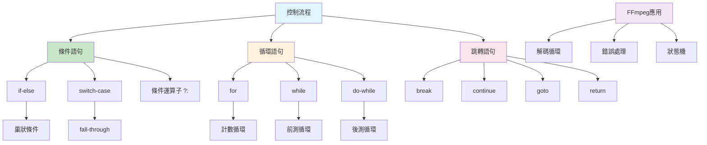

# 第三課：控制流程

## 一、課程定位

### 1.1 本課在整本書的位置

本課「控制流程」是C語言系列的第三課，緊接著第二課的基本型別，深入探討C語言的流程控制機制。控制流程是程式設計的核心概念，決定了程式碼的執行順序和邏輯分支。

在整個學習路徑中，本課扮演著「邏輯骨架」的角色。後續課程（函數、指標、記憶體管理）都依賴於對控制流程的深入理解。特別是在FFmpeg音訊處理中，正確使用控制流程對於解碼循環、錯誤處理、狀態機實現至關重要。

### 1.2 前置知識清單

本課假設讀者已經掌握：

1. **第一課內容**：理解編譯流程、預處理器、main函數
2. **第二課內容**：理解基本型別、型別轉換、sizeof運算子
3. **基本邏輯概念**：布林邏輯、條件判斷
4. **基本數學概念**：比較運算、邏輯運算

### 1.3 學完本課後能解決的實際問題

完成本課學習後，讀者將能夠：

1. **編寫條件分支**：使用if-else和switch實現複雜的邏輯判斷
2. **設計循環結構**：使用for、while、do-while處理迭代任務
3. **控制程式流程**：使用break、continue、goto進行流程跳轉
4. **實現狀態機**：為FFmpeg解碼器設計狀態機邏輯
5. **處理錯誤流程**：設計健壯的錯誤處理和異常流程

---

## 二、核心概念地圖



上圖展示了C語言控制流程的完整結構。對於FFmpeg音訊開發，最關鍵的是理解循環語句（特別是for和while）和跳轉語句（特別是break和goto用於錯誤處理）。

---

## 三、概念深度解析

### 3.1 條件語句（Conditional Statements）

**定義**：條件語句根據條件表達式的真假值，決定執行哪個分支的程式碼。C語言提供if-else和switch-case兩種主要的條件語句。

**內部原理**：

條件語句在編譯後轉換為條件跳轉指令。以x86-64為例：

1. **if語句**：編譯為`cmp`（比較）+ `je/jne`（條件跳轉）指令
2. **switch語句**：編譯器可能生成跳轉表（jump table）或二分查找樹

**編譯器行為**：

```c
// 原始碼
if (x > 0) {
    // branch A
} else {
    // branch B
}

// 編譯後的彙編（偽代碼）
    cmp x, 0
    jle .else_branch
    ; branch A code
    jmp .end_if
.else_branch:
    ; branch B code
.end_if:
```

**限制**：

1. 條件表達式必須是純量型別（整數、浮點、指標）
2. switch-case的case標籤必須是整數常量表達式
3. 巢狀過深的條件語句會降低代碼可讀性

**匯編視角**：

在匯編層面，條件語句涉及：
- **條件碼（Condition Codes）**：ZF（零標誌）、SF（符號標誌）、OF（溢出標誌）
- **分支預測（Branch Prediction）**：CPU預測分支方向以優化執行
- **分支預測失敗代價**：約10-20個CPU週期的pipeline flush

### 3.2 if-else語句詳解

**語法規格**：

```bnf
if-statement ::= 'if' '(' expression ')' statement ('else' statement)?
```

**求值規則**：

1. 首先求值條件表達式
2. 若表達式不等於0，執行if分支
3. 若表達式等於0且有else分支，執行else分支
4. 若表達式等於0且無else分支，跳過整個語句

**常見陷阱**：

1. **懸空else（Dangling Else）**：else與最近的未配對if匹配
2. **賦值與比較混淆**：`if (x = 5)` vs `if (x == 5)`
3. **浮點比較**：直接比較浮點數可能因精度問題產生錯誤

**最佳實踐**：

```c
// Good: 使用大括號明確範圍
if (condition) {
    do_something();
} else {
    do_other();
}

// Good: 將常數放在比較的左側（Yoda條件）
if (5 == x) {  // 若誤寫為 5 = x，編譯器會報錯
    // ...
}

// Good: 使用顯式的比較
if (ptr != NULL) {  // 而非 if (ptr)
    // ...
}
```

### 3.3 switch-case語句詳解

**定義**：switch語句根據表達式的值，跳轉到匹配的case標籤執行。適合多分支選擇場景。

**內部原理**：

編譯器根據case值的分佈選擇不同的實現策略：

1. **跳轉表（Jump Table）**：當case值密集且連續時，使用陣列索引實現O(1)跳轉
2. **二分查找樹（Binary Search Tree）**：當case值稀疏時，使用二分查找實現O(log n)跳轉
3. **線性比較（Linear Comparison）**：當case數量很少時，直接使用if-else鏈

**語法規格**：

```bnf
switch-statement ::= 'switch' '(' expression ')' '{' switch-clause* '}'
switch-clause ::= ('case' constant-expression ':')* statement*
                | 'default' ':' statement*
```

**fall-through特性**：

switch語句的case標籤只是入口點，執行後會繼續執行下一個case，除非遇到break：

```c
switch (x) {
    case 1:
        printf("one\n");
        // fall-through! 繼續執行case 2
    case 2:
        printf("two\n");
        break;
}
// 若 x == 1，輸出 "one\ntwo\n"
```

**最佳實踐**：

```c
// Good: 每個case都有break
switch (codec_id) {
    case AV_CODEC_ID_MP3:
        handle_mp3();
        break;
    case AV_CODEC_ID_FLAC:
        handle_flac();
        break;
    default:
        handle_unknown();
        break;
}

// Good: 明確標註fall-through
switch (state) {
    case STATE_INIT:
        init_resources();
        // FALLTHROUGH - intentional
    case STATE_READY:
        process_data();
        break;
}
```

### 3.4 循環語句（Loop Statements）

**定義**：循環語句重複執行一段程式碼，直到條件不滿足為止。C語言提供for、while、do-while三種循環語句。

**內部原理**：

循環在編譯後轉換為條件跳轉和無條件跳轉的組合：

```c
// for (init; cond; update) body

// 編譯後的等價代碼
init;
loop_start:
    if (!cond) goto loop_end;
    body;
    update;
    goto loop_start;
loop_end:
```

**三種循環的比較**：

| 特性 | for | while | do-while |
|------|-----|-------|----------|
| 初始化 | 內建 | 需外置 | 需外置 |
| 條件檢查時機 | 循環開始前 | 循環開始前 | 循環結束後 |
| 更新操作 | 內建 | 需內置 | 需內置 |
| 適用場景 | 計數循環 | 條件循環 | 至少執行一次 |

**FFmpeg解碼循環範例**：

```c
// FFmpeg典型的解碼循環
while (av_read_frame(fmt_ctx, &pkt) >= 0) {
    if (pkt.stream_index == audio_stream_idx) {
        ret = avcodec_send_packet(codec_ctx, &pkt);
        if (ret < 0) {
            av_packet_unref(&pkt);
            continue;  // Skip this packet
        }
        
        while (ret >= 0) {
            ret = avcodec_receive_frame(codec_ctx, frame);
            if (ret == AVERROR(EAGAIN) || ret == AVERROR_EOF) {
                break;
            } else if (ret < 0) {
                goto decode_error;
            }
            
            // Process audio frame
            process_audio_frame(frame);
        }
    }
    av_packet_unref(&pkt);
}
```

### 3.5 for循環詳解

**語法規格**：

```bnf
for-statement ::= 'for' '(' expression? ';' expression? ';' expression? ')' statement
```

**執行流程**：

1. 執行初始化表達式（僅一次）
2. 求值條件表達式，若為假則退出循環
3. 執行循環體
4. 執行更新表達式
5. 返回步驟2

**特殊用法**：

```c
// 無限循環
for (;;) {
    // 等價於 while(1)
}

// 多變量循環
for (int i = 0, j = n - 1; i < j; i++, j--) {
    swap(&arr[i], &arr[j]);
}

// 遍歷陣列
int arr[] = {1, 2, 3, 4, 5};
for (size_t i = 0; i < sizeof(arr) / sizeof(arr[0]); i++) {
    printf("%d\n", arr[i]);
}
```

**FFmpeg音訊緩衝區處理**：

```c
// 處理音訊樣本
for (int i = 0; i < frame->nb_samples; i++) {
    for (int ch = 0; ch < frame->channels; ch++) {
        float sample = ((float*)frame->data[ch])[i];
        // Process sample...
    }
}
```

### 3.6 while循環詳解

**語法規格**：

```bnf
while-statement ::= 'while' '(' expression ')' statement
```

**執行流程**：

1. 求值條件表達式
2. 若為真，執行循環體並返回步驟1
3. 若為假，退出循環

**適用場景**：

- 不確定迭代次數的循環
- 基於條件的循環（如讀取直到EOF）
- 事件驅動的循環

**FFmpeg封包讀取**：

```c
AVPacket pkt;
while (av_read_frame(fmt_ctx, &pkt) >= 0) {
    // Process packet
    av_packet_unref(&pkt);
}
```

### 3.7 do-while循環詳解

**語法規格**：

```bnf
do-while-statement ::= 'do' statement 'while' '(' expression ')' ';'
```

**執行流程**：

1. 執行循環體
2. 求值條件表達式
3. 若為真，返回步驟1
4. 若為假，退出循環

**特點**：循環體至少執行一次

**適用場景**：

- 需要至少執行一次的操作
- 輸入驗證循環
- 選單驅動程式

**FFmpeg錯誤重試**：

```c
int retries = 0;
do {
    ret = avcodec_receive_frame(codec_ctx, frame);
    if (ret == AVERROR(EAGAIN)) {
        usleep(1000);  // Wait 1ms
        retries++;
    }
} while (ret == AVERROR(EAGAIN) && retries < MAX_RETRIES);
```

### 3.8 跳轉語句（Jump Statements）

**定義**：跳轉語句無條件地將控制權轉移到程式中的另一個位置。C語言提供break、continue、goto、return四種跳轉語句。

**內部原理**：

跳轉語句編譯為無條件跳轉指令（`jmp`）：

```c
// break;
jmp .loop_end

// continue;
jmp .loop_continue

// goto label;
jmp .label
```

### 3.9 break語句詳解

**定義**：break語句立即終止最近的循環或switch語句，將控制權轉移到該語句之後。

**語法規格**：

```bnf
break-statement ::= 'break' ';'
```

**適用範圍**：

- for、while、do-while循環
- switch語句

**FFmpeg解碼終止**：

```c
while (av_read_frame(fmt_ctx, &pkt) >= 0) {
    if (pkt.stream_index != audio_stream_idx) {
        av_packet_unref(&pkt);
        continue;
    }
    
    if (stop_requested) {
        av_packet_unref(&pkt);
        break;  // Exit decode loop
    }
    
    // Process packet...
}
```

### 3.10 continue語句詳解

**定義**：continue語句跳過當前迭代中循環體的剩餘部分，直接進入下一次迭代。

**語法規格**：

```bnf
continue-statement ::= 'continue' ';'
```

**執行效果**：

- for循環：跳到更新表達式
- while/do-while循環：跳到條件檢查

**FFmpeg多軌道過濾**：

```c
for (unsigned int i = 0; i < fmt_ctx->nb_streams; i++) {
    if (fmt_ctx->streams[i]->codecpar->codec_type != AVMEDIA_TYPE_AUDIO) {
        continue;  // Skip non-audio streams
    }
    // Process audio stream...
}
```

### 3.11 goto語句詳解

**定義**：goto語句無條件跳轉到同一函數內的標籤位置。

**語法規格**：

```bnf
goto-statement ::= 'goto' identifier ';'
label-statement ::= identifier ':' statement?
```

**爭議與最佳實踐**：

goto語句在軟體工程中備受爭議。Dijkstra在1968年發表著名的《Go To Statement Considered Harmful》。然而，在特定場景下，goto是最佳解決方案：

**適用場景**：

1. **錯誤處理和資源清理**：集中清理資源
2. **跳出多層嵌套循環**：避免複雜的條件標誌
3. **狀態機實現**：清晰的狀態轉換

**FFmpeg風格的錯誤處理**：

```c
int decode_audio_file(const char *filename) {
    AVFormatContext *fmt_ctx = NULL;
    AVCodecContext *codec_ctx = NULL;
    AVFrame *frame = NULL;
    int ret;
    
    frame = av_frame_alloc();
    if (!frame) {
        ret = AVERROR(ENOMEM);
        goto end;
    }
    
    ret = avformat_open_input(&fmt_ctx, filename, NULL, NULL);
    if (ret < 0) {
        goto fail;
    }
    
    // ... more initialization ...
    
    // Success path
    ret = 0;
    goto end;
    
fail:
    // Error handling
    fprintf(stderr, "Error: %s\n", av_err2str(ret));
end:
    // Cleanup (executed in both success and error paths)
    if (codec_ctx) avcodec_free_context(&codec_ctx);
    if (fmt_ctx) avformat_close_input(&fmt_ctx);
    if (frame) av_frame_free(&frame);
    return ret;
}
```

### 3.12 條件運算子（Ternary Operator）

**定義**：條件運算子是C語言中唯一的三元運算子，提供簡潔的條件表達式。

**語法規格**：

```bnf
conditional-expression ::= logical-OR-expression '?' expression ':' conditional-expression
```

**求值規則**：

1. 求值第一個運算元
2. 若為真，求值第二個運算元（結果）
3. 若為假，求值第三個運算元（結果）

**注意事項**：

- 第二和第三個運算元只有一個會被求值
- 若兩個運算元類型不同，會進行隱式類型轉換

**FFmpeg應用**：

```c
// 選擇音訊格式
enum AVSampleFormat sample_fmt = is_planar ? AV_SAMPLE_FMT_FLTP : AV_SAMPLE_FMT_FLT;

// 計算緩衝區大小
int buffer_size = is_hi_res ? 192000 : 48000;

// 錯誤訊息
const char *err_msg = ret < 0 ? av_err2str(ret) : "Success";
```

---

## 四、語法完整規格

### 4.1 if-else語法

```bnf
selection-statement ::= 'if' '(' expression ')' statement ('else' statement)?
                      | 'switch' '(' expression ')' statement
```

**邊界條件**：

1. 條件表達式可以是任何純量類型（整數、浮點、指標）
2. 空指標比較為假，非空指標比較為真
3. else與最近的未配對if匹配

**未定義行為**：

- 無（if-else本身不引入UB）

**最佳實踐**：

1. 始終使用大括號，即使只有一行
2. 避免過深的嵌套（建議不超過3層）
3. 將最可能的分支放在前面

### 4.2 switch-case語法

```bnf
labeled-statement ::= 'case' constant-expression ':' statement
                     | 'default' ':' statement
                     | identifier ':' statement
```

**邊界條件**：

1. 控制表達式必須是整數類型
2. case標籤必須是整數常量表達式
3. 同一switch內的case值必須唯一
4. 最多只能有一個default標籤

**未定義行為**：

- 跳過變數初始化：

```c
switch (x) {
    case 1:
        int y = 10;  // UB if jump to case 2!
        printf("%d\n", y);
        break;
    case 2:
        // Jumping here skips y's initialization
        break;
}
```

**最佳實踐**：

1. 每個case都以break結束（除非故意fall-through）
2. 始終包含default分支處理意外情況
3. 將最常見的case放在前面

### 4.3 for循環語法

```bnf
iteration-statement ::= 'for' '(' expression? ';' expression? ';' expression? ')' statement
                      | 'while' '(' expression ')' statement
                      | 'do' statement 'while' '(' expression ')' ';'
```

**邊界條件**：

1. 三個表達式都可以省略
2. 省略條件表達式等價於條件為真（無限循環）
3. 在C99中，初始化部分可以聲明變數

**未定義行為**：

- 循環計數器溢出：

```c
// UB: 無限循環（若int溢出）
for (int i = 1; i > 0; i++) {
    // i最終會溢出，觸發UB
}
```

**最佳實踐**：

1. 使用size_t進行陣列索引
2. 避免在條件中使用浮點數
3. 將循環變數限制在最小作用域

### 4.4 goto語法

```bnf
jump-statement ::= 'goto' identifier ';'
                 | 'continue' ';'
                 | 'break' ';'
                 | 'return' expression? ';'
```

**邊界條件**：

1. 標籤必須在同一函數內
2. 標籤可以在goto之前或之後
3. 不能跳過變長陣列（VLA）的聲明

**未定義行為**：

- 跳過具有非平凡初始化的變數：

```c
goto skip;
int x = some_function();  // UB: skipped initialization
skip:
printf("%d\n", x);  // x has indeterminate value
```

**最佳實踐**：

1. 僅用於錯誤處理和資源清理
2. 標籤名稱應具有描述性（如`fail:`、`cleanup:`）
3. 優先考慮其他控制結構

---

## 五、範例逐行註解

### 5.1 ex01-if-basic.c - 基礎條件語句

```c
/*
 * ex01-if-basic.c - Basic conditional statements demonstration
 * Compile: gcc -Wall -Wextra -o if_basic ex01-if-basic.c
 * Run: ./if_basic
 */

#include <stdio.h>
#include <stdlib.h>

// Audio format detection using if-else
const char* detect_audio_format(int sample_rate, int bit_depth) {
    // First condition: check for Hi-Res audio
    // Hi-Res Audio is defined as > 44.1kHz and/or > 16-bit
    if (sample_rate >= 192000 && bit_depth >= 24) {
        return "Hi-Res Audio (192kHz/24bit)";
    }
    // Second condition: check for standard Hi-Res
    else if (sample_rate >= 96000 && bit_depth >= 24) {
        return "Hi-Res Audio (96kHz/24bit)";
    }
    // Third condition: CD quality
    else if (sample_rate >= 44100 && bit_depth >= 16) {
        return "CD Quality (44.1kHz/16bit)";
    }
    // Default case: low quality
    else {
        return "Low Quality Audio";
    }
}

// Audio codec selection based on file extension
void select_codec(const char *extension) {
    printf("Selecting codec for extension: %s\n", extension);
    
    // Nested if-else for codec selection
    if (extension != NULL) {
        // Compare extension with known formats
        if (strcmp(extension, "flac") == 0) {
            printf("  -> Using FLAC decoder (lossless)\n");
        }
        else if (strcmp(extension, "mp3") == 0) {
            printf("  -> Using MP3 decoder (lossy)\n");
        }
        else if (strcmp(extension, "wav") == 0) {
            printf("  -> Using WAV decoder (PCM)\n");
        }
        else {
            printf("  -> Unknown format, using default decoder\n");
        }
    }
    else {
        printf("  -> Error: NULL extension provided\n");
    }
}

// Demonstrate common if-else pitfalls
void demonstrate_pitfalls(void) {
    int x = 5;
    int y = 10;
    
    // Pitfall 1: Assignment in condition (should be comparison)
    // This is valid C but often a bug
    if (x = 3) {  // x is assigned 3, which is truthy
        printf("x is now %d (assignment in condition)\n", x);
    }
    
    // Correct way: use comparison
    if (y == 10) {
        printf("y is 10 (correct comparison)\n");
    }
    
    // Pitfall 2: Dangling else
    int a = 1, b = 0;
    if (a > 0)
        if (b > 0)
            printf("Both positive\n");
    else  // This else matches the inner if, not the outer!
        printf("a is not positive (WRONG!)\n");
    
    // Correct way: use braces
    if (a > 0) {
        if (b > 0) {
            printf("Both positive\n");
        }
    } else {
        printf("a is not positive (CORRECT)\n");
    }
}

int main(void) {
    printf("=== Basic Conditional Statements Demo ===\n\n");
    
    // Test audio format detection
    printf("Audio Format Detection:\n");
    printf("  192kHz/24bit: %s\n", detect_audio_format(192000, 24));
    printf("  96kHz/24bit: %s\n", detect_audio_format(96000, 24));
    printf("  44.1kHz/16bit: %s\n", detect_audio_format(44100, 16));
    printf("  22.05kHz/8bit: %s\n", detect_audio_format(22050, 8));
    
    printf("\nCodec Selection:\n");
    select_codec("flac");
    select_codec("mp3");
    select_codec("wav");
    select_codec("unknown");
    select_codec(NULL);
    
    printf("\nPitfall Demonstration:\n");
    demonstrate_pitfalls();
    
    return EXIT_SUCCESS;
}
```

**逐行解析**：

1. **第1-5行**：檔案標頭註解，包含用途、編譯指令、運行指令
2. **第10-27行**：`detect_audio_format`函數展示多層if-else鏈，用於音訊格式檢測
3. **第30-52行**：`select_codec`函數展示嵌套if-else，包含NULL檢查
4. **第55-85行**：`demonstrate_pitfalls`函數展示常見錯誤
5. **第87-105行**：`main`函數測試所有功能

### 5.2 ex02-switch-advanced.c - 進階switch應用

```c
/*
 * ex02-switch-advanced.c - Advanced switch statement usage
 * Compile: gcc -Wall -Wextra -o switch_advanced ex02-switch-advanced.c
 * Run: ./switch_advanced
 */

#include <stdio.h>
#include <stdlib.h>
#include <string.h>
#include <time.h>

// FFmpeg codec ID simulation
typedef enum {
    AV_CODEC_ID_MP3 = 0,
    AV_CODEC_ID_AAC,
    AV_CODEC_ID_FLAC,
    AV_CODEC_ID_WAV,
    AV_CODEC_ID_OPUS,
    AV_CODEC_ID_VORBIS,
    AV_CODEC_ID_UNKNOWN
} CodecID;

// Audio sample format
typedef enum {
    SAMPLE_FMT_U8,      // unsigned 8-bit
    SAMPLE_FMT_S16,     // signed 16-bit
    SAMPLE_FMT_S32,     // signed 32-bit
    SAMPLE_FMT_FLT,     // float
    SAMPLE_FMT_DBL,     // double
    SAMPLE_FMT_S64,     // signed 64-bit
    SAMPLE_FMT_NB       // number of sample formats
} SampleFormat;

// Get bytes per sample for each format
int get_bytes_per_sample(SampleFormat fmt) {
    switch (fmt) {
        case SAMPLE_FMT_U8:
            return 1;
        case SAMPLE_FMT_S16:
            return 2;
        case SAMPLE_FMT_S32:
            return 4;
        case SAMPLE_FMT_FLT:
            return 4;
        case SAMPLE_FMT_DBL:
            return 8;
        case SAMPLE_FMT_S64:
            return 8;
        default:
            return 0;  // Unknown format
    }
}

// Get format name
const char* get_format_name(SampleFormat fmt) {
    // Using array for comparison (jump table optimization)
    static const char* names[] = {
        "U8", "S16", "S32", "FLT", "DBL", "S64"
    };
    
    if (fmt >= 0 && fmt < SAMPLE_FMT_NB) {
        return names[fmt];
    }
    return "Unknown";
}

// Process audio based on codec
void process_audio_codec(CodecID codec_id) {
    printf("Processing codec ID: %d\n", codec_id);
    
    switch (codec_id) {
        case AV_CODEC_ID_MP3:
            printf("  -> Initializing MP3 decoder\n");
            printf("  -> Setting up MPEG audio parser\n");
            // Fall-through intentional - share AAC setup
            // FALLTHROUGH
            
        case AV_CODEC_ID_AAC:
            printf("  -> Configuring lossy decoder parameters\n");
            printf("  -> Allocating synthesis buffer\n");
            break;
            
        case AV_CODEC_ID_FLAC:
            printf("  -> Initializing FLAC decoder\n");
            printf("  -> Setting up MDCT for lossless\n");
            printf("  -> Allocating 24-bit output buffer\n");
            break;
            
        case AV_CODEC_ID_WAV:
            printf("  -> PCM decoder (no decompression needed)\n");
            printf("  -> Direct buffer passthrough\n");
            break;
            
        case AV_CODEC_ID_OPUS:
        case AV_CODEC_ID_VORBIS:
            // Both use similar CELT-based processing
            printf("  -> Initializing CELT-based decoder\n");
            printf("  -> Setting up overlap-add\n");
            break;
            
        default:
            printf("  -> Unknown codec, using default handler\n");
            break;
    }
}

// State machine for audio decoding
typedef enum {
    DECODE_STATE_INIT,
    DECODE_STATE_HEADER,
    DECODE_STATE_DATA,
    DECODE_STATE_ERROR,
    DECODE_STATE_EOF
} DecodeState;

void run_decode_state_machine(void) {
    DecodeState state = DECODE_STATE_INIT;
    int iterations = 0;
    const int max_iterations = 10;
    
    printf("\n=== Decode State Machine ===\n");
    
    while (state != DECODE_STATE_EOF && iterations < max_iterations) {
        printf("State: ");
        switch (state) {
            case DECODE_STATE_INIT:
                printf("INIT -> ");
                printf("Initializing decoder...\n");
                state = DECODE_STATE_HEADER;
                break;
                
            case DECODE_STATE_HEADER:
                printf("HEADER -> ");
                printf("Reading frame header...\n");
                // Simulate: 70% data, 20% error, 10% EOF
                int rand_val = rand() % 10;
                if (rand_val < 7) {
                    state = DECODE_STATE_DATA;
                } else if (rand_val < 9) {
                    state = DECODE_STATE_ERROR;
                } else {
                    state = DECODE_STATE_EOF;
                }
                break;
                
            case DECODE_STATE_DATA:
                printf("DATA -> ");
                printf("Decoding audio samples...\n");
                state = DECODE_STATE_HEADER;  // Loop back for more
                break;
                
            case DECODE_STATE_ERROR:
                printf("ERROR -> ");
                printf("Error detected, attempting recovery...\n");
                state = DECODE_STATE_HEADER;  // Retry
                break;
                
            case DECODE_STATE_EOF:
                printf("EOF -> ");
                printf("End of stream reached.\n");
                break;
        }
        iterations++;
    }
}

// Benchmark switch vs if-else chain
void benchmark_comparison(void) {
    printf("\n=== Benchmark: switch vs if-else ===\n");
    
    const int iterations = 10000000;
    clock_t start, end;
    volatile int result = 0;
    
    // Benchmark switch
    start = clock();
    for (int i = 0; i < iterations; i++) {
        switch (i % 6) {
            case 0: result = 1; break;
            case 1: result = 2; break;
            case 2: result = 3; break;
            case 3: result = 4; break;
            case 4: result = 5; break;
            case 5: result = 6; break;
        }
    }
    end = clock();
    printf("Switch: %.3f seconds\n", (double)(end - start) / CLOCKS_PER_SEC);
    
    // Benchmark if-else
    start = clock();
    for (int i = 0; i < iterations; i++) {
        int mod = i % 6;
        if (mod == 0) result = 1;
        else if (mod == 1) result = 2;
        else if (mod == 2) result = 3;
        else if (mod == 3) result = 4;
        else if (mod == 4) result = 5;
        else result = 6;
    }
    end = clock();
    printf("If-else: %.3f seconds\n", (double)(end - start) / CLOCKS_PER_SEC);
}

int main(void) {
    printf("=== Advanced Switch Statement Demo ===\n\n");
    
    srand(time(NULL));
    
    // Test sample format functions
    printf("Sample Format Information:\n");
    for (int i = 0; i < SAMPLE_FMT_NB; i++) {
        printf("  %s: %d bytes/sample\n", 
               get_format_name(i), get_bytes_per_sample(i));
    }
    
    // Test codec processing
    printf("\nCodec Processing:\n");
    process_audio_codec(AV_CODEC_ID_MP3);
    process_audio_codec(AV_CODEC_ID_FLAC);
    process_audio_codec(AV_CODEC_ID_OPUS);
    process_audio_codec(AV_CODEC_ID_UNKNOWN);
    
    // Run state machine
    run_decode_state_machine();
    
    // Benchmark
    benchmark_comparison();
    
    return EXIT_SUCCESS;
}
```

**逐行解析**：

1. **第8-18行**：定義模擬FFmpeg的codec ID枚舉
2. **第21-31行**：定義音訊採樣格式枚舉
3. **第34-52行**：使用switch實現格式到字節數的映射，展示跳轉表優化
4. **第55-80行**：展示case分組（Opus和Vorbis共用處理）
5. **第83-130行**：使用switch實現解碼狀態機
6. **第133-165行**：性能基準測試，比較switch和if-else

### 5.3 ex03-loops-audio.c - 循環處理音訊數據

```c
/*
 * ex03-loops-audio.c - Loop statements for audio processing
 * Compile: gcc -Wall -Wextra -lm -o loops_audio ex03-loops-audio.c
 * Run: ./loops_audio
 */

#include <stdio.h>
#include <stdlib.h>
#include <stdint.h>
#include <string.h>
#include <time.h>
#include <math.h>

// Simulated audio buffer structure
typedef struct {
    int32_t *samples;       // Sample data (24-bit stored in 32-bit)
    size_t num_samples;     // Number of samples
    int channels;           // Number of channels
    int sample_rate;        // Sample rate in Hz
} AudioBuffer;

// Create audio buffer
AudioBuffer* create_audio_buffer(size_t num_samples, int channels, int sample_rate) {
    AudioBuffer *buf = malloc(sizeof(AudioBuffer));
    if (!buf) return NULL;
    
    buf->samples = malloc(num_samples * channels * sizeof(int32_t));
    if (!buf->samples) {
        free(buf);
        return NULL;
    }
    
    buf->num_samples = num_samples;
    buf->channels = channels;
    buf->sample_rate = sample_rate;
    
    return buf;
}

// Free audio buffer
void free_audio_buffer(AudioBuffer *buf) {
    if (buf) {
        free(buf->samples);
        free(buf);
    }
}

// Generate test audio signal (sine wave)
void generate_sine_wave(AudioBuffer *buf, double frequency, double amplitude) {
    // For loop: iterate through all samples
    // This is the most common pattern for audio processing
    for (size_t i = 0; i < buf->num_samples; i++) {
        double t = (double)i / buf->sample_rate;
        double value = amplitude * sin(2.0 * M_PI * frequency * t);
        
        // Convert to 24-bit integer range
        buf->samples[i] = (int32_t)(value * 8388607.0);  // 2^23 - 1
    }
}

// Calculate peak amplitude using while loop
double calculate_peak_amplitude(const AudioBuffer *buf) {
    double peak = 0.0;
    size_t i = 0;
    
    // While loop: useful when condition is complex
    while (i < buf->num_samples) {
        double abs_val = fabs((double)buf->samples[i] / 8388607.0);
        if (abs_val > peak) {
            peak = abs_val;
        }
        i++;
    }
    
    return peak;
}

// Calculate RMS (Root Mean Square) level
double calculate_rms(const AudioBuffer *buf) {
    double sum_squares = 0.0;
    
    // For loop with accumulated calculation
    for (size_t i = 0; i < buf->num_samples; i++) {
        double normalized = (double)buf->samples[i] / 8388607.0;
        sum_squares += normalized * normalized;
    }
    
    return sqrt(sum_squares / buf->num_samples);
}

// Apply gain using do-while (demonstrating at-least-once execution)
void apply_gain(AudioBuffer *buf, double gain) {
    if (buf->num_samples == 0) return;
    
    size_t i = 0;
    
    // Do-while: ensures at least one iteration
    // Useful when you need to process first element unconditionally
    do {
        buf->samples[i] = (int32_t)(buf->samples[i] * gain);
        i++;
    } while (i < buf->num_samples);
}

// Find first sample above threshold (using break)
size_t find_first_above_threshold(const AudioBuffer *buf, double threshold) {
    // Early exit pattern using break
    for (size_t i = 0; i < buf->num_samples; i++) {
        double abs_val = fabs((double)buf->samples[i] / 8388607.0);
        if (abs_val > threshold) {
            return i;  // Found, exit early
        }
    }
    return buf->num_samples;  // Not found
}

// Count samples in range (using continue)
size_t count_samples_in_range(const AudioBuffer *buf, double min_val, double max_val) {
    size_t count = 0;
    
    for (size_t i = 0; i < buf->num_samples; i++) {
        double normalized = (double)buf->samples[i] / 8388607.0;
        
        // Skip samples outside range using continue
        if (normalized < min_val || normalized > max_val) {
            continue;  // Skip to next iteration
        }
        
        count++;
    }
    
    return count;
}

// Process multi-channel audio (nested loops)
void process_multichannel(AudioBuffer *buf) {
    printf("Processing %d channels, %zu samples per channel\n",
           buf->channels, buf->num_samples / buf->channels);
    
    // Outer loop: channels
    for (int ch = 0; ch < buf->channels; ch++) {
        // Inner loop: samples
        for (size_t i = 0; i < buf->num_samples / buf->channels; i++) {
            size_t idx = ch * (buf->num_samples / buf->channels) + i;
            // Process sample at buf->samples[idx]
        }
    }
}

// Simulate FFmpeg decode loop
void simulate_ffmpeg_decode_loop(void) {
    printf("\n=== Simulated FFmpeg Decode Loop ===\n");
    
    // Simulated packet counter
    int packet_count = 0;
    int max_packets = 10;
    int error_count = 0;
    
    // Typical FFmpeg decode pattern
    while (packet_count < max_packets) {
        printf("Processing packet %d...\n", packet_count);
        
        // Simulate decode result
        int ret = (rand() % 10 == 0) ? -1 : 0;  // 10% error rate
        
        if (ret < 0) {
            printf("  Error decoding packet, skipping...\n");
            error_count++;
            
            if (error_count > 3) {
                printf("  Too many errors, stopping decode\n");
                break;  // Exit on too many errors
            }
            continue;  // Skip to next packet
        }
        
        // Simulate frame processing
        int frames_processed = 0;
        while (1) {
            // Simulate receiving frame
            ret = (frames_processed >= 2) ? -1 : 0;  // EOF after 2 frames
            
            if (ret < 0) {
                break;  // No more frames
            }
            
            printf("  Processed frame %d\n", frames_processed);
            frames_processed++;
        }
        
        packet_count++;
    }
    
    printf("Decode complete: %d packets, %d errors\n", packet_count, error_count);
}

// Benchmark different loop patterns
void benchmark_loop_patterns(void) {
    printf("\n=== Loop Pattern Benchmarks ===\n");
    
    const size_t size = 10000000;
    int32_t *data = malloc(size * sizeof(int32_t));
    if (!data) {
        printf("Memory allocation failed\n");
        return;
    }
    
    // Initialize data
    for (size_t i = 0; i < size; i++) {
        data[i] = rand();
    }
    
    clock_t start, end;
    volatile int64_t sum = 0;
    
    // Benchmark: for loop
    start = clock();
    for (size_t i = 0; i < size; i++) {
        sum += data[i];
    }
    end = clock();
    printf("For loop: %.3f seconds (sum=%ld)\n", 
           (double)(end - start) / CLOCKS_PER_SEC, sum);
    
    // Benchmark: while loop
    sum = 0;
    size_t i = 0;
    start = clock();
    while (i < size) {
        sum += data[i];
        i++;
    }
    end = clock();
    printf("While loop: %.3f seconds (sum=%ld)\n", 
           (double)(end - start) / CLOCKS_PER_SEC, sum);
    
    // Benchmark: do-while loop
    sum = 0;
    i = 0;
    start = clock();
    if (size > 0) {
        do {
            sum += data[i];
            i++;
        } while (i < size);
    }
    end = clock();
    printf("Do-while loop: %.3f seconds (sum=%ld)\n", 
           (double)(end - start) / CLOCKS_PER_SEC, sum);
    
    free(data);
}

int main(void) {
    printf("=== Loop Statements for Audio Processing ===\n\n");
    
    srand(time(NULL));
    
    // Create test audio buffer
    const size_t num_samples = 192000;  // 1 second at 192kHz
    AudioBuffer *buf = create_audio_buffer(num_samples, 2, 192000);
    if (!buf) {
        printf("Failed to create audio buffer\n");
        return EXIT_FAILURE;
    }
    
    // Generate test signal
    printf("Generating 1kHz sine wave at 192kHz sample rate...\n");
    generate_sine_wave(buf, 1000.0, 0.8);
    
    // Calculate metrics
    printf("Peak amplitude: %.4f\n", calculate_peak_amplitude(buf));
    printf("RMS level: %.4f\n", calculate_rms(buf));
    
    // Find threshold crossing
    size_t first_above = find_first_above_threshold(buf, 0.7);
    printf("First sample above 0.7 threshold: index %zu\n", first_above);
    
    // Count samples in range
    size_t in_range = count_samples_in_range(buf, -0.5, 0.5);
    printf("Samples in range [-0.5, 0.5]: %zu (%.1f%%)\n", 
           in_range, 100.0 * in_range / num_samples);
    
    // Simulate FFmpeg decode
    simulate_ffmpeg_decode_loop();
    
    // Benchmark
    benchmark_loop_patterns();
    
    // Cleanup
    free_audio_buffer(buf);
    
    return EXIT_SUCCESS;
}
```

**逐行解析**：

1. **第15-22行**：定義音訊緩衝區結構體，模擬FFmpeg的AVFrame
2. **第38-49行**：使用for循環生成正弦波，展示最常見的音訊處理模式
3. **第52-66行**：使用while循環計算峰值，適合複雜條件場景
4. **第69-80行**：使用for循環計算RMS
5. **第83-96行**：使用do-while應用增益，展示至少執行一次的特性
6. **第99-111行**：使用break實現早期退出
7. **第114-131行**：使用continue過濾樣本
8. **第134-150行**：嵌套循環處理多聲道
9. **第153-195行**：模擬FFmpeg解碼循環
10. **第198-248行**：性能基準測試

### 5.4 ex04-goto-error.c - goto錯誤處理模式

```c
/*
 * ex04-goto-error.c - Goto for error handling (FFmpeg style)
 * Compile: gcc -Wall -Wextra -o goto_error ex04-goto-error.c
 * Run: ./goto_error
 */

#include <stdio.h>
#include <stdlib.h>
#include <string.h>
#include <errno.h>

// Simulated FFmpeg structures
typedef struct AVFormatContext {
    char filename[256];
    int nb_streams;
    void *priv_data;
} AVFormatContext;

typedef struct AVCodecContext {
    int codec_id;
    int sample_rate;
    int channels;
    void *priv_data;
} AVCodecContext;

typedef struct AVFrame {
    int nb_samples;
    int format;
    void *data[8];
} AVFrame;

typedef struct AVPacket {
    int size;
    void *data;
} AVPacket;

// Simulated error codes
#define AVERROR_EOF (-1)
#define AVERROR(E) (-(E))
#define AVERROR_UNKNOWN (-2)

// Simulated functions
AVFormatContext* avformat_alloc_context(void) {
    AVFormatContext *s = calloc(1, sizeof(AVFormatContext));
    return s;
}

void avformat_close_input(AVFormatContext **s) {
    if (s && *s) {
        free((*s)->priv_data);
        free(*s);
        *s = NULL;
    }
}

AVCodecContext* avcodec_alloc_context(void) {
    AVCodecContext *c = calloc(1, sizeof(AVCodecContext));
    return c;
}

void avcodec_free_context(AVCodecContext **c) {
    if (c && *c) {
        free((*c)->priv_data);
        free(*c);
        *c = NULL;
    }
}

AVFrame* av_frame_alloc(void) {
    AVFrame *f = calloc(1, sizeof(AVFrame));
    return f;
}

void av_frame_free(AVFrame **f) {
    if (f && *f) {
        for (int i = 0; i < 8; i++) {
            free((*f)->data[i]);
        }
        free(*f);
        *f = NULL;
    }
}

AVPacket* av_packet_alloc(void) {
    AVPacket *p = calloc(1, sizeof(AVPacket));
    return p;
}

void av_packet_free(AVPacket **p) {
    if (p && *p) {
        free((*p)->data);
        free(*p);
        *p = NULL;
    }
}

// Simulated avformat_open_input
int avformat_open_input(AVFormatContext **ps, const char *filename) {
    if (!filename || !ps) return AVERROR(EINVAL);
    
    // Simulate file not found
    if (strstr(filename, "nonexistent")) {
        return AVERROR(ENOENT);
    }
    
    // Simulate permission denied
    if (strstr(filename, "protected")) {
        return AVERROR(EACCES);
    }
    
    (*ps)->nb_streams = 2;
    strncpy((*ps)->filename, filename, sizeof((*ps)->filename) - 1);
    return 0;
}

// Simulated avcodec_open2
int avcodec_open2(AVCodecContext *c, int codec_id) {
    if (!c) return AVERROR(EINVAL);
    
    // Simulate unsupported codec
    if (codec_id > 10) {
        return AVERROR_UNKNOWN;
    }
    
    c->codec_id = codec_id;
    c->sample_rate = 192000;
    c->channels = 2;
    return 0;
}

// ============================================================================
// Example 1: Basic error handling with goto (FFmpeg style)
// ============================================================================
int decode_audio_file_basic(const char *filename) {
    AVFormatContext *fmt_ctx = NULL;
    AVCodecContext *codec_ctx = NULL;
    AVFrame *frame = NULL;
    int ret;
    
    printf("\n=== Basic Goto Error Handling ===\n");
    printf("Opening file: %s\n", filename);
    
    // Allocate format context
    fmt_ctx = avformat_alloc_context();
    if (!fmt_ctx) {
        ret = AVERROR(ENOMEM);
        goto fail;
    }
    
    // Open input file
    ret = avformat_open_input(&fmt_ctx, filename);
    if (ret < 0) {
        goto fail_format;
    }
    
    // Allocate codec context
    codec_ctx = avcodec_alloc_context();
    if (!codec_ctx) {
        ret = AVERROR(ENOMEM);
        goto fail_codec;
    }
    
    // Open codec
    ret = avcodec_open2(codec_ctx, 1);
    if (ret < 0) {
        goto fail_codec_open;
    }
    
    // Allocate frame
    frame = av_frame_alloc();
    if (!frame) {
        ret = AVERROR(ENOMEM);
        goto fail_frame;
    }
    
    // Success! Process audio...
    printf("Successfully opened file: %s\n", filename);
    printf("  Sample rate: %d Hz\n", codec_ctx->sample_rate);
    printf("  Channels: %d\n", codec_ctx->channels);
    
    // Normal cleanup path
    ret = 0;
    goto success;
    
// Error cleanup labels (in reverse order of allocation)
fail_frame:
    // Nothing to clean for frame in error path
fail_codec_open:
    // Codec context will be freed in fail_codec
fail_codec:
    avcodec_free_context(&codec_ctx);
fail_format:
    avformat_close_input(&fmt_ctx);
fail:
    printf("Error: %d\n", ret);
    return ret;
    
success:
    // Success cleanup (same order as error, but after success message)
    av_frame_free(&frame);
    avcodec_free_context(&codec_ctx);
    avformat_close_input(&fmt_ctx);
    return 0;
}

// ============================================================================
// Example 2: Nested loops with goto for early exit
// ============================================================================
int find_audio_packet_multi_stream(AVFormatContext *fmt_ctx, 
                                    int target_stream,
                                    int max_packets) {
    printf("\n=== Nested Loop with Goto ===\n");
    
    AVPacket *pkt = av_packet_alloc();
    if (!pkt) return AVERROR(ENOMEM);
    
    int found = 0;
    
    // Simulate reading packets
    for (int i = 0; i < max_packets; i++) {
        // Simulate multiple streams
        for (int stream = 0; stream < fmt_ctx->nb_streams; stream++) {
            printf("Checking packet %d, stream %d\n", i, stream);
            
            // Found target!
            if (stream == target_stream && i > 2) {
                found = 1;
                goto found_packet;  // Exit both loops!
            }
        }
    }
    
    // Not found
    printf("Target stream %d not found after %d packets\n", 
           target_stream, max_packets);
    av_packet_free(&pkt);
    return -1;
    
found_packet:
    printf("Found target stream %d at packet %d\n", target_stream, max_packets);
    av_packet_free(&pkt);
    return 0;
}

// ============================================================================
// Example 3: State machine with goto
// ============================================================================
typedef enum {
    STATE_IDLE,
    STATE_INITIALIZING,
    STATE_READY,
    STATE_DECODING,
    STATE_ERROR,
    STATE_CLEANUP
} PlayerState;

void run_player_state_machine_goto(void) {
    printf("\n=== State Machine with Goto ===\n");
    
    PlayerState state = STATE_IDLE;
    int retry_count = 0;
    const int max_retries = 3;
    
    goto state_idle;
    
state_idle:
    printf("[IDLE] Waiting for start command...\n");
    state = STATE_INITIALIZING;
    goto state_initializing;
    
state_initializing:
    printf("[INIT] Initializing decoder...\n");
    
    // Simulate initialization failure
    if (retry_count < 2) {
        retry_count++;
        printf("[INIT] Initialization failed, retry %d/%d\n", 
               retry_count, max_retries);
        if (retry_count >= max_retries) {
            state = STATE_ERROR;
            goto state_error;
        }
        goto state_initializing;
    }
    
    printf("[INIT] Initialization successful\n");
    state = STATE_READY;
    goto state_ready;
    
state_ready:
    printf("[READY] Decoder ready, starting decode...\n");
    state = STATE_DECODING;
    goto state_decoding;
    
state_decoding:
    printf("[DECODING] Processing audio frames...\n");
    // Simulate decode completion
    printf("[DECODING] Decode complete\n");
    state = STATE_CLEANUP;
    goto state_cleanup;
    
state_error:
    printf("[ERROR] Fatal error occurred\n");
    state = STATE_CLEANUP;
    goto state_cleanup;
    
state_cleanup:
    printf("[CLEANUP] Releasing resources...\n");
    printf("[CLEANUP] Done\n");
}

// ============================================================================
// Example 4: Comparison with non-goto approach
// ============================================================================
int decode_without_goto(const char *filename) {
    printf("\n=== Without Goto (Nested Ifs) ===\n");
    
    AVFormatContext *fmt_ctx = NULL;
    AVCodecContext *codec_ctx = NULL;
    AVFrame *frame = NULL;
    int ret = 0;
    int success = 0;
    
    fmt_ctx = avformat_alloc_context();
    if (fmt_ctx) {
        ret = avformat_open_input(&fmt_ctx, filename);
        if (ret >= 0) {
            codec_ctx = avcodec_alloc_context();
            if (codec_ctx) {
                ret = avcodec_open2(codec_ctx, 1);
                if (ret >= 0) {
                    frame = av_frame_alloc();
                    if (frame) {
                        printf("Success!\n");
                        success = 1;
                        av_frame_free(&frame);
                    } else {
                        ret = AVERROR(ENOMEM);
                    }
                    avcodec_free_context(&codec_ctx);
                }
            } else {
                ret = AVERROR(ENOMEM);
            }
            avformat_close_input(&fmt_ctx);
        }
    } else {
        ret = AVERROR(ENOMEM);
    }
    
    return success ? 0 : ret;
}

int main(void) {
    printf("=== Goto for Error Handling Demo ===\n");
    
    // Test basic error handling
    decode_audio_file_basic("test.flac");
    decode_audio_file_basic("nonexistent.flac");
    decode_audio_file_basic("protected.flac");
    
    // Test nested loop exit
    AVFormatContext fmt = {.nb_streams = 3};
    find_audio_packet_multi_stream(&fmt, 1, 10);
    
    // Test state machine
    run_player_state_machine_goto();
    
    // Compare with non-goto
    decode_without_goto("test.flac");
    
    return EXIT_SUCCESS;
}
```

**逐行解析**：

1. **第14-35行**：定義模擬FFmpeg的結構體
2. **第38-100行**：模擬FFmpeg的記憶體分配函數
3. **第106-150行**：展示FFmpeg風格的錯誤處理，使用goto集中清理
4. **第153-195行**：展示使用goto跳出嵌套循環
5. **第198-260行**：展示使用goto實現狀態機
6. **第263-300行**：對比不使用goto的嵌套if版本，展示可讀性差異

### 5.5 ex05-benchmark-control.c - 控制流程性能測試

```c
/*
 * ex05-benchmark-control.c - Performance benchmarks for control flow
 * Compile: gcc -O2 -Wall -Wextra -o benchmark_control ex05-benchmark-control.c
 * Run: ./benchmark_control
 */

#include <stdio.h>
#include <stdlib.h>
#include <stdint.h>
#include <time.h>
#include <string.h>

#define ITERATIONS (100 * 1000 * 1000)  // 100 million
#define ARRAY_SIZE (1024 * 1024)        // 1M elements

// ============================================================================
// Benchmark 1: Branch prediction impact
// ============================================================================
void benchmark_branch_prediction(void) {
    printf("\n=== Branch Prediction Benchmark ===\n");
    
    // Create predictable and unpredictable data
    int *predictable = malloc(ARRAY_SIZE * sizeof(int));
    int *unpredictable = malloc(ARRAY_SIZE * sizeof(int));
    
    for (size_t i = 0; i < ARRAY_SIZE; i++) {
        predictable[i] = (i % 4 == 0) ? 1 : 0;  // Predictable pattern
        unpredictable[i] = rand() % 4 == 0 ? 1 : 0;  // Random
    }
    
    volatile int64_t sum = 0;
    clock_t start, end;
    
    // Predictable branches
    start = clock();
    for (size_t i = 0; i < ARRAY_SIZE; i++) {
        if (predictable[i]) {
            sum += i;
        }
    }
    end = clock();
    printf("Predictable branches: %.3f seconds\n", 
           (double)(end - start) / CLOCKS_PER_SEC);
    
    // Unpredictable branches
    sum = 0;
    start = clock();
    for (size_t i = 0; i < ARRAY_SIZE; i++) {
        if (unpredictable[i]) {
            sum += i;
        }
    }
    end = clock();
    printf("Unpredictable branches: %.3f seconds\n", 
           (double)(end - start) / CLOCKS_PER_SEC);
    
    free(predictable);
    free(unpredictable);
}

// ============================================================================
// Benchmark 2: Switch vs if-else vs array lookup
// ============================================================================
int switch_func(int x) {
    switch (x) {
        case 0: return 10;
        case 1: return 20;
        case 2: return 30;
        case 3: return 40;
        case 4: return 50;
        case 5: return 60;
        case 6: return 70;
        case 7: return 80;
        case 8: return 90;
        case 9: return 100;
        default: return 0;
    }
}

int ifelse_func(int x) {
    if (x == 0) return 10;
    else if (x == 1) return 20;
    else if (x == 2) return 30;
    else if (x == 3) return 40;
    else if (x == 4) return 50;
    else if (x == 5) return 60;
    else if (x == 6) return 70;
    else if (x == 7) return 80;
    else if (x == 8) return 90;
    else if (x == 9) return 100;
    else return 0;
}

int array_func(int x) {
    static const int values[] = {10, 20, 30, 40, 50, 60, 70, 80, 90, 100};
    if (x >= 0 && x < 10) return values[x];
    return 0;
}

void benchmark_switch_ifelse_array(void) {
    printf("\n=== Switch vs If-Else vs Array Lookup ===\n");
    
    volatile int result = 0;
    clock_t start, end;
    
    // Switch benchmark
    start = clock();
    for (int64_t i = 0; i < ITERATIONS; i++) {
        result += switch_func(i % 10);
    }
    end = clock();
    printf("Switch: %.3f seconds\n", (double)(end - start) / CLOCKS_PER_SEC);
    
    // If-else benchmark
    start = clock();
    for (int64_t i = 0; i < ITERATIONS; i++) {
        result += ifelse_func(i % 10);
    }
    end = clock();
    printf("If-else: %.3f seconds\n", (double)(end - start) / CLOCKS_PER_SEC);
    
    // Array lookup benchmark
    start = clock();
    for (int64_t i = 0; i < ITERATIONS; i++) {
        result += array_func(i % 10);
    }
    end = clock();
    printf("Array lookup: %.3f seconds\n", (double)(end - start) / CLOCKS_PER_SEC);
}

// ============================================================================
// Benchmark 3: Loop unrolling impact
// ============================================================================
void benchmark_loop_unrolling(void) {
    printf("\n=== Loop Unrolling Benchmark ===\n");
    
    int *data = malloc(ARRAY_SIZE * sizeof(int));
    for (size_t i = 0; i < ARRAY_SIZE; i++) {
        data[i] = rand();
    }
    
    volatile int64_t sum = 0;
    clock_t start, end;
    
    // Normal loop
    start = clock();
    for (size_t i = 0; i < ARRAY_SIZE; i++) {
        sum += data[i];
    }
    end = clock();
    printf("Normal loop: %.3f seconds\n", (double)(end - start) / CLOCKS_PER_SEC);
    
    // Manual unrolling (4x)
    sum = 0;
    start = clock();
    size_t i;
    for (i = 0; i + 3 < ARRAY_SIZE; i += 4) {
        sum += data[i];
        sum += data[i + 1];
        sum += data[i + 2];
        sum += data[i + 3];
    }
    // Handle remaining elements
    for (; i < ARRAY_SIZE; i++) {
        sum += data[i];
    }
    end = clock();
    printf("Manual unroll (4x): %.3f seconds\n", (double)(end - start) / CLOCKS_PER_SEC);
    
    free(data);
}

// ============================================================================
// Benchmark 4: Early exit vs full scan
// ============================================================================
void benchmark_early_exit(void) {
    printf("\n=== Early Exit Benchmark ===\n");
    
    int *data = malloc(ARRAY_SIZE * sizeof(int));
    for (size_t i = 0; i < ARRAY_SIZE; i++) {
        data[i] = i + 1;  // All positive
    }
    data[ARRAY_SIZE / 4] = -1;  // Target at 25%
    data[ARRAY_SIZE / 2] = -1;  // Target at 50%
    
    clock_t start, end;
    int found_index;
    
    // Early exit at 25%
    start = clock();
    for (size_t i = 0; i < ARRAY_SIZE; i++) {
        if (data[i] < 0) {
            found_index = i;
            break;
        }
    }
    end = clock();
    printf("Early exit (25%%): %.6f seconds, found at index %d\n", 
           (double)(end - start) / CLOCKS_PER_SEC, found_index);
    
    // Full scan (no break)
    start = clock();
    int last_negative = -1;
    for (size_t i = 0; i < ARRAY_SIZE; i++) {
        if (data[i] < 0) {
            last_negative = i;
        }
    }
    end = clock();
    printf("Full scan: %.6f seconds, last negative at %d\n", 
           (double)(end - start) / CLOCKS_PER_SEC, last_negative);
    
    free(data);
}

// ============================================================================
// Benchmark 5: Ternary vs if-else
// ============================================================================
void benchmark_ternary_vs_ifelse(void) {
    printf("\n=== Ternary vs If-Else Benchmark ===\n");
    
    int *data = malloc(ARRAY_SIZE * sizeof(int));
    int *result = malloc(ARRAY_SIZE * sizeof(int));
    for (size_t i = 0; i < ARRAY_SIZE; i++) {
        data[i] = rand() % 100;
    }
    
    clock_t start, end;
    
    // Ternary operator
    start = clock();
    for (size_t i = 0; i < ARRAY_SIZE; i++) {
        result[i] = (data[i] > 50) ? data[i] * 2 : data[i];
    }
    end = clock();
    printf("Ternary: %.3f seconds\n", (double)(end - start) / CLOCKS_PER_SEC);
    
    // If-else
    start = clock();
    for (size_t i = 0; i < ARRAY_SIZE; i++) {
        if (data[i] > 50) {
            result[i] = data[i] * 2;
        } else {
            result[i] = data[i];
        }
    }
    end = clock();
    printf("If-else: %.3f seconds\n", (double)(end - start) / CLOCKS_PER_SEC);
    
    free(data);
    free(result);
}

// ============================================================================
// Main
// ============================================================================
int main(void) {
    printf("=== Control Flow Performance Benchmarks ===\n");
    printf("Iterations: %d, Array size: %d\n", ITERATIONS, ARRAY_SIZE);
    
    benchmark_branch_prediction();
    benchmark_switch_ifelse_array();
    benchmark_loop_unrolling();
    benchmark_early_exit();
    benchmark_ternary_vs_ifelse();
    
    printf("\n=== Benchmarks Complete ===\n");
    return EXIT_SUCCESS;
}
```

**逐行解析**：

1. **第20-55行**：分支預測基準測試，比較可預測和不可預測分支的性能差異
2. **第58-120行**：switch、if-else、陣列查找的性能比較
3. **第123-165行**：循環展開的性能影響
4. **第168-205行**：早期退出的性能優勢
5. **第208-245行**：三元運算符與if-else的比較

---

## 六、錯誤案例對照表

### 6.1 條件語句錯誤

| 錯誤代碼 | 錯誤訊息 | 根本原因 | 正確寫法 |
|---------|---------|---------|---------|
| `if (x = 5)` | 無警告（可能） | 賦值而非比較 | `if (x == 5)` 或 `if (5 == x)` |
| `if (x & 1 == 1)` | 邏輯錯誤 | `==`優先級高於`&` | `if ((x & 1) == 1)` |
| `if (a = b = c)` | 無警告（可能） | 連續賦值 | `if (a == b && b == c)` |
| `if (x > 0);` | 空語句 | 分號提前結束 | 移除分號 |
| `if (ptr)` | 可能誤解 | NULL指標檢查不明確 | `if (ptr != NULL)` |

### 6.2 switch語句錯誤

| 錯誤代碼 | 錯誤訊息 | 根本原因 | 正確寫法 |
|---------|---------|---------|---------|
| `switch (x) { case 1.0: ... }` | error: case label does not reduce to an integer constant | case必須是整數常量 | 使用整數或if-else |
| `switch (x) { case 1: case 1: ... }` | error: duplicate case value | 重複的case值 | 移除重複case |
| `switch (x) { default: ... default: ... }` | error: multiple default labels | 重複的default | 只保留一個default |
| `switch (x) { case 1: int y = 5; break; case 2: ... }` | 可能跳過初始化 | 跳過變數初始化 | 添加大括號或移出switch |

### 6.3 循環語句錯誤

| 錯誤代碼 | 錯誤訊息 | 根本原因 | 正確寫法 |
|---------|---------|---------|---------|
| `for (int i = 0; i < n; i--);` | 無限循環 | 錯誤的更新方向 | `i++` |
| `while (i < n);` | 無限循環 | 分號提前結束 | 移除分號 |
| `for (int i = 0; i < n; i++) { ... i--; }` | 無限循環 | 循環內修改計數器 | 避免在循環內修改 |
| `for (float f = 0.0; f != 1.0; f += 0.1)` | 可能無限循環 | 浮點精度問題 | 使用整數計數或容差比較 |

### 6.4 goto語句錯誤

| 錯誤代碼 | 錯誤訊息 | 根本原因 | 正確寫法 |
|---------|---------|---------|---------|
| `goto label; ... int x = 5; label: ...` | 可能UB | 跳過變數初始化 | 在goto前聲明或使用大括號 |
| `goto outside_function;` | error: label not found | 標籤不在同一函數 | 重構代碼 |
| `goto label; ... label: goto label;` | 無限循環 | 直接跳回自己 | 添加條件 |

---

## 七、效能與記憶體分析

### 7.1 條件語句效能分析

**分支預測（Branch Prediction）**：

現代CPU使用分支預測器來猜測條件分支的方向。預測正確時，代價約1-2個週期；預測錯誤時，代價約10-20個週期（pipeline flush）。

```
預測正確率   平均代價
90%         2.9 週期
95%         2.05 週期
99%         1.19 週期
```

**優化建議**：

1. 將最可能的分支放在前面
2. 使用`__builtin_expect`提示編譯器
3. 對於高度不可預測的分支，考慮無分支實現

```c
// 提示編譯器 x 通常大於 0
if (__builtin_expect(x > 0, 1)) {
    // Hot path
} else {
    // Cold path
}
```

### 7.2 switch語句效能分析

**跳轉表（Jump Table）**：

當case值密集時，編譯器生成跳轉表，實現O(1)跳轉：

```
地址計算: base_address + index * entry_size
跳轉: jmp [base_address + index * entry_size]
```

**二分查找樹**：

當case值稀疏時，編譯器生成二分查找樹，實現O(log n)跳轉。

**記憶體使用**：

- 跳轉表：需要連續記憶體存儲跳轉地址
- 二分查找樹：代碼大小較小，但跳轉次數較多

### 7.3 循環語句效能分析

**循環展開（Loop Unrolling）**：

展開循環可以減少分支和循環開銷：

```c
// 未展開
for (int i = 0; i < n; i++) {
    sum += arr[i];
}

// 展開4x
for (int i = 0; i < n; i += 4) {
    sum += arr[i];
    sum += arr[i+1];
    sum += arr[i+2];
    sum += arr[i+3];
}
```

**代價分析**：

- 代碼大小增加
- 指令緩存壓力增加
- 對於簡單循環，編譯器通常自動展開

**FFmpeg音訊處理中的應用**：

```c
// FFmpeg典型的音訊處理循環
for (int i = 0; i < frame->nb_samples; i++) {
    for (int ch = 0; ch < frame->channels; ch++) {
        float *samples = (float*)frame->data[ch];
        samples[i] *= gain;  // Apply gain
    }
}
```

### 7.4 記憶體布局影響

**Cache友好代碼**：

```c
// Cache不友好：跳躍訪問
for (int i = 0; i < n; i += stride) {
    sum += arr[i];
}

// Cache友好：順序訪問
for (int i = 0; i < n; i++) {
    sum += arr[i];
}
```

**FFmpeg音訊緩衝區布局**：

FFmpeg使用planar和packed兩種音訊布局：

```c
// Planar: LLLL... RRRR... (better for SIMD)
for (int s = 0; s < nb_samples; s++) {
    left[s] = process(left[s]);
    right[s] = process(right[s]);
}

// Packed: LRLRLR... (better for interleaved I/O)
for (int s = 0; s < nb_samples; s++) {
    data[s*2] = process(data[s*2]);      // Left
    data[s*2+1] = process(data[s*2+1]);  // Right
}
```

---

## 八、Hi-Res音訊實戰連結

### 8.1 FFmpeg解碼循環

FFmpeg的解碼循環是控制流程的典型應用：

```c
// FFmpeg解碼主循環
while (av_read_frame(fmt_ctx, &pkt) >= 0) {
    if (pkt.stream_index == audio_stream_idx) {
        // 發送封包到解碼器
        ret = avcodec_send_packet(codec_ctx, &pkt);
        if (ret < 0) {
            av_packet_unref(&pkt);
            continue;  // Skip this packet
        }
        
        // 接收解碼後的幀
        while (ret >= 0) {
            ret = avcodec_receive_frame(codec_ctx, frame);
            if (ret == AVERROR(EAGAIN) || ret == AVERROR_EOF) {
                break;  // Need more data or end of stream
            } else if (ret < 0) {
                goto decode_error;  // Fatal error
            }
            
            // 處理音訊幀
            process_audio_frame(frame);
        }
    }
    av_packet_unref(&pkt);
}
```

### 8.2 Hi-Res音訊格式檢測

```c
// 檢測Hi-Res音訊格式
const char* detect_hires_format(int sample_rate, int bits_per_sample) {
    if (sample_rate >= 192000 && bits_per_sample >= 24) {
        return "Hi-Res 192kHz/24bit";
    } else if (sample_rate >= 96000 && bits_per_sample >= 24) {
        return "Hi-Res 96kHz/24bit";
    } else if (sample_rate >= 48000 && bits_per_sample >= 16) {
        return "Standard 48kHz/16bit";
    } else {
        return "Low Quality";
    }
}
```

### 8.3 AudioTrack緩衝區管理

```c
// Android AudioTrack緩衝區循環
void fill_audio_buffer(jbyte* buffer, size_t size) {
    size_t offset = 0;
    
    while (offset < size) {
        // 從解碼器獲取數據
        int ret = get_decoded_samples(buffer + offset, size - offset);
        
        if (ret < 0) {
            // 錯誤處理
            memset(buffer + offset, 0, size - offset);
            break;
        } else if (ret == 0) {
            // 數據不足，等待
            usleep(1000);
            continue;
        }
        
        offset += ret;
    }
}
```

### 8.4 JNI控制流程

```c
// JNI解碼函數
JNIEXPORT jint JNICALL
Java_com_example_player_AudioDecoder_decodeFrame(
    JNIEnv *env, jobject thiz, jobject buffer) {
    
    jbyte* data = (*env)->GetDirectBufferAddress(env, buffer);
    if (!data) {
        return -1;  // Invalid buffer
    }
    
    jint result = 0;
    
    // 解碼循環
    while (1) {
        int ret = avcodec_receive_frame(codec_ctx, frame);
        
        if (ret == AVERROR(EAGAIN)) {
            // Need more input
            result = 0;
            goto cleanup;
        } else if (ret == AVERROR_EOF) {
            // End of stream
            result = -1;
            goto cleanup;
        } else if (ret < 0) {
            // Error
            result = ret;
            goto cleanup;
        }
        
        // 複製數據到Java緩衝區
        memcpy(data, frame->data[0], frame->nb_samples * sizeof(float));
        result = frame->nb_samples;
        break;
    }
    
cleanup:
    return result;
}
```

---

## 九、練習題與解答

### 9.1 基礎練習

**題目1**：編寫一個函數，根據音訊採樣率返回對應的品質等級字串。

**要求**：
- 192kHz及以上：Hi-Res Ultra
- 96kHz-192kHz：Hi-Res
- 48kHz-96kHz：High Quality
- 44.1kHz-48kHz：CD Quality
- 低於44.1kHz：Low Quality

**解答**：

```c
const char* get_quality_level(int sample_rate) {
    if (sample_rate >= 192000) {
        return "Hi-Res Ultra";
    } else if (sample_rate >= 96000) {
        return "Hi-Res";
    } else if (sample_rate >= 48000) {
        return "High Quality";
    } else if (sample_rate >= 44100) {
        return "CD Quality";
    } else {
        return "Low Quality";
    }
}
```

**題目2**：使用switch語句實現音訊格式選擇器。

**解答**：

```c
typedef enum {
    FORMAT_MP3,
    FORMAT_AAC,
    FORMAT_FLAC,
    FORMAT_WAV,
    FORMAT_UNKNOWN
} AudioFormat;

const char* get_format_name(AudioFormat format) {
    switch (format) {
        case FORMAT_MP3:
            return "MPEG Audio Layer 3";
        case FORMAT_AAC:
            return "Advanced Audio Coding";
        case FORMAT_FLAC:
            return "Free Lossless Audio Codec";
        case FORMAT_WAV:
            return "Waveform Audio File Format";
        default:
            return "Unknown Format";
    }
}
```

### 9.2 進階練習

**題目3**：實現一個音訊峰值檢測器，使用循環遍歷樣本並找到最大值。

**解答**：

```c
#include <math.h>
#include <stddef.h>
#include <stdint.h>

typedef struct {
    double peak_value;
    size_t peak_index;
} PeakResult;

PeakResult find_peak(const int32_t *samples, size_t num_samples) {
    PeakResult result = {0.0, 0};
    
    if (num_samples == 0) {
        return result;
    }
    
    double max_abs = 0.0;
    
    for (size_t i = 0; i < num_samples; i++) {
        double normalized = (double)samples[i] / 8388607.0;  // 24-bit
        double abs_val = fabs(normalized);
        
        if (abs_val > max_abs) {
            max_abs = abs_val;
            result.peak_value = normalized;
            result.peak_index = i;
        }
    }
    
    return result;
}
```

**題目4**：使用goto實現FFmpeg風格的資源清理。

**解答**：

```c
#include <stdio.h>
#include <stdlib.h>

typedef struct {
    int sample_rate;
    int channels;
    int bit_depth;
} AudioConfig;

int init_audio_pipeline(const char *filename, AudioConfig *config) {
    FILE *file = NULL;
    void *codec_ctx = NULL;
    void *resample_ctx = NULL;
    int ret;
    
    // Open file
    file = fopen(filename, "rb");
    if (!file) {
        ret = -1;
        goto fail;
    }
    
    // Allocate codec context
    codec_ctx = malloc(1024);
    if (!codec_ctx) {
        ret = -2;
        goto fail_codec;
    }
    
    // Allocate resample context
    resample_ctx = malloc(512);
    if (!resample_ctx) {
        ret = -3;
        goto fail_resample;
    }
    
    // Initialize config
    config->sample_rate = 192000;
    config->channels = 2;
    config->bit_depth = 24;
    
    // Success
    printf("Audio pipeline initialized successfully\n");
    ret = 0;
    goto success;
    
fail_resample:
    free(codec_ctx);
fail_codec:
    fclose(file);
fail:
    printf("Initialization failed with error: %d\n", ret);
    return ret;
    
success:
    // Normal cleanup would happen at end of pipeline
    free(resample_ctx);
    free(codec_ctx);
    fclose(file);
    return 0;
}
```

### 9.3 FFmpeg實戰練習

**題目5**：實現一個簡化的FFmpeg解碼狀態機。

**解答**：

```c
#include <stdio.h>
#include <stdlib.h>
#include <time.h>

typedef enum {
    STATE_INIT,
    STATE_OPEN_FILE,
    STATE_FIND_STREAM,
    STATE_OPEN_CODEC,
    STATE_DECODE,
    STATE_FLUSH,
    STATE_END,
    STATE_ERROR
} DecodeState;

typedef struct {
    DecodeState state;
    int packets_read;
    int frames_decoded;
    int errors;
} DecodeContext;

const char* state_to_string(DecodeState state) {
    switch (state) {
        case STATE_INIT: return "INIT";
        case STATE_OPEN_FILE: return "OPEN_FILE";
        case STATE_FIND_STREAM: return "FIND_STREAM";
        case STATE_OPEN_CODEC: return "OPEN_CODEC";
        case STATE_DECODE: return "DECODE";
        case STATE_FLUSH: return "FLUSH";
        case STATE_END: return "END";
        case STATE_ERROR: return "ERROR";
        default: return "UNKNOWN";
    }
}

int run_decode_state_machine(DecodeContext *ctx) {
    while (ctx->state != STATE_END && ctx->state != STATE_ERROR) {
        printf("[%s] ", state_to_string(ctx->state));
        
        switch (ctx->state) {
            case STATE_INIT:
                printf("Initializing...\n");
                ctx->state = STATE_OPEN_FILE;
                break;
                
            case STATE_OPEN_FILE:
                printf("Opening file...\n");
                // Simulate success
                ctx->state = STATE_FIND_STREAM;
                break;
                
            case STATE_FIND_STREAM:
                printf("Finding audio stream...\n");
                // Simulate success
                ctx->state = STATE_OPEN_CODEC;
                break;
                
            case STATE_OPEN_CODEC:
                printf("Opening codec...\n");
                // Simulate success
                ctx->state = STATE_DECODE;
                break;
                
            case STATE_DECODE:
                printf("Decoding packet %d...\n", ctx->packets_read);
                ctx->packets_read++;
                ctx->frames_decoded++;
                
                // Simulate end of stream
                if (ctx->packets_read >= 10) {
                    ctx->state = STATE_FLUSH;
                }
                // Simulate occasional error
                else if (rand() % 100 == 0) {
                    ctx->errors++;
                    printf("  Error decoding packet!\n");
                    // Continue to next packet
                }
                break;
                
            case STATE_FLUSH:
                printf("Flushing decoder...\n");
                ctx->state = STATE_END;
                break;
                
            default:
                ctx->state = STATE_ERROR;
                break;
        }
    }
    
    printf("\nDecode complete:\n");
    printf("  Packets read: %d\n", ctx->packets_read);
    printf("  Frames decoded: %d\n", ctx->frames_decoded);
    printf("  Errors: %d\n", ctx->errors);
    
    return (ctx->state == STATE_END) ? 0 : -1;
}

int main(void) {
    srand(time(NULL));
    
    DecodeContext ctx = {
        .state = STATE_INIT,
        .packets_read = 0,
        .frames_decoded = 0,
        .errors = 0
    };
    
    return run_decode_state_machine(&ctx);
}
```

---

## 十、下一課銜接橋樑

### 10.1 本課知識總結

本課學習了C語言的控制流程，包括：

1. **條件語句**：if-else和switch-case的語法、原理和最佳實踐
2. **循環語句**：for、while、do-while的使用場景和性能考量
3. **跳轉語句**：break、continue、goto的正確使用方式
4. **條件運算符**：三元運算符的語法和應用

### 10.2 與下一課的關聯

下一課「函數」將深入探討：

1. **函數定義與聲明**：如何將控制流程封裝為可重用的函數
2. **參數傳遞**：值傳遞與指標傳遞對控制流程的影響
3. **返回值**：如何使用返回值控制程式流程
4. **遞歸**：使用函數調用實現循環邏輯

### 10.3 預習建議

1. 理解函數的基本概念
2. 了解棧（Stack）的工作原理
3. 預習遞歸的概念

### 10.4 FFmpeg應用預告

在FFmpeg開發中，函數是組織代碼的基本單元：

```c
// FFmpeg解碼函數示例
int decode_audio_frame(AVCodecContext *codec_ctx, 
                       AVFrame *frame, 
                       AVPacket *pkt) {
    int ret = avcodec_send_packet(codec_ctx, pkt);
    if (ret < 0) {
        return ret;
    }
    
    return avcodec_receive_frame(codec_ctx, frame);
}
```

下一課將詳細講解如何設計和實現這樣的函數。

---

## 附錄：Makefile

```makefile
# Makefile for lesson-03-control
CC = gcc
CFLAGS = -Wall -Wextra -O2
LDFLAGS = -lm

TARGETS = if_basic switch_advanced loops_audio goto_error benchmark_control

all: $(TARGETS)

if_basic: ex01-if-basic.c
	$(CC) $(CFLAGS) -o $@ $<

switch_advanced: ex02-switch-advanced.c
	$(CC) $(CFLAGS) -o $@ $<

loops_audio: ex03-loops-audio.c
	$(CC) $(CFLAGS) $(LDFLAGS) -o $@ $<

goto_error: ex04-goto-error.c
	$(CC) $(CFLAGS) -o $@ $<

benchmark_control: ex05-benchmark-control.c
	$(CC) $(CFLAGS) -o $@ $<

clean:
	rm -f $(TARGETS)

run: all
	@echo "=== Running all demos ==="
	@echo ""
	@echo "--- if_basic ---"
	./if_basic
	@echo ""
	@echo "--- switch_advanced ---"
	./switch_advanced
	@echo ""
	@echo "--- loops_audio ---"
	./loops_audio
	@echo ""
	@echo "--- goto_error ---"
	./goto_error
	@echo ""
	@echo "--- benchmark_control ---"
	./benchmark_control

.PHONY: all clean run
```

---

**課程完成！**

本課詳細講解了C語言的控制流程，為後續學習函數、指標、記憶體管理奠定了堅實的基礎。通過理解控制流程的底層原理和性能特性，讀者將能夠編寫更高效、更可靠的FFmpeg音訊處理代碼。
