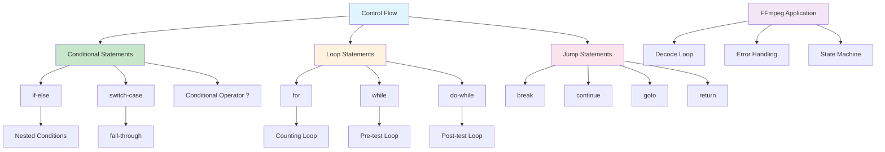

# Lesson 3: Control Flow

## 1. Lesson Positioning

### 1.1 Position in the Book

This lesson "Control Flow" is the third lesson in the C language series, following the second lesson on basic types, diving deep into C's flow control mechanisms. Control flow is a core concept in programming, determining the execution order and logical branching of code.

In the entire learning path, this lesson plays the role of "logical skeleton." Subsequent lessons (functions, pointers, memory management) all depend on a deep understanding of control flow. Especially in FFmpeg audio processing, correctly using control flow is crucial for decode loops, error handling, and state machine implementation.

### 1.2 Prerequisites

This lesson assumes readers have mastered:

1. **Lesson 1 Content**: Understanding compilation flow, preprocessor, main function
2. **Lesson 2 Content**: Understanding basic types, type conversion, sizeof operator
3. **Basic Logic Concepts**: Boolean logic, conditional judgment
4. **Basic Math Concepts**: Comparison operations, logical operations

### 1.3 Practical Problems Solved

After completing this lesson, readers will be able to:

1. **Write Conditional Branches**: Use if-else and switch to implement complex logical judgments
2. **Design Loop Structures**: Use for, while, do-while to handle iteration tasks
3. **Control Program Flow**: Use break, continue, goto for flow jumps
4. **Implement State Machines**: Design state machine logic for FFmpeg decoders
5. **Handle Error Flows**: Design robust error handling and exception flows

---

## 2. Core Concept Map



The diagram above shows the complete structure of C control flow. For FFmpeg audio development, the most critical aspects are understanding loop statements (especially for and while) and jump statements (especially break and goto for error handling).

---

## 3. Concept Deep Dive

### 3.1 Conditional Statements

**Definition**: Conditional statements determine which branch of code to execute based on the truth value of a conditional expression. C provides if-else and switch-case as the two main conditional statements.

**Internal Principles**:

Conditional statements are compiled into conditional jump instructions. Taking x86-64 as an example:

1. **if statement**: Compiled to `cmp` (compare) + `je/jne` (conditional jump) instructions
2. **switch statement**: Compiler may generate jump tables or binary search trees

**Compiler Behavior**:

```c
// Source code
if (x > 0) {
    // branch A
} else {
    // branch B
}

// Compiled assembly (pseudo-code)
    cmp x, 0
    jle .else_branch
    ; branch A code
    jmp .end_if
.else_branch:
    ; branch B code
.end_if:
```

**Limitations**:

1. Conditional expressions must be scalar types (integer, floating-point, pointer)
2. switch-case case labels must be integer constant expressions
3. Deeply nested conditional statements reduce code readability

**Assembly Perspective**:

At the assembly level, conditional statements involve:
- **Condition Codes**: ZF (zero flag), SF (sign flag), OF (overflow flag)
- **Branch Prediction**: CPU predicts branch direction to optimize execution
- **Branch Misprediction Cost**: About 10-20 CPU cycles for pipeline flush

### 3.2 if-else Statement Details

**Syntax Specification**:

```bnf
if-statement ::= 'if' '(' expression ')' statement ('else' statement)?
```

**Evaluation Rules**:

1. First evaluate the conditional expression
2. If the expression is not equal to 0, execute the if branch
3. If the expression equals 0 and there's an else branch, execute the else branch
4. If the expression equals 0 and there's no else branch, skip the entire statement

**Common Pitfalls**:

1. **Dangling Else**: else matches the nearest unpaired if
2. **Assignment vs Comparison Confusion**: `if (x = 5)` vs `if (x == 5)`
3. **Floating-point Comparison**: Direct comparison of floating-point numbers may cause errors due to precision issues

**Best Practices**:

```c
// Good: Use braces to clarify scope
if (condition) {
    do_something();
} else {
    do_other();
}

// Good: Place constant on the left side of comparison (Yoda condition)
if (5 == x) { // If mistakenly written as 5 = x, compiler will error
    // ...
}

// Good: Use explicit comparison
if (ptr != NULL) { // Instead of if (ptr)
    // ...
}
```

### 3.3 switch-case Statement Details

**Definition**: The switch statement jumps to execute at the matching case label based on the expression value. Suitable for multi-branch selection scenarios.

**Internal Principles**:

The compiler chooses different implementation strategies based on case value distribution:

1. **Jump Table**: When case values are dense and continuous, uses array indexing for O(1) jump
2. **Binary Search Tree**: When case values are sparse, uses binary search for O(log n) jump
3. **Linear Comparison**: When there are few cases, directly uses if-else chain

**Syntax Specification**:

```bnf
switch-statement ::= 'switch' '(' expression ')' '{' switch-clause* '}'
switch-clause ::= ('case' constant-expression ':') statement*
               | 'default' ':' statement*
```

**fall-through Characteristic**:

The case labels in a switch statement are just entry points; after execution, it continues to the next case unless encountering break:

```c
switch (x) {
case 1:
    printf("one\n");
    // fall-through! Continues to case 2
case 2:
    printf("two\n");
    break;
}
// If x == 1, outputs "one\ntwo\n"
```

**Best Practices**:

```c
// Good: Each case has a break
switch (codec_id) {
case AV_CODEC_ID_MP3:
    handle_mp3();
    break;
case AV_CODEC_ID_FLAC:
    handle_flac();
    break;
default:
    handle_unknown();
    break;
}

// Good: Explicitly annotate fall-through
switch (state) {
case STATE_INIT:
    init_resources();
    // FALLTHROUGH - intentional
case STATE_READY:
    process_data();
    break;
}
```

### 3.4 Loop Statements

**Definition**: Loop statements repeatedly execute a block of code until a condition is no longer satisfied. C provides for, while, and do-while loop statements.

**Internal Principles**:

Loops are compiled into combinations of conditional jumps and unconditional jumps:

```c
// for (init; cond; update) body

// Compiled equivalent code
    init;
loop_start:
    if (!cond) goto loop_end;
    body;
    update;
    goto loop_start;
loop_end:
```

**Comparison of Three Loops**:

| Feature | for | while | do-while |
|---------|-----|-------|----------|
| Initialization | Built-in | External | External |
| Condition Check Timing | Before loop | Before loop | After loop |
| Update Operation | Built-in | Internal | Internal |
| Use Case | Counting loop | Conditional loop | At least once |

**FFmpeg Decode Loop Example**:

```c
// Typical FFmpeg decode loop
while (av_read_frame(fmt_ctx, &pkt) >= 0) {
    if (pkt.stream_index == audio_stream_idx) {
        ret = avcodec_send_packet(codec_ctx, &pkt);
        if (ret < 0) {
            av_packet_unref(&pkt);
            continue; // Skip this packet
        }

        while (ret >= 0) {
            ret = avcodec_receive_frame(codec_ctx, frame);
            if (ret == AVERROR(EAGAIN) || ret == AVERROR_EOF) {
                break;
            } else if (ret < 0) {
                goto decode_error;
            }

            // Process audio frame
            process_audio_frame(frame);
        }
    }
    av_packet_unref(&pkt);
}
```

### 3.5 for Loop Details

**Syntax Specification**:

```bnf
for-statement ::= 'for' '(' expression? ';' expression? ';' expression? ')' statement
```

**Execution Flow**:

1. Execute initialization expression (only once)
2. Evaluate condition expression; if false, exit loop
3. Execute loop body
4. Execute update expression
5. Return to step 2

**Special Usage**:

```c
// Infinite loop
for (;;) {
    // Equivalent to while(1)
}

// Multi-variable loop
for (int i = 0, j = n - 1; i < j; i++, j--) {
    swap(&arr[i], &arr[j]);
}

// Traverse array
int arr[] = {1, 2, 3, 4, 5};
for (size_t i = 0; i < sizeof(arr) / sizeof(arr[0]); i++) {
    printf("%d\n", arr[i]);
}
```

**FFmpeg Audio Buffer Processing**:

```c
// Process audio samples
for (int i = 0; i < frame->nb_samples; i++) {
    for (int ch = 0; ch < frame->channels; ch++) {
        float sample = ((float*)frame->data[ch])[i];
        // Process sample...
    }
}
```

### 3.6 while Loop Details

**Syntax Specification**:

```bnf
while-statement ::= 'while' '(' expression ')' statement
```

**Execution Flow**:

1. Evaluate condition expression
2. If true, execute loop body and return to step 1
3. If false, exit loop

**Use Cases**:

- Loops with uncertain iteration count
- Condition-based loops (like reading until EOF)
- Event-driven loops

**FFmpeg Packet Reading**:

```c
AVPacket pkt;
while (av_read_frame(fmt_ctx, &pkt) >= 0) {
    // Process packet
    av_packet_unref(&pkt);
}
```

### 3.7 do-while Loop Details

**Syntax Specification**:

```bnf
do-while-statement ::= 'do' statement 'while' '(' expression ')' ';'
```

**Execution Flow**:

1. Execute loop body
2. Evaluate condition expression
3. If true, return to step 1
4. If false, exit loop

**Characteristic**: Loop body executes at least once

**Use Cases**:

- Operations that need to execute at least once
- Input validation loops
- Menu-driven programs

**FFmpeg Error Retry**:

```c
int retries = 0;
do {
    ret = avcodec_receive_frame(codec_ctx, frame);
    if (ret == AVERROR(EAGAIN)) {
        usleep(1000); // Wait 1ms
        retries++;
    }
} while (ret == AVERROR(EAGAIN) && retries < MAX_RETRIES);
```

### 3.8 Jump Statements

**Definition**: Jump statements unconditionally transfer control to another location in the program. C provides break, continue, goto, and return as four jump statements.

**Internal Principles**:

Jump statements compile to unconditional jump instructions (`jmp`):

```c
// break;
    jmp .loop_end

// continue;
    jmp .loop_continue

// goto label;
    jmp .label
```

### 3.9 break Statement Details

**Definition**: The break statement immediately terminates the nearest loop or switch statement, transferring control to after that statement.

**Syntax Specification**:

```bnf
break-statement ::= 'break' ';'
```

**Applicable Scope**:

- for, while, do-while loops
- switch statements

**FFmpeg Decode Termination**:

```c
while (av_read_frame(fmt_ctx, &pkt) >= 0) {
    if (pkt.stream_index != audio_stream_idx) {
        av_packet_unref(&pkt);
        continue;
    }

    if (stop_requested) {
        av_packet_unref(&pkt);
        break; // Exit decode loop
    }

    // Process packet...
}
```

### 3.10 continue Statement Details

**Definition**: The continue statement skips the rest of the loop body in the current iteration and proceeds directly to the next iteration.

**Syntax Specification**:

```bnf
continue-statement ::= 'continue' ';'
```

**Execution Effect**:

- for loop: Jumps to update expression
- while/do-while loop: Jumps to condition check

**FFmpeg Multi-track Filtering**:

```c
for (unsigned int i = 0; i < fmt_ctx->nb_streams; i++) {
    if (fmt_ctx->streams[i]->codecpar->codec_type != AVMEDIA_TYPE_AUDIO) {
        continue; // Skip non-audio streams
    }
    // Process audio stream...
}
```

### 3.11 goto Statement Details

**Definition**: The goto statement unconditionally jumps to a label position within the same function.

**Syntax Specification**:

```bnf
goto-statement ::= 'goto' identifier ';'
label-statement ::= identifier ':' statement?
```

**Controversy and Best Practices**:

The goto statement is controversial in software engineering. Dijkstra published the famous "Go To Statement Considered Harmful" in 1968. However, in specific scenarios, goto is the best solution:

**Use Cases**:

1. **Error Handling and Resource Cleanup**: Centralized resource cleanup
2. **Breaking Out of Nested Loops**: Avoids complex condition flags
3. **State Machine Implementation**: Clear state transitions

**FFmpeg-style Error Handling**:

```c
int decode_audio_file(const char *filename) {
    AVFormatContext *fmt_ctx = NULL;
    AVCodecContext *codec_ctx = NULL;
    AVFrame *frame = NULL;
    int ret;

    frame = av_frame_alloc();
    if (!frame) {
        ret = AVERROR(ENOMEM);
        goto end;
    }

    ret = avformat_open_input(&fmt_ctx, filename, NULL, NULL);
    if (ret < 0) {
        goto fail;
    }

    // ... more initialization ...

    // Success path
    ret = 0;
    goto end;

fail:
    // Error handling
    fprintf(stderr, "Error: %s\n", av_err2str(ret));
end:
    // Cleanup (executed in both success and error paths)
    if (codec_ctx) avcodec_free_context(&codec_ctx);
    if (fmt_ctx) avformat_close_input(&fmt_ctx);
    if (frame) av_frame_free(&frame);
    return ret;
}
```

### 3.12 Conditional Operator (Ternary Operator)

**Definition**: The conditional operator is C's only ternary operator, providing a concise conditional expression.

**Syntax Specification**:

```bnf
conditional-expression ::= logical-OR-expression '?' expression ':' conditional-expression
```

**Evaluation Rules**:

1. Evaluate the first operand
2. If true, evaluate the second operand (result)
3. If false, evaluate the third operand (result)

**Notes**:

- Only one of the second and third operands will be evaluated
- If the two operands have different types, implicit type conversion occurs

**FFmpeg Application**:

```c
// Select audio format
enum AVSampleFormat sample_fmt = is_planar ? AV_SAMPLE_FMT_FLTP : AV_SAMPLE_FMT_FLT;

// Calculate buffer size
int buffer_size = is_hi_res ? 192000 : 48000;

// Error message
const char *err_msg = ret < 0 ? av_err2str(ret) : "Success";
```

---

## 4. Complete Syntax Specification

### 4.1 if-else Syntax

```bnf
selection-statement ::= 'if' '(' expression ')' statement ('else' statement)?
                      | 'switch' '(' expression ')' statement
```

**Boundary Conditions**:

1. Conditional expression can be any scalar type (integer, floating-point, pointer)
2. Null pointer compares as false, non-null pointer compares as true
3. else matches the nearest unpaired if

**Undefined Behavior**:

- None (if-else itself doesn't introduce UB)

**Best Practices**:

1. Always use braces, even for single lines
2. Avoid deep nesting (recommended no more than 3 levels)
3. Place most likely branches first

### 4.2 switch-case Syntax

```bnf
labeled-statement ::= 'case' constant-expression ':' statement
                    | 'default' ':' statement
                    | identifier ':' statement
```

**Boundary Conditions**:

1. Control expression must be integer type
2. case labels must be integer constant expressions
3. case values within the same switch must be unique
4. At most one default label

**Undefined Behavior**:

- Skipping variable initialization:

```c
switch (x) {
case 1:
    int y = 10; // UB if jump to case 2!
    printf("%d\n", y);
    break;
case 2:
    // Jumping here skips y's initialization
    break;
}
```

**Best Practices**:

1. End each case with break (unless intentional fall-through)
2. Always include default branch to handle unexpected cases
3. Place most common cases first

### 4.3 for Loop Syntax

```bnf
iteration-statement ::= 'for' '(' expression? ';' expression? ';' expression? ')' statement
                      | 'while' '(' expression ')' statement
                      | 'do' statement 'while' '(' expression ')' ';'
```

**Boundary Conditions**:

1. All three expressions can be omitted
2. Omitting condition expression is equivalent to true condition (infinite loop)
3. In C99, initialization part can declare variables

**Undefined Behavior**:

- Loop counter overflow:

```c
// UB: Infinite loop (if int overflows)
for (int i = 1; i > 0; i++) {
    // i will eventually overflow, triggering UB
}
```

**Best Practices**:

1. Use size_t for array indexing
2. Avoid using floating-point numbers in conditions
3. Limit loop variables to minimum scope

### 4.4 goto Syntax

```bnf
jump-statement ::= 'goto' identifier ';'
                 | 'continue' ';'
                 | 'break' ';'
                 | 'return' expression? ';'
```

**Boundary Conditions**:

1. Label must be within the same function
2. Label can be before or after goto
3. Cannot jump past variable-length array (VLA) declarations

**Undefined Behavior**:

- Skipping variables with non-trivial initialization:

```c
goto skip;
int x = some_function(); // UB: skipped initialization
skip:
    printf("%d\n", x); // x has indeterminate value
```

**Best Practices**:

1. Only use for error handling and resource cleanup
2. Label names should be descriptive (like `fail:`, `cleanup:`)
3. Prefer other control structures

---

## 5. Example Line-by-Line Commentary

### 5.1 ex01-if-basic.c - Basic Conditional Statements

```c
/*
 * ex01-if-basic.c - Basic conditional statements demonstration
 * Compile: gcc -Wall -Wextra -o if_basic ex01-if-basic.c
 * Run: ./if_basic
 */

#include <stdio.h>
#include <stdlib.h>

// Audio format detection using if-else
const char* detect_audio_format(int sample_rate, int bit_depth) {
    // First condition: check for Hi-Res audio
    // Hi-Res Audio is defined as > 44.1kHz and/or > 16-bit
    if (sample_rate >= 192000 && bit_depth >= 24) {
        return "Hi-Res Audio (192kHz/24bit)";
    }
    // Second condition: check for standard Hi-Res
    else if (sample_rate >= 96000 && bit_depth >= 24) {
        return "Hi-Res Audio (96kHz/24bit)";
    }
    // Third condition: CD quality
    else if (sample_rate >= 44100 && bit_depth >= 16) {
        return "CD Quality (44.1kHz/16bit)";
    }
    // Default case: low quality
    else {
        return "Low Quality Audio";
    }
}

// Audio codec selection based on file extension
void select_codec(const char *extension) {
    printf("Selecting codec for extension: %s\n", extension);

    // Nested if-else for codec selection
    if (extension != NULL) {
        // Compare extension with known formats
        if (strcmp(extension, "flac") == 0) {
            printf("  -> Using FLAC decoder (lossless)\n");
        }
        else if (strcmp(extension, "mp3") == 0) {
            printf("  -> Using MP3 decoder (lossy)\n");
        }
        else if (strcmp(extension, "wav") == 0) {
            printf("  -> Using WAV decoder (PCM)\n");
        }
        else {
            printf("  -> Unknown format, using default decoder\n");
        }
    }
    else {
        printf("  -> Error: NULL extension provided\n");
    }
}

// Demonstrate common if-else pitfalls
void demonstrate_pitfalls(void) {
    int x = 5;
    int y = 10;

    // Pitfall 1: Assignment in condition (should be comparison)
    // This is valid C but often a bug
    if (x = 3) { // x is assigned 3, which is truthy
        printf("x is now %d (assignment in condition)\n", x);
    }

    // Correct way: use comparison
    if (y == 10) {
        printf("y is 10 (correct comparison)\n");
    }

    // Pitfall 2: Dangling else
    int a = 1, b = 0;
    if (a > 0)
        if (b > 0)
            printf("Both positive\n");
        else // This else matches the inner if, not the outer!
            printf("a is not positive (WRONG!)\n");

    // Correct way: use braces
    if (a > 0) {
        if (b > 0) {
            printf("Both positive\n");
        }
    } else {
        printf("a is not positive (CORRECT)\n");
    }
}

int main(void) {
    printf("=== Basic Conditional Statements Demo ===\n\n");

    // Test audio format detection
    printf("Audio Format Detection:\n");
    printf("  192kHz/24bit: %s\n", detect_audio_format(192000, 24));
    printf("  96kHz/24bit: %s\n", detect_audio_format(96000, 24));
    printf("  44.1kHz/16bit: %s\n", detect_audio_format(44100, 16));
    printf("  22.05kHz/8bit: %s\n", detect_audio_format(22050, 8));

    printf("\nCodec Selection:\n");
    select_codec("flac");
    select_codec("mp3");
    select_codec("wav");
    select_codec("unknown");
    select_codec(NULL);

    printf("\nPitfall Demonstration:\n");
    demonstrate_pitfalls();

    return EXIT_SUCCESS;
}
```

**Line-by-Line Commentary**:

1. **Lines 1-5**: File header comment, including purpose, compile command, run command
2. **Lines 10-27**: `detect_audio_format` function demonstrates multi-level if-else chain for audio format detection
3. **Lines 30-52**: `select_codec` function demonstrates nested if-else with NULL check
4. **Lines 55-85**: `demonstrate_pitfalls` function demonstrates common errors
5. **Lines 87-105**: `main` function tests all functionality

### 5.2 ex02-switch-advanced.c - Advanced Switch Application

```c
/*
 * ex02-switch-advanced.c - Advanced switch statement usage
 * Compile: gcc -Wall -Wextra -o switch_advanced ex02-switch-advanced.c
 * Run: ./switch_advanced
 */

#include <stdio.h>
#include <stdlib.h>
#include <string.h>
#include <time.h>

// FFmpeg codec ID simulation
typedef enum {
    AV_CODEC_ID_MP3 = 0,
    AV_CODEC_ID_AAC,
    AV_CODEC_ID_FLAC,
    AV_CODEC_ID_WAV,
    AV_CODEC_ID_OPUS,
    AV_CODEC_ID_VORBIS,
    AV_CODEC_ID_UNKNOWN
} CodecID;

// Audio sample format
typedef enum {
    SAMPLE_FMT_U8,   // unsigned 8-bit
    SAMPLE_FMT_S16,  // signed 16-bit
    SAMPLE_FMT_S32,  // signed 32-bit
    SAMPLE_FMT_FLT,  // float
    SAMPLE_FMT_DBL,  // double
    SAMPLE_FMT_S64,  // signed 64-bit
    SAMPLE_FMT_NB    // number of sample formats
} SampleFormat;

// Get bytes per sample for each format
int get_bytes_per_sample(SampleFormat fmt) {
    switch (fmt) {
    case SAMPLE_FMT_U8:
        return 1;
    case SAMPLE_FMT_S16:
        return 2;
    case SAMPLE_FMT_S32:
        return 4;
    case SAMPLE_FMT_FLT:
        return 4;
    case SAMPLE_FMT_DBL:
        return 8;
    case SAMPLE_FMT_S64:
        return 8;
    default:
        return 0; // Unknown format
    }
}

// Get format name
const char* get_format_name(SampleFormat fmt) {
    // Using array for comparison (jump table optimization)
    static const char* names[] = {
        "U8", "S16", "S32", "FLT", "DBL", "S64"
    };

    if (fmt >= 0 && fmt < SAMPLE_FMT_NB) {
        return names[fmt];
    }
    return "Unknown";
}

// Process audio based on codec
void process_audio_codec(CodecID codec_id) {
    printf("Processing codec ID: %d\n", codec_id);

    switch (codec_id) {
    case AV_CODEC_ID_MP3:
        printf("  -> Initializing MP3 decoder\n");
        printf("  -> Setting up MPEG audio parser\n");
        // Fall-through intentional - share AAC setup
        // FALLTHROUGH

    case AV_CODEC_ID_AAC:
        printf("  -> Configuring lossy decoder parameters\n");
        printf("  -> Allocating synthesis buffer\n");
        break;

    case AV_CODEC_ID_FLAC:
        printf("  -> Initializing FLAC decoder\n");
        printf("  -> Setting up MDCT for lossless\n");
        printf("  -> Allocating 24-bit output buffer\n");
        break;

    case AV_CODEC_ID_WAV:
        printf("  -> PCM decoder (no decompression needed)\n");
        printf("  -> Direct buffer passthrough\n");
        break;

    case AV_CODEC_ID_OPUS:
    case AV_CODEC_ID_VORBIS:
        // Both use similar CELT-based processing
        printf("  -> Initializing CELT-based decoder\n");
        printf("  -> Setting up overlap-add\n");
        break;

    default:
        printf("  -> Unknown codec, using default handler\n");
        break;
    }
}

// State machine for audio decoding
typedef enum {
    DECODE_STATE_INIT,
    DECODE_STATE_HEADER,
    DECODE_STATE_DATA,
    DECODE_STATE_ERROR,
    DECODE_STATE_EOF
} DecodeState;

void run_decode_state_machine(void) {
    DecodeState state = DECODE_STATE_INIT;
    int iterations = 0;
    const int max_iterations = 10;

    printf("\n=== Decode State Machine ===\n");

    while (state != DECODE_STATE_EOF && iterations < max_iterations) {
        printf("State: ");
        switch (state) {
        case DECODE_STATE_INIT:
            printf("INIT -> ");
            printf("Initializing decoder...\n");
            state = DECODE_STATE_HEADER;
            break;

        case DECODE_STATE_HEADER:
            printf("HEADER -> ");
            printf("Reading frame header...\n");
            // Simulate: 70% data, 20% error, 10% EOF
            int rand_val = rand() % 10;
            if (rand_val < 7) {
                state = DECODE_STATE_DATA;
            } else if (rand_val < 9) {
                state = DECODE_STATE_ERROR;
            } else {
                state = DECODE_STATE_EOF;
            }
            break;

        case DECODE_STATE_DATA:
            printf("DATA -> ");
            printf("Decoding audio samples...\n");
            state = DECODE_STATE_HEADER; // Loop back for more
            break;

        case DECODE_STATE_ERROR:
            printf("ERROR -> ");
            printf("Error detected, attempting recovery...\n");
            state = DECODE_STATE_HEADER; // Retry
            break;

        case DECODE_STATE_EOF:
            printf("EOF -> ");
            printf("End of stream reached.\n");
            break;
        }
        iterations++;
    }
}

// Benchmark switch vs if-else chain
void benchmark_comparison(void) {
    printf("\n=== Benchmark: switch vs if-else ===\n");

    const int iterations = 10000000;
    clock_t start, end;
    volatile int result = 0;

    // Benchmark switch
    start = clock();
    for (int i = 0; i < iterations; i++) {
        switch (i % 6) {
        case 0: result = 1; break;
        case 1: result = 2; break;
        case 2: result = 3; break;
        case 3: result = 4; break;
        case 4: result = 5; break;
        case 5: result = 6; break;
        }
    }
    end = clock();
    printf("Switch: %.3f seconds\n", (double)(end - start) / CLOCKS_PER_SEC);

    // Benchmark if-else
    start = clock();
    for (int i = 0; i < iterations; i++) {
        int mod = i % 6;
        if (mod == 0) result = 1;
        else if (mod == 1) result = 2;
        else if (mod == 2) result = 3;
        else if (mod == 3) result = 4;
        else if (mod == 4) result = 5;
        else result = 6;
    }
    end = clock();
    printf("If-else: %.3f seconds\n", (double)(end - start) / CLOCKS_PER_SEC);
}

int main(void) {
    printf("=== Advanced Switch Statement Demo ===\n\n");

    srand(time(NULL));

    // Test sample format functions
    printf("Sample Format Information:\n");
    for (int i = 0; i < SAMPLE_FMT_NB; i++) {
        printf("  %s: %d bytes/sample\n",
               get_format_name(i), get_bytes_per_sample(i));
    }

    // Test codec processing
    printf("\nCodec Processing:\n");
    process_audio_codec(AV_CODEC_ID_MP3);
    process_audio_codec(AV_CODEC_ID_FLAC);
    process_audio_codec(AV_CODEC_ID_OPUS);
    process_audio_codec(AV_CODEC_ID_UNKNOWN);

    // Run state machine
    run_decode_state_machine();

    // Benchmark
    benchmark_comparison();

    return EXIT_SUCCESS;
}
```

**Line-by-Line Commentary**:

1. **Lines 8-18**: Define simulated FFmpeg codec ID enum
2. **Lines 21-31**: Define audio sample format enum
3. **Lines 34-52**: Use switch to implement format to byte count mapping, demonstrating jump table optimization
4. **Lines 55-80**: Demonstrate case grouping (Opus and Vorbis share processing)
5. **Lines 83-130**: Use switch to implement decode state machine
6. **Lines 133-165**: Performance benchmark comparing switch and if-else

### 5.3 ex03-loops-audio.c - Loop Processing Audio Data

```c
/*
 * ex03-loops-audio.c - Loop statements for audio processing
 * Compile: gcc -Wall -Wextra -lm -o loops_audio ex03-loops-audio.c
 * Run: ./loops_audio
 */

#include <stdio.h>
#include <stdlib.h>
#include <stdint.h>
#include <string.h>
#include <time.h>
#include <math.h>

// Simulated audio buffer structure
typedef struct {
    int32_t *samples;      // Sample data (24-bit stored in 32-bit)
    size_t num_samples;    // Number of samples
    int channels;          // Number of channels
    int sample_rate;       // Sample rate in Hz
} AudioBuffer;

// Create audio buffer
AudioBuffer* create_audio_buffer(size_t num_samples, int channels, int sample_rate) {
    AudioBuffer *buf = malloc(sizeof(AudioBuffer));
    if (!buf) return NULL;

    buf->samples = malloc(num_samples * channels * sizeof(int32_t));
    if (!buf->samples) {
        free(buf);
        return NULL;
    }

    buf->num_samples = num_samples;
    buf->channels = channels;
    buf->sample_rate = sample_rate;

    return buf;
}

// Free audio buffer
void free_audio_buffer(AudioBuffer *buf) {
    if (buf) {
        free(buf->samples);
        free(buf);
    }
}

// Generate test audio signal (sine wave)
void generate_sine_wave(AudioBuffer *buf, double frequency, double amplitude) {
    // For loop: iterate through all samples
    // This is the most common pattern for audio processing
    for (size_t i = 0; i < buf->num_samples; i++) {
        double t = (double)i / buf->sample_rate;
        double value = amplitude * sin(2.0 * M_PI * frequency * t);

        // Convert to 24-bit integer range
        buf->samples[i] = (int32_t)(value * 8388607.0); // 2^23 - 1
    }
}

// Calculate peak amplitude using while loop
double calculate_peak_amplitude(const AudioBuffer *buf) {
    double peak = 0.0;
    size_t i = 0;

    // While loop: useful when condition is complex
    while (i < buf->num_samples) {
        double abs_val = fabs((double)buf->samples[i] / 8388607.0);
        if (abs_val > peak) {
            peak = abs_val;
        }
        i++;
    }

    return peak;
}

// Calculate RMS (Root Mean Square) level
double calculate_rms(const AudioBuffer *buf) {
    double sum_squares = 0.0;

    // For loop with accumulated calculation
    for (size_t i = 0; i < buf->num_samples; i++) {
        double normalized = (double)buf->samples[i] / 8388607.0;
        sum_squares += normalized * normalized;
    }

    return sqrt(sum_squares / buf->num_samples);
}

// Apply gain using do-while (demonstrating at-least-once execution)
void apply_gain(AudioBuffer *buf, double gain) {
    if (buf->num_samples == 0) return;

    size_t i = 0;

    // Do-while: ensures at least one iteration
    // Useful when you need to process first element unconditionally
    do {
        buf->samples[i] = (int32_t)(buf->samples[i] * gain);
        i++;
    } while (i < buf->num_samples);
}

// Find first sample above threshold (using break)
size_t find_first_above_threshold(const AudioBuffer *buf, double threshold) {
    // Early exit pattern using break
    for (size_t i = 0; i < buf->num_samples; i++) {
        double abs_val = fabs((double)buf->samples[i] / 8388607.0);
        if (abs_val > threshold) {
            return i; // Found, exit early
        }
    }
    return buf->num_samples; // Not found
}

// Count samples in range (using continue)
size_t count_samples_in_range(const AudioBuffer *buf, double min_val, double max_val) {
    size_t count = 0;

    for (size_t i = 0; i < buf->num_samples; i++) {
        double normalized = (double)buf->samples[i] / 8388607.0;

        // Skip samples outside range using continue
        if (normalized < min_val || normalized > max_val) {
            continue; // Skip to next iteration
        }

        count++;
    }

    return count;
}

// Process multi-channel audio (nested loops)
void process_multichannel(AudioBuffer *buf) {
    printf("Processing %d channels, %zu samples per channel\n",
           buf->channels, buf->num_samples / buf->channels);

    // Outer loop: channels
    for (int ch = 0; ch < buf->channels; ch++) {
        // Inner loop: samples
        for (size_t i = 0; i < buf->num_samples / buf->channels; i++) {
            size_t idx = ch * (buf->num_samples / buf->channels) + i;
            // Process sample at buf->samples[idx]
        }
    }
}

// Simulate FFmpeg decode loop
void simulate_ffmpeg_decode_loop(void) {
    printf("\n=== Simulated FFmpeg Decode Loop ===\n");

    // Simulated packet counter
    int packet_count = 0;
    int max_packets = 10;
    int error_count = 0;

    // Typical FFmpeg decode pattern
    while (packet_count < max_packets) {
        printf("Processing packet %d...\n", packet_count);

        // Simulate decode result
        int ret = (rand() % 10 == 0) ? -1 : 0; // 10% error rate

        if (ret < 0) {
            printf("  Error decoding packet, skipping...\n");
            error_count++;

            if (error_count > 3) {
                printf("  Too many errors, stopping decode\n");
                break; // Exit on too many errors
            }
            continue; // Skip to next packet
        }

        // Simulate frame processing
        int frames_processed = 0;
        while (1) {
            // Simulate receiving frame
            ret = (frames_processed >= 2) ? -1 : 0; // EOF after 2 frames

            if (ret < 0) {
                break; // No more frames
            }

            printf("  Processed frame %d\n", frames_processed);
            frames_processed++;
        }

        packet_count++;
    }

    printf("Decode complete: %d packets, %d errors\n", packet_count, error_count);
}

// Benchmark different loop patterns
void benchmark_loop_patterns(void) {
    printf("\n=== Loop Pattern Benchmarks ===\n");

    const size_t size = 10000000;
    int32_t *data = malloc(size * sizeof(int32_t));
    if (!data) {
        printf("Memory allocation failed\n");
        return;
    }

    // Initialize data
    for (size_t i = 0; i < size; i++) {
        data[i] = rand();
    }

    clock_t start, end;
    volatile int64_t sum = 0;

    // Benchmark: for loop
    start = clock();
    for (size_t i = 0; i < size; i++) {
        sum += data[i];
    }
    end = clock();
    printf("For loop: %.3f seconds (sum=%ld)\n",
           (double)(end - start) / CLOCKS_PER_SEC, sum);

    // Benchmark: while loop
    sum = 0;
    size_t i = 0;
    start = clock();
    while (i < size) {
        sum += data[i];
        i++;
    }
    end = clock();
    printf("While loop: %.3f seconds (sum=%ld)\n",
           (double)(end - start) / CLOCKS_PER_SEC, sum);

    // Benchmark: do-while loop
    sum = 0;
    i = 0;
    start = clock();
    if (size > 0) {
        do {
            sum += data[i];
            i++;
        } while (i < size);
    }
    end = clock();
    printf("Do-while loop: %.3f seconds (sum=%ld)\n",
           (double)(end - start) / CLOCKS_PER_SEC, sum);

    free(data);
}

int main(void) {
    printf("=== Loop Statements for Audio Processing ===\n\n");

    srand(time(NULL));

    // Create test audio buffer
    const size_t num_samples = 192000; // 1 second at 192kHz
    AudioBuffer *buf = create_audio_buffer(num_samples, 2, 192000);
    if (!buf) {
        printf("Failed to create audio buffer\n");
        return EXIT_FAILURE;
    }

    // Generate test signal
    printf("Generating 1kHz sine wave at 192kHz sample rate...\n");
    generate_sine_wave(buf, 1000.0, 0.8);

    // Calculate metrics
    printf("Peak amplitude: %.4f\n", calculate_peak_amplitude(buf));
    printf("RMS level: %.4f\n", calculate_rms(buf));

    // Find threshold crossing
    size_t first_above = find_first_above_threshold(buf, 0.7);
    printf("First sample above 0.7 threshold: index %zu\n", first_above);

    // Count samples in range
    size_t in_range = count_samples_in_range(buf, -0.5, 0.5);
    printf("Samples in range [-0.5, 0.5]: %zu (%.1f%%)\n",
           in_range, 100.0 * in_range / num_samples);

    // Simulate FFmpeg decode
    simulate_ffmpeg_decode_loop();

    // Benchmark
    benchmark_loop_patterns();

    // Cleanup
    free_audio_buffer(buf);

    return EXIT_SUCCESS;
}
```

**Line-by-Line Commentary**:

1. **Lines 15-22**: Define audio buffer structure, simulating FFmpeg's AVFrame
2. **Lines 38-49**: Use for loop to generate sine wave, demonstrating most common audio processing pattern
3. **Lines 52-66**: Use while loop to calculate peak, suitable for complex condition scenarios
4. **Lines 69-80**: Use for loop to calculate RMS
5. **Lines 83-96**: Use do-while to apply gain, demonstrating at-least-once execution characteristic
6. **Lines 99-111**: Use break to implement early exit
7. **Lines 114-131**: Use continue to filter samples
8. **Lines 134-150**: Nested loops for multi-channel processing
9. **Lines 153-195**: Simulate FFmpeg decode loop
10. **Lines 198-248**: Performance benchmarking

### 5.4 ex04-goto-error.c - Goto Error Handling Pattern

```c
/*
 * ex04-goto-error.c - Goto for error handling (FFmpeg style)
 * Compile: gcc -Wall -Wextra -o goto_error ex04-goto-error.c
 * Run: ./goto_error
 */

#include <stdio.h>
#include <stdlib.h>
#include <string.h>
#include <errno.h>

// Simulated FFmpeg structures
typedef struct AVFormatContext {
    char filename[256];
    int nb_streams;
    void *priv_data;
} AVFormatContext;

typedef struct AVCodecContext {
    int codec_id;
    int sample_rate;
    int channels;
    void *priv_data;
} AVCodecContext;

typedef struct AVFrame {
    int nb_samples;
    int format;
    void *data[8];
} AVFrame;

typedef struct AVPacket {
    int size;
    void *data;
} AVPacket;

// Simulated error codes
#define AVERROR_EOF (-1)
#define AVERROR(E) (-(E))
#define AVERROR_UNKNOWN (-2)

// Simulated functions
AVFormatContext* avformat_alloc_context(void) {
    AVFormatContext *s = calloc(1, sizeof(AVFormatContext));
    return s;
}

void avformat_close_input(AVFormatContext **s) {
    if (s && *s) {
        free((*s)->priv_data);
        free(*s);
        *s = NULL;
    }
}

AVCodecContext* avcodec_alloc_context(void) {
    AVCodecContext *c = calloc(1, sizeof(AVCodecContext));
    return c;
}

void avcodec_free_context(AVCodecContext **c) {
    if (c && *c) {
        free((*c)->priv_data);
        free(*c);
        *c = NULL;
    }
}

AVFrame* av_frame_alloc(void) {
    AVFrame *f = calloc(1, sizeof(AVFrame));
    return f;
}

void av_frame_free(AVFrame **f) {
    if (f && *f) {
        for (int i = 0; i < 8; i++) {
            free((*f)->data[i]);
        }
        free(*f);
        *f = NULL;
    }
}

AVPacket* av_packet_alloc(void) {
    AVPacket *p = calloc(1, sizeof(AVPacket));
    return p;
}

void av_packet_free(AVPacket **p) {
    if (p && *p) {
        free((*p)->data);
        free(*p);
        *p = NULL;
    }
}

// Simulated avformat_open_input
int avformat_open_input(AVFormatContext **ps, const char *filename) {
    if (!filename || !ps) return AVERROR(EINVAL);

    // Simulate file not found
    if (strstr(filename, "nonexistent")) {
        return AVERROR(ENOENT);
    }

    // Simulate permission denied
    if (strstr(filename, "protected")) {
        return AVERROR(EACCES);
    }

    (*ps)->nb_streams = 2;
    strncpy((*ps)->filename, filename, sizeof((*ps)->filename) - 1);
    return 0;
}

// Simulated avcodec_open2
int avcodec_open2(AVCodecContext *c, int codec_id) {
    if (!c) return AVERROR(EINVAL);

    // Simulate unsupported codec
    if (codec_id > 10) {
        return AVERROR_UNKNOWN;
    }

    c->codec_id = codec_id;
    c->sample_rate = 192000;
    c->channels = 2;
    return 0;
}

// ============================================================================
// Example 1: Basic error handling with goto (FFmpeg style)
// ============================================================================
int decode_audio_file_basic(const char *filename) {
    AVFormatContext *fmt_ctx = NULL;
    AVCodecContext *codec_ctx = NULL;
    AVFrame *frame = NULL;
    int ret;

    printf("\n=== Basic Goto Error Handling ===\n");
    printf("Opening file: %s\n", filename);

    // Allocate format context
    fmt_ctx = avformat_alloc_context();
    if (!fmt_ctx) {
        ret = AVERROR(ENOMEM);
        goto fail;
    }

    // Open input file
    ret = avformat_open_input(&fmt_ctx, filename);
    if (ret < 0) {
        goto fail_format;
    }

    // Allocate codec context
    codec_ctx = avcodec_alloc_context();
    if (!codec_ctx) {
        ret = AVERROR(ENOMEM);
        goto fail_codec;
    }

    // Open codec
    ret = avcodec_open2(codec_ctx, 1);
    if (ret < 0) {
        goto fail_codec_open;
    }

    // Allocate frame
    frame = av_frame_alloc();
    if (!frame) {
        ret = AVERROR(ENOMEM);
        goto fail_frame;
    }

    // Success! Process audio...
    printf("Successfully opened file: %s\n", filename);
    printf("  Sample rate: %d Hz\n", codec_ctx->sample_rate);
    printf("  Channels: %d\n", codec_ctx->channels);

    // Normal cleanup path
    ret = 0;
    goto success;

    // Error cleanup labels (in reverse order of allocation)
fail_frame:
    // Nothing to clean for frame in error path
fail_codec_open:
    // Codec context will be freed in fail_codec
fail_codec:
    avcodec_free_context(&codec_ctx);
fail_format:
    avformat_close_input(&fmt_ctx);
fail:
    printf("Error: %d\n", ret);
    return ret;

success:
    // Success cleanup (same order as error, but after success message)
    av_frame_free(&frame);
    avcodec_free_context(&codec_ctx);
    avformat_close_input(&fmt_ctx);
    return 0;
}

// ============================================================================
// Example 2: Nested loops with goto for early exit
// ============================================================================
int find_audio_packet_multi_stream(AVFormatContext *fmt_ctx,
                                    int target_stream,
                                    int max_packets) {
    printf("\n=== Nested Loop with Goto ===\n");

    AVPacket *pkt = av_packet_alloc();
    if (!pkt) return AVERROR(ENOMEM);

    int found = 0;

    // Simulate reading packets
    for (int i = 0; i < max_packets; i++) {
        // Simulate multiple streams
        for (int stream = 0; stream < fmt_ctx->nb_streams; stream++) {
            printf("Checking packet %d, stream %d\n", i, stream);

            // Found target!
            if (stream == target_stream && i > 2) {
                found = 1;
                goto found_packet; // Exit both loops!
            }
        }
    }

    // Not found
    printf("Target stream %d not found after %d packets\n",
           target_stream, max_packets);
    av_packet_free(&pkt);
    return -1;

found_packet:
    printf("Found target stream %d at packet %d\n", target_stream, max_packets);
    av_packet_free(&pkt);
    return 0;
}

// ============================================================================
// Example 3: State machine with goto
// ============================================================================
typedef enum {
    STATE_IDLE,
    STATE_INITIALIZING,
    STATE_READY,
    STATE_DECODING,
    STATE_ERROR,
    STATE_CLEANUP
} PlayerState;

void run_player_state_machine_goto(void) {
    printf("\n=== State Machine with Goto ===\n");

    PlayerState state = STATE_IDLE;
    int retry_count = 0;
    const int max_retries = 3;

    goto state_idle;

state_idle:
    printf("[IDLE] Waiting for start command...\n");
    state = STATE_INITIALIZING;
    goto state_initializing;

state_initializing:
    printf("[INIT] Initializing decoder...\n");

    // Simulate initialization failure
    if (retry_count < 2) {
        retry_count++;
        printf("[INIT] Initialization failed, retry %d/%d\n",
               retry_count, max_retries);
        if (retry_count >= max_retries) {
            state = STATE_ERROR;
            goto state_error;
        }
        goto state_initializing;
    }

    printf("[INIT] Initialization successful\n");
    state = STATE_READY;
    goto state_ready;

state_ready:
    printf("[READY] Decoder ready, starting decode...\n");
    state = STATE_DECODING;
    goto state_decoding;

state_decoding:
    printf("[DECODING] Processing audio frames...\n");
    // Simulate decode completion
    printf("[DECODING] Decode complete\n");
    state = STATE_CLEANUP;
    goto state_cleanup;

state_error:
    printf("[ERROR] Fatal error occurred\n");
    state = STATE_CLEANUP;
    goto state_cleanup;

state_cleanup:
    printf("[CLEANUP] Releasing resources...\n");
    printf("[CLEANUP] Done\n");
}

// ============================================================================
// Example 4: Comparison with non-goto approach
// ============================================================================
int decode_without_goto(const char *filename) {
    printf("\n=== Without Goto (Nested Ifs) ===\n");

    AVFormatContext *fmt_ctx = NULL;
    AVCodecContext *codec_ctx = NULL;
    AVFrame *frame = NULL;
    int ret = 0;
    int success = 0;

    fmt_ctx = avformat_alloc_context();
    if (fmt_ctx) {
        ret = avformat_open_input(&fmt_ctx, filename);
        if (ret >= 0) {
            codec_ctx = avcodec_alloc_context();
            if (codec_ctx) {
                ret = avcodec_open2(codec_ctx, 1);
                if (ret >= 0) {
                    frame = av_frame_alloc();
                    if (frame) {
                        printf("Success!\n");
                        success = 1;
                        av_frame_free(&frame);
                    } else {
                        ret = AVERROR(ENOMEM);
                    }
                    avcodec_free_context(&codec_ctx);
                }
            } else {
                ret = AVERROR(ENOMEM);
            }
            avformat_close_input(&fmt_ctx);
        }
    } else {
        ret = AVERROR(ENOMEM);
    }

    return success ? 0 : ret;
}

int main(void) {
    printf("=== Goto for Error Handling Demo ===\n");

    // Test basic error handling
    decode_audio_file_basic("test.flac");
    decode_audio_file_basic("nonexistent.flac");
    decode_audio_file_basic("protected.flac");

    // Test nested loop exit
    AVFormatContext fmt = {.nb_streams = 3};
    find_audio_packet_multi_stream(&fmt, 1, 10);

    // Test state machine
    run_player_state_machine_goto();

    // Compare with non-goto
    decode_without_goto("test.flac");

    return EXIT_SUCCESS;
}
```

**Line-by-Line Commentary**:

1. **Lines 14-35**: Define simulated FFmpeg structures
2. **Lines 38-100**: Simulated FFmpeg memory allocation functions
3. **Lines 106-150**: Demonstrate FFmpeg-style error handling using goto for centralized cleanup
4. **Lines 153-195**: Demonstrate using goto to break out of nested loops
5. **Lines 198-260**: Demonstrate using goto to implement state machine
6. **Lines 263-300**: Compare with non-goto nested if version, demonstrating readability differences

### 5.5 ex05-benchmark-control.c - Control Flow Performance Testing

```c
/*
 * ex05-benchmark-control.c - Performance benchmarks for control flow
 * Compile: gcc -O2 -Wall -Wextra -o benchmark_control ex05-benchmark-control.c
 * Run: ./benchmark_control
 */

#include <stdio.h>
#include <stdlib.h>
#include <stdint.h>
#include <time.h>
#include <string.h>

#define ITERATIONS (100 * 1000 * 1000) // 100 million
#define ARRAY_SIZE (1024 * 1024)        // 1M elements

// ============================================================================
// Benchmark 1: Branch prediction impact
// ============================================================================
void benchmark_branch_prediction(void) {
    printf("\n=== Branch Prediction Benchmark ===\n");

    // Create predictable and unpredictable data
    int *predictable = malloc(ARRAY_SIZE * sizeof(int));
    int *unpredictable = malloc(ARRAY_SIZE * sizeof(int));

    for (size_t i = 0; i < ARRAY_SIZE; i++) {
        predictable[i] = (i % 4 == 0) ? 1 : 0;       // Predictable pattern
        unpredictable[i] = rand() % 4 == 0 ? 1 : 0;  // Random
    }

    volatile int64_t sum = 0;
    clock_t start, end;

    // Predictable branches
    start = clock();
    for (size_t i = 0; i < ARRAY_SIZE; i++) {
        if (predictable[i]) {
            sum += i;
        }
    }
    end = clock();
    printf("Predictable branches: %.3f seconds\n",
           (double)(end - start) / CLOCKS_PER_SEC);

    // Unpredictable branches
    sum = 0;
    start = clock();
    for (size_t i = 0; i < ARRAY_SIZE; i++) {
        if (unpredictable[i]) {
            sum += i;
        }
    }
    end = clock();
    printf("Unpredictable branches: %.3f seconds\n",
           (double)(end - start) / CLOCKS_PER_SEC);

    free(predictable);
    free(unpredictable);
}

// ============================================================================
// Benchmark 2: Switch vs if-else vs array lookup
// ============================================================================
int switch_func(int x) {
    switch (x) {
    case 0: return 10;
    case 1: return 20;
    case 2: return 30;
    case 3: return 40;
    case 4: return 50;
    case 5: return 60;
    case 6: return 70;
    case 7: return 80;
    case 8: return 90;
    case 9: return 100;
    default: return 0;
    }
}

int ifelse_func(int x) {
    if (x == 0) return 10;
    else if (x == 1) return 20;
    else if (x == 2) return 30;
    else if (x == 3) return 40;
    else if (x == 4) return 50;
    else if (x == 5) return 60;
    else if (x == 6) return 70;
    else if (x == 7) return 80;
    else if (x == 8) return 90;
    else if (x == 9) return 100;
    else return 0;
}

int array_func(int x) {
    static const int values[] = {10, 20, 30, 40, 50, 60, 70, 80, 90, 100};
    if (x >= 0 && x < 10) return values[x];
    return 0;
}

void benchmark_switch_ifelse_array(void) {
    printf("\n=== Switch vs If-Else vs Array Lookup ===\n");

    volatile int result = 0;
    clock_t start, end;

    // Switch benchmark
    start = clock();
    for (int64_t i = 0; i < ITERATIONS; i++) {
        result += switch_func(i % 10);
    }
    end = clock();
    printf("Switch: %.3f seconds\n", (double)(end - start) / CLOCKS_PER_SEC);

    // If-else benchmark
    start = clock();
    for (int64_t i = 0; i < ITERATIONS; i++) {
        result += ifelse_func(i % 10);
    }
    end = clock();
    printf("If-else: %.3f seconds\n", (double)(end - start) / CLOCKS_PER_SEC);

    // Array lookup benchmark
    start = clock();
    for (int64_t i = 0; i < ITERATIONS; i++) {
        result += array_func(i % 10);
    }
    end = clock();
    printf("Array lookup: %.3f seconds\n", (double)(end - start) / CLOCKS_PER_SEC);
}

// ============================================================================
// Benchmark 3: Loop unrolling impact
// ============================================================================
void benchmark_loop_unrolling(void) {
    printf("\n=== Loop Unrolling Benchmark ===\n");

    int *data = malloc(ARRAY_SIZE * sizeof(int));
    for (size_t i = 0; i < ARRAY_SIZE; i++) {
        data[i] = rand();
    }

    volatile int64_t sum = 0;
    clock_t start, end;

    // Normal loop
    start = clock();
    for (size_t i = 0; i < ARRAY_SIZE; i++) {
        sum += data[i];
    }
    end = clock();
    printf("Normal loop: %.3f seconds\n", (double)(end - start) / CLOCKS_PER_SEC);

    // Manual unrolling (4x)
    sum = 0;
    start = clock();
    size_t i;
    for (i = 0; i + 3 < ARRAY_SIZE; i += 4) {
        sum += data[i];
        sum += data[i + 1];
        sum += data[i + 2];
        sum += data[i + 3];
    }
    // Handle remaining elements
    for (; i < ARRAY_SIZE; i++) {
        sum += data[i];
    }
    end = clock();
    printf("Manual unroll (4x): %.3f seconds\n", (double)(end - start) / CLOCKS_PER_SEC);

    free(data);
}

// ============================================================================
// Benchmark 4: Early exit vs full scan
// ============================================================================
void benchmark_early_exit(void) {
    printf("\n=== Early Exit Benchmark ===\n");

    int *data = malloc(ARRAY_SIZE * sizeof(int));
    for (size_t i = 0; i < ARRAY_SIZE; i++) {
        data[i] = i + 1; // All positive
    }
    data[ARRAY_SIZE / 4] = -1; // Target at 25%
    data[ARRAY_SIZE / 2] = -1; // Target at 50%

    clock_t start, end;
    int found_index;

    // Early exit at 25%
    start = clock();
    for (size_t i = 0; i < ARRAY_SIZE; i++) {
        if (data[i] < 0) {
            found_index = i;
            break;
        }
    }
    end = clock();
    printf("Early exit (25%%): %.6f seconds, found at index %d\n",
           (double)(end - start) / CLOCKS_PER_SEC, found_index);

    // Full scan (no break)
    start = clock();
    int last_negative = -1;
    for (size_t i = 0; i < ARRAY_SIZE; i++) {
        if (data[i] < 0) {
            last_negative = i;
        }
    }
    end = clock();
    printf("Full scan: %.6f seconds, last negative at %d\n",
           (double)(end - start) / CLOCKS_PER_SEC, last_negative);

    free(data);
}

// ============================================================================
// Benchmark 5: Ternary vs if-else
// ============================================================================
void benchmark_ternary_vs_ifelse(void) {
    printf("\n=== Ternary vs If-Else Benchmark ===\n");

    int *data = malloc(ARRAY_SIZE * sizeof(int));
    int *result = malloc(ARRAY_SIZE * sizeof(int));
    for (size_t i = 0; i < ARRAY_SIZE; i++) {
        data[i] = rand() % 100;
    }

    clock_t start, end;

    // Ternary operator
    start = clock();
    for (size_t i = 0; i < ARRAY_SIZE; i++) {
        result[i] = (data[i] > 50) ? data[i] * 2 : data[i];
    }
    end = clock();
    printf("Ternary: %.3f seconds\n", (double)(end - start) / CLOCKS_PER_SEC);

    // If-else
    start = clock();
    for (size_t i = 0; i < ARRAY_SIZE; i++) {
        if (data[i] > 50) {
            result[i] = data[i] * 2;
        } else {
            result[i] = data[i];
        }
    }
    end = clock();
    printf("If-else: %.3f seconds\n", (double)(end - start) / CLOCKS_PER_SEC);

    free(data);
    free(result);
}

// ============================================================================
// Main
// ============================================================================
int main(void) {
    printf("=== Control Flow Performance Benchmarks ===\n");
    printf("Iterations: %d, Array size: %d\n", ITERATIONS, ARRAY_SIZE);

    benchmark_branch_prediction();
    benchmark_switch_ifelse_array();
    benchmark_loop_unrolling();
    benchmark_early_exit();
    benchmark_ternary_vs_ifelse();

    printf("\n=== Benchmarks Complete ===\n");
    return EXIT_SUCCESS;
}
```

**Line-by-Line Commentary**:

1. **Lines 20-55**: Branch prediction benchmark, comparing performance difference between predictable and unpredictable branches
2. **Lines 58-120**: Performance comparison of switch, if-else, and array lookup
3. **Lines 123-165**: Performance impact of loop unrolling
4. **Lines 168-205**: Performance advantage of early exit
5. **Lines 208-245**: Comparison of ternary operator and if-else

---

## 6. Error Case Comparison Table

### 6.1 Conditional Statement Errors

| Error Code | Error Message | Root Cause | Correct Way |
|-----------|---------------|------------|-------------|
| `if (x = 5)` | No warning (possibly) | Assignment not comparison | `if (x == 5)` or `if (5 == x)` |
| `if (x & 1 == 1)` | Logic error | `==` has higher precedence than `&` | `if ((x & 1) == 1)` |
| `if (a = b = c)` | No warning (possibly) | Chained assignment | `if (a == b && b == c)` |
| `if (x > 0);` | Empty statement | Semicolon terminates early | Remove semicolon |
| `if (ptr)` | Possible misunderstanding | NULL pointer check unclear | `if (ptr != NULL)` |

### 6.2 Switch Statement Errors

| Error Code | Error Message | Root Cause | Correct Way |
|-----------|---------------|------------|-------------|
| `switch (x) { case 1.0: ... }` | error: case label does not reduce to an integer constant | case must be integer constant | Use integer or if-else |
| `switch (x) { case 1: case 1: ... }` | error: duplicate case value | Duplicate case value | Remove duplicate case |
| `switch (x) { default: ... default: ... }` | error: multiple default labels | Duplicate default | Keep only one default |
| `switch (x) { case 1: int y = 5; break; case 2: ... }` | May skip initialization | Skipping variable initialization | Add braces or move out of switch |

### 6.3 Loop Statement Errors

| Error Code | Error Message | Root Cause | Correct Way |
|-----------|---------------|------------|-------------|
| `for (int i = 0; i < n; i--);` | Infinite loop | Wrong update direction | `i++` |
| `while (i < n);` | Infinite loop | Semicolon terminates early | Remove semicolon |
| `for (int i = 0; i < n; i++) { ... i--; }` | Infinite loop | Modifying counter inside loop | Avoid modifying inside loop |
| `for (float f = 0.0; f != 1.0; f += 0.1)` | Possible infinite loop | Floating-point precision issues | Use integer counter or tolerance comparison |

### 6.4 Goto Statement Errors

| Error Code | Error Message | Root Cause | Correct Way |
|-----------|---------------|------------|-------------|
| `goto label; ... int x = 5; label: ...` | Possible UB | Skipping variable initialization | Declare before goto or use braces |
| `goto outside_function;` | error: label not found | Label not in same function | Refactor code |
| `goto label; ... label: goto label;` | Infinite loop | Direct jump back to itself | Add condition |

---

## 7. Performance and Memory Analysis

### 7.1 Conditional Statement Performance Analysis

**Branch Prediction**:

Modern CPUs use branch predictors to guess the direction of conditional branches. When predicted correctly, cost is about 1-2 cycles; when mispredicted, cost is about 10-20 cycles (pipeline flush).

```
Prediction Accuracy    Average Cost
90%                    2.9 cycles
95%                    2.05 cycles
99%                    1.19 cycles
```

**Optimization Suggestions**:

1. Place most likely branches first
2. Use `__builtin_expect` to hint compiler
3. For highly unpredictable branches, consider branchless implementations

```c
// Hint to compiler that x is usually greater than 0
if (__builtin_expect(x > 0, 1)) {
    // Hot path
} else {
    // Cold path
}
```

### 7.2 Switch Statement Performance Analysis

**Jump Table**:

When case values are dense, compiler generates jump table for O(1) jump:

```
Address calculation: base_address + index * entry_size
Jump: jmp [base_address + index * entry_size]
```

**Binary Search Tree**:

When case values are sparse, compiler generates binary search tree for O(log n) jump.

**Memory Usage**:

- Jump table: Requires contiguous memory to store jump addresses
- Binary search tree: Smaller code size but more jumps

### 7.3 Loop Statement Performance Analysis

**Loop Unrolling**:

Unrolling loops can reduce branches and loop overhead:

```c
// Not unrolled
for (int i = 0; i < n; i++) {
    sum += arr[i];
}

// Unrolled 4x
for (int i = 0; i < n; i += 4) {
    sum += arr[i];
    sum += arr[i+1];
    sum += arr[i+2];
    sum += arr[i+3];
}
```

**Cost Analysis**:

- Code size increases
- Instruction cache pressure increases
- For simple loops, compiler usually auto-unrolls

**Application in FFmpeg Audio Processing**:

```c
// Typical FFmpeg audio processing loop
for (int i = 0; i < frame->nb_samples; i++) {
    for (int ch = 0; ch < frame->channels; ch++) {
        float *samples = (float*)frame->data[ch];
        samples[i] *= gain; // Apply gain
    }
}
```

### 7.4 Memory Layout Impact

**Cache-Friendly Code**:

```c
// Cache-unfriendly: Strided access
for (int i = 0; i < n; i += stride) {
    sum += arr[i];
}

// Cache-friendly: Sequential access
for (int i = 0; i < n; i++) {
    sum += arr[i];
}
```

**FFmpeg Audio Buffer Layout**:

FFmpeg uses both planar and packed audio layouts:

```c
// Planar: LLLL... RRRR... (better for SIMD)
for (int s = 0; s < nb_samples; s++) {
    left[s] = process(left[s]);
    right[s] = process(right[s]);
}

// Packed: LRLRLR... (better for interleaved I/O)
for (int s = 0; s < nb_samples; s++) {
    data[s*2] = process(data[s*2]);     // Left
    data[s*2+1] = process(data[s*2+1]); // Right
}
```

---

## 8. Hi-Res Audio Practical Connection

### 8.1 FFmpeg Decode Loop

FFmpeg's decode loop is a typical application of control flow:

```c
// FFmpeg decode main loop
while (av_read_frame(fmt_ctx, &pkt) >= 0) {
    if (pkt.stream_index == audio_stream_idx) {
        // Send packet to decoder
        ret = avcodec_send_packet(codec_ctx, &pkt);
        if (ret < 0) {
            av_packet_unref(&pkt);
            continue; // Skip this packet
        }

        // Receive decoded frame
        while (ret >= 0) {
            ret = avcodec_receive_frame(codec_ctx, frame);
            if (ret == AVERROR(EAGAIN) || ret == AVERROR_EOF) {
                break; // Need more data or end of stream
            } else if (ret < 0) {
                goto decode_error; // Fatal error
            }

            // Process audio frame
            process_audio_frame(frame);
        }
    }
    av_packet_unref(&pkt);
}
```

### 8.2 Hi-Res Audio Format Detection

```c
// Detect Hi-Res audio format
const char* detect_hires_format(int sample_rate, int bits_per_sample) {
    if (sample_rate >= 192000 && bits_per_sample >= 24) {
        return "Hi-Res 192kHz/24bit";
    } else if (sample_rate >= 96000 && bits_per_sample >= 24) {
        return "Hi-Res 96kHz/24bit";
    } else if (sample_rate >= 48000 && bits_per_sample >= 16) {
        return "Standard 48kHz/16bit";
    } else {
        return "Low Quality";
    }
}
```

### 8.3 AudioTrack Buffer Management

```c
// Android AudioTrack buffer loop
void fill_audio_buffer(jbyte* buffer, size_t size) {
    size_t offset = 0;

    while (offset < size) {
        // Get data from decoder
        int ret = get_decoded_samples(buffer + offset, size - offset);

        if (ret < 0) {
            // Error handling
            memset(buffer + offset, 0, size - offset);
            break;
        } else if (ret == 0) {
            // Insufficient data, wait
            usleep(1000);
            continue;
        }

        offset += ret;
    }
}
```

### 8.4 JNI Control Flow

```c
// JNI decode function
JNIEXPORT jint JNICALL
Java_com_example_player_AudioDecoder_decodeFrame(
    JNIEnv *env, jobject thiz, jobject buffer) {

    jbyte* data = (*env)->GetDirectBufferAddress(env, buffer);
    if (!data) {
        return -1; // Invalid buffer
    }

    jint result = 0;

    // Decode loop
    while (1) {
        int ret = avcodec_receive_frame(codec_ctx, frame);

        if (ret == AVERROR(EAGAIN)) {
            // Need more input
            result = 0;
            goto cleanup;
        } else if (ret == AVERROR_EOF) {
            // End of stream
            result = -1;
            goto cleanup;
        } else if (ret < 0) {
            // Error
            result = ret;
            goto cleanup;
        }

        // Copy data to Java buffer
        memcpy(data, frame->data[0], frame->nb_samples * sizeof(float));
        result = frame->nb_samples;
        break;
    }

cleanup:
    return result;
}
```

---

## 9. Exercises and Solutions

### 9.1 Basic Exercises

**Problem 1**: Write a function that returns a quality level string based on audio sample rate.

**Requirements**:
- 192kHz and above: Hi-Res Ultra
- 96kHz-192kHz: Hi-Res
- 48kHz-96kHz: High Quality
- 44.1kHz-48kHz: CD Quality
- Below 44.1kHz: Low Quality

**Solution**:

```c
const char* get_quality_level(int sample_rate) {
    if (sample_rate >= 192000) {
        return "Hi-Res Ultra";
    } else if (sample_rate >= 96000) {
        return "Hi-Res";
    } else if (sample_rate >= 48000) {
        return "High Quality";
    } else if (sample_rate >= 44100) {
        return "CD Quality";
    } else {
        return "Low Quality";
    }
}
```

**Problem 2**: Use switch statement to implement an audio format selector.

**Solution**:

```c
typedef enum {
    FORMAT_MP3,
    FORMAT_AAC,
    FORMAT_FLAC,
    FORMAT_WAV,
    FORMAT_UNKNOWN
} AudioFormat;

const char* get_format_name(AudioFormat format) {
    switch (format) {
    case FORMAT_MP3:
        return "MPEG Audio Layer 3";
    case FORMAT_AAC:
        return "Advanced Audio Coding";
    case FORMAT_FLAC:
        return "Free Lossless Audio Codec";
    case FORMAT_WAV:
        return "Waveform Audio File Format";
    default:
        return "Unknown Format";
    }
}
```

### 9.2 Advanced Exercises

**Problem 3**: Implement an audio peak detector using a loop to traverse samples and find the maximum value.

**Solution**:

```c
#include <math.h>
#include <stddef.h>
#include <stdint.h>

typedef struct {
    double peak_value;
    size_t peak_index;
} PeakResult;

PeakResult find_peak(const int32_t *samples, size_t num_samples) {
    PeakResult result = {0.0, 0};

    if (num_samples == 0) {
        return result;
    }

    double max_abs = 0.0;

    for (size_t i = 0; i < num_samples; i++) {
        double normalized = (double)samples[i] / 8388607.0; // 24-bit
        double abs_val = fabs(normalized);

        if (abs_val > max_abs) {
            max_abs = abs_val;
            result.peak_value = normalized;
            result.peak_index = i;
        }
    }

    return result;
}
```

**Problem 4**: Use goto to implement FFmpeg-style resource cleanup.

**Solution**:

```c
#include <stdio.h>
#include <stdlib.h>

typedef struct {
    int sample_rate;
    int channels;
    int bit_depth;
} AudioConfig;

int init_audio_pipeline(const char *filename, AudioConfig *config) {
    FILE *file = NULL;
    void *codec_ctx = NULL;
    void *resample_ctx = NULL;
    int ret;

    // Open file
    file = fopen(filename, "rb");
    if (!file) {
        ret = -1;
        goto fail;
    }

    // Allocate codec context
    codec_ctx = malloc(1024);
    if (!codec_ctx) {
        ret = -2;
        goto fail_codec;
    }

    // Allocate resample context
    resample_ctx = malloc(512);
    if (!resample_ctx) {
        ret = -3;
        goto fail_resample;
    }

    // Initialize config
    config->sample_rate = 192000;
    config->channels = 2;
    config->bit_depth = 24;

    // Success
    printf("Audio pipeline initialized successfully\n");
    ret = 0;
    goto success;

fail_resample:
    free(codec_ctx);
fail_codec:
    fclose(file);
fail:
    printf("Initialization failed with error: %d\n", ret);
    return ret;

success:
    // Normal cleanup would happen at end of pipeline
    free(resample_ctx);
    free(codec_ctx);
    fclose(file);
    return 0;
}
```

### 9.3 FFmpeg Practical Exercises

**Problem 5**: Implement a simplified FFmpeg decode state machine.

**Solution**:

```c
#include <stdio.h>
#include <stdlib.h>
#include <time.h>

typedef enum {
    STATE_INIT,
    STATE_OPEN_FILE,
    STATE_FIND_STREAM,
    STATE_OPEN_CODEC,
    STATE_DECODE,
    STATE_FLUSH,
    STATE_END,
    STATE_ERROR
} DecodeState;

typedef struct {
    DecodeState state;
    int packets_read;
    int frames_decoded;
    int errors;
} DecodeContext;

const char* state_to_string(DecodeState state) {
    switch (state) {
    case STATE_INIT: return "INIT";
    case STATE_OPEN_FILE: return "OPEN_FILE";
    case STATE_FIND_STREAM: return "FIND_STREAM";
    case STATE_OPEN_CODEC: return "OPEN_CODEC";
    case STATE_DECODE: return "DECODE";
    case STATE_FLUSH: return "FLUSH";
    case STATE_END: return "END";
    case STATE_ERROR: return "ERROR";
    default: return "UNKNOWN";
    }
}

int run_decode_state_machine(DecodeContext *ctx) {
    while (ctx->state != STATE_END && ctx->state != STATE_ERROR) {
        printf("[%s] ", state_to_string(ctx->state));

        switch (ctx->state) {
        case STATE_INIT:
            printf("Initializing...\n");
            ctx->state = STATE_OPEN_FILE;
            break;

        case STATE_OPEN_FILE:
            printf("Opening file...\n");
            // Simulate success
            ctx->state = STATE_FIND_STREAM;
            break;

        case STATE_FIND_STREAM:
            printf("Finding audio stream...\n");
            // Simulate success
            ctx->state = STATE_OPEN_CODEC;
            break;

        case STATE_OPEN_CODEC:
            printf("Opening codec...\n");
            // Simulate success
            ctx->state = STATE_DECODE;
            break;

        case STATE_DECODE:
            printf("Decoding packet %d...\n", ctx->packets_read);
            ctx->packets_read++;
            ctx->frames_decoded++;

            // Simulate end of stream
            if (ctx->packets_read >= 10) {
                ctx->state = STATE_FLUSH;
            }
            // Simulate occasional error
            else if (rand() % 100 == 0) {
                ctx->errors++;
                printf("  Error decoding packet!\n");
                // Continue to next packet
            }
            break;

        case STATE_FLUSH:
            printf("Flushing decoder...\n");
            ctx->state = STATE_END;
            break;

        default:
            ctx->state = STATE_ERROR;
            break;
        }
    }

    printf("\nDecode complete:\n");
    printf("  Packets read: %d\n", ctx->packets_read);
    printf("  Frames decoded: %d\n", ctx->frames_decoded);
    printf("  Errors: %d\n", ctx->errors);

    return (ctx->state == STATE_END) ? 0 : -1;
}

int main(void) {
    srand(time(NULL));

    DecodeContext ctx = {
        .state = STATE_INIT,
        .packets_read = 0,
        .frames_decoded = 0,
        .errors = 0
    };

    return run_decode_state_machine(&ctx);
}
```

---

## 10. Next Lesson Bridge

### 10.1 Lesson Summary

This lesson covered C language control flow, including:

1. **Conditional Statements**: Syntax, principles, and best practices for if-else and switch-case
2. **Loop Statements**: Use cases and performance considerations for for, while, and do-while
3. **Jump Statements**: Correct usage of break, continue, and goto
4. **Conditional Operator**: Syntax and applications of ternary operator

### 10.2 Connection to Next Lesson

The next lesson "Functions" will explore in depth:

1. **Function Definition and Declaration**: How to encapsulate control flow into reusable functions
2. **Parameter Passing**: Impact of pass-by-value and pass-by-pointer on control flow
3. **Return Values**: How to use return values to control program flow
4. **Recursion**: Using function calls to implement loop logic

### 10.3 Preview Suggestions

1. Understand basic concepts of functions
2. Learn about stack operation principles
3. Preview recursion concepts

### 10.4 FFmpeg Application Preview

In FFmpeg development, functions are the basic unit of code organization:

```c
// FFmpeg decode function example
int decode_audio_frame(AVCodecContext *codec_ctx,
                       AVFrame *frame,
                       AVPacket *pkt) {
    int ret = avcodec_send_packet(codec_ctx, pkt);
    if (ret < 0) {
        return ret;
    }

    return avcodec_receive_frame(codec_ctx, frame);
}
```

The next lesson will explain in detail how to design and implement such functions.

---

## Appendix: Makefile

```makefile
# Makefile for lesson-03-control
CC = gcc
CFLAGS = -Wall -Wextra -O2
LDFLAGS = -lm

TARGETS = if_basic switch_advanced loops_audio goto_error benchmark_control

all: $(TARGETS)

if_basic: ex01-if-basic.c
	$(CC) $(CFLAGS) -o $@ $<

switch_advanced: ex02-switch-advanced.c
	$(CC) $(CFLAGS) -o $@ $<

loops_audio: ex03-loops-audio.c
	$(CC) $(CFLAGS) $(LDFLAGS) -o $@ $<

goto_error: ex04-goto-error.c
	$(CC) $(CFLAGS) -o $@ $<

benchmark_control: ex05-benchmark-control.c
	$(CC) $(CFLAGS) -o $@ $<

clean:
	rm -f $(TARGETS)

run: all
	@echo "=== Running all demos ==="
	@echo ""
	@echo "--- if_basic ---"
	./if_basic
	@echo ""
	@echo "--- switch_advanced ---"
	./switch_advanced
	@echo ""
	@echo "--- loops_audio ---"
	./loops_audio
	@echo ""
	@echo "--- goto_error ---"
	./goto_error
	@echo ""
	@echo "--- benchmark_control ---"
	./benchmark_control

.PHONY: all clean run
```

---

**Lesson Complete!**

This lesson detailed C language control flow, laying a solid foundation for subsequent learning of functions, pointers, and memory management. By understanding the underlying principles and performance characteristics of control flow, readers will be able to write more efficient and reliable FFmpeg audio processing code.
