# Lesson 6: Memory Management

## 1. Lesson Positioning

### 1.1 Position in the Book

This lesson, "Memory Management," is the sixth lesson in the C language series, following Lesson 5 on Pointers. It provides a comprehensive deep dive into C's memory model, dynamic memory allocation, and memory lifecycle management. Memory management is the cornerstone of systems programming and is absolutely critical for FFmpeg audio processing where efficient buffer handling directly impacts playback performance.

In the entire learning path, this lesson serves as the "Foundation of Efficiency." Understanding memory management is essential for:
- Implementing zero-copy audio pipelines in FFmpeg
- Managing large audio buffers without memory leaks
- Optimizing cache usage for real-time audio processing
- Building robust NDK/JNI audio engines

### 1.2 Prerequisites

This lesson assumes the reader has mastered:

1. **Lesson 1 content**: Understanding compilation process, preprocessor, main function
2. **Lesson 2 content**: Understanding basic types, type sizes, alignment
3. **Lesson 3 content**: Understanding control flow, loops for buffer iteration
4. **Lesson 4 content**: Understanding functions, parameter passing, scope
5. **Lesson 5 content**: Understanding pointers, pointer arithmetic, dereferencing

### 1.3 Practical Problems Solved After This Lesson

After completing this lesson, readers will be able to:

1. **Understand C memory model**: Master stack, heap, data segment, and their characteristics
2. **Use dynamic allocation**: Master malloc, calloc, realloc, free and their proper usage
3. **Prevent memory leaks**: Implement proper cleanup patterns and leak detection
4. **Handle memory errors**: Debug segmentation faults, buffer overflows, use-after-free
5. **Optimize memory usage**: Align buffers for SIMD, reduce fragmentation
6. **Design FFmpeg buffers**: Create efficient audio buffer pools for decoding pipelines

---

## 2. Core Concept Map

```mermaid
graph TD
    A[Memory Management] --> B[Memory Regions]
    A --> C[Dynamic Allocation]
    A --> D[Memory Lifecycle]
    A --> E[Advanced Topics]

    B --> F[Stack Memory]
    B --> G[Heap Memory]
    B --> H[Data Segment]
    B --> I[Code/Text Segment]

    C --> J[malloc]
    C --> K[calloc]
    C --> L[realloc]
    C --> M[free]
    C --> N[aligned_alloc]

    D --> O[Allocation]
    D --> P[Usage]
    D --> Q[Reallocation]
    D --> R[Deallocation]

    E --> S[Memory Alignment]
    E --> T[Buffer Overflows]
    E --> U[Memory Leaks]
    E --> V[Custom Allocators]

    W[FFmpeg Application] --> X[AVFrame Buffer Pool]
    W --> Y[AVPacket Data]
    W --> Z[Audio Sample Buffers]
    W --> AA[Decoder Context Allocation]

    style A fill:#e1f5fe
    style B fill:#c8e6c9
    style C fill:#fff3e0
    style D fill:#fce4ec
    style E fill:#f3e5f5
    style W fill:#fff9c4
```



The diagram above shows the complete structure of C memory management. For FFmpeg audio development, the most critical aspects are understanding heap allocation (for variable-size audio frames), memory alignment (for SIMD-optimized decoding), and proper lifecycle management (to prevent leaks in long-running playback sessions).

---

## 3. Concept Deep Dive

### 3.1 Memory Regions

**Definition**: C programs are divided into distinct memory regions, each with specific allocation patterns, lifetimes, and access characteristics. Understanding these regions is fundamental to writing efficient and bug-free code.

**Internal Principles**:

The operating system and runtime organize program memory into the following segments:

```
High Addresses (e.g., 0x7FFFFFFFFFFF)
┌─────────────────────────────────────┐
│           Stack                      │ ← Grows downward
│         (local variables)            │
│              ↓                       │
│              ↑                       │
│         (free space)                 │
│              ↑                       │
│           Heap                       │ ← Grows upward
│     (dynamic allocation)             │
├─────────────────────────────────────┤
│         BSS Segment                  │ ← Uninitialized data
│    (uninitialized globals)           │
├─────────────────────────────────────┤
│         Data Segment                 │ ← Initialized data
│      (initialized globals)           │
├─────────────────────────────────────┤
│         Text/Code Segment            │ ← Program instructions
│          (read-only)                 │
└─────────────────────────────────────┘
Low Addresses (e.g., 0x00400000)
```

**Stack Memory**:

The stack is a LIFO (Last-In-First-Out) data structure used for:
- Local variables
- Function parameters
- Return addresses
- Saved registers

Stack characteristics:
- **Fast allocation**: Simply moves the stack pointer
- **Automatic management**: Variables automatically deallocated when function returns
- **Limited size**: Typically 1-8 MB per thread (ulimit -s on Linux)
- **Contiguous memory**: Excellent cache locality

```c
void stack_example(void) {
    int local_var = 42;           /* Allocated on stack */
    char buffer[1024];            /* 1KB on stack */
    /* When function returns, all stack memory is freed */
}
```

**Heap Memory**:

The heap is a region for dynamic allocation with these characteristics:
- **Manual management**: Programmer controls allocation and deallocation
- **Large capacity**: Limited only by available virtual memory
- **Slower access**: Requires pointer indirection
- **Potential fragmentation**: Frequent allocation/deallocation can fragment memory

```c
void heap_example(void) {
    int *dynamic_var = malloc(sizeof(int) * 1000);  /* Allocated on heap */
    /* Must be manually freed */
    free(dynamic_var);
}
```

**Data Segment**:

The data segment contains global and static variables:
- **Initialized data**: Variables with explicit initializers
- **BSS (Block Started by Symbol)**: Uninitialized variables, zero-initialized at startup

```c
int initialized_global = 42;      /* Data segment - initialized */
int uninitialized_global;         /* BSS segment - zero at startup */
static int file_static = 100;     /* Data segment - file scope */
```

**Compiler Behavior**:

The compiler generates different code for accessing each region:
- Stack: Offset from stack pointer or frame pointer
- Heap: Indirect through pointer (two memory accesses)
- Global: Fixed address or offset from global pointer

**Assembly Perspective**:

```asm
; Stack access (x86-64)
mov     dword ptr [rbp-4], 42    ; Store to stack local variable

; Heap access (x86-64)
mov     rax, qword ptr [rbp-8]   ; Load pointer from stack
mov     dword ptr [rax], 42      ; Store through pointer to heap

; Global access (x86-64)
mov     dword ptr [global_var], 42  ; Direct address access
```

**Limitations**:

1. **Stack overflow**: Deep recursion or large local arrays can overflow
2. **Heap fragmentation**: Long-running programs may fragment heap
3. **Memory leaks**: Forgetting to free heap memory
4. **Cache misses**: Heap access patterns may cause poor cache utilization

### 3.2 Dynamic Memory Allocation

**Definition**: Dynamic memory allocation allows programs to request memory at runtime from the heap, enabling flexible data structures that can grow or shrink based on actual needs.

**malloc() - Memory Allocation**:

```c
void *malloc(size_t size);
```

The `malloc` function allocates `size` bytes of uninitialized memory. Key points:
- Returns `NULL` on failure (always check!)
- Memory is uninitialized (contains garbage)
- Returns a `void*` that should be cast to the appropriate type
- The allocated block may be larger than requested (alignment padding)

```c
/* Basic malloc usage */
int *arr = (int *)malloc(10 * sizeof(int));
if (arr == NULL) {
    fprintf(stderr, "Memory allocation failed\n");
    return -1;
}
/* Use arr[0] through arr[9] */
free(arr);
```

**calloc() - Contiguous Allocation**:

```c
void *calloc(size_t nmemb, size_t size);
```

The `calloc` function allocates memory for an array of `nmemb` elements of `size` bytes each:
- Memory is zero-initialized
- Returns `NULL` on failure
- Safer for arrays (avoids overflow in size calculation)
- Slightly slower than malloc due to zeroing

```c
/* calloc for zero-initialized array */
int *arr = (int *)calloc(10, sizeof(int));
if (arr == NULL) {
    fprintf(stderr, "Memory allocation failed\n");
    return -1;
}
/* All elements are guaranteed to be 0 */
free(arr);
```

**realloc() - Reallocation**:

```c
void *realloc(void *ptr, size_t size);
```

The `realloc` function changes the size of the memory block pointed to by `ptr`:
- If `ptr` is `NULL`, behaves like `malloc(size)`
- If `size` is 0, behaves like `free(ptr)` (returns NULL)
- May move the block to a new location (copy data if needed)
- Returns `NULL` on failure (original block remains unchanged)

```c
/* Growing an array with realloc */
int *arr = (int *)malloc(10 * sizeof(int));
/* ... use arr ... */

/* Double the size */
int *temp = (int *)realloc(arr, 20 * sizeof(int));
if (temp == NULL) {
    /* Original arr is still valid! */
    free(arr);
    return -1;
}
arr = temp;  /* Use the new pointer */
/* ... use arr[0] through arr[19] ... */
free(arr);
```

**free() - Deallocation**:

```c
void free(void *ptr);
```

The `free` function deallocates the memory previously allocated:
- Passing `NULL` is safe (does nothing)
- Passing an invalid pointer causes undefined behavior
- Double-free is a serious bug
- Memory is returned to the allocator (may not go back to OS immediately)

```c
/* Proper free pattern */
int *arr = (int *)malloc(100 * sizeof(int));
if (arr != NULL) {
    /* Use arr */
    free(arr);
    arr = NULL;  /* Prevent use-after-free */
}
```

**aligned_alloc() - Aligned Allocation (C11)**:

```c
void *aligned_alloc(size_t alignment, size_t size);
```

The `aligned_alloc` function allocates memory with a specific alignment:
- `alignment` must be a power of 2
- `size` must be a multiple of `alignment`
- Critical for SIMD operations (AVX2 requires 32-byte alignment)
- Essential for FFmpeg audio buffers

```c
/* Allocate 4096-byte aligned buffer for SIMD */
float *audio_buffer = (float *)aligned_alloc(32, 4096 * sizeof(float));
if (audio_buffer == NULL) {
    fprintf(stderr, "Aligned allocation failed\n");
    return -1;
}
/* audio_buffer is guaranteed 32-byte aligned for AVX2 */
free(audio_buffer);
```

**Internal Principles - Allocator Implementation**:

Memory allocators typically use one of these strategies:

1. **First Fit**: Use the first free block that's large enough
2. **Best Fit**: Use the smallest free block that's large enough
3. **Buddy System**: Split blocks in halves for efficient merging
4. **Slab Allocator**: Pre-allocated pools for fixed-size objects

Modern allocators (glibc malloc, jemalloc, tcmalloc) use sophisticated hybrid approaches:
- Thread-local caches for fast allocation
- Size classes to reduce fragmentation
- mmap for large allocations
- Brk/sbrk for small allocations

**Compiler Behavior**:

The compiler doesn't directly manage heap memory but:
- Generates calls to malloc/free functions
- May optimize away redundant allocations
- Can inline small allocations as stack variables (if safe)

**Assembly Perspective**:

```asm
; malloc call (x86-64 Linux)
mov     rdi, 40         ; Size = 40 bytes
call    malloc
test    rax, rax        ; Check for NULL
jz      .error
; rax now contains pointer to allocated memory

; free call
mov     rdi, rax        ; Pointer to free
call    free
```

**Limitations**:

1. **No bounds checking**: Buffer overflows corrupt heap metadata
2. **Fragmentation**: Long-running programs may waste memory
3. **Thread contention**: Multi-threaded allocation can be slow
4. **No RAII**: Must manually free (unlike C++)

### 3.3 Memory Lifecycle

**Definition**: Memory lifecycle refers to the stages a memory block goes through: allocation, initialization, usage, and deallocation. Proper lifecycle management is critical for preventing bugs.

**Allocation Stage**:

```c
/* Stage 1: Allocation */
typedef struct {
    int sample_rate;
    int channels;
    int frame_size;
    float *samples;
} AudioBuffer;

AudioBuffer *buffer = (AudioBuffer *)malloc(sizeof(AudioBuffer));
if (buffer == NULL) {
    return NULL;  /* Early return on failure */
}
```

**Initialization Stage**:

```c
/* Stage 2: Initialization */
buffer->sample_rate = 48000;
buffer->channels = 2;
buffer->frame_size = 1024;
buffer->samples = (float *)calloc(
    buffer->channels * buffer->frame_size,
    sizeof(float)
);
if (buffer->samples == NULL) {
    free(buffer);  /* Clean up partial allocation */
    return NULL;
}
```

**Usage Stage**:

```c
/* Stage 3: Usage */
void process_audio(AudioBuffer *buffer) {
    for (int i = 0; i < buffer->frame_size; i++) {
        for (int ch = 0; ch < buffer->channels; ch++) {
            int idx = ch * buffer->frame_size + i;
            buffer->samples[idx] *= 0.5f;  /* Apply gain */
        }
    }
}
```

**Deallocation Stage**:

```c
/* Stage 4: Deallocation */
void free_audio_buffer(AudioBuffer *buffer) {
    if (buffer != NULL) {
        free(buffer->samples);  /* Free inner allocation first */
        free(buffer);           /* Then free outer allocation */
    }
}
```

**RAII Pattern in C**:

While C doesn't have automatic destructors, we can simulate RAII:

```c
/* RAII-style cleanup with goto */
int process_file(const char *filename) {
    FILE *fp = NULL;
    char *buffer = NULL;
    int result = -1;
    
    fp = fopen(filename, "r");
    if (fp == NULL) goto cleanup;
    
    buffer = (char *)malloc(BUFFER_SIZE);
    if (buffer == NULL) goto cleanup;
    
    /* Process file... */
    result = 0;  /* Success */
    
cleanup:
    if (buffer != NULL) free(buffer);
    if (fp != NULL) fclose(fp);
    return result;
}
```

### 3.4 Memory Alignment

**Definition**: Memory alignment refers to the requirement that data be placed at addresses that are multiples of a specific power of 2. Proper alignment is critical for performance and required for some CPU instructions.

**Internal Principles**:

CPU memory access is most efficient when data is naturally aligned:
- 1-byte types: Any address
- 2-byte types: Address divisible by 2
- 4-byte types: Address divisible by 4
- 8-byte types: Address divisible by 8
- 16-byte types: Address divisible by 16 (SSE)
- 32-byte types: Address divisible by 32 (AVX)
- 64-byte types: Address divisible by 64 (cache line)

**Alignment Requirements**:

```c
#include <stdalign.h>

/* Check alignment requirements */
printf("int alignment: %zu\n", alignof(int));        /* Usually 4 */
printf("double alignment: %zu\n", alignof(double));  /* Usually 8 */
printf("float* alignment: %zu\n", alignof(float*));  /* Usually 8 on 64-bit */

/* Declare aligned variables */
alignas(16) float simd_buffer[16];  /* 16-byte aligned for SSE */
alignas(32) float avx_buffer[32];   /* 32-byte aligned for AVX */
```

**Structure Padding**:

```c
/* Structure padding example */
struct Unaligned {
    char a;      /* 1 byte */
    /* 3 bytes padding */
    int b;       /* 4 bytes (needs 4-byte alignment) */
    char c;      /* 1 byte */
    /* 3 bytes padding */
};               /* Total: 12 bytes */

struct Aligned {
    int b;       /* 4 bytes */
    char a;      /* 1 byte */
    char c;      /* 1 byte */
    /* 2 bytes padding */
};               /* Total: 8 bytes */

/* Use sizeof to check */
printf("Unaligned: %zu\n", sizeof(struct Unaligned));  /* 12 */
printf("Aligned: %zu\n", sizeof(struct Aligned));      /* 8 */
```

**FFmpeg Alignment Requirements**:

FFmpeg requires specific alignments for SIMD-optimized codecs:
- `AVX2`: 32-byte alignment
- `AVX-512`: 64-byte alignment
- `FF_INPUT_BUFFER_PADDING_SIZE`: 64 bytes for bitstream buffers

```c
/* FFmpeg-style aligned allocation */
#define FF_ALIGN 32

typedef struct {
    int nb_samples;
    int channels;
    alignas(FF_ALIGN) float samples[0];  /* Flexible array member */
} AudioFrame;

/* Allocate with alignment */
AudioFrame *frame = (AudioFrame *)aligned_alloc(
    FF_ALIGN,
    sizeof(AudioFrame) + nb_samples * channels * sizeof(float)
);
```

### 3.5 Memory Errors

**Definition**: Memory errors are bugs related to improper memory access or management. They are among the most common and dangerous bugs in C programs.

**Buffer Overflow**:

```c
/* Buffer overflow example */
char buffer[10];
strcpy(buffer, "This string is way too long!");  /* OVERFLOW! */

/* Safe alternative */
strncpy(buffer, "This string is way too long!", sizeof(buffer) - 1);
buffer[sizeof(buffer) - 1] = '\0';
```

**Use-After-Free**:

```c
/* Use-after-free example */
int *ptr = (int *)malloc(sizeof(int));
*ptr = 42;
free(ptr);
printf("%d\n", *ptr);  /* UNDEFINED BEHAVIOR! */

/* Safe pattern */
free(ptr);
ptr = NULL;  /* Prevent accidental use */
```

**Double Free**:

```c
/* Double free example */
int *ptr = (int *)malloc(sizeof(int));
free(ptr);
free(ptr);  /* UNDEFINED BEHAVIOR! */

/* Safe pattern */
free(ptr);
ptr = NULL;
free(ptr);  /* Safe: free(NULL) is a no-op */
```

**Memory Leak**:

```c
/* Memory leak example */
void leak_example(void) {
    int *ptr = (int *)malloc(sizeof(int) * 1000);
    /* Function returns without freeing ptr */
    /* Memory is leaked! */
}

/* Fixed version */
void no_leak_example(void) {
    int *ptr = (int *)malloc(sizeof(int) * 1000);
    if (ptr != NULL) {
        /* Use ptr */
        free(ptr);
    }
}
```

**Dangling Pointer**:

```c
/* Dangling pointer example */
int *create_dangling(void) {
    int local = 42;
    return &local;  /* Returns address of stack variable! */
}

/* Fixed version */
int *create_valid(void) {
    int *ptr = (int *)malloc(sizeof(int));
    if (ptr != NULL) {
        *ptr = 42;
    }
    return ptr;  /* Caller must free */
}
```

---

## 4. Complete Syntax Specification

### 4.1 malloc Family BNF

```
<allocation-function> ::= 
    | malloc(<size-expression>)
    | calloc(<count>, <size>)
    | realloc(<pointer>, <new-size>)
    | free(<pointer>)
    | aligned_alloc(<alignment>, <size>)

<size-expression> ::= <integer-expression>

<pointer> ::= <identifier> | <pointer-expression>
```

### 4.2 Memory Functions Specification

| Function | Purpose | Returns | Notes |
|----------|---------|---------|-------|
| `malloc(size)` | Allocate uninitialized memory | Pointer or NULL | Check return value! |
| `calloc(n, size)` | Allocate zeroed array | Pointer or NULL | Safe multiplication |
| `realloc(ptr, size)` | Resize allocation | Pointer or NULL | May move memory |
| `free(ptr)` | Deallocate memory | void | Safe with NULL |
| `aligned_alloc(align, size)` | Allocate aligned memory | Pointer or NULL | C11, size must be multiple of alignment |

### 4.3 Undefined Behaviors

1. **Dereferencing NULL pointer**: `int *p = NULL; *p = 5;`
2. **Buffer overflow**: `char buf[10]; buf[20] = 'x';`
3. **Use after free**: `free(p); *p = 5;`
4. **Double free**: `free(p); free(p);`
5. **Invalid free**: `int x; free(&x);`
6. **Realloc on freed pointer**: `free(p); realloc(p, 100);`
7. **Alignment violation**: `int *p = (int*)malloc(1); *p = 5;` (may crash on some architectures)

### 4.4 Best Practices

1. **Always check malloc return value**
2. **Initialize memory after allocation** (or use calloc)
3. **Set pointers to NULL after free**
4. **Use sizeof for allocation sizes**
5. **Match malloc/free in the same module**
6. **Consider using allocation wrappers for debugging**
7. **Use valgrind or AddressSanitizer for testing**

---

## 5. Example Line-by-Line Commentary

### 5.1 Example 1: Basic Memory Allocation (ex01-memory-basic.c)

```c
/*
 * ex01-memory-basic.c
 * Purpose: Demonstrate basic memory allocation and deallocation
 * Dependencies: stdlib.h, stdio.h
 * Compile: gcc -o ex01 ex01-memory-basic.c
 * Run: ./ex01
 */

#include <stdio.h>
#include <stdlib.h>
#include <string.h>

int main(void) {
    /* Line 1: Declare a pointer, initialized to NULL for safety */
    int *numbers = NULL;
    
    /* Line 2: Allocate memory for 10 integers
     * sizeof(int) ensures correct size on all platforms
     * malloc returns void*, which we cast to int*
     */
    numbers = (int *)malloc(10 * sizeof(int));
    
    /* Line 3: ALWAYS check malloc return value
     * malloc returns NULL if allocation fails
     * Dereferencing NULL causes undefined behavior
     */
    if (numbers == NULL) {
        fprintf(stderr, "Error: Memory allocation failed\n");
        return 1;  /* Return error code */
    }
    
    /* Line 4: Initialize the allocated memory
     * malloc doesn't initialize memory (contains garbage)
     * We explicitly set each element
     */
    for (int i = 0; i < 10; i++) {
        numbers[i] = i * i;  /* Store squares: 0, 1, 4, 9, ... */
    }
    
    /* Line 5: Use the allocated memory */
    printf("Allocated array contents:\n");
    for (int i = 0; i < 10; i++) {
        printf("numbers[%d] = %d\n", i, numbers[i]);
    }
    
    /* Line 6: Free the allocated memory
     * This returns memory to the heap allocator
     * The pointer still holds the address (dangling pointer)
     */
    free(numbers);
    
    /* Line 7: Set pointer to NULL after free
     * This prevents accidental use-after-free
     * free(NULL) is safe and does nothing
     */
    numbers = NULL;
    
    /* Line 8: Verify cleanup */
    printf("Memory has been freed and pointer set to NULL\n");
    
    return 0;
}
```

### 5.2 Example 2: Memory Reallocation (ex02-realloc.c)

```c
/*
 * ex02-realloc.c
 * Purpose: Demonstrate dynamic array resizing with realloc
 * Dependencies: stdlib.h, stdio.h
 * Compile: gcc -o ex02 ex02-realloc.c
 * Run: ./ex02
 */

#include <stdio.h>
#include <stdlib.h>

int main(void) {
    /* Initial allocation */
    size_t capacity = 5;
    size_t count = 0;
    int *array = (int *)malloc(capacity * sizeof(int));
    
    if (array == NULL) {
        fprintf(stderr, "Initial allocation failed\n");
        return 1;
    }
    
    /* Add elements, growing array as needed */
    for (int i = 0; i < 20; i++) {
        /* Check if we need more space */
        if (count == capacity) {
            /* Double the capacity (amortized O(1) append) */
            size_t new_capacity = capacity * 2;
            
            /* CRITICAL: Use a temporary pointer for realloc
             * If realloc fails, original pointer is still valid
             */
            int *temp = (int *)realloc(array, new_capacity * sizeof(int));
            
            if (temp == NULL) {
                fprintf(stderr, "Reallocation failed at size %zu\n", count);
                /* Original array is still valid, can continue or cleanup */
                break;
            }
            
            /* realloc succeeded, update our pointer */
            array = temp;
            capacity = new_capacity;
            printf("Resized array to capacity %zu\n", capacity);
        }
        
        /* Add element */
        array[count++] = i * 10;
    }
    
    /* Print final array */
    printf("\nFinal array (count=%zu, capacity=%zu):\n", count, capacity);
    for (size_t i = 0; i < count; i++) {
        printf("array[%zu] = %d\n", i, array[i]);
    }
    
    /* Cleanup */
    free(array);
    array = NULL;
    
    return 0;
}
```

### 5.3 Example 3: Memory Alignment for SIMD (ex03-aligned.c)

```c
/*
 * ex03-aligned.c
 * Purpose: Demonstrate aligned memory allocation for SIMD operations
 * Dependencies: stdlib.h, stdio.h, stdalign.h
 * Compile: gcc -O2 -mavx2 -o ex03 ex03-aligned.c
 * Run: ./ex03
 */

#include <stdio.h>
#include <stdlib.h>
#include <stdalign.h>
#include <stdint.h>
#include <string.h>

/* AVX2 requires 32-byte alignment */
#define SIMD_ALIGNMENT 32

/* Check if pointer is aligned */
#define IS_ALIGNED(ptr, alignment) \
    (((uintptr_t)(ptr) & ((alignment) - 1)) == 0)

int main(void) {
    /* Method 1: aligned_alloc (C11) */
    size_t buffer_size = 1024 * sizeof(float);
    
    /* Size must be a multiple of alignment for aligned_alloc */
    size_t aligned_size = buffer_size;
    if (aligned_size % SIMD_ALIGNMENT != 0) {
        aligned_size += SIMD_ALIGNMENT - (aligned_size % SIMD_ALIGNMENT);
    }
    
    float *simd_buffer = (float *)aligned_alloc(SIMD_ALIGNMENT, aligned_size);
    
    if (simd_buffer == NULL) {
        fprintf(stderr, "Aligned allocation failed\n");
        return 1;
    }
    
    /* Verify alignment */
    printf("Buffer address: %p\n", (void *)simd_buffer);
    printf("Is 32-byte aligned: %s\n", 
           IS_ALIGNED(simd_buffer, SIMD_ALIGNMENT) ? "YES" : "NO");
    
    /* Initialize buffer (simulating audio samples) */
    for (size_t i = 0; i < 1024; i++) {
        simd_buffer[i] = (float)i / 1024.0f;
    }
    
    /* Simulate SIMD processing (would use AVX intrinsics in real code) */
    printf("\nFirst 8 samples: ");
    for (int i = 0; i < 8; i++) {
        printf("%.4f ", simd_buffer[i]);
    }
    printf("\n");
    
    /* Cleanup */
    free(simd_buffer);
    
    /* Method 2: Stack allocation with alignas */
    printf("\n--- Stack Aligned Buffer ---\n");
    alignas(SIMD_ALIGNMENT) float stack_buffer[1024];
    
    printf("Stack buffer address: %p\n", (void *)stack_buffer);
    printf("Is 32-byte aligned: %s\n",
           IS_ALIGNED(stack_buffer, SIMD_ALIGNMENT) ? "YES" : "NO");
    
    return 0;
}
```

### 5.4 Example 4: Memory Error Detection (ex04-memory-errors.c)

```c
/*
 * ex04-memory-errors.c
 * Purpose: Demonstrate common memory errors and their detection
 * Dependencies: stdlib.h, stdio.h
 * Compile with sanitizers: gcc -fsanitize=address -g -o ex04 ex04-memory-errors.c
 * Run: ./ex04
 * 
 * WARNING: This program intentionally contains bugs for educational purposes!
 * Compile with AddressSanitizer to detect them.
 */

#include <stdio.h>
#include <stdlib.h>
#include <string.h>

/* Correct implementation */
void correct_memory_usage(void) {
    printf("=== Correct Memory Usage ===\n");
    
    int *ptr = (int *)malloc(5 * sizeof(int));
    if (ptr == NULL) {
        fprintf(stderr, "Allocation failed\n");
        return;
    }
    
    /* Initialize */
    for (int i = 0; i < 5; i++) {
        ptr[i] = i * 10;
    }
    
    /* Use */
    for (int i = 0; i < 5; i++) {
        printf("ptr[%d] = %d\n", i, ptr[i]);
    }
    
    /* Cleanup */
    free(ptr);
    ptr = NULL;
    
    printf("Correct usage completed successfully\n\n");
}

/* Intentional buffer overflow (for demonstration) */
#ifdef DEMONSTRATE_OVERFLOW
void buffer_overflow_demo(void) {
    printf("=== Buffer Overflow (DEMONSTRATION) ===\n");
    
    int *arr = (int *)malloc(5 * sizeof(int));
    if (arr == NULL) return;
    
    /* BUG: Writing beyond allocated size */
    for (int i = 0; i < 10; i++) {  /* Should be i < 5 */
        arr[i] = i;  /* Overflow when i >= 5 */
    }
    
    free(arr);
}
#endif

/* Intentional use-after-free (for demonstration) */
#ifdef DEMONSTRATE_UAF
void use_after_free_demo(void) {
    printf("=== Use-After-Free (DEMONSTRATION) ===\n");
    
    int *ptr = (int *)malloc(sizeof(int));
    if (ptr == NULL) return;
    
    *ptr = 42;
    printf("Before free: %d\n", *ptr);
    
    free(ptr);
    
    /* BUG: Using pointer after free */
    printf("After free: %d\n", *ptr);  /* UNDEFINED BEHAVIOR */
}
#endif

/* Intentional memory leak (for demonstration) */
#ifdef DEMONSTRATE_LEAK
void memory_leak_demo(void) {
    printf("=== Memory Leak (DEMONSTRATION) ===\n");
    
    int *leaked = (int *)malloc(1000 * sizeof(int));
    if (leaked == NULL) return;
    
    /* BUG: Function returns without freeing */
    printf("Allocated memory that will be leaked\n");
    /* Missing: free(leaked); */
}
#endif

/* Intentional double free (for demonstration) */
#ifdef DEMONSTRATE_DOUBLE_FREE
void double_free_demo(void) {
    printf("=== Double Free (DEMONSTRATION) ===\n");
    
    int *ptr = (int *)malloc(sizeof(int));
    if (ptr == NULL) return;
    
    *ptr = 42;
    free(ptr);
    
    /* BUG: Freeing same pointer twice */
    free(ptr);  /* UNDEFINED BEHAVIOR */
}
#endif

int main(void) {
    /* Always run correct example */
    correct_memory_usage();
    
    /* Error demonstrations are disabled by default
     * Enable by defining macros at compile time:
     * gcc -DDEMONSTRATE_OVERFLOW -fsanitize=address -o ex04 ex04-memory-errors.c
     */
    
    printf("Error demonstrations are disabled.\n");
    printf("To see error detection, compile with:\n");
    printf("  gcc -DDEMONSTRATE_OVERFLOW -fsanitize=address -g -o ex04 ex04-memory-errors.c\n");
    printf("  gcc -DDEMONSTRATE_UAF -fsanitize=address -g -o ex04 ex04-memory-errors.c\n");
    printf("  gcc -DDEMONSTRATE_LEAK -fsanitize=leak -g -o ex04 ex04-memory-errors.c\n");
    
    return 0;
}
```

### 5.5 Example 5: Audio Buffer Pool (ex05-audio-buffer-pool.c)

```c
/*
 * ex05-audio-buffer-pool.c
 * Purpose: Demonstrate memory pool pattern for audio buffers
 * Dependencies: stdlib.h, stdio.h, stdalign.h
 * Compile: gcc -O2 -o ex05 ex05-audio-buffer-pool.c
 * Run: ./ex05
 * 
 * This example shows a simplified version of FFmpeg's buffer pool concept,
 * which is used for efficient audio frame management.
 */

#include <stdio.h>
#include <stdlib.h>
#include <stdalign.h>
#include <string.h>
#include <stdint.h>

/* Audio buffer configuration */
#define AUDIO_ALIGNMENT 32
#define MAX_POOL_SIZE 16
#define DEFAULT_FRAME_SIZE 4096

/* Audio buffer structure */
typedef struct AudioBuffer {
    int sample_rate;
    int channels;
    int nb_samples;
    int capacity;
    alignas(AUDIO_ALIGNMENT) float *samples;
    struct AudioBuffer *next;  /* For pool linkage */
    int in_use;                /* Allocation flag */
} AudioBuffer;

/* Buffer pool structure */
typedef struct BufferPool {
    AudioBuffer *buffers[MAX_POOL_SIZE];
    int count;
    int sample_rate;
    int channels;
    int frame_size;
} BufferPool;

/* Create a buffer pool */
BufferPool *buffer_pool_create(int sample_rate, int channels, int frame_size) {
    BufferPool *pool = (BufferPool *)calloc(1, sizeof(BufferPool));
    if (pool == NULL) {
        return NULL;
    }
    
    pool->sample_rate = sample_rate;
    pool->channels = channels;
    pool->frame_size = frame_size;
    pool->count = 0;
    
    return pool;
}

/* Allocate a single audio buffer */
static AudioBuffer *audio_buffer_alloc(int sample_rate, int channels, int nb_samples) {
    AudioBuffer *buf = (AudioBuffer *)aligned_alloc(AUDIO_ALIGNMENT, sizeof(AudioBuffer));
    if (buf == NULL) {
        return NULL;
    }
    
    size_t samples_size = channels * nb_samples * sizeof(float);
    /* Align size for aligned_alloc */
    if (samples_size % AUDIO_ALIGNMENT != 0) {
        samples_size += AUDIO_ALIGNMENT - (samples_size % AUDIO_ALIGNMENT);
    }
    
    buf->samples = (float *)aligned_alloc(AUDIO_ALIGNMENT, samples_size);
    if (buf->samples == NULL) {
        free(buf);
        return NULL;
    }
    
    buf->sample_rate = sample_rate;
    buf->channels = channels;
    buf->nb_samples = 0;
    buf->capacity = nb_samples;
    buf->next = NULL;
    buf->in_use = 0;
    
    return buf;
}

/* Free a single audio buffer */
static void audio_buffer_free(AudioBuffer *buf) {
    if (buf != NULL) {
        free(buf->samples);
        free(buf);
    }
}

/* Get a buffer from the pool (or allocate new) */
AudioBuffer *buffer_pool_get(BufferPool *pool) {
    if (pool == NULL) {
        return NULL;
    }
    
    /* Try to find an unused buffer in the pool */
    for (int i = 0; i < pool->count; i++) {
        if (!pool->buffers[i]->in_use) {
            pool->buffers[i]->in_use = 1;
            pool->buffers[i]->nb_samples = 0;
            return pool->buffers[i];
        }
    }
    
    /* No free buffer, allocate new if pool not full */
    if (pool->count < MAX_POOL_SIZE) {
        AudioBuffer *buf = audio_buffer_alloc(
            pool->sample_rate,
            pool->channels,
            pool->frame_size
        );
        if (buf != NULL) {
            buf->in_use = 1;
            pool->buffers[pool->count++] = buf;
            return buf;
        }
    }
    
    /* Pool exhausted */
    fprintf(stderr, "Buffer pool exhausted\n");
    return NULL;
}

/* Return a buffer to the pool */
void buffer_pool_return(BufferPool *pool, AudioBuffer *buf) {
    if (pool == NULL || buf == NULL) {
        return;
    }
    
    /* Verify buffer belongs to this pool */
    for (int i = 0; i < pool->count; i++) {
        if (pool->buffers[i] == buf) {
            buf->in_use = 0;
            return;
        }
    }
    
    /* Buffer doesn't belong to pool, free it */
    fprintf(stderr, "Warning: Returning foreign buffer\n");
    audio_buffer_free(buf);
}

/* Destroy the buffer pool */
void buffer_pool_destroy(BufferPool *pool) {
    if (pool == NULL) {
        return;
    }
    
    for (int i = 0; i < pool->count; i++) {
        audio_buffer_free(pool->buffers[i]);
    }
    
    free(pool);
}

/* Simulate audio processing */
void simulate_audio_processing(BufferPool *pool, int num_frames) {
    printf("\n=== Simulating Audio Processing ===\n");
    
    for (int frame = 0; frame < num_frames; frame++) {
        AudioBuffer *buf = buffer_pool_get(pool);
        if (buf == NULL) {
            fprintf(stderr, "Failed to get buffer for frame %d\n", frame);
            continue;
        }
        
        /* Simulate filling buffer with audio data */
        buf->nb_samples = pool->frame_size;
        for (int i = 0; i < buf->channels * buf->nb_samples; i++) {
            buf->samples[i] = (float)(i % 100) / 100.0f;
        }
        
        printf("Frame %d: buffer %p, samples=%d, channels=%d\n",
               frame, (void *)buf, buf->nb_samples, buf->channels);
        
        /* Return buffer to pool for reuse */
        buffer_pool_return(pool, buf);
    }
    
    printf("Pool statistics: %d buffers allocated\n", pool->count);
}

int main(void) {
    printf("=== Audio Buffer Pool Demo ===\n");
    printf("Configuration: 48kHz, 2 channels, %d samples/frame\n\n",
           DEFAULT_FRAME_SIZE);
    
    /* Create buffer pool for 48kHz stereo audio */
    BufferPool *pool = buffer_pool_create(48000, 2, DEFAULT_FRAME_SIZE);
    if (pool == NULL) {
        fprintf(stderr, "Failed to create buffer pool\n");
        return 1;
    }
    
    /* Process multiple frames (demonstrates buffer reuse) */
    simulate_audio_processing(pool, 20);
    
    /* Cleanup */
    buffer_pool_destroy(pool);
    
    printf("\nBuffer pool destroyed successfully\n");
    return 0;
}
```

---

## 6. Error Case Comparison Table

| Error Type | Code Example | Error Message | Root Cause | Correct Approach |
|------------|--------------|---------------|------------|------------------|
| **NULL dereference** | `int *p = NULL; *p = 5;` | `Segmentation fault (core dumped)` | Dereferencing NULL pointer | Always check pointer before use |
| **Buffer overflow** | `char buf[10]; strcpy(buf, "too long string");` | `*** stack smashing detected ***` | Writing past allocated bounds | Use strncpy with size limit |
| **Use-after-free** | `free(p); *p = 5;` | `AddressSanitizer: heap-use-after-free` | Accessing freed memory | Set pointer to NULL after free |
| **Double free** | `free(p); free(p);` | `AddressSanitizer: attempting double-free` | Freeing same pointer twice | Set pointer to NULL after free |
| **Memory leak** | `void f() { malloc(100); }` | `LeakSanitizer: detected memory leaks` | Missing free call | Always free allocated memory |
| **Invalid free** | `int x; free(&x);` | `AddressSanitizer: attempting free on address which was not malloc'd` | Freeing non-heap memory | Only free heap-allocated pointers |
| **Uninitialized read** | `int *p = malloc(4); printf("%d", *p);` | Valgrind: `Use of uninitialised value` | Reading garbage from malloc'd memory | Use calloc or initialize after malloc |
| **Alignment violation** | `int *p = malloc(1); *p = 0;` | `Bus error` on some architectures | Insufficient alignment | Allocate sizeof(type) bytes |
| **Realloc on freed** | `free(p); p = realloc(p, 100);` | `AddressSanitizer: attempting realloc on address which was not malloc'd` | Using freed pointer | Don't use freed pointers |
| **Wrong size** | `int *p = malloc(10);` (should be `10*sizeof(int)`) | Buffer overflow when accessing p[1]+ | Forgetting sizeof | Always use `sizeof(type) * count` |

---

## 7. Performance and Memory Analysis

### 7.1 Stack vs Heap Performance

| Operation | Stack | Heap | Ratio |
|-----------|-------|------|-------|
| Allocation | ~1-2 cycles | ~50-200 cycles | 1:50-100 |
| Deallocation | ~1-2 cycles | ~50-100 cycles | 1:50 |
| Access | 1 cycle (direct) | 2+ cycles (indirect) | 1:2+ |
| Cache locality | Excellent | Variable | - |

### 7.2 Memory Overhead

```
malloc overhead per allocation:
- 32-bit: 8-16 bytes for metadata
- 64-bit: 16-32 bytes for metadata
- Alignment padding: 0-15 bytes

Total overhead for small allocations can be 50-200% of requested size!
```

### 7.3 FFmpeg Memory Usage Example

For a 192kHz/24-bit stereo FLAC stream:
- Sample rate: 192,000 samples/second
- Bit depth: 24-bit (stored as 32-bit float)
- Channels: 2 (stereo)
- Bytes per second: 192,000 × 4 × 2 = 1,536,000 bytes/sec
- Typical frame size: 4096 samples = 32,768 bytes
- Buffer pool of 16 frames: ~524 KB

### 7.4 Cache Considerations

```
L1 Data Cache: 32KB (typical)
L2 Cache: 256KB-1MB (typical)
L3 Cache: 4-32MB (typical)
Cache Line: 64 bytes

For audio processing:
- Keep working set in L1/L2 for best performance
- Process in cache-friendly order (sequential access)
- Use aligned buffers for SIMD operations
- Consider prefetching for predictable access patterns
```

---

## 8. Hi-Res Audio Practical Connection

### 8.1 FFmpeg Memory Allocation Patterns

FFmpeg uses several memory patterns that are essential to understand:

**AVFrame Allocation**:
```c
/* FFmpeg frame allocation */
AVFrame *frame = av_frame_alloc();
if (!frame) {
    return AVERROR(ENOMEM);
}

/* Configure frame parameters */
frame->format = AV_SAMPLE_FMT_FLT;
frame->channel_layout = AV_CH_LAYOUT_STEREO;
frame->sample_rate = 192000;
frame->nb_samples = 4096;

/* Allocate data buffers */
int ret = av_frame_get_buffer(frame, 0);
if (ret < 0) {
    av_frame_free(&frame);
    return ret;
}

/* Use frame... */

/* Cleanup */
av_frame_free(&frame);
```

**AVPacket Allocation**:
```c
/* FFmpeg packet allocation */
AVPacket *pkt = av_packet_alloc();
if (!pkt) {
    return AVERROR(ENOMEM);
}

/* Read packet from demuxer */
ret = av_read_frame(format_ctx, pkt);
if (ret >= 0) {
    /* Process packet... */
}

/* Unref (returns data to pool) */
av_packet_unref(pkt);

/* Or free completely */
av_packet_free(&pkt);
```

### 8.2 Audio Buffer Pool for Hi-Res

```c
/* Hi-Res audio buffer pool configuration */
typedef struct {
    int sample_rate;      /* 192000 for Hi-Res */
    int bit_depth;        /* 24 or 32 */
    int channels;         /* 2 for stereo */
    int frame_size;       /* 4096 typical */
    int buffer_count;     /* 16-32 for smooth playback */
} HiResBufferConfig;

/* Calculate memory requirements */
size_t calculate_buffer_size(HiResBufferConfig *config) {
    /* For 192kHz/24-bit stereo:
     * 4096 samples × 2 channels × 4 bytes (float) = 32,768 bytes
     * Plus alignment padding
     */
    size_t samples = config->frame_size * config->channels;
    size_t bytes = samples * sizeof(float);
    
    /* Add alignment padding */
    if (bytes % 32 != 0) {
        bytes += 32 - (bytes % 32);
    }
    
    return bytes;
}
```

### 8.3 JNI Memory Transfer

```c
/* JNI direct buffer transfer (zero-copy) */
JNIEXPORT jobject JNICALL
Java_com_example_Player_allocateBuffer(JNIEnv *env, jobject thiz, jint size) {
    /* Allocate aligned buffer */
    void *buffer = aligned_alloc(32, size);
    if (buffer == NULL) {
        return NULL;
    }
    
    /* Create direct ByteBuffer (zero-copy) */
    jobject direct_buffer = (*env)->NewDirectByteBuffer(env, buffer, size);
    if (direct_buffer == NULL) {
        free(buffer);
        return NULL;
    }
    
    return direct_buffer;
}

/* Must also provide release function */
JNIEXPORT void JNICALL
Java_com_example_Player_releaseBuffer(JNIEnv *env, jobject thiz, jobject buffer) {
    void *addr = (*env)->GetDirectBufferAddress(env, buffer);
    if (addr != NULL) {
        free(addr);
    }
}
```

### 8.4 Memory Leak Prevention in Long-Running Playback

```c
/* Proper cleanup sequence for audio player */
typedef struct AudioPlayer {
    AVFormatContext *format_ctx;
    AVCodecContext *codec_ctx;
    SwrContext *swr_ctx;
    AudioBuffer *buffer_pool[16];
    int buffer_count;
} AudioPlayer;

void audio_player_destroy(AudioPlayer *player) {
    if (player == NULL) return;
    
    /* 1. Free all buffers in pool */
    for (int i = 0; i < player->buffer_count; i++) {
        if (player->buffer_pool[i] != NULL) {
            free(player->buffer_pool[i]->samples);
            free(player->buffer_pool[i]);
        }
    }
    
    /* 2. Free resampling context */
    if (player->swr_ctx != NULL) {
        swr_free(&player->swr_ctx);
    }
    
    /* 3. Free codec context */
    if (player->codec_ctx != NULL) {
        avcodec_free_context(&player->codec_ctx);
    }
    
    /* 4. Close and free format context */
    if (player->format_ctx != NULL) {
        avformat_close_input(&player->format_ctx);
    }
    
    /* 5. Free player structure */
    free(player);
}
```

---

## 9. Exercises and Solutions

### 9.1 Basic Exercise: Dynamic String Array

**Problem**: Implement a dynamic array of strings that can grow as needed.

**Solution**:
```c
#include <stdio.h>
#include <stdlib.h>
#include <string.h>

typedef struct {
    char **strings;
    size_t count;
    size_t capacity;
} StringArray;

StringArray *string_array_create(void) {
    StringArray *arr = (StringArray *)malloc(sizeof(StringArray));
    if (arr == NULL) return NULL;
    
    arr->capacity = 4;
    arr->count = 0;
    arr->strings = (char **)malloc(arr->capacity * sizeof(char *));
    if (arr->strings == NULL) {
        free(arr);
        return NULL;
    }
    
    return arr;
}

int string_array_append(StringArray *arr, const char *str) {
    if (arr == NULL || str == NULL) return -1;
    
    /* Grow if needed */
    if (arr->count == arr->capacity) {
        size_t new_cap = arr->capacity * 2;
        char **new_strings = (char **)realloc(arr->strings, 
                                               new_cap * sizeof(char *));
        if (new_strings == NULL) return -1;
        
        arr->strings = new_strings;
        arr->capacity = new_cap;
    }
    
    /* Duplicate string */
    arr->strings[arr->count] = strdup(str);
    if (arr->strings[arr->count] == NULL) return -1;
    
    arr->count++;
    return 0;
}

void string_array_free(StringArray *arr) {
    if (arr == NULL) return;
    
    for (size_t i = 0; i < arr->count; i++) {
        free(arr->strings[i]);
    }
    free(arr->strings);
    free(arr);
}

int main(void) {
    StringArray *arr = string_array_create();
    
    string_array_append(arr, "Hello");
    string_array_append(arr, "World");
    string_array_append(arr, "From");
    string_array_append(arr, "C");
    string_array_append(arr, "Memory");
    string_array_append(arr, "Management");
    
    for (size_t i = 0; i < arr->count; i++) {
        printf("%zu: %s\n", i, arr->strings[i]);
    }
    
    string_array_free(arr);
    return 0;
}
```

### 9.2 Advanced Exercise: Memory Pool Allocator

**Problem**: Implement a simple memory pool for fixed-size allocations.

**Solution**:
```c
#include <stdio.h>
#include <stdlib.h>
#include <stdalign.h>

#define POOL_BLOCK_SIZE 64
#define POOL_BLOCK_COUNT 1024
#define POOL_ALIGNMENT 16

typedef struct MemoryPool {
    alignas(POOL_ALIGNMENT) char data[POOL_BLOCK_SIZE * POOL_BLOCK_COUNT];
    void *free_list[POOL_BLOCK_COUNT];
    size_t free_count;
} MemoryPool;

MemoryPool *pool_create(void) {
    MemoryPool *pool = (MemoryPool *)aligned_alloc(
        POOL_ALIGNMENT, sizeof(MemoryPool));
    if (pool == NULL) return NULL;
    
    pool->free_count = POOL_BLOCK_COUNT;
    for (size_t i = 0; i < POOL_BLOCK_COUNT; i++) {
        pool->free_list[i] = &pool->data[i * POOL_BLOCK_SIZE];
    }
    
    return pool;
}

void *pool_alloc(MemoryPool *pool) {
    if (pool == NULL || pool->free_count == 0) return NULL;
    return pool->free_list[--pool->free_count];
}

void pool_free(MemoryPool *pool, void *ptr) {
    if (pool == NULL || ptr == NULL) return;
    pool->free_list[pool->free_count++] = ptr;
}

void pool_destroy(MemoryPool *pool) {
    free(pool);
}

int main(void) {
    MemoryPool *pool = pool_create();
    
    void *blocks[10];
    for (int i = 0; i < 10; i++) {
        blocks[i] = pool_alloc(pool);
        printf("Allocated block %d at %p\n", i, blocks[i]);
    }
    
    for (int i = 0; i < 10; i++) {
        pool_free(pool, blocks[i]);
    }
    
    printf("All blocks freed, free_count = %zu\n", pool->free_count);
    pool_destroy(pool);
    return 0;
}
```

### 9.3 FFmpeg Practical Exercise: Audio Frame Pool

**Problem**: Create an audio frame pool that manages pre-allocated buffers for FFmpeg decoding.

**Solution**:
```c
#include <stdio.h>
#include <stdlib.h>
#include <stdalign.h>
#include <stdint.h>

#define AUDIO_ALIGNMENT 32
#define MAX_FRAMES 16
#define SAMPLE_RATE 192000
#define CHANNELS 2
#define FRAME_SAMPLES 4096

typedef struct AudioFrame {
    alignas(AUDIO_ALIGNMENT) float samples[CHANNELS * FRAME_SAMPLES];
    int nb_samples;
    int64_t pts;
    int in_use;
} AudioFrame;

typedef struct AudioFramePool {
    AudioFrame frames[MAX_FRAMES];
    int count;
} AudioFramePool;

AudioFramePool *frame_pool_create(void) {
    AudioFramePool *pool = (AudioFramePool *)aligned_alloc(
        AUDIO_ALIGNMENT, sizeof(AudioFramePool));
    if (pool == NULL) return NULL;
    
    pool->count = MAX_FRAMES;
    for (int i = 0; i < MAX_FRAMES; i++) {
        pool->frames[i].in_use = 0;
        pool->frames[i].nb_samples = 0;
        pool->frames[i].pts = 0;
    }
    
    return pool;
}

AudioFrame *frame_pool_get(AudioFramePool *pool) {
    if (pool == NULL) return NULL;
    
    for (int i = 0; i < pool->count; i++) {
        if (!pool->frames[i].in_use) {
            pool->frames[i].in_use = 1;
            return &pool->frames[i];
        }
    }
    
    return NULL;  /* Pool exhausted */
}

void frame_pool_return(AudioFramePool *pool, AudioFrame *frame) {
    if (pool == NULL || frame == NULL) return;
    
    /* Verify frame belongs to pool */
    if (frame >= pool->frames && 
        frame < pool->frames + pool->count) {
        frame->in_use = 0;
    }
}

void frame_pool_destroy(AudioFramePool *pool) {
    free(pool);
}

/* Simulate FFmpeg decode */
int simulate_decode(AudioFrame *frame) {
    frame->nb_samples = FRAME_SAMPLES;
    frame->pts += FRAME_SAMPLES;
    
    /* Fill with test data */
    for (int i = 0; i < CHANNELS * FRAME_SAMPLES; i++) {
        frame->samples[i] = (float)(i % 1000) / 1000.0f;
    }
    
    return 0;
}

int main(void) {
    printf("=== Audio Frame Pool Demo ===\n");
    printf("Config: %d Hz, %d ch, %d samples/frame\n",
           SAMPLE_RATE, CHANNELS, FRAME_SAMPLES);
    printf("Memory per frame: %zu bytes\n", sizeof(AudioFrame));
    printf("Total pool memory: %zu bytes\n\n", sizeof(AudioFramePool));
    
    AudioFramePool *pool = frame_pool_create();
    if (pool == NULL) {
        fprintf(stderr, "Failed to create frame pool\n");
        return 1;
    }
    
    /* Simulate decode/playback cycle */
    for (int cycle = 0; cycle < 3; cycle++) {
        printf("--- Cycle %d ---\n", cycle + 1);
        
        AudioFrame *frames[4];
        for (int i = 0; i < 4; i++) {
            frames[i] = frame_pool_get(pool);
            if (frames[i] != NULL) {
                simulate_decode(frames[i]);
                printf("Decoded frame %d: pts=%ld, samples=%d\n",
                       i, frames[i]->pts, frames[i]->nb_samples);
            }
        }
        
        /* Return frames to pool */
        for (int i = 0; i < 4; i++) {
            if (frames[i] != NULL) {
                frame_pool_return(pool, frames[i]);
            }
        }
    }
    
    frame_pool_destroy(pool);
    printf("\nFrame pool destroyed\n");
    return 0;
}
```

---

## 10. Next Lesson Bridge

After completing this lesson on Memory Management, you have mastered:

1. **Memory regions**: Stack, heap, data segment, and their characteristics
2. **Dynamic allocation**: malloc, calloc, realloc, free, and aligned_alloc
3. **Memory lifecycle**: Allocation, initialization, usage, and deallocation
4. **Memory alignment**: Understanding alignment requirements for SIMD
5. **Error prevention**: Detecting and preventing common memory errors

### How Lesson 7 Will Use This Knowledge

**Lesson 7: String Handling** will build on memory management concepts:

1. **String allocation**: Strings are dynamically allocated character arrays
2. **String functions**: Many string functions involve memory operations
3. **Buffer management**: Safe string handling requires proper buffer sizing
4. **String pools**: Similar to audio buffer pools, string pools optimize allocation

In FFmpeg, strings are used for:
- Metadata (artist, album, title)
- Codec names and parameters
- Error messages
- File paths and URLs

The memory management patterns learned here (allocation, initialization, cleanup) directly apply to string handling, especially when dealing with variable-length metadata in audio files.

---

## Summary

This lesson covered C memory management comprehensively:

- **Memory regions**: Understanding stack, heap, and data segments
- **Dynamic allocation**: Mastering malloc, calloc, realloc, free, and aligned_alloc
- **Memory lifecycle**: Proper allocation, initialization, usage, and cleanup patterns
- **Alignment**: Ensuring proper alignment for SIMD operations
- **Error prevention**: Detecting and preventing common memory bugs
- **FFmpeg connection**: Applying memory patterns to audio buffer management

These concepts are fundamental to building efficient, leak-free audio processing pipelines in FFmpeg and NDK development. The next lesson on String Handling will continue building toward complete FFmpeg integration.
