# Lesson 7: String Handling

## 1. Lesson Positioning

### 1.1 Position in the Book

This lesson, "String Handling," is the seventh lesson in the C language series, following Lesson 6 on Memory Management. It provides a comprehensive exploration of C's string representation, manipulation functions, and safe string handling practices. String handling is fundamental to almost every program, from user interfaces to file processing.

In the entire learning path, this lesson serves as the "Text Processing Foundation." Understanding strings is essential for:
- Parsing audio metadata (artist, album, title from FLAC/MP3 tags)
- Processing file paths and URLs for audio files
- Handling error messages and logging
- Implementing configuration file parsing
- Building command-line interfaces for audio tools

### 1.2 Prerequisites

This lesson assumes the reader has mastered:

1. **Lesson 1 content**: Understanding compilation process, preprocessor, main function
2. **Lesson 2 content**: Understanding basic types, especially char type
3. **Lesson 3 content**: Understanding control flow for string iteration
4. **Lesson 4 content**: Understanding functions, parameter passing
5. **Lesson 5 content**: Understanding pointers, pointer arithmetic for string traversal
6. **Lesson 6 content**: Understanding memory allocation for dynamic strings

### 1.3 Practical Problems Solved After This Lesson

After completing this lesson, readers will be able to:

1. **Understand C string representation**: Master null-terminated strings and their implications
2. **Use string library functions**: Master strlen, strcpy, strcat, strcmp, and their safe variants
3. **Handle string memory**: Allocate, resize, and free dynamic strings properly
4. **Parse structured text**: Extract fields from metadata strings
5. **Implement safe string operations**: Prevent buffer overflows and undefined behavior
6. **Process audio metadata**: Parse ID3 tags, Vorbis comments, and FLAC metadata

---

## 2. Core Concept Map

```mermaid
graph TD
    A[String Handling] --> B[String Basics]
    A --> C[String Functions]
    A --> D[Dynamic Strings]
    A --> E[Advanced Topics]

    B --> F[String Representation]
    B --> G[String Literals]
    B --> H[Character Encoding]
    B --> I[Null Termination]

    C --> J[Length: strlen]
    C --> K[Copy: strcpy/strncpy]
    C --> L[Concatenate: strcat/strncat]
    C --> M[Compare: strcmp/strncmp]
    C --> N[Search: strchr/strstr]

    D --> O[malloc Strings]
    D --> P[strdup]
    D --> Q[String Builders]
    D --> R[String Arrays]

    E --> S[Wide Strings wchar_t]
    E --> T[UTF-8 Handling]
    E --> U[String Safety]
    E --> V[Custom String Types]

    W[FFmpeg Application] --> X[Metadata Parsing]
    W --> Y[Error Messages]
    W --> Z[File Path Handling]
    W --> AA[Codec Names]

    style A fill:#e1f5fe
    style B fill:#c8e6c9
    style C fill:#fff3e0
    style D fill:#fce4ec
    style E fill:#f3e5f5
    style W fill:#fff9c4
```



The diagram above shows the complete structure of C string handling. For FFmpeg audio development, the most critical aspects are understanding string representation (for metadata), safe string operations (for file paths), and dynamic string management (for variable-length metadata).

---

## 3. Concept Deep Dive

### 3.1 String Representation

**Definition**: In C, a string is a sequence of characters terminated by a null character ('\0'). This representation is known as a "null-terminated string" or "C-string."

**Internal Principles**:

The null terminator serves as a sentinel value that marks the end of the string. This design choice has profound implications:

```
Memory layout of "Hello":
Address:  0x1000  0x1001  0x1002  0x1003  0x1004  0x1005
Content:    'H'     'e'     'l'     'l'     'o'     '\0'
Index:       0       1       2       3       4       5
```

Key characteristics:
- **Length vs Size**: Length is the number of characters before '\0'; size is length + 1
- **No length field**: The string carries no information about its capacity
- **Vulnerable to overflow**: Writing past the terminator corrupts memory
- **O(n) length calculation**: strlen must scan for the terminator

**Declaration and Initialization**:

```c
/* String literal (stored in read-only segment) */
const char *literal = "Hello";  /* Points to read-only memory */

/* Character array (modifiable, stored on stack or data segment) */
char stack_str[] = "Hello";     /* Stack-allocated, size = 6 */
char data_str[20] = "Hello";    /* Data segment, size = 20, length = 5 */

/* Explicit initialization */
char explicit_str[] = {'H', 'e', 'l', 'l', 'o', '\0'};

/* Empty string */
char empty[] = "";              /* Contains only '\0' */
```

**Compiler Behavior**:

The compiler handles string literals specially:
- Identical literals may be merged (string pooling)
- Literals are typically placed in the `.rodata` (read-only data) section
- Modifying a string literal is undefined behavior

```c
/* These may point to the same memory */
const char *a = "Hello";
const char *b = "Hello";
/* a == b is implementation-defined */

/* This is undefined behavior! */
char *bad = "Hello";
bad[0] = 'h';  /* CRASH on many systems */
```

**Assembly Perspective**:

```asm
; String literal in .rodata
.section .rodata
.LC0:
    .ascii "Hello\0"

; Accessing string literal
lea     rax, .LC0    ; Load address of "Hello"
mov     rdi, rax     ; First argument to function

; Stack-allocated string
sub     rsp, 16
mov     dword ptr [rsp], 1819043144  ; "Hell" in little-endian
mov     word ptr [rsp+4], 111        ; "o\0"
```

**Limitations**:

1. **No bounds checking**: Easy to overflow buffers
2. **O(n) operations**: Most string operations require scanning
3. **No embedded nulls**: Can't represent binary data with nulls
4. **Encoding ambiguity**: No standard way to specify character encoding

### 3.2 String Library Functions

**strlen - String Length**:

```c
size_t strlen(const char *s);
```

Returns the length of the string (excluding null terminator).

```c
/* Implementation */
size_t my_strlen(const char *s) {
    const char *p = s;
    while (*p != '\0') {
        p++;
    }
    return p - s;
}

/* Usage */
const char *str = "Hello";
size_t len = strlen(str);  /* Returns 5, not 6 */
```

**strcpy/strncpy - String Copy**:

```c
char *strcpy(char *dest, const char *src);
char *strncpy(char *dest, const char *src, size_t n);
```

```c
/* strcpy - DANGEROUS, no bounds checking */
char dest[10];
strcpy(dest, "Hello");  /* OK, fits */
strcpy(dest, "This is a very long string");  /* BUFFER OVERFLOW! */

/* strncpy - Safer but has quirks */
char dest[10];
strncpy(dest, "Hello", sizeof(dest) - 1);
dest[sizeof(dest) - 1] = '\0';  /* Ensure null termination */

/* strncpy doesn't null-terminate if src is longer than n */
strncpy(dest, "VeryLongString", sizeof(dest));
/* dest is NOT null-terminated! Must add: */
dest[sizeof(dest) - 1] = '\0';
```

**strcat/strncat - String Concatenation**:

```c
char *strcat(char *dest, const char *src);
char *strncat(char *dest, const char *src, size_t n);
```

```c
/* strcat - DANGEROUS */
char dest[20] = "Hello";
strcat(dest, " World");  /* OK, fits */
strcat(dest, " This is too long for the buffer");  /* OVERFLOW! */

/* strncat - Safer */
char dest[20] = "Hello";
strncat(dest, " World", sizeof(dest) - strlen(dest) - 1);
/* Note: strncat ALWAYS null-terminates (unlike strncpy) */
```

**strcmp/strncmp - String Comparison**:

```c
int strcmp(const char *s1, const char *s2);
int strncmp(const char *s1, const char *s2, size_t n);
```

Returns:
- Negative if s1 < s2
- Zero if s1 == s2
- Positive if s1 > s2

```c
/* Comparison */
if (strcmp(str1, str2) == 0) {
    printf("Strings are equal\n");
}

/* Case-sensitive comparison */
strcmp("hello", "Hello");  /* Returns non-zero */

/* Safe comparison with length limit */
strncmp(str1, str2, 10);  /* Compare at most 10 characters */
```

**strchr/strrchr - Character Search**:

```c
char *strchr(const char *s, int c);
char *strrchr(const char *s, int c);
```

```c
/* Find first occurrence */
const char *str = "Hello, World!";
char *comma = strchr(str, ',');  /* Points to "," */
char *not_found = strchr(str, 'z');  /* Returns NULL */

/* Find last occurrence */
char *last_o = strrchr(str, 'o');  /* Points to last 'o' in "World" */
```

**strstr - Substring Search**:

```c
char *strstr(const char *haystack, const char *needle);
```

```c
const char *str = "Hello, World!";
char *world = strstr(str, "World");  /* Points to "World!" */
char *not_found = strstr(str, "xyz");  /* Returns NULL */
```

### 3.3 Dynamic String Management

**strdup - String Duplicate**:

```c
char *strdup(const char *s);
```

Allocates memory and copies the string. Caller must free!

```c
/* Create a copy of a string */
const char *original = "Hello, World!";
char *copy = strdup(original);
if (copy != NULL) {
    printf("Copy: %s\n", copy);
    free(copy);  /* Must free when done */
}
```

**strndup - Bounded String Duplicate**:

```c
char *strndup(const char *s, size_t n);
```

```c
/* Copy at most n characters */
const char *long_str = "This is a very long string";
char *short_copy = strndup(long_str, 10);  /* "This is a " */
if (short_copy != NULL) {
    printf("Short: %s\n", short_copy);
    free(short_copy);
}
```

**Dynamic String Builder Pattern**:

```c
typedef struct {
    char *data;
    size_t length;
    size_t capacity;
} StringBuilder;

StringBuilder *sb_create(size_t initial_capacity) {
    StringBuilder *sb = malloc(sizeof(StringBuilder));
    if (sb == NULL) return NULL;
    
    sb->data = malloc(initial_capacity);
    if (sb->data == NULL) {
        free(sb);
        return NULL;
    }
    
    sb->data[0] = '\0';
    sb->length = 0;
    sb->capacity = initial_capacity;
    return sb;
}

int sb_append(StringBuilder *sb, const char *str) {
    size_t str_len = strlen(str);
    size_t needed = sb->length + str_len + 1;
    
    if (needed > sb->capacity) {
        size_t new_capacity = sb->capacity * 2;
        if (new_capacity < needed) new_capacity = needed;
        
        char *new_data = realloc(sb->data, new_capacity);
        if (new_data == NULL) return -1;
        
        sb->data = new_data;
        sb->capacity = new_capacity;
    }
    
    memcpy(sb->data + sb->length, str, str_len + 1);
    sb->length += str_len;
    return 0;
}

char *sb_to_string(StringBuilder *sb) {
    return sb->data;  /* Caller takes ownership */
}

void sb_free(StringBuilder *sb) {
    if (sb != NULL) {
        free(sb->data);
        free(sb);
    }
}
```

### 3.4 Character Encoding

**ASCII**:

Basic ASCII uses 7 bits (0-127):
- 0-31: Control characters
- 32-126: Printable characters
- 127: DEL

**UTF-8**:

Variable-width encoding, backward compatible with ASCII:
- 1 byte: 0-127 (ASCII)
- 2 bytes: 128-2047
- 3 bytes: 2048-65535
- 4 bytes: 65536+

```c
/* UTF-8 string literal */
const char *utf8_str = "Hello, 世界!";  /* Multi-byte characters */

/* Count UTF-8 characters (not bytes) */
size_t utf8_strlen(const char *s) {
    size_t len = 0;
    while (*s) {
        if ((*s & 0xC0) != 0x80) {  /* Not a continuation byte */
            len++;
        }
        s++;
    }
    return len;
}
```

### 3.5 String Safety

**Common Vulnerabilities**:

1. **Buffer Overflow**:
```c
char buf[10];
gets(buf);  /* NEVER use gets()! */
strcpy(buf, long_string);  /* Dangerous */
```

2. **Format String Vulnerability**:
```c
printf(user_input);  /* DANGEROUS! */
printf("%s", user_input);  /* Safe */
```

3. **Null Pointer Dereference**:
```c
strlen(NULL);  /* Undefined behavior */
```

**Safe Alternatives**:

```c
/* Use snprintf instead of sprintf */
char buf[100];
snprintf(buf, sizeof(buf), "Value: %d", value);

/* Use strlcpy/strlcat if available (BSD) */
strlcpy(dest, src, sizeof(dest));
strlcat(dest, src, sizeof(dest));

/* Check for NULL */
if (str != NULL) {
    size_t len = strlen(str);
}
```

---

## 4. Complete Syntax Specification

### 4.1 String Function BNF

```
<string-function> ::=
    | strlen(<string>)
    | strcpy(<dest>, <src>)
    | strncpy(<dest>, <src>, <n>)
    | strcat(<dest>, <src>)
    | strncat(<dest>, <src>, <n>)
    | strcmp(<s1>, <s2>)
    | strncmp(<s1>, <s2>, <n>)
    | strchr(<string>, <char>)
    | strrchr(<string>, <char>)
    | strstr(<haystack>, <needle>)
    | strdup(<string>)
    | strndup(<string>, <n>)

<string> ::= <identifier> | <string-literal> | <string-expression>
<dest> ::= <identifier> | <pointer-expression>
<src> ::= <identifier> | <string-literal> | <string-expression>
```

### 4.2 String Functions Specification

| Function | Purpose | Returns | Safety |
|----------|---------|---------|--------|
| `strlen(s)` | Get string length | size_t | Safe if s != NULL |
| `strcpy(d, s)` | Copy string | char* | DANGEROUS |
| `strncpy(d, s, n)` | Copy n chars | char* | Partially safe |
| `strcat(d, s)` | Concatenate | char* | DANGEROUS |
| `strncat(d, s, n)` | Concatenate n chars | char* | Safer |
| `strcmp(s1, s2)` | Compare strings | int | Safe |
| `strncmp(s1, s2, n)` | Compare n chars | int | Safe |
| `strchr(s, c)` | Find char | char* | Safe |
| `strstr(s, sub)` | Find substring | char* | Safe |
| `strdup(s)` | Duplicate string | char* | Safe (check NULL) |

### 4.3 Undefined Behaviors

1. **Passing NULL to string functions**: `strlen(NULL)`
2. **Modifying string literals**: `char *s = "hello"; s[0] = 'H';`
3. **Buffer overflow**: `char buf[5]; strcpy(buf, "too long");`
4. **Uninitialized string pointer**: `char *s; printf("%s", s);`
5. **Missing null terminator**: `char buf[5] = {'a', 'b', 'c', 'd', 'e'}; printf("%s", buf);`
6. **Double free on strdup**: `char *s = strdup("hello"); free(s); free(s);`

### 4.4 Best Practices

1. **Always use bounded functions**: Prefer strncpy, strncat, snprintf
2. **Check for NULL**: Validate all string pointers
3. **Ensure null termination**: Always add '\0' after strncpy
4. **Use snprintf**: Never use sprintf
5. **Free strdup results**: Always free strings from strdup
6. **Use const**: Mark read-only string parameters as const
7. **Consider string libraries**: Use safer alternatives when available

---

## 5. Example Line-by-Line Commentary

### 5.1 Example 1: Basic String Operations (ex01-string-basic.c)

```c
/*
 * ex01-string-basic.c
 * Purpose: Demonstrate basic string operations
 * Dependencies: stdio.h, string.h
 * Compile: gcc -o ex01 ex01-string-basic.c
 * Run: ./ex01
 */

#include <stdio.h>
#include <string.h>

int main(void) {
    /* Line 1: String literal declaration
     * Points to read-only memory containing "Hello, World!"
     * The compiler adds '\0' automatically
     */
    const char *greeting = "Hello, World!";
    
    /* Line 2: Get string length
     * strlen counts characters until '\0'
     * Returns 13 (not including '\0')
     */
    size_t len = strlen(greeting);
    printf("String: \"%s\"\n", greeting);
    printf("Length: %zu characters\n", len);
    printf("Size in memory: %zu bytes (including null terminator)\n", len + 1);
    
    /* Line 3: Character array (modifiable)
     * Copies the string literal to stack memory
     * Array size is automatically determined (14 bytes)
     */
    char modifiable[] = "Hello, World!";
    modifiable[0] = 'h';  /* Safe: this is a copy, not the literal */
    printf("Modified: %s\n", modifiable);
    
    /* Line 4: String comparison
     * strcmp returns 0 if strings are equal
     * Returns negative if s1 < s2, positive if s1 > s2
     */
    const char *str1 = "apple";
    const char *str2 = "banana";
    
    int cmp_result = strcmp(str1, str2);
    if (cmp_result < 0) {
        printf("\"%s\" comes before \"%s\"\n", str1, str2);
    } else if (cmp_result > 0) {
        printf("\"%s\" comes after \"%s\"\n", str1, str2);
    } else {
        printf("Strings are equal\n");
    }
    
    /* Line 5: String copy (safe version)
     * strncpy copies at most n characters
     * We must ensure null termination
     */
    char dest[20];
    strncpy(dest, greeting, sizeof(dest) - 1);
    dest[sizeof(dest) - 1] = '\0';  /* Ensure null termination */
    printf("Copied: %s\n", dest);
    
    /* Line 6: String concatenation
     * strncat appends at most n characters
     * Always null-terminates (unlike strncpy)
     */
    char concat[50] = "Hello";
    strncat(concat, ", ", sizeof(concat) - strlen(concat) - 1);
    strncat(concat, "World!", sizeof(concat) - strlen(concat) - 1);
    printf("Concatenated: %s\n", concat);
    
    /* Line 7: Character and substring search
     * strchr finds first occurrence of character
     * strstr finds first occurrence of substring
     */
    const char *text = "The quick brown fox jumps over the lazy dog";
    
    char *first_o = strchr(text, 'o');
    if (first_o != NULL) {
        printf("First 'o' at position: %ld\n", first_o - text);
    }
    
    char *fox = strstr(text, "fox");
    if (fox != NULL) {
        printf("Found \"fox\" at position: %ld\n", fox - text);
    }
    
    /* Line 8: String tokenization
     * strtok splits string by delimiters
     * Modifies the original string!
     */
    char sentence[] = "apple,banana,cherry,date";
    char *token = strtok(sentence, ",");
    printf("Tokens: ");
    while (token != NULL) {
        printf("[%s] ", token);
        token = strtok(NULL, ",");
    }
    printf("\n");
    
    return 0;
}
```

### 5.2 Example 2: Dynamic Strings (ex02-dynamic-strings.c)

```c
/*
 * ex02-dynamic-strings.c
 * Purpose: Demonstrate dynamic string allocation and manipulation
 * Dependencies: stdio.h, stdlib.h, string.h
 * Compile: gcc -o ex02 ex02-dynamic-strings.c
 * Run: ./ex02
 */

#include <stdio.h>
#include <stdlib.h>
#include <string.h>

int main(void) {
    printf("=== Dynamic String Demo ===\n\n");
    
    /* strdup - duplicate a string
     * Allocates memory and copies the string
     * Caller must free the result
     */
    const char *original = "Hello, Dynamic World!";
    char *duplicate = strdup(original);
    
    if (duplicate == NULL) {
        fprintf(stderr, "strdup failed\n");
        return 1;
    }
    
    printf("Original: %s\n", original);
    printf("Duplicate: %s\n", duplicate);
    printf("Addresses: original=%p, duplicate=%p\n", 
           (void *)original, (void *)duplicate);
    
    /* Modify the duplicate (safe, it's a copy) */
    duplicate[7] = 'D';
    printf("Modified duplicate: %s\n", duplicate);
    
    free(duplicate);
    
    /* strndup - duplicate with length limit */
    const char *long_string = "This is a very long string that we'll truncate";
    char *truncated = strndup(long_string, 10);
    
    if (truncated != NULL) {
        printf("\nOriginal: %s\n", long_string);
        printf("Truncated (10 chars): %s\n", truncated);
        free(truncated);
    }
    
    /* Manual dynamic string allocation */
    printf("\n=== Manual Allocation ===\n");
    
    /* Allocate buffer */
    size_t buffer_size = 100;
    char *dynamic_str = (char *)malloc(buffer_size);
    
    if (dynamic_str == NULL) {
        fprintf(stderr, "malloc failed\n");
        return 1;
    }
    
    /* Initialize */
    strncpy(dynamic_str, "Initial content", buffer_size - 1);
    dynamic_str[buffer_size - 1] = '\0';
    printf("Initial: %s (length=%zu, capacity=%zu)\n", 
           dynamic_str, strlen(dynamic_str), buffer_size);
    
    /* Append more content */
    strncat(dynamic_str, " + appended text", 
            buffer_size - strlen(dynamic_str) - 1);
    printf("After append: %s\n", dynamic_str);
    
    /* Resize if needed */
    size_t needed = strlen(dynamic_str) + 100;
    if (needed > buffer_size) {
        char *temp = (char *)realloc(dynamic_str, needed);
        if (temp != NULL) {
            dynamic_str = temp;
            buffer_size = needed;
            printf("Resized to: %zu bytes\n", buffer_size);
        }
    }
    
    free(dynamic_str);
    
    /* Array of strings */
    printf("\n=== String Array ===\n");
    
    const char *words[] = {"apple", "banana", "cherry", "date", NULL};
    int count = 0;
    
    /* Count words */
    for (int i = 0; words[i] != NULL; i++) {
        count++;
    }
    
    printf("Word count: %d\n", count);
    
    /* Duplicate array */
    char **word_copies = (char **)malloc((count + 1) * sizeof(char *));
    if (word_copies != NULL) {
        for (int i = 0; i < count; i++) {
            word_copies[i] = strdup(words[i]);
        }
        word_copies[count] = NULL;
        
        /* Print and free */
        printf("Copies: ");
        for (int i = 0; word_copies[i] != NULL; i++) {
            printf("%s ", word_copies[i]);
            free(word_copies[i]);
        }
        printf("\n");
        free(word_copies);
    }
    
    return 0;
}
```

### 5.3 Example 3: String Parsing (ex03-string-parsing.c)

```c
/*
 * ex03-string-parsing.c
 * Purpose: Demonstrate string parsing techniques
 * Dependencies: stdio.h, stdlib.h, string.h, ctype.h
 * Compile: gcc -o ex03 ex03-string-parsing.c
 * Run: ./ex03
 */

#include <stdio.h>
#include <stdlib.h>
#include <string.h>
#include <ctype.h>

/* Parse key=value pair */
int parse_kv_pair(const char *input, char *key, char *value, size_t max_len) {
    /* Find the '=' delimiter */
    const char *eq = strchr(input, '=');
    if (eq == NULL) {
        return -1;  /* No '=' found */
    }
    
    /* Extract key */
    size_t key_len = eq - input;
    if (key_len >= max_len) {
        key_len = max_len - 1;
    }
    strncpy(key, input, key_len);
    key[key_len] = '\0';
    
    /* Extract value */
    const char *val_start = eq + 1;
    strncpy(value, val_start, max_len - 1);
    value[max_len - 1] = '\0';
    
    return 0;
}

/* Trim whitespace from both ends */
char *trim(char *str) {
    /* Trim leading space */
    while (isspace((unsigned char)*str)) {
        str++;
    }
    
    if (*str == '\0') {
        return str;
    }
    
    /* Trim trailing space */
    char *end = str + strlen(str) - 1;
    while (end > str && isspace((unsigned char)*end)) {
        end--;
    }
    end[1] = '\0';
    
    return str;
}

/* Split string into tokens (non-destructive) */
int split_string(const char *input, const char *delim, 
                 char tokens[][100], int max_tokens) {
    /* Make a copy since strtok modifies the string */
    char *copy = strdup(input);
    if (copy == NULL) {
        return -1;
    }
    
    int count = 0;
    char *token = strtok(copy, delim);
    
    while (token != NULL && count < max_tokens) {
        strncpy(tokens[count], token, 99);
        tokens[count][99] = '\0';
        count++;
        token = strtok(NULL, delim);
    }
    
    free(copy);
    return count;
}

/* Parse audio metadata line */
typedef struct {
    char artist[100];
    char album[100];
    char title[100];
    int year;
    int track;
} AudioMetadata;

int parse_metadata_line(const char *line, AudioMetadata *meta) {
    /* Expected format: artist|album|title|year|track */
    char tokens[5][100];
    int count = split_string(line, "|", tokens, 5);
    
    if (count < 5) {
        return -1;
    }
    
    strncpy(meta->artist, trim(tokens[0]), sizeof(meta->artist) - 1);
    strncpy(meta->album, trim(tokens[1]), sizeof(meta->album) - 1);
    strncpy(meta->title, trim(tokens[2]), sizeof(meta->title) - 1);
    meta->year = atoi(tokens[3]);
    meta->track = atoi(tokens[4]);
    
    return 0;
}

int main(void) {
    printf("=== String Parsing Demo ===\n\n");
    
    /* Key-Value parsing */
    printf("--- Key-Value Parsing ---\n");
    const char *config_lines[] = {
        "sample_rate=192000",
        "channels=2",
        "bit_depth=24",
        "format=FLAC"
    };
    
    for (int i = 0; i < 4; i++) {
        char key[50], value[50];
        if (parse_kv_pair(config_lines[i], key, value, sizeof(key)) == 0) {
            printf("Key: '%s', Value: '%s'\n", key, value);
        }
    }
    
    /* String trimming */
    printf("\n--- String Trimming ---\n");
    char strings[][50] = {
        "   hello world   ",
        "\t\ttabbed\t\t",
        "no-spaces",
        "   "
    };
    
    for (int i = 0; i < 4; i++) {
        char copy[50];
        strcpy(copy, strings[i]);
        char *trimmed = trim(copy);
        printf("Original: '%s' -> Trimmed: '%s'\n", strings[i], trimmed);
    }
    
    /* Token splitting */
    printf("\n--- Token Splitting ---\n");
    const char *csv = "apple,banana,cherry,date,elderberry";
    char tokens[10][100];
    int count = split_string(csv, ",", tokens, 10);
    
    printf("CSV: %s\n", csv);
    printf("Tokens (%d): ", count);
    for (int i = 0; i < count; i++) {
        printf("[%s] ", tokens[i]);
    }
    printf("\n");
    
    /* Audio metadata parsing */
    printf("\n--- Audio Metadata Parsing ---\n");
    const char *metadata_line = "Pink Floyd|The Dark Side of the Moon|Time|1973|4";
    
    AudioMetadata meta;
    if (parse_metadata_line(metadata_line, &meta) == 0) {
        printf("Artist: %s\n", meta.artist);
        printf("Album:  %s\n", meta.album);
        printf("Title:  %s\n", meta.title);
        printf("Year:   %d\n", meta.year);
        printf("Track:  %d\n", meta.track);
    }
    
    /* Path parsing */
    printf("\n--- Path Parsing ---\n");
    const char *filepath = "/music/artist/album/track.flac";
    
    /* Find filename */
    const char *filename = strrchr(filepath, '/');
    if (filename != NULL) {
        filename++;  /* Skip the '/' */
        printf("Filename: %s\n", filename);
    }
    
    /* Find extension */
    const char *ext = strrchr(filename, '.');
    if (ext != NULL) {
        printf("Extension: %s\n", ext + 1);
    }
    
    return 0;
}
```

### 5.4 Example 4: Safe String Operations (ex04-safe-strings.c)

```c
/*
 * ex04-safe-strings.c
 * Purpose: Demonstrate safe string handling practices
 * Dependencies: stdio.h, stdlib.h, string.h
 * Compile: gcc -o ex04 ex04-safe-strings.c
 * Run: ./ex04
 */

#include <stdio.h>
#include <stdlib.h>
#include <string.h>
#include <stdarg.h>

/* Safe string copy with explicit size checking */
int safe_strcpy(char *dest, size_t dest_size, const char *src) {
    if (dest == NULL || src == NULL || dest_size == 0) {
        return -1;
    }
    
    size_t src_len = strlen(src);
    if (src_len >= dest_size) {
        /* Source too long, copy what we can */
        strncpy(dest, src, dest_size - 1);
        dest[dest_size - 1] = '\0';
        return -2;  /* Truncated */
    }
    
    strcpy(dest, src);
    return 0;
}

/* Safe string concatenation */
int safe_strcat(char *dest, size_t dest_size, const char *src) {
    if (dest == NULL || src == NULL || dest_size == 0) {
        return -1;
    }
    
    size_t dest_len = strlen(dest);
    size_t src_len = strlen(src);
    size_t needed = dest_len + src_len + 1;
    
    if (needed > dest_size) {
        /* Not enough space, append what we can */
        size_t available = dest_size - dest_len - 1;
        strncat(dest, src, available);
        return -2;  /* Truncated */
    }
    
    strcat(dest, src);
    return 0;
}

/* Safe formatted string */
int safe_snprintf(char *dest, size_t dest_size, const char *fmt, ...) {
    if (dest == NULL || dest_size == 0 || fmt == NULL) {
        return -1;
    }
    
    va_list args;
    va_start(args, fmt);
    int result = vsnprintf(dest, dest_size, fmt, args);
    va_end(args);
    
    if (result < 0) {
        return -1;
    }
    
    if ((size_t)result >= dest_size) {
        return -2;  /* Truncated */
    }
    
    return 0;
}

/* Safe string duplicate with error handling */
char *safe_strdup(const char *src, const char *context) {
    if (src == NULL) {
        fprintf(stderr, "Error: %s - NULL pointer\n", 
                context ? context : "safe_strdup");
        return NULL;
    }
    
    char *result = strdup(src);
    if (result == NULL) {
        fprintf(stderr, "Error: %s - allocation failed\n", 
                context ? context : "safe_strdup");
    }
    return result;
}

/* String builder for safe concatenation */
typedef struct {
    char *buffer;
    size_t length;
    size_t capacity;
} SafeStringBuilder;

SafeStringBuilder *sb_create_safe(size_t initial_capacity) {
    SafeStringBuilder *sb = malloc(sizeof(SafeStringBuilder));
    if (sb == NULL) return NULL;
    
    sb->buffer = malloc(initial_capacity);
    if (sb->buffer == NULL) {
        free(sb);
        return NULL;
    }
    
    sb->buffer[0] = '\0';
    sb->length = 0;
    sb->capacity = initial_capacity;
    return sb;
}

int sb_append_safe(SafeStringBuilder *sb, const char *str) {
    if (sb == NULL || str == NULL) return -1;
    
    size_t str_len = strlen(str);
    size_t needed = sb->length + str_len + 1;
    
    if (needed > sb->capacity) {
        size_t new_capacity = sb->capacity * 2;
        if (new_capacity < needed) new_capacity = needed;
        
        char *new_buffer = realloc(sb->buffer, new_capacity);
        if (new_buffer == NULL) return -1;
        
        sb->buffer = new_buffer;
        sb->capacity = new_capacity;
    }
    
    memcpy(sb->buffer + sb->length, str, str_len + 1);
    sb->length += str_len;
    return 0;
}

void sb_free_safe(SafeStringBuilder *sb) {
    if (sb != NULL) {
        free(sb->buffer);
        free(sb);
    }
}

int main(void) {
    printf("=== Safe String Operations Demo ===\n\n");
    
    /* Safe copy */
    printf("--- Safe Copy ---\n");
    char dest[10];
    
    int result = safe_strcpy(dest, sizeof(dest), "Hello");
    printf("Copy 'Hello': %s (result=%d)\n", dest, result);
    
    result = safe_strcpy(dest, sizeof(dest), "This is too long");
    printf("Copy 'This is too long': %s (result=%d, truncated)\n", dest, result);
    
    /* Safe concatenation */
    printf("\n--- Safe Concatenation ---\n");
    char concat[20] = "Hello";
    
    result = safe_strcat(concat, sizeof(concat), ", World!");
    printf("After concat: %s (result=%d)\n", concat, result);
    
    result = safe_strcat(concat, sizeof(concat), " This will be truncated");
    printf("After overflow: %s (result=%d)\n", concat, result);
    
    /* Safe formatted string */
    printf("\n--- Safe Formatted String ---\n");
    char formatted[30];
    
    result = safe_snprintf(formatted, sizeof(formatted), 
                           "Track %d: %s", 1, "Song Title");
    printf("Formatted: %s (result=%d)\n", formatted, result);
    
    result = safe_snprintf(formatted, sizeof(formatted),
                           "Very long format string: %d %s %f", 
                           12345, "text", 3.14159);
    printf("Truncated: %s (result=%d)\n", formatted, result);
    
    /* String builder */
    printf("\n--- String Builder ---\n");
    SafeStringBuilder *sb = sb_create_safe(10);
    
    sb_append_safe(sb, "Hello");
    sb_append_safe(sb, ", ");
    sb_append_safe(sb, "Dynamic");
    sb_append_safe(sb, " ");
    sb_append_safe(sb, "World!");
    
    printf("Built string: %s\n", sb->buffer);
    printf("Length: %zu, Capacity: %zu\n", sb->length, sb->capacity);
    
    sb_free_safe(sb);
    
    /* Error handling demo */
    printf("\n--- Error Handling ---\n");
    
    char *copy = safe_strdup("Test string", "main");
    if (copy != NULL) {
        printf("Duplicated: %s\n", copy);
        free(copy);
    }
    
    /* NULL handling */
    char *null_copy = safe_strdup(NULL, "test_null");
    printf("NULL strdup returned: %p\n", (void *)null_copy);
    
    printf("\nAll safe operations completed\n");
    return 0;
}
```

### 5.5 Example 5: Audio Metadata Handling (ex05-audio-metadata.c)

```c
/*
 * ex05-audio-metadata.c
 * Purpose: Demonstrate string handling for audio metadata
 * Dependencies: stdio.h, stdlib.h, string.h, ctype.h
 * Compile: gcc -o ex05 ex05-audio-metadata.c
 * Run: ./ex05
 */

#include <stdio.h>
#include <stdlib.h>
#include <string.h>
#include <ctype.h>

/* ============================================================
 * Audio Metadata Structures
 * ============================================================ */

typedef struct {
    char title[256];
    char artist[256];
    char album[256];
    char genre[64];
    char comment[512];
    int year;
    int track;
    int duration_ms;
    int sample_rate;
    int channels;
    int bit_depth;
} AudioMetadata;

typedef struct {
    char key[64];
    char value[256];
} MetadataField;

/* ============================================================
 * Metadata Parsing Functions
 * ============================================================ */

/* Trim whitespace */
static char *trim_whitespace(char *str) {
    char *end;
    
    while (isspace((unsigned char)*str)) str++;
    
    if (*str == '\0') return str;
    
    end = str + strlen(str) - 1;
    while (end > str && isspace((unsigned char)*end)) end--;
    end[1] = '\0';
    
    return str;
}

/* Parse Vorbis comment format: KEY=value */
int parse_vorbis_comment(const char *line, MetadataField *field) {
    const char *eq = strchr(line, '=');
    if (eq == NULL) return -1;
    
    /* Extract key */
    size_t key_len = eq - line;
    if (key_len >= sizeof(field->key)) key_len = sizeof(field->key) - 1;
    strncpy(field->key, line, key_len);
    field->key[key_len] = '\0';
    
    /* Convert key to uppercase (Vorbis convention) */
    for (char *p = field->key; *p; p++) {
        *p = toupper((unsigned char)*p);
    }
    
    /* Extract value */
    strncpy(field->value, eq + 1, sizeof(field->value) - 1);
    field->value[sizeof(field->value) - 1] = '\0';
    trim_whitespace(field->value);
    
    return 0;
}

/* Initialize metadata structure */
void metadata_init(AudioMetadata *meta) {
    memset(meta, 0, sizeof(AudioMetadata));
    strcpy(meta->title, "Unknown Title");
    strcpy(meta->artist, "Unknown Artist");
    strcpy(meta->album, "Unknown Album");
}

/* Apply metadata field to structure */
void metadata_apply_field(AudioMetadata *meta, const MetadataField *field) {
    if (strcmp(field->key, "TITLE") == 0) {
        strncpy(meta->title, field->value, sizeof(meta->title) - 1);
    } else if (strcmp(field->key, "ARTIST") == 0) {
        strncpy(meta->artist, field->value, sizeof(meta->artist) - 1);
    } else if (strcmp(field->key, "ALBUM") == 0) {
        strncpy(meta->album, field->value, sizeof(meta->album) - 1);
    } else if (strcmp(field->key, "GENRE") == 0) {
        strncpy(meta->genre, field->value, sizeof(meta->genre) - 1);
    } else if (strcmp(field->key, "DATE") == 0 || 
               strcmp(field->key, "YEAR") == 0) {
        meta->year = atoi(field->value);
    } else if (strcmp(field->key, "TRACKNUMBER") == 0 ||
               strcmp(field->key, "TRACK") == 0) {
        meta->track = atoi(field->value);
    } else if (strcmp(field->key, "COMMENT") == 0 ||
               strcmp(field->key, "DESCRIPTION") == 0) {
        strncpy(meta->comment, field->value, sizeof(meta->comment) - 1);
    }
}

/* Parse multiple metadata lines */
int parse_metadata_lines(const char *lines[], int count, AudioMetadata *meta) {
    metadata_init(meta);
    
    for (int i = 0; i < count; i++) {
        MetadataField field;
        if (parse_vorbis_comment(lines[i], &field) == 0) {
            metadata_apply_field(meta, &field);
        }
    }
    
    return 0;
}

/* ============================================================
 * Path and Filename Handling
 * ============================================================ */

/* Extract filename from path */
const char *get_filename(const char *path) {
    const char *filename = strrchr(path, '/');
    if (filename == NULL) {
        filename = strrchr(path, '\\');  /* Windows */
    }
    return filename ? filename + 1 : path;
}

/* Get file extension */
const char *get_extension(const char *filename) {
    const char *ext = strrchr(filename, '.');
    return ext ? ext + 1 : "";
}

/* Check if file is supported audio format */
int is_supported_format(const char *filename) {
    const char *ext = get_extension(filename);
    
    /* Convert to lowercase for comparison */
    char ext_lower[16];
    size_t i;
    for (i = 0; ext[i] && i < sizeof(ext_lower) - 1; i++) {
        ext_lower[i] = tolower((unsigned char)ext[i]);
    }
    ext_lower[i] = '\0';
    
    /* Check supported formats */
    const char *supported[] = {
        "flac", "wav", "mp3", "ogg", "m4a", "aac", "opus", NULL
    };
    
    for (i = 0; supported[i] != NULL; i++) {
        if (strcmp(ext_lower, supported[i]) == 0) {
            return 1;
        }
    }
    
    return 0;
}

/* Build output filename */
int build_output_filename(char *dest, size_t dest_size,
                          const char *artist, const char *title,
                          const char *ext) {
    return snprintf(dest, dest_size, "%s - %s.%s", artist, title, ext);
}

/* ============================================================
 * Display Functions
 * ============================================================ */

/* Print metadata */
void print_metadata(const AudioMetadata *meta) {
    printf("=== Audio Metadata ===\n");
    printf("Title:      %s\n", meta->title);
    printf("Artist:     %s\n", meta->artist);
    printf("Album:      %s\n", meta->album);
    printf("Genre:      %s\n", meta->genre);
    printf("Year:       %d\n", meta->year);
    printf("Track:      %d\n", meta->track);
    printf("Duration:   %d ms\n", meta->duration_ms);
    printf("Sample Rate: %d Hz\n", meta->sample_rate);
    printf("Channels:   %d\n", meta->channels);
    printf("Bit Depth:  %d\n", meta->bit_depth);
    if (meta->comment[0] != '\0') {
        printf("Comment:    %s\n", meta->comment);
    }
}

/* ============================================================
 * Main Function
 * ============================================================ */

int main(void) {
    printf("========================================\n");
    printf("Audio Metadata String Handling Demo\n");
    printf("========================================\n\n");
    
    /* Simulated FLAC Vorbis comments */
    const char *vorbis_comments[] = {
        "TITLE=Money",
        "ARTIST=Pink Floyd",
        "ALBUM=The Dark Side of the Moon",
        "DATE=1973",
        "TRACKNUMBER=6",
        "GENRE=Progressive Rock",
        "COMMENT=24-bit/192kHz Hi-Res FLAC"
    };
    
    /* Parse metadata */
    AudioMetadata meta;
    parse_metadata_lines(vorbis_comments, 
                         sizeof(vorbis_comments) / sizeof(vorbis_comments[0]),
                         &meta);
    
    /* Add technical info */
    meta.sample_rate = 192000;
    meta.channels = 2;
    meta.bit_depth = 24;
    meta.duration_ms = 382000;  /* 6:22 */
    
    print_metadata(&meta);
    
    /* Path handling demo */
    printf("\n=== Path Handling ===\n");
    const char *test_paths[] = {
        "/music/Pink Floyd/Dark Side/Money.flac",
        "C:\\Music\\Hi-Res\\track01.wav",
        "song.mp3",
        "/home/user/Music/artist-album-track.flac"
    };
    
    for (int i = 0; i < 4; i++) {
        const char *path = test_paths[i];
        const char *filename = get_filename(path);
        const char *ext = get_extension(filename);
        
        printf("\nPath: %s\n", path);
        printf("  Filename: %s\n", filename);
        printf("  Extension: %s\n", ext);
        printf("  Supported: %s\n", 
               is_supported_format(filename) ? "Yes" : "No");
    }
    
    /* Build output filename */
    printf("\n=== Output Filename Builder ===\n");
    char output[256];
    build_output_filename(output, sizeof(output), 
                          meta.artist, meta.title, "flac");
    printf("Output filename: %s\n", output);
    
    /* Format string for display */
    printf("\n=== Formatted Display ===\n");
    char display[512];
    snprintf(display, sizeof(display),
             "Now Playing: %s by %s\n"
             "From: %s (%d)\n"
             "Format: %d Hz / %d-bit / %d ch",
             meta.title, meta.artist, meta.album, meta.year,
             meta.sample_rate, meta.bit_depth, meta.channels);
    printf("%s\n", display);
    
    return 0;
}
