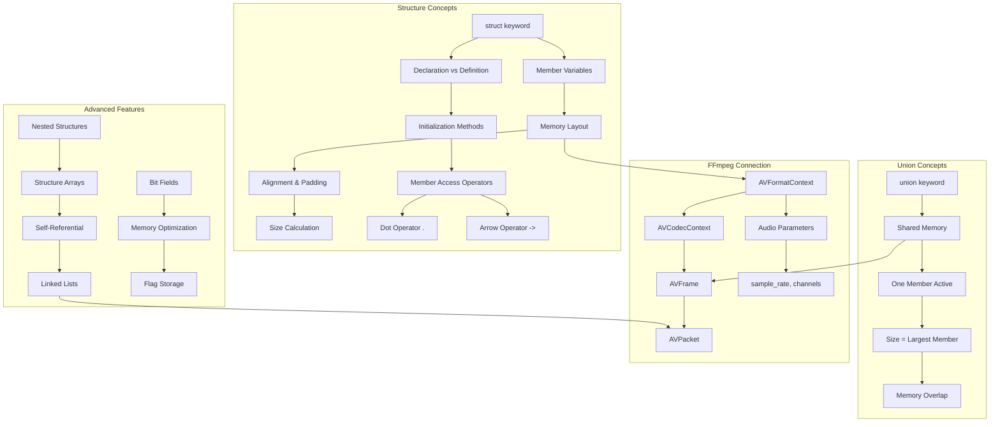

# Lesson 08: Structures and Unions - Building Complex Data Types for Audio Processing

## 1. Lesson Positioning

### Where This Lesson Fits in the Book

This lesson is the **eighth** in the C language learning path and serves as a critical bridge between basic data types and advanced data organization. After mastering pointers (lesson-05), memory management (lesson-06), and string handling (lesson-07), you now need to understand how to group related data together into meaningful units.

**Position in the learning progression:**
```
lesson-01-entry → lesson-02-types → lesson-03-control → lesson-04-functions
       ↓
lesson-05-pointers → lesson-06-memory → lesson-07-strings → **lesson-08-structs** (YOU ARE HERE)
       ↓
lesson-09-fileio → lesson-10-advanced → lesson-11-ffmpeg-basics
```

### Prerequisite Knowledge Checklist

Before starting this lesson, you should be comfortable with:

- [x] Basic C data types (int, float, char, double)
- [x] Pointer declaration, dereferencing, and arithmetic
- [x] Dynamic memory allocation (malloc, calloc, realloc, free)
- [x] Array declaration and usage
- [x] String handling with null-terminated character arrays
- [x] Understanding of memory layout (stack vs heap)
- [x] Basic understanding of type sizes and alignment

### What Practical Problems You Can Solve After Learning

After completing this lesson, you will be able to:

1. **Design audio format structures** - Create data types that represent audio headers, format information, and metadata
2. **Build linked data structures** - Implement linked lists, trees, and graphs for playlist management
3. **Optimize memory layout** - Use unions to save memory in audio buffer pools
4. **Interface with FFmpeg** - Understand how FFmpeg's `AVFormatContext`, `AVCodecContext`, and `AVFrame` structures work
5. **Create configuration systems** - Store player settings, equalizer presets, and audio parameters
6. **Implement binary file parsing** - Read WAV/FLAC headers using structure mapping
7. **Design JNI data transfer** - Create structures that efficiently pass data between C and Java/Kotlin

---

## 2. Core Concept Map



### Concept Relationships Explained

The diagram above shows how structures and unions form the foundation for complex data organization:

1. **Structures** group related variables into a single named entity
2. **Unions** allow different types to share the same memory location
3. **Nested structures** enable hierarchical data modeling
4. **Self-referential structures** make dynamic data structures possible
5. **Bit fields** provide fine-grained memory control for flags

---

## 3. Concept Deep Dive

### 3.1 Structure (struct)

#### Definition

A **structure** is a user-defined composite data type that groups variables of different types under a single name. Each variable in a structure is called a **member** (or field). Unlike arrays, structures can contain members of different data types.

#### Internal Principles

**Memory Allocation:**
When you declare a structure, the compiler allocates contiguous memory for all members. The total size is NOT simply the sum of member sizes due to **alignment requirements**.

```
struct Example {
    char c;     // 1 byte
    // 3 bytes padding (for int alignment)
    int i;      // 4 bytes
    short s;    // 2 bytes
    // 2 bytes padding (for struct alignment)
};
// Total: 12 bytes (not 7)
```

**Alignment Rules:**
- Each member must be aligned to its natural boundary
- `int` (4 bytes) must be at address divisible by 4
- `double` (8 bytes) must be at address divisible by 8
- Structure itself aligns to its largest member's alignment

#### Limitations

1. **Cannot compare structures directly** - Must use memcmp or member-by-member comparison
2. **Cannot assign structures with different types** - Even if members match
3. **Padding wastes memory** - Can be controlled with `#pragma pack` or `__attribute__((packed))`
4. **No runtime type information** - Unlike C++ classes

#### Compiler Behavior

The compiler performs these operations for structures:

1. **Name mangling** - Creates unique internal names for members
2. **Offset calculation** - Determines each member's offset from structure start
3. **Size computation** - Calculates total size including padding
4. **Alignment enforcement** - Ensures proper memory access

#### Assembly Perspective

When accessing structure members, the compiler generates:

```assembly
; struct AudioHeader { int sample_rate; int channels; };
; AudioHeader* header;
; header->sample_rate = 44100;

mov     eax, DWORD PTR [rdi]      ; Load from offset 0
mov     DWORD PTR [rdi], 44100    ; Store sample_rate at offset 0
mov     DWORD PTR [rdi+4], 2      ; Store channels at offset 4
```

The `rdi+4` shows the compiler calculating the offset at compile time.

### 3.2 Union

#### Definition

A **union** is a user-defined data type that allows different data types to share the same memory location. Only one member can hold a value at any given time. The size of a union equals the size of its largest member.

#### Internal Principles

**Memory Sharing:**
All union members start at the same memory address. Writing to one member overwrites all others.

```
union Data {
    int i;       // 4 bytes
    float f;     // 4 bytes
    char str[8]; // 8 bytes
};
// Total size: 8 bytes (largest member)
```

**Memory Layout:**
```
Address:  0x1000  0x1001  0x1002  0x1003  0x1004  0x1005  0x1006  0x1007
          +-------+-------+-------+-------+-------+-------+-------+-------+
int i:    |      i[0]     |      i[1]     |      i[2]     |      i[3]     |
          +-------+-------+-------+-------+-------+-------+-------+-------+
float f:  |      f[0]     |      f[1]     |      f[2]     |      f[3]     |
          +-------+-------+-------+-------+-------+-------+-------+-------+
char[8]:  | str[0]| str[1]| str[2]| str[3]| str[4]| str[5]| str[6]| str[7]|
          +-------+-------+-------+-------+-------+-------+-------+-------+
```

#### Limitations

1. **No type safety** - Compiler doesn't track which member is active
2. **Only one member valid** - Reading wrong member gives undefined results
3. **No constructors/destructors** - In C, must manage manually
4. **Cannot initialize multiple members** - Only first member can be initialized

#### Use Cases in Audio Processing

1. **Audio sample storage** - Store 16-bit or 24-bit samples in same buffer
2. **Format conversion** - Interpret same bytes as different types
3. **Memory optimization** - Save memory when only one format is used at a time

### 3.3 Bit Fields

#### Definition

**Bit fields** allow specifying the exact number of bits for structure members. They're useful for memory-constrained environments and hardware interfacing.

#### Internal Principles

```c
struct AudioFlags {
    unsigned int is_compressed : 1;    // 1 bit
    unsigned int is_float : 1;          // 1 bit
    unsigned int channels : 4;          // 4 bits (0-15)
    unsigned int bit_depth : 6;         // 6 bits (0-63)
    unsigned int sample_rate_code : 4;  // 4 bits (0-15)
};
// Total: 16 bits = 2 bytes (may have padding)
```

#### Limitations

1. **Platform-dependent** - Order and alignment vary by compiler
2. **Cannot take address** - `&flags.channels` is illegal
3. **No portable size** - Different compilers may pad differently
4. **Performance cost** - Bit manipulation is slower than direct access

### 3.4 Nested Structures

#### Definition

Structures can contain other structures as members, creating hierarchical data organization.

#### Internal Principles

```c
struct AudioFormat {
    int sample_rate;
    int channels;
    int bit_depth;
};

struct AudioStream {
    struct AudioFormat format;    // Nested structure
    int duration_ms;
    int bitrate;
};
```

**Memory Layout:**
```
AudioStream:
  offset 0:  format.sample_rate (4 bytes)
  offset 4:  format.channels (4 bytes)
  offset 8:  format.bit_depth (4 bytes)
  offset 12: duration_ms (4 bytes)
  offset 16: bitrate (4 bytes)
```

### 3.5 Self-Referential Structures

#### Definition

A structure that contains a pointer to its own type, enabling linked data structures.

#### Internal Principles

```c
struct PlaylistNode {
    char title[256];
    char artist[256];
    char filepath[512];
    int duration_ms;
    struct PlaylistNode* next;    // Pointer to next node
    struct PlaylistNode* prev;    // Pointer to previous node
};
```

This enables:
- **Linked lists** - Dynamic playlist management
- **Trees** - Hierarchical music library organization
- **Graphs** - Complex relationship mapping

---

## 4. Complete Syntax Specification

### 4.1 Structure Declaration Syntax (BNF)

```
<struct-declaration> ::= 
    "struct" [<struct-tag>] "{" <member-list> "}" [<declarator-list>] ";"

<member-list> ::= 
    <member-declaration> | <member-declaration> <member-list>

<member-declaration> ::=
    <type-specifier> <declarator-list> ";"

<struct-tag> ::= 
    <identifier>

<declarator-list> ::=
    <declarator> | <declarator> "," <declarator-list>
```

### 4.2 Union Declaration Syntax (BNF)

```
<union-declaration> ::= 
    "union" [<union-tag>] "{" <member-list> "}" [<declarator-list>] ";"
```

### 4.3 Bit Field Syntax (BNF)

```
<bit-field-declaration> ::=
    <type-specifier> <declarator> ":" <width> ";"

<width> ::= 
    <integer-constant-expression>
```

### 4.4 Member Access Operators

| Operator | Name | Usage | Description |
|----------|------|-------|-------------|
| `.` | Direct member access | `obj.member` | Access member of structure object |
| `->` | Indirect member access | `ptr->member` | Access member through pointer |

### 4.5 Boundary Conditions

**Structure Size:**
- Minimum size: 1 byte (even if empty, C requires non-zero size)
- Maximum size: Implementation-defined (typically SIZE_MAX)
- Alignment: Must be multiple of strictest member alignment

**Union Size:**
- Minimum size: Size of largest member
- Maximum size: SIZE_MAX
- Alignment: Same as largest member's alignment

**Bit Fields:**
- Width must be non-negative and not exceed type's bit width
- `int` bit fields can be signed or unsigned (implementation-defined)
- Zero-width bit field forces alignment to next boundary

### 4.6 Undefined Behavior (UB)

1. **Accessing wrong union member** - Reading member other than last written
2. **Unaligned pointer access** - Casting to structure pointer with wrong alignment
3. **Bit field overflow** - Storing value larger than bit field width
4. **Comparing structures with memcmp** - Padding bytes may contain garbage
5. **Taking address of bit field** - `&struct.bitfield` is illegal

### 4.7 Best Practices

1. **Always initialize structures** - Use designated initializers for clarity
2. **Use `sizeof` for size** - Never assume member sizes or padding
3. **Pack when interfacing hardware** - Use `#pragma pack(1)` for binary formats
4. **Document active union member** - Use enum tag to track which member is valid
5. **Avoid bit fields for portable code** - Use explicit masks and shifts instead

---

## 5. Example Line-by-Line Commentary

### Example 1: Basic Structure Declaration and Usage

**File:** `ex01-struct-basic.c`

```c
/*
 * Purpose: Demonstrate basic structure declaration, initialization, and member access
 * Dependencies: stdio.h, string.h
 * Compile: gcc -o ex01 ex01-struct-basic.c -Wall -Wextra
 * Run: ./ex01
 */

#include <stdio.h>
#include <string.h>

/* Line 1-5: Structure declaration (creates a new type) */
struct AudioHeader {
    int sample_rate;      /* Sampling frequency in Hz (e.g., 44100, 192000) */
    int channels;         /* Number of audio channels (1=mono, 2=stereo) */
    int bit_depth;        /* Bits per sample (16, 24, 32) */
    int duration_ms;      /* Duration in milliseconds */
};

/* Line 6-10: Structure with flexible array member (C99 feature) */
struct AudioMetadata {
    char title[256];
    char artist[256];
    char album[256];
    int year;
    int track_number;
};

/* Line 11-15: Typedef for convenience (creates alias) */
typedef struct {
    float left;
    float right;
} StereoSample;

/* Line 16-20: Structure with nested structure */
struct AudioStream {
    struct AudioHeader header;      /* Nested structure member */
    struct AudioMetadata metadata;  /* Another nested structure */
    StereoSample* samples;          /* Pointer to sample buffer */
    size_t sample_count;            /* Number of samples */
};

int main(void) {
    /* Line 21-25: Method 1: Designated initializer (C99, recommended) */
    struct AudioHeader header1 = {
        .sample_rate = 192000,
        .channels = 2,
        .bit_depth = 24,
        .duration_ms = 240000  /* 4 minutes */
    };
    
    /* Line 26-30: Method 2: Positional initializer */
    struct AudioHeader header2 = {44100, 2, 16, 180000};
    
    /* Line 31-35: Method 3: Zero initialization */
    struct AudioHeader header3 = {0};  /* All members set to 0 */
    
    /* Line 36-40: Method 4: Member-by-member assignment */
    struct AudioHeader header4;
    header4.sample_rate = 96000;
    header4.channels = 2;
    header4.bit_depth = 24;
    header4.duration_ms = 300000;
    
    /* Line 41-45: Accessing members with dot operator */
    printf("Header 1:\n");
    printf("  Sample Rate: %d Hz\n", header1.sample_rate);
    printf("  Channels: %d\n", header1.channels);
    printf("  Bit Depth: %d bits\n", header1.bit_depth);
    printf("  Duration: %d ms\n", header1.duration_ms);
    
    /* Line 46-50: Structure assignment (copies all members) */
    struct AudioHeader header_copy = header1;
    printf("\nCopied header sample rate: %d Hz\n", header_copy.sample_rate);
    
    /* Line 51-55: Using typedef'd structure */
    StereoSample sample = {-0.5f, 0.75f};
    printf("\nStereo sample: L=%.3f, R=%.3f\n", sample.left, sample.right);
    
    /* Line 56-60: Nested structure access */
    struct AudioStream stream = {0};
    stream.header.sample_rate = 44100;
    stream.header.channels = 2;
    stream.header.bit_depth = 16;
    stream.header.duration_ms = 200000;
    
    /* Line 61-65: Using strcpy for string members */
    strcpy(stream.metadata.title, "Hi-Res Audio Test");
    strcpy(stream.metadata.artist, "FFmpeg Tutorial");
    strcpy(stream.metadata.album, "Learning C");
    stream.metadata.year = 2024;
    stream.metadata.track_number = 1;
    
    /* Line 66-70: Printing nested structure */
    printf("\nAudio Stream:\n");
    printf("  Title: %s\n", stream.metadata.title);
    printf("  Artist: %s\n", stream.metadata.artist);
    printf("  Sample Rate: %d Hz\n", stream.header.sample_rate);
    
    /* Line 71-75: Calculating size */
    printf("\nStructure sizes:\n");
    printf("  sizeof(AudioHeader): %zu bytes\n", sizeof(struct AudioHeader));
    printf("  sizeof(AudioMetadata): %zu bytes\n", sizeof(struct AudioMetadata));
    printf("  sizeof(StereoSample): %zu bytes\n", sizeof(StereoSample));
    printf("  sizeof(AudioStream): %zu bytes\n", sizeof(struct AudioStream));
    
    return 0;
}
```

**Key Points Explained:**

1. **Lines 1-5**: Structure declaration creates a template, no memory allocated yet
2. **Lines 21-25**: Designated initializers improve readability and allow partial initialization
3. **Line 36**: Zero initialization `{0}` sets all bytes to zero, safe for all types
4. **Line 46**: Structure assignment performs shallow copy (memcpy equivalent)
5. **Lines 61-65**: String members require `strcpy` or `strncpy`, not direct assignment

### Example 2: Structure Pointers and Dynamic Allocation

**File:** `ex02-struct-pointers.c`

```c
/*
 * Purpose: Demonstrate structure pointers, dynamic allocation, and arrow operator
 * Dependencies: stdio.h, stdlib.h, string.h
 * Compile: gcc -o ex02 ex02-struct-pointers.c -Wall -Wextra
 * Run: ./ex02
 */

#include <stdio.h>
#include <stdlib.h>
#include <string.h>

/* Define a structure for audio track information */
typedef struct AudioTrack {
    char* title;              /* Dynamic string for title */
    char* artist;             /* Dynamic string for artist */
    char* filepath;           /* Dynamic string for file path */
    int duration_ms;          /* Duration in milliseconds */
    int sample_rate;          /* Sample rate in Hz */
    struct AudioTrack* next;  /* Pointer to next track (linked list) */
} AudioTrack;

/* Function to create a new track (factory function) */
AudioTrack* create_track(const char* title, const char* artist,
                         const char* filepath, int duration, int sample_rate) {
    /* Allocate memory for the structure */
    AudioTrack* track = (AudioTrack*)malloc(sizeof(AudioTrack));
    if (track == NULL) {
        fprintf(stderr, "Error: Failed to allocate memory for track\n");
        return NULL;
    }
    
    /* Allocate and copy strings */
    track->title = strdup(title);
    track->artist = strdup(artist);
    track->filepath = strdup(filepath);
    
    /* Check for allocation failures */
    if (track->title == NULL || track->artist == NULL || track->filepath == NULL) {
        fprintf(stderr, "Error: Failed to allocate memory for strings\n");
        free(track->title);
        free(track->artist);
        free(track->filepath);
        free(track);
        return NULL;
    }
    
    /* Set numeric fields */
    track->duration_ms = duration;
    track->sample_rate = sample_rate;
    track->next = NULL;
    
    return track;
}

/* Function to free a track and its strings */
void free_track(AudioTrack* track) {
    if (track != NULL) {
        free(track->title);
        free(track->artist);
        free(track->filepath);
        free(track);
    }
}

/* Function to print track information */
void print_track(const AudioTrack* track) {
    if (track == NULL) {
        printf("Track is NULL\n");
        return;
    }
    
    printf("Track Information:\n");
    printf("  Title: %s\n", track->title);
    printf("  Artist: %s\n", track->artist);
    printf("  File: %s\n", track->filepath);
    printf("  Duration: %d ms (%.2f min)\n", 
           track->duration_ms, track->duration_ms / 60000.0);
    printf("  Sample Rate: %d Hz\n", track->sample_rate);
}

int main(void) {
    /* Static structure pointer */
    struct AudioHeader {
        int sample_rate;
        int channels;
        int bit_depth;
    };
    
    /* Allocate structure on heap */
    struct AudioHeader* header = (struct AudioHeader*)malloc(sizeof(struct AudioHeader));
    if (header == NULL) {
        fprintf(stderr, "Error: Memory allocation failed\n");
        return 1;
    }
    
    /* Initialize using arrow operator (pointer->member) */
    header->sample_rate = 192000;
    header->channels = 2;
    header->bit_depth = 24;
    
    printf("Dynamic AudioHeader:\n");
    printf("  Sample Rate: %d Hz\n", header->sample_rate);
    printf("  Channels: %d\n", header->channels);
    printf("  Bit Depth: %d bits\n", header->bit_depth);
    
    /* Arrow operator is equivalent to dereference + dot */
    /* header->sample_rate is same as (*header).sample_rate */
    printf("\nUsing (*ptr).member syntax: %d Hz\n", (*header).sample_rate);
    
    free(header);
    
    /* Create linked list of tracks */
    printf("\n=== Playlist (Linked List) ===\n");
    
    AudioTrack* head = create_track("Hi-Res Symphony", "Orchestra", 
                                    "/music/symphony.flac", 240000, 192000);
    AudioTrack* track2 = create_track("Jazz Night", "Jazz Band",
                                      "/music/jazz.flac", 180000, 96000);
    AudioTrack* track3 = create_track("Rock Anthem", "Rock Band",
                                      "/music/rock.flac", 210000, 44100);
    
    /* Link tracks together */
    head->next = track2;
    track2->next = track3;
    
    /* Traverse linked list */
    AudioTrack* current = head;
    int track_num = 1;
    while (current != NULL) {
        printf("\n--- Track %d ---\n", track_num++);
        print_track(current);
        current = current->next;
    }
    
    /* Free all tracks in list */
    current = head;
    while (current != NULL) {
        AudioTrack* next = current->next;
        free_track(current);
        current = next;
    }
    
    return 0;
}
```

**Key Points Explained:**

1. **Arrow operator `->`**: Used when accessing members through a pointer
2. **Dynamic string allocation**: Use `strdup()` to copy strings into structure
3. **Error handling**: Always check malloc return value before use
4. **Linked list traversal**: Use temporary pointer to iterate without losing head
5. **Memory cleanup**: Free inner allocations before freeing the structure

### Example 3: Unions for Audio Sample Storage

**File:** `ex03-unions.c`

```c
/*
 * Purpose: Demonstrate union usage for audio sample type flexibility
 * Dependencies: stdio.h, stdint.h, string.h
 * Compile: gcc -o ex03 ex03-unions.c -Wall -Wextra
 * Run: ./ex03
 */

#include <stdio.h>
#include <stdint.h>
#include <string.h>

/* Union for storing different sample formats */
typedef union AudioSample {
    int8_t i8;          /* 8-bit signed integer */
    int16_t i16;        /* 16-bit signed integer (CD quality) */
    int32_t i32;        /* 32-bit signed integer (Hi-Res) */
    float f32;          /* 32-bit float (professional) */
    double f64;         /* 64-bit double (mastering) */
    uint8_t bytes[8];   /* Raw byte access */
} AudioSample;

/* Tagged union - includes type indicator */
typedef struct {
    enum SampleType {
        SAMPLE_INT8,
        SAMPLE_INT16,
        SAMPLE_INT32,
        SAMPLE_FLOAT32,
        SAMPLE_FLOAT64
    } type;
    AudioSample value;
} TaggedSample;

/* Union for WAV file format chunk */
typedef union {
    struct {
        uint16_t audio_format;   /* 1 = PCM, 3 = IEEE float */
        uint16_t num_channels;
        uint32_t sample_rate;
        uint32_t byte_rate;
        uint16_t block_align;
        uint16_t bits_per_sample;
    } pcm;
    uint8_t raw[24];             /* Raw byte access for parsing */
} WavFormatChunk;

/* Function to print sample based on type */
void print_tagged_sample(const TaggedSample* ts) {
    switch (ts->type) {
        case SAMPLE_INT8:
            printf("INT8: %d\n", ts->value.i8);
            break;
        case SAMPLE_INT16:
            printf("INT16: %d\n", ts->value.i16);
            break;
        case SAMPLE_INT32:
            printf("INT32: %d\n", ts->value.i32);
            break;
        case SAMPLE_FLOAT32:
            printf("FLOAT32: %.6f\n", ts->value.f32);
            break;
        case SAMPLE_FLOAT64:
            printf("FLOAT64: %.15f\n", ts->value.f64);
            break;
        default:
            printf("Unknown sample type\n");
    }
}

/* Function to convert sample to float (normalized to -1.0 to 1.0) */
double sample_to_float(const TaggedSample* ts) {
    switch (ts->type) {
        case SAMPLE_INT8:
            return ts->value.i8 / 128.0;
        case SAMPLE_INT16:
            return ts->value.i16 / 32768.0;
        case SAMPLE_INT32:
            return ts->value.i32 / 2147483648.0;
        case SAMPLE_FLOAT32:
            return (double)ts->value.f32;
        case SAMPLE_FLOAT64:
            return ts->value.f64;
        default:
            return 0.0;
    }
}

int main(void) {
    printf("=== Union Size Demonstration ===\n");
    printf("sizeof(AudioSample): %zu bytes\n", sizeof(AudioSample));
    printf("sizeof(TaggedSample): %zu bytes\n", sizeof(TaggedSample));
    printf("sizeof(WavFormatChunk): %zu bytes\n", sizeof(WavFormatChunk));
    
    /* Using basic union */
    printf("\n=== Basic Union Usage ===\n");
    AudioSample sample;
    
    /* Store as 16-bit integer */
    sample.i16 = 16384;
    printf("Stored as INT16: %d\n", sample.i16);
    printf("Bytes: ");
    for (int i = 0; i < 2; i++) {
        printf("%02x ", sample.bytes[i]);
    }
    printf("\n");
    
    /* Store as float (overwrites i16) */
    sample.f32 = 0.5f;
    printf("Stored as FLOAT32: %.6f\n", sample.f32);
    printf("Bytes: ");
    for (int i = 0; i < 4; i++) {
        printf("%02x ", sample.bytes[i]);
    }
    printf("\n");
    
    /* Using tagged union for type safety */
    printf("\n=== Tagged Union Usage ===\n");
    TaggedSample ts1 = {.type = SAMPLE_INT16, .value.i16 = -8192};
    TaggedSample ts2 = {.type = SAMPLE_FLOAT32, .value.f32 = 0.25f};
    TaggedSample ts3 = {.type = SAMPLE_INT32, .value.i32 = 536870912};
    
    print_tagged_sample(&ts1);
    print_tagged_sample(&ts2);
    print_tagged_sample(&ts3);
    
    /* Converting to normalized float */
    printf("\n=== Normalized Values ===\n");
    printf("ts1 normalized: %.6f\n", sample_to_float(&ts1));
    printf("ts2 normalized: %.6f\n", sample_to_float(&ts2));
    printf("ts3 normalized: %.6f\n", sample_to_float(&ts3));
    
    /* WAV format chunk example */
    printf("\n=== WAV Format Chunk ===\n");
    WavFormatChunk wav;
    wav.pcm.audio_format = 1;      /* PCM */
    wav.pcm.num_channels = 2;      /* Stereo */
    wav.pcm.sample_rate = 192000;  /* Hi-Res */
    wav.pcm.byte_rate = 192000 * 2 * 3;  /* SampleRate * Channels * BytesPerSample */
    wav.pcm.block_align = 2 * 3;   /* Channels * BytesPerSample */
    wav.pcm.bits_per_sample = 24;  /* 24-bit */
    
    printf("WAV Format:\n");
    printf("  Audio Format: %d (PCM)\n", wav.pcm.audio_format);
    printf("  Channels: %d\n", wav.pcm.num_channels);
    printf("  Sample Rate: %d Hz\n", wav.pcm.sample_rate);
    printf("  Byte Rate: %d bytes/sec\n", wav.pcm.byte_rate);
    printf("  Block Align: %d bytes\n", wav.pcm.block_align);
    printf("  Bits/Sample: %d\n", wav.pcm.bits_per_sample);
    
    /* Raw byte access */
    printf("  Raw bytes: ");
    for (int i = 0; i < 24; i++) {
        printf("%02x ", wav.raw[i]);
    }
    printf("\n");
    
    return 0;
}
```

### Example 4: Bit Fields and Structure Padding

**File:** `ex04-bitfields-padding.c`

```c
/*
 * Purpose: Demonstrate bit fields and structure padding analysis
 * Dependencies: stdio.h, stdint.h
 * Compile: gcc -o ex04 ex04-bitfields-padding.c -Wall -Wextra
 * Run: ./ex04
 */

#include <stdio.h>
#include <stdint.h>

/* Structure without bit fields - normal padding */
struct NormalFlags {
    uint8_t is_compressed;   /* 1 byte */
    uint8_t is_float;        /* 1 byte */
    uint8_t channels;        /* 1 byte */
    uint8_t bit_depth;       /* 1 byte */
};  /* Total: 4 bytes */

/* Structure with bit fields - compact storage */
struct BitFieldFlags {
    uint8_t is_compressed : 1;   /* 1 bit */
    uint8_t is_float : 1;         /* 1 bit */
    uint8_t channels : 4;         /* 4 bits (supports 0-15 channels) */
    uint8_t bit_depth : 6;        /* 6 bits (supports 0-63 bit depth) */
};  /* Total: 2 bytes (may vary by compiler) */

/* Audio header with intentional padding */
struct PaddedHeader {
    char type[4];           /* 4 bytes */
    uint32_t size;          /* 4 bytes */
    uint16_t format;        /* 2 bytes */
    /* 2 bytes padding here (for uint32_t alignment) */
    uint32_t sample_rate;   /* 4 bytes */
    uint32_t byte_rate;     /* 4 bytes */
};  /* Total: 20 bytes (with padding) */

/* Audio header with packed attribute (GCC extension) */
struct __attribute__((packed)) PackedHeader {
    char type[4];           /* 4 bytes */
    uint32_t size;          /* 4 bytes */
    uint16_t format;        /* 2 bytes */
    uint32_t sample_rate;   /* 4 bytes (no padding before this) */
    uint32_t byte_rate;     /* 4 bytes */
};  /* Total: 18 bytes (no padding) */

/* FLAC frame header bit field simulation */
struct FlacFrameHeader {
    uint32_t sync_code : 14;        /* 14 bits: sync code */
    uint32_t reserved : 1;           /* 1 bit: reserved */
    uint32_t blocking_strategy : 1;  /* 1 bit: blocking strategy */
    uint32_t block_size : 4;         /* 4 bits: block size */
    uint32_t sample_rate : 4;        /* 4 bits: sample rate */
    uint32_t channel_assignment : 4; /* 4 bits: channel assignment */
    uint32_t sample_size : 3;        /* 3 bits: sample size */
    uint32_t reserved2 : 1;          /* 1 bit: reserved */
};  /* Total: 32 bits = 4 bytes */

/* Function to print memory layout */
void print_memory_layout(const void* ptr, size_t size, const char* name) {
    const uint8_t* bytes = (const uint8_t*)ptr;
    printf("%s (%zu bytes): ", name, size);
    for (size_t i = 0; i < size; i++) {
        printf("%02x ", bytes[i]);
    }
    printf("\n");
}

int main(void) {
    printf("=== Structure Size Comparison ===\n");
    printf("sizeof(NormalFlags): %zu bytes\n", sizeof(struct NormalFlags));
    printf("sizeof(BitFieldFlags): %zu bytes\n", sizeof(struct BitFieldFlags));
    printf("sizeof(PaddedHeader): %zu bytes\n", sizeof(struct PaddedHeader));
    printf("sizeof(PackedHeader): %zu bytes\n", sizeof(struct PackedHeader));
    printf("sizeof(FlacFrameHeader): %zu bytes\n", sizeof(struct FlacFrameHeader));
    
    /* Normal flags usage */
    printf("\n=== Normal Flags Usage ===\n");
    struct NormalFlags normal = {1, 0, 2, 24};
    printf("Normal: compressed=%d, float=%d, channels=%d, bit_depth=%d\n",
           normal.is_compressed, normal.is_float, normal.channels, normal.bit_depth);
    print_memory_layout(&normal, sizeof(normal), "NormalFlags");
    
    /* Bit field usage */
    printf("\n=== Bit Field Usage ===\n");
    struct BitFieldFlags bf = {0};
    bf.is_compressed = 1;
    bf.is_float = 0;
    bf.channels = 2;
    bf.bit_depth = 24;
    printf("BitField: compressed=%d, float=%d, channels=%d, bit_depth=%d\n",
           bf.is_compressed, bf.is_float, bf.channels, bf.bit_depth);
    print_memory_layout(&bf, sizeof(bf), "BitFieldFlags");
    
    /* Padded header */
    printf("\n=== Padded Header ===\n");
    struct PaddedHeader padded = {0};
    memcpy(padded.type, "RIFF", 4);
    packed.size = 1024;
    packed.format = 1;
    packed.sample_rate = 192000;
    packed.byte_rate = 192000 * 2 * 3;
    print_memory_layout(&padded, sizeof(padded), "PaddedHeader");
    
    /* Packed header */
    printf("\n=== Packed Header ===\n");
    struct PackedHeader packed = {0};
    memcpy(packed.type, "RIFF", 4);
    packed.size = 1024;
    packed.format = 1;
    packed.sample_rate = 192000;
    packed.byte_rate = 192000 * 2 * 3;
    print_memory_layout(&packed, sizeof(packed), "PackedHeader");
    
    /* FLAC frame header */
    printf("\n=== FLAC Frame Header ===\n");
    struct FlacFrameHeader flac = {0};
    flac.sync_code = 0x3FFE;        /* 14-bit sync code */
    flac.blocking_strategy = 1;      /* Variable block size */
    flac.block_size = 0x6;           /* 4096 samples */
    flac.sample_rate = 0x8;          /* 192kHz */
    flac.channel_assignment = 0x2;   /* Stereo */
    flac.sample_size = 0x4;          /* 24-bit */
    print_memory_layout(&flac, sizeof(flac), "FlacFrameHeader");
    
    /* Offset analysis */
    printf("\n=== Member Offsets ===\n");
    printf("PaddedHeader offsets:\n");
    printf("  type: %zu\n", offsetof(struct PaddedHeader, type));
    printf("  size: %zu\n", offsetof(struct PaddedHeader, size));
    printf("  format: %zu\n", offsetof(struct PaddedHeader, format));
    printf("  sample_rate: %zu\n", offsetof(struct PaddedHeader, sample_rate));
    printf("  byte_rate: %zu\n", offsetof(struct PaddedHeader, byte_rate));
    
    return 0;
}
```

### Example 5: Audio Configuration Structure

**File:** `ex05-audio-config.c`

```c
/*
 * Purpose: Complete audio configuration structure for Hi-Res player
 * Dependencies: stdio.h, stdint.h, string.h, stdlib.h
 * Compile: gcc -o ex05 ex05-audio-config.c -Wall -Wextra
 * Run: ./ex05
 */

#include <stdio.h>
#include <stdint.h>
#include <string.h>
#include <stdlib.h>

/* Audio format enumeration */
typedef enum {
    AUDIO_FORMAT_PCM = 0,
    AUDIO_FORMAT_FLOAT = 1,
    AUDIO_FORMAT_DSD = 2,
    AUDIO_FORMAT_COMPRESSED = 3
} AudioFormat;

/* Sample rate enumeration */
typedef enum {
    SAMPLE_RATE_44100 = 0,
    SAMPLE_RATE_48000 = 1,
    SAMPLE_RATE_88200 = 2,
    SAMPLE_RATE_96000 = 3,
    SAMPLE_RATE_176400 = 4,
    SAMPLE_RATE_192000 = 5,
    SAMPLE_RATE_352800 = 6,
    SAMPLE_RATE_384000 = 7
} SampleRateCode;

/* Channel configuration */
typedef enum {
    CHANNEL_MONO = 1,
    CHANNEL_STEREO = 2,
    CHANNEL_2POINT1 = 3,
    CHANNEL_QUAD = 4,
    CHANNEL_5POINT1 = 6,
    CHANNEL_7POINT1 = 8
} ChannelConfig;

/* Bit depth options */
typedef enum {
    BIT_DEPTH_16 = 16,
    BIT_DEPTH_24 = 24,
    BIT_DEPTH_32 = 32,
    BIT_DEPTH_64 = 64
} BitDepth;

/* Complete audio configuration structure */
typedef struct AudioConfig {
    /* Basic format info */
    AudioFormat format;
    uint32_t sample_rate;
    ChannelConfig channels;
    BitDepth bit_depth;
    
    /* Advanced settings */
    uint32_t buffer_size_ms;      /* Buffer duration in milliseconds */
    uint32_t target_latency_ms;   /* Target output latency */
    uint8_t exclusive_mode;       /* Exclusive audio mode flag */
    uint8_t dither_enabled;       /* Dithering for bit depth conversion */
    uint8_t resample_quality;     /* 0=fast, 1=medium, 2=best */
    uint8_t reserved;             /* Padding/alignment */
    
    /* Volume and gain */
    float volume;                 /* 0.0 to 1.0 */
    float preamp_db;              /* Preamp gain in dB */
    
    /* DSP settings */
    struct {
        uint8_t enabled;
        float cutoff_hz;
        float resonance;
    } lowpass_filter;
    
    struct {
        uint8_t enabled;
        float frequency_hz;
        float gain_db;
        float Q;
    } equalizer_bands[10];       /* 10-band equalizer */
    
    /* Output device info */
    char device_name[256];
    char device_id[64];
    
    /* Callback pointers (for audio pipeline) */
    int (*on_buffer_ready)(struct AudioConfig* config, void* buffer, size_t size);
    void (*on_error)(struct AudioConfig* config, const char* message);
    
} AudioConfig;

/* Function to initialize default configuration */
void audio_config_init_default(AudioConfig* config) {
    if (config == NULL) return;
    
    memset(config, 0, sizeof(AudioConfig));
    
    /* Default Hi-Res settings */
    config->format = AUDIO_FORMAT_PCM;
    config->sample_rate = 192000;
    config->channels = CHANNEL_STEREO;
    config->bit_depth = BIT_DEPTH_24;
    
    /* Buffer settings */
    config->buffer_size_ms = 500;     /* 500ms buffer */
    config->target_latency_ms = 10;   /* 10ms target latency */
    config->exclusive_mode = 1;       /* Enable exclusive mode */
    config->dither_enabled = 1;       /* Enable dithering */
    config->resample_quality = 2;     /* Best quality */
    
    /* Volume */
    config->volume = 1.0f;
    config->preamp_db = 0.0f;
    
    /* DSP defaults */
    config->lowpass_filter.enabled = 0;
    config->lowpass_filter.cutoff_hz = 20000.0f;
    
    /* Default device */
    strcpy(config->device_name, "Default Audio Device");
    strcpy(config->device_id, "default");
}

/* Function to calculate bytes per sample */
uint32_t audio_config_bytes_per_sample(const AudioConfig* config) {
    if (config == NULL) return 0;
    
    switch (config->format) {
        case AUDIO_FORMAT_PCM:
            return config->bit_depth / 8;
        case AUDIO_FORMAT_FLOAT:
            return 4;  /* 32-bit float */
        case AUDIO_FORMAT_DSD:
            return 1;  /* DSD is 1-bit, but stored as bytes */
        default:
            return 0;
    }
}

/* Function to calculate buffer size in bytes */
size_t audio_config_buffer_size_bytes(const AudioConfig* config) {
    if (config == NULL) return 0;
    
    uint32_t bytes_per_sample = audio_config_bytes_per_sample(config);
    uint32_t samples_per_ms = config->sample_rate / 1000;
    size_t total_samples = samples_per_ms * config->buffer_size_ms * config->channels;
    
    return total_samples * bytes_per_sample;
}

/* Function to print configuration */
void audio_config_print(const AudioConfig* config) {
    if (config == NULL) {
        printf("AudioConfig is NULL\n");
        return;
    }
    
    printf("=== Audio Configuration ===\n");
    printf("Format: ");
    switch (config->format) {
        case AUDIO_FORMAT_PCM: printf("PCM\n"); break;
        case AUDIO_FORMAT_FLOAT: printf("Float\n"); break;
        case AUDIO_FORMAT_DSD: printf("DSD\n"); break;
        default: printf("Unknown\n");
    }
    printf("Sample Rate: %u Hz\n", config->sample_rate);
    printf("Channels: %d\n", config->channels);
    printf("Bit Depth: %d bits\n", config->bit_depth);
    printf("Buffer Size: %u ms (%zu bytes)\n", 
           config->buffer_size_ms, audio_config_buffer_size_bytes(config));
    printf("Target Latency: %u ms\n", config->target_latency_ms);
    printf("Exclusive Mode: %s\n", config->exclusive_mode ? "Enabled" : "Disabled");
    printf("Dithering: %s\n", config->dither_enabled ? "Enabled" : "Disabled");
    printf("Volume: %.2f\n", config->volume);
    printf("Preamp: %.1f dB\n", config->preamp_db);
    printf("Device: %s (%s)\n", config->device_name, config->device_id);
}

/* Sample callback function */
int on_buffer_ready_callback(AudioConfig* config, void* buffer, size_t size) {
    printf("Buffer ready: %zu bytes\n", size);
    return 0;
}

/* Sample error callback function */
void on_error_callback(AudioConfig* config, const char* message) {
    fprintf(stderr, "Audio Error: %s\n", message);
}

int main(void) {
    printf("=== Audio Configuration Demo ===\n\n");
    
    /* Create and initialize configuration */
    AudioConfig config;
    audio_config_init_default(&config);
    
    /* Set callbacks */
    config.on_buffer_ready = on_buffer_ready_callback;
    config.on_error = on_error_callback;
    
    /* Print configuration */
    audio_config_print(&config);
    
    /* Modify settings */
    printf("\n=== Modifying Configuration ===\n");
    config.sample_rate = 384000;  /* Ultra Hi-Res */
    config.bit_depth = BIT_DEPTH_32;
    config.volume = 0.8f;
    config.preamp_db = -3.0f;
    
    /* Enable lowpass filter */
    config.lowpass_filter.enabled = 1;
    config.lowpass_filter.cutoff_hz = 40000.0f;  /* 40kHz for ultrasonic content */
    
    /* Configure equalizer */
    config.equalizer_bands[0].enabled = 1;
    config.equalizer_bands[0].frequency_hz = 32.0f;
    config.equalizer_bands[0].gain_db = 2.0f;
    config.equalizer_bands[0].Q = 1.0f;
    
    /* Print modified configuration */
    printf("\n=== Modified Configuration ===\n");
    audio_config_print(&config);
    
    /* Calculate sizes */
    printf("\n=== Size Calculations ===\n");
    printf("sizeof(AudioConfig): %zu bytes\n", sizeof(AudioConfig));
    printf("Bytes per sample: %u\n", audio_config_bytes_per_sample(&config));
    printf("Buffer size: %zu bytes\n", audio_config_buffer_size_bytes(&config));
    
    /* Test callback */
    printf("\n=== Testing Callbacks ===\n");
    uint8_t test_buffer[1024] = {0};
    config.on_buffer_ready(&config, test_buffer, sizeof(test_buffer));
    config.on_error(&config, "Test error message");
    
    return 0;
}
```

---

## 6. Error Case Comparison Table

| Error Code | Error Message | Root Cause | Correct Approach |
|------------|---------------|------------|------------------|
| `struct AudioHeader h; h->sample_rate = 44100;` | error: invalid type argument of '->' | Using arrow operator on non-pointer | Use `.` operator: `h.sample_rate = 44100;` |
| `struct AudioHeader* h; h.sample_rate = 44100;` | error: request for member 'sample_rate' in something not a structure or union | Using dot operator on pointer | Use `->` operator: `h->sample_rate = 44100;` |
| `AudioHeader h = {192000, 2, 24};` (without struct keyword) | error: 'AudioHeader' undeclared | Missing `struct` keyword or typedef | Use `struct AudioHeader` or add `typedef` |
| `strcpy(header.title, "Song");` (title is char*) | Segmentation fault or corruption | Uninitialized pointer, no memory allocated | Allocate with `header.title = strdup("Song");` or use array |
| `union Data u; printf("%d", u.i);` (uninitialized) | Garbage value or UB | Reading uninitialized union member | Initialize before use: `u.i = 42;` |
| `struct { int a:33; } s;` | error: width of 'a' exceeds its type | Bit field width exceeds type size | Use valid width: `int a:31;` for 32-bit int |
| `&flags.bitfield` | error: cannot take address of bit-field | Bit fields don't have addresses | Use regular member or copy to variable |
| `memcmp(&s1, &s2, sizeof(s1))` | Incorrect comparison | Padding bytes may differ | Compare members individually |
| `struct S* p = malloc(sizeof(S*));` | Buffer overflow, heap corruption | Allocating pointer size, not struct size | Use `sizeof(struct S)` or `sizeof(*p)` |
| `free(s->title); free(s);` (title is array) | Invalid free, crash | Freeing non-heap memory | Only free dynamically allocated members |

---

## 7. Performance and Memory Analysis

### 7.1 Memory Layout Analysis

**Structure Memory Layout:**
```
struct AudioHeader {
    int sample_rate;    // Offset 0,  Size 4
    int channels;       // Offset 4,  Size 4
    int bit_depth;      // Offset 8,  Size 4
    int duration_ms;    // Offset 12, Size 4
};                      // Total: 16 bytes, Alignment: 4
```

**With Padding:**
```
struct PaddedExample {
    char c;         // Offset 0,  Size 1
    // 3 bytes padding
    int i;          // Offset 4,  Size 4
    short s;        // Offset 8,  Size 2
    // 2 bytes padding
};                  // Total: 12 bytes (not 7)
```

### 7.2 Cache Line Considerations

Modern CPUs use 64-byte cache lines. Structure layout affects cache performance:

**Poor Layout (cache misses):**
```c
struct PoorLayout {
    bool flag1;     // 1 byte
    // 7 bytes padding
    double data[7]; // 56 bytes
    bool flag2;     // 1 byte
    // 7 bytes padding
};                  // Total: 72 bytes (2 cache lines)
```

**Better Layout (cache-friendly):**
```c
struct BetterLayout {
    double data[7]; // 56 bytes
    bool flag1;     // 1 byte
    bool flag2;     // 1 byte
    // 6 bytes padding
};                  // Total: 64 bytes (1 cache line)
```

### 7.3 Time Complexity Analysis

| Operation | Time Complexity | Notes |
|-----------|-----------------|-------|
| Member access | O(1) | Direct offset calculation |
| Structure copy | O(n) | n = sizeof(struct) |
| Comparison | O(n) | Member-by-member |
| Dynamic allocation | O(1) | malloc/free overhead |
| Linked list traversal | O(n) | n = number of nodes |

### 7.4 FFmpeg Structure Performance

FFmpeg structures are optimized for cache efficiency:

```c
/* AVFrame layout (simplified) */
struct AVFrame {
    uint8_t *data[AV_NUM_DATA_POINTERS];  // Pointer array first
    int linesize[AV_NUM_DATA_POINTERS];   // Dimensions
    int width, height;                     // Video dimensions
    int nb_samples;                        // Audio samples
    int format;                            // Pixel/sample format
    // ... many more fields
};
```

**Key optimizations:**
1. Hot fields (data pointers) at the beginning
2. Related fields grouped together
3. Pointer arrays for multi-planar data

---

## 8. Hi-Res Audio Practical Connection

### 8.1 FFmpeg Structure Integration

**AVFormatContext for container format:**
```c
typedef struct AVFormatContext {
    struct AVInputFormat *iformat;      // Input format
    struct AVOutputFormat *oformat;     // Output format
    void *priv_data;                    // Format private data
    AVIOContext *pb;                    // I/O context
    int ctx_flags;                      // Format context flags
    unsigned int nb_streams;            // Number of streams
    AVStream **streams;                 // List of streams
    char filename[1024];                // Input filename
    int64_t start_time;                 // Start time
    int64_t duration;                   // Duration in microseconds
    int bit_rate;                       // Total stream bitrate
    // ... many more fields
} AVFormatContext;
```

**AVCodecContext for codec parameters:**
```c
typedef struct AVCodecContext {
    const struct AVCodec *codec;        // Codec
    enum AVMediaType codec_type;        // Media type (audio/video)
    enum AVCodecID codec_id;            // Codec ID
    uint32_t tag;                       // Codec tag
    int bit_rate;                       // Bitrate
    int sample_rate;                    // Audio sample rate
    int channels;                       // Number of channels
    int frame_size;                     // Samples per frame
    int frame_number;                   // Frame counter
    // ... many more fields
} AVCodecContext;
```

### 8.2 WAV Header Structure Mapping

```c
/* WAV file header structure (packed for binary mapping) */
#pragma pack(push, 1)
typedef struct {
    /* RIFF chunk */
    char riff_id[4];        /* "RIFF" */
    uint32_t file_size;     /* File size - 8 */
    char wave_id[4];        /* "WAVE" */
    
    /* Format chunk */
    char fmt_id[4];         /* "fmt " */
    uint32_t fmt_size;      /* 16 for PCM */
    uint16_t audio_format;  /* 1 = PCM, 3 = IEEE float */
    uint16_t num_channels;
    uint32_t sample_rate;
    uint32_t byte_rate;
    uint16_t block_align;
    uint16_t bits_per_sample;
    
    /* Data chunk */
    char data_id[4];        /* "data" */
    uint32_t data_size;
} WavHeader;
#pragma pack(pop)

/* Usage in FFmpeg pipeline */
int parse_wav_header(const char* filename) {
    FILE* f = fopen(filename, "rb");
    if (!f) return -1;
    
    WavHeader header;
    if (fread(&header, sizeof(WavHeader), 1, f) != 1) {
        fclose(f);
        return -1;
    }
    
    /* Validate header */
    if (memcmp(header.riff_id, "RIFF", 4) != 0 ||
        memcmp(header.wave_id, "WAVE", 4) != 0) {
        fclose(f);
        return -1;
    }
    
    printf("WAV File: %u Hz, %u channels, %u bits\n",
           header.sample_rate, header.num_channels, header.bits_per_sample);
    
    fclose(f);
    return 0;
}
```

### 8.3 JNI Structure Transfer

```c
/* Native structure for audio buffer */
typedef struct {
    int sample_rate;
    int channels;
    int bit_depth;
    int64_t timestamp_us;
    size_t data_size;
    uint8_t data[];  /* Flexible array member */
} NativeAudioBuffer;

/* JNI function to create and return buffer */
JNIEXPORT jobject JNICALL
Java_com_example_player_AudioDecoder_getBuffer(JNIEnv* env, jobject thiz) {
    /* Create native buffer */
    NativeAudioBuffer* native_buf = malloc(sizeof(NativeAudioBuffer) + 8192);
    native_buf->sample_rate = 192000;
    native_buf->channels = 2;
    native_buf->bit_depth = 24;
    native_buf->timestamp_us = 0;
    native_buf->data_size = 8192;
    
    /* Find Java class */
    jclass cls = (*env)->FindClass(env, "com/example/player/AudioBuffer");
    
    /* Create Java object */
    jmethodID ctor = (*env)->GetMethodID(env, cls, "<init>", "()V");
    jobject obj = (*env)->NewObject(env, cls, ctor);
    
    /* Set fields */
    (*env)->SetIntField(env, obj, 
        (*env)->GetFieldID(env, cls, "sampleRate", "I"), 
        native_buf->sample_rate);
    
    /* Transfer data via ByteBuffer */
    jobject byte_buf = (*env)->NewDirectByteBuffer(env, 
        native_buf->data, native_buf->data_size);
    (*env)->SetObjectField(env, obj,
        (*env)->GetFieldID(env, cls, "data", "Ljava/nio/ByteBuffer;"),
        byte_buf);
    
    return obj;
}
```

### 8.4 Android AudioTrack Configuration

```c
/* Structure for AudioTrack parameters */
typedef struct {
    int stream_type;        /* STREAM_MUSIC = 3 */
    int sample_rate;        /* 192000 for Hi-Res */
    int channel_config;     /* CHANNEL_OUT_STEREO = 3 */
    int audio_format;       /* ENCODING_PCM_24BIT = 21 */
    int mode;               /* MODE_STREAM = 1 */
    int buffer_size;        /* In bytes */
} AudioTrackConfig;

/* Calculate optimal buffer size */
int calculate_buffer_size(AudioTrackConfig* config) {
    /* Minimum buffer for 192kHz/24bit stereo: */
    /* 192000 samples/sec * 3 bytes/sample * 2 channels = 1,152,000 bytes/sec */
    /* For 100ms buffer: 115,200 bytes */
    int bytes_per_sample = (config->audio_format == 21) ? 3 : 2;
    int min_buffer = config->sample_rate * bytes_per_sample * 
                     config->channel_config / 10;
    return min_buffer;
}
```

---

## 9. Exercises and Solutions

### Exercise 1: Basic Structure Design (Beginner)

**Task:** Design a structure to store music track metadata including title, artist, album, duration, and sample rate. Write functions to initialize, print, and free the structure.

**Solution:**

```c
#include <stdio.h>
#include <stdlib.h>
#include <string.h>

/* Track metadata structure */
typedef struct TrackMetadata {
    char* title;
    char* artist;
    char* album;
    int duration_ms;
    int sample_rate;
    int bit_depth;
    int channels;
} TrackMetadata;

/* Initialize track with copies of strings */
TrackMetadata* track_create(const char* title, const char* artist,
                            const char* album, int duration, 
                            int sample_rate, int bit_depth, int channels) {
    TrackMetadata* track = malloc(sizeof(TrackMetadata));
    if (!track) return NULL;
    
    track->title = strdup(title);
    track->artist = strdup(artist);
    track->album = strdup(album);
    
    if (!track->title || !track->artist || !track->album) {
        free(track->title);
        free(track->artist);
        free(track->album);
        free(track);
        return NULL;
    }
    
    track->duration_ms = duration;
    track->sample_rate = sample_rate;
    track->bit_depth = bit_depth;
    track->channels = channels;
    
    return track;
}

/* Print track information */
void track_print(const TrackMetadata* track) {
    if (!track) return;
    
    printf("Title: %s\n", track->title);
    printf("Artist: %s\n", track->artist);
    printf("Album: %s\n", track->album);
    printf("Duration: %d:%02d\n", track->duration_ms / 60000, 
           (track->duration_ms / 1000) % 60);
    printf("Format: %d Hz, %d-bit, %d channels\n",
           track->sample_rate, track->bit_depth, track->channels);
}

/* Free track and all strings */
void track_free(TrackMetadata* track) {
    if (!track) return;
    
    free(track->title);
    free(track->artist);
    free(track->album);
    free(track);
}

int main(void) {
    TrackMetadata* track = track_create(
        "Hi-Res Symphony No. 9",
        "Berlin Philharmonic",
        "Beethoven Symphonies",
        4200000,  /* 70 minutes */
        192000,
        24,
        2
    );
    
    track_print(track);
    track_free(track);
    
    return 0;
}
```

### Exercise 2: Linked List Playlist (Advanced)

**Task:** Implement a doubly-linked list to manage a playlist. Include functions to add tracks, remove tracks, search by title, and traverse the list.

**Solution:**

```c
#include <stdio.h>
#include <stdlib.h>
#include <string.h>

/* Playlist node structure */
typedef struct PlaylistNode {
    char* title;
    char* filepath;
    int duration_ms;
    struct PlaylistNode* prev;
    struct PlaylistNode* next;
} PlaylistNode;

/* Playlist structure with head and tail */
typedef struct {
    PlaylistNode* head;
    PlaylistNode* tail;
    int count;
} Playlist;

/* Create empty playlist */
Playlist* playlist_create(void) {
    Playlist* pl = malloc(sizeof(Playlist));
    if (pl) {
        pl->head = NULL;
        pl->tail = NULL;
        pl->count = 0;
    }
    return pl;
}

/* Add track to end of playlist */
int playlist_append(Playlist* pl, const char* title, 
                    const char* filepath, int duration) {
    if (!pl) return -1;
    
    PlaylistNode* node = malloc(sizeof(PlaylistNode));
    if (!node) return -1;
    
    node->title = strdup(title);
    node->filepath = strdup(filepath);
    node->duration_ms = duration;
    node->prev = pl->tail;
    node->next = NULL;
    
    if (!node->title || !node->filepath) {
        free(node->title);
        free(node->filepath);
        free(node);
        return -1;
    }
    
    if (pl->tail) {
        pl->tail->next = node;
    } else {
        pl->head = node;
    }
    pl->tail = node;
    pl->count++;
    
    return 0;
}

/* Remove track by index */
int playlist_remove(Playlist* pl, int index) {
    if (!pl || index < 0 || index >= pl->count) return -1;
    
    PlaylistNode* current = pl->head;
    for (int i = 0; i < index; i++) {
        current = current->next;
    }
    
    if (current->prev) {
        current->prev->next = current->next;
    } else {
        pl->head = current->next;
    }
    
    if (current->next) {
        current->next->prev = current->prev;
    } else {
        pl->tail = current->prev;
    }
    
    free(current->title);
    free(current->filepath);
    free(current);
    pl->count--;
    
    return 0;
}

/* Search by title (returns index or -1) */
int playlist_find_by_title(Playlist* pl, const char* title) {
    if (!pl || !title) return -1;
    
    PlaylistNode* current = pl->head;
    int index = 0;
    while (current) {
        if (strcmp(current->title, title) == 0) {
            return index;
        }
        current = current->next;
        index++;
    }
    return -1;
}

/* Print all tracks */
void playlist_print(Playlist* pl) {
    if (!pl) return;
    
    printf("Playlist (%d tracks):\n", pl->count);
    PlaylistNode* current = pl->head;
    int index = 1;
    while (current) {
        printf("  %d. %s (%d:%02d)\n", index++, current->title,
               current->duration_ms / 60000,
               (current->duration_ms / 1000) % 60);
        current = current->next;
    }
}

/* Free entire playlist */
void playlist_free(Playlist* pl) {
    if (!pl) return;
    
    PlaylistNode* current = pl->head;
    while (current) {
        PlaylistNode* next = current->next;
        free(current->title);
        free(current->filepath);
        free(current);
        current = next;
    }
    free(pl);
}

int main(void) {
    Playlist* pl = playlist_create();
    
    playlist_append(pl, "Symphony No. 5", "/music/sym5.flac", 2100000);
    playlist_append(pl, "Piano Concerto", "/music/piano.flac", 1800000);
    playlist_append(pl, "Violin Sonata", "/music/violin.flac", 1500000);
    
    playlist_print(pl);
    
    int idx = playlist_find_by_title(pl, "Piano Concerto");
    printf("\nFound 'Piano Concerto' at index %d\n", idx);
    
    playlist_remove(pl, idx);
    printf("\nAfter removal:\n");
    playlist_print(pl);
    
    playlist_free(pl);
    return 0;
}
```

### Exercise 3: FFmpeg AVFrame Wrapper (Practical)

**Task:** Create a wrapper structure for FFmpeg's AVFrame that includes additional metadata and provides helper functions for audio frame handling.

**Solution:**

```c
#include <stdio.h>
#include <stdlib.h>
#include <stdint.h>
#include <string.h>

/* Simulated AVFrame structure (simplified from FFmpeg) */
typedef struct AVFrame {
    uint8_t* data[8];           /* Pointers to data planes */
    int linesize[8];            /* Size of each plane */
    int width, height;          /* Video dimensions */
    int nb_samples;             /* Audio samples per channel */
    int format;                 /* Format (AV_SAMPLE_FMT_*) */
    int sample_rate;            /* Sample rate */
    uint64_t channel_layout;    /* Channel layout */
    int channels;               /* Number of channels */
    int64_t pts;                /* Presentation timestamp */
    int64_t pkt_dts;            /* Decompression timestamp */
} AVFrame;

/* Our wrapper structure */
typedef struct {
    AVFrame* frame;
    char* codec_name;
    int bitrate;
    int64_t total_samples;
    double duration_sec;
} AudioFrameWrapper;

/* Audio format constants */
#define AV_SAMPLE_FMT_U8     0   /* unsigned 8 bits */
#define AV_SAMPLE_FMT_S16    1   /* signed 16 bits */
#define AV_SAMPLE_FMT_S32    2   /* signed 32 bits */
#define AV_SAMPLE_FMT_FLT    3   /* float */
#define AV_SAMPLE_FMT_DBL    4   /* double */
#define AV_SAMPLE_FMT_S16P   5   /* signed 16 bits, planar */
#define AV_SAMPLE_FMT_S32P   6   /* signed 32 bits, planar */
#define AV_SAMPLE_FMT_FLTP   7   /* float, planar */

/* Create wrapper */
AudioFrameWrapper* audio_frame_wrapper_create(void) {
    AudioFrameWrapper* wrapper = malloc(sizeof(AudioFrameWrapper));
    if (!wrapper) return NULL;
    
    wrapper->frame = malloc(sizeof(AVFrame));
    if (!wrapper->frame) {
        free(wrapper);
        return NULL;
    }
    
    memset(wrapper->frame, 0, sizeof(AVFrame));
    wrapper->codec_name = NULL;
    wrapper->bitrate = 0;
    wrapper->total_samples = 0;
    wrapper->duration_sec = 0.0;
    
    return wrapper;
}

/* Get bytes per sample for format */
int get_bytes_per_sample(int format) {
    switch (format) {
        case AV_SAMPLE_FMT_U8:
        case AV_SAMPLE_FMT_S16:
        case AV_SAMPLE_FMT_S16P:
            return 2;
        case AV_SAMPLE_FMT_S32:
        case AV_SAMPLE_FMT_FLT:
        case AV_SAMPLE_FMT_S32P:
        case AV_SAMPLE_FMT_FLTP:
            return 4;
        case AV_SAMPLE_FMT_DBL:
            return 8;
        default:
            return 0;
    }
}

/* Check if format is planar */
int is_planar_format(int format) {
    return format >= AV_SAMPLE_FMT_S16P;
}

/* Calculate buffer size for frame */
size_t audio_frame_get_buffer_size(AudioFrameWrapper* wrapper) {
    if (!wrapper || !wrapper->frame) return 0;
    
    AVFrame* frame = wrapper->frame;
    int bytes_per_sample = get_bytes_per_sample(frame->format);
    
    if (is_planar_format(frame->format)) {
        /* Planar: separate buffers for each channel */
        return frame->nb_samples * bytes_per_sample * frame->channels;
    } else {
        /* Interleaved: single buffer */
        return frame->nb_samples * bytes_per_sample * frame->channels;
    }
}

/* Print frame info */
void audio_frame_print_info(AudioFrameWrapper* wrapper) {
    if (!wrapper || !wrapper->frame) {
        printf("Invalid wrapper\n");
        return;
    }
    
    AVFrame* frame = wrapper->frame;
    
    printf("=== Audio Frame Info ===\n");
    printf("Sample Rate: %d Hz\n", frame->sample_rate);
    printf("Channels: %d\n", frame->channels);
    printf("Samples: %d\n", frame->nb_samples);
    printf("Format: ");
    switch (frame->format) {
        case AV_SAMPLE_FMT_U8: printf("U8\n"); break;
        case AV_SAMPLE_FMT_S16: printf("S16 (interleaved)\n"); break;
        case AV_SAMPLE_FMT_S32: printf("S32 (interleaved)\n"); break;
        case AV_SAMPLE_FMT_FLT: printf("FLT (interleaved)\n"); break;
        case AV_SAMPLE_FMT_DBL: printf("DBL\n"); break;
        case AV_SAMPLE_FMT_S16P: printf("S16 (planar)\n"); break;
        case AV_SAMPLE_FMT_S32P: printf("S32 (planar)\n"); break;
        case AV_SAMPLE_FMT_FLTP: printf("FLT (planar)\n"); break;
        default: printf("Unknown\n");
    }
    printf("PTS: %ld\n", frame->pts);
    printf("Buffer Size: %zu bytes\n", audio_frame_get_buffer_size(wrapper));
    if (wrapper->codec_name) {
        printf("Codec: %s\n", wrapper->codec_name);
    }
    printf("Bitrate: %d bps\n", wrapper->bitrate);
}

/* Free wrapper */
void audio_frame_wrapper_free(AudioFrameWrapper* wrapper) {
    if (!wrapper) return;
    
    if (wrapper->frame) {
        /* In real FFmpeg, use av_frame_free() */
        for (int i = 0; i < 8; i++) {
            free(wrapper->frame->data[i]);
        }
        free(wrapper->frame);
    }
    free(wrapper->codec_name);
    free(wrapper);
}

int main(void) {
    AudioFrameWrapper* wrapper = audio_frame_wrapper_create();
    
    /* Simulate Hi-Res audio frame */
    wrapper->frame->sample_rate = 192000;
    wrapper->frame->channels = 2;
    wrapper->frame->nb_samples = 4096;
    wrapper->frame->format = AV_SAMPLE_FMT_S32;
    wrapper->frame->pts = 0;
    
    wrapper->codec_name = strdup("FLAC");
    wrapper->bitrate = 4000000;  /* 4 Mbps */
    
    /* Calculate and allocate buffer */
    size_t buf_size = audio_frame_get_buffer_size(wrapper);
    wrapper->frame->data[0] = malloc(buf_size);
    wrapper->frame->linesize[0] = buf_size;
    
    audio_frame_print_info(wrapper);
    
    /* Calculate duration */
    double duration = (double)wrapper->frame->nb_samples / wrapper->frame->sample_rate;
    printf("Frame Duration: %.3f ms\n", duration * 1000);
    
    audio_frame_wrapper_free(wrapper);
    
    return 0;
}
```

---

## 10. Next Lesson Bridge

After completing this lesson on structures and unions, you have mastered:

1. **Complex data organization** - Grouping related data into meaningful units
2. **Memory-efficient unions** - Sharing memory between different data interpretations
3. **Linked data structures** - Building dynamic playlists and trees
4. **Binary format mapping** - Directly mapping structures to file headers

### How Lesson 9 Will Use This Knowledge

**Lesson 9: File I/O Operations** will build directly on structures:

1. **Binary file reading** - Use structures to read WAV/FLAC headers directly
2. **File format parsing** - Map file chunks to structure layouts
3. **Configuration files** - Read/write player settings using structures
4. **Audio file metadata** - Parse ID3 tags and Vorbis comments

**Key connections:**
- `fread(&header, sizeof(WavHeader), 1, file)` - Direct structure reading
- `fwrite(&config, sizeof(AudioConfig), 1, file)` - Configuration persistence
- Structure packing for binary format compatibility
- Error handling with file operations

**Preview of Lesson 9 code:**
```c
/* Reading WAV header using structure from Lesson 8 */
WavHeader header;
FILE* f = fopen("audio.wav", "rb");
fread(&header, sizeof(WavHeader), 1, f);

/* Validate using structure members */
if (memcmp(header.riff_id, "RIFF", 4) == 0) {
    printf("Valid WAV: %u Hz, %u channels\n",
           header.sample_rate, header.num_channels);
}
```

---

## Summary

This lesson covered:

1. **Structure fundamentals** - Declaration, initialization, member access
2. **Pointer operations** - Arrow operator, dynamic allocation
3. **Union usage** - Memory sharing, tagged unions, type safety
4. **Bit fields** - Compact storage, limitations, portability concerns
5. **Nested structures** - Hierarchical data modeling
6. **Self-referential structures** - Linked lists, trees
7. **FFmpeg integration** - AVFormatContext, AVCodecContext, AVFrame
8. **JNI data transfer** - Structure mapping between C and Java/Kotlin

These concepts form the foundation for building complex audio processing pipelines in the upcoming FFmpeg lessons.
