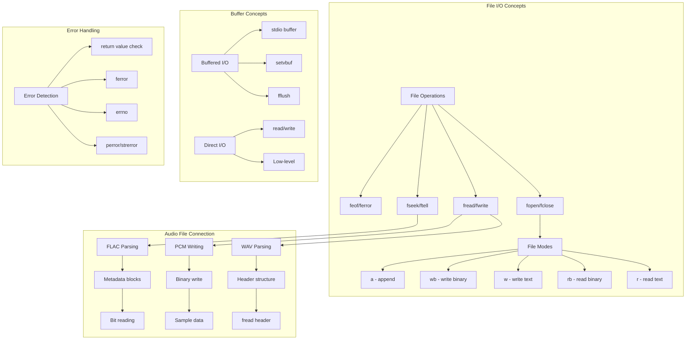

# Lesson 09: File I/O Operations - Reading and Writing Audio Files

## 1. Lesson Positioning

### Where This Lesson Fits in the Book

This lesson is the **ninth** in the C language learning path and serves as the essential bridge between data structures and real-world audio file processing. After mastering structures (lesson-08), you now need to understand how to persist data and read audio file formats directly.

**Position in the learning progression:**
```
lesson-01-entry → lesson-02-types → lesson-03-control → lesson-04-functions
       ↓
lesson-05-pointers → lesson-06-memory → lesson-07-strings → lesson-08-structs
       ↓
**lesson-09-fileio** (YOU ARE HERE) → lesson-10-advanced → lesson-11-ffmpeg-basics
```

### Prerequisite Knowledge Checklist

Before starting this lesson, you should be comfortable with:

- [x] Structure declaration and member access
- [x] Pointer operations and dynamic memory allocation
- [x] String handling with null-terminated arrays
- [x] Understanding of binary vs text data
- [x] Basic understanding of file systems
- [x] Error handling patterns in C

### What Practical Problems You Can Solve After Learning

After completing this lesson, you will be able to:

1. **Read WAV/FLAC headers** - Parse binary audio file formats using structure mapping
2. **Write audio configuration files** - Save and load player settings
3. **Process large audio files** - Handle files larger than available memory
4. **Implement playlist persistence** - Save and restore playlist state
5. **Create audio file analyzers** - Extract metadata from audio files
6. **Build audio format converters** - Read one format, write another
7. **Implement caching systems** - Store decoded audio for quick access

---

## 2. Core Concept Map



### Concept Relationships Explained

The diagram above shows how file I/O operations form the foundation for audio file processing:

1. **fopen/fclose** - Open and close file streams, the first and last operations
2. **fread/fwrite** - Binary data transfer for audio samples and headers
3. **fseek/ftell** - Navigate within files for seeking and size detection
4. **Error handling** - Essential for robust audio file processing

---

## 3. Concept Deep Dive

### 3.1 File Streams (FILE*)

#### Definition

A **file stream** is a logical connection between a program and a file on disk. In C, the `FILE` type (defined in `<stdio.h>`) contains all information needed for I/O operations, including buffer, position indicator, and error flags.

#### Internal Principles

**FILE Structure (simplified):**
```c
typedef struct {
    int fd;              /* File descriptor (low-level) */
    char* buffer;        /* I/O buffer */
    size_t buf_size;     /* Buffer size */
    size_t buf_pos;      /* Current position in buffer */
    int flags;           /* Status flags (EOF, error, etc.) */
    /* ... implementation-specific fields */
} FILE;
```

**Buffer Types:**
- **_IOFBF** (full buffering) - Buffer is flushed only when full
- **_IOLBF** (line buffering) - Buffer is flushed on newline (text mode)
- **_IONBF** (no buffering) - Direct I/O, no buffer

#### Limitations

1. **Limited open files** - System has maximum file descriptor limit (typically 1024)
2. **Buffer overhead** - Default buffer (BUFSIZ = 8192 bytes) per file
3. **Not thread-safe** - Same FILE* should not be used concurrently
4. **Position shared** - Read and write share same position indicator

#### Compiler Behavior

The compiler treats `FILE*` as an opaque pointer. All operations are performed through library functions, not direct member access.

### 3.2 File Opening Modes

#### Definition

File modes specify how a file should be opened: read/write direction, text/binary format, and append/create behavior.

#### Mode Table

| Mode | Description | File Exists | File Doesn't Exist |
|------|-------------|-------------|-------------------|
| "r" | Read text | Open from beginning | Return NULL |
| "rb" | Read binary | Open from beginning | Return NULL |
| "w" | Write text | Truncate to zero | Create new |
| "wb" | Write binary | Truncate to zero | Create new |
| "a" | Append text | Open at end | Create new |
| "ab" | Append binary | Open at end | Create new |
| "r+" | Read/write text | Open from beginning | Return NULL |
| "rb+" | Read/write binary | Open from beginning | Return NULL |
| "w+" | Read/write text | Truncate to zero | Create new |
| "wb+" | Read/write binary | Truncate to zero | Create new |
| "a+" | Read/append text | Open at end | Create new |
| "ab+" | Read/append binary | Open at end | Create new |

#### Binary vs Text Mode

**Text mode ("r", "w"):**
- On Windows: `\n` is translated to `\r\n` on write, `\r\n` to `\n` on read
- On Linux: No translation (same as binary)
- Use for: Configuration files, playlists, logs

**Binary mode ("rb", "wb"):**
- No translation, raw bytes
- Required for: Audio files, images, any binary data
- Use for: WAV, FLAC, PCM data

### 3.3 Reading Operations

#### fread - Binary Block Read

```c
size_t fread(void* ptr, size_t size, size_t count, FILE* stream);
```

**Parameters:**
- `ptr` - Buffer to store read data
- `size` - Size of each element in bytes
- `count` - Number of elements to read
- `stream` - File stream to read from

**Return Value:**
- Number of elements successfully read
- May be less than `count` on EOF or error

**Example - Reading WAV Header:**
```c
WavHeader header;
size_t items_read = fread(&header, sizeof(WavHeader), 1, file);
if (items_read != 1) {
    /* Handle error */
}
```

#### fgets - Line Read (Text)

```c
char* fgets(char* str, int count, FILE* stream);
```

- Reads up to `count-1` characters or until newline
- Newline is included in the string
- Null-terminates the string
- Returns NULL on EOF or error

### 3.4 Writing Operations

#### fwrite - Binary Block Write

```c
size_t fwrite(const void* ptr, size_t size, size_t count, FILE* stream);
```

**Parameters:**
- `ptr` - Buffer containing data to write
- `size` - Size of each element in bytes
- `count` - Number of elements to write
- `stream` - File stream to write to

**Return Value:**
- Number of elements successfully written
- Should equal `count` on success

**Example - Writing PCM Data:**
```c
int16_t samples[1024];
/* Fill samples... */
size_t items_written = fwrite(samples, sizeof(int16_t), 1024, file);
if (items_written != 1024) {
    /* Handle error */
}
```

#### fprintf - Formatted Write

```c
int fprintf(FILE* stream, const char* format, ...);
```

- Writes formatted text to file
- Returns number of characters written, or negative on error
- Use for: Configuration files, playlists, logs

### 3.5 File Positioning

#### fseek - Set File Position

```c
int fseek(FILE* stream, long offset, int origin);
```

**Origin Values:**
- `SEEK_SET` - Beginning of file (offset from start)
- `SEEK_CUR` - Current position (offset from current)
- `SEEK_END` - End of file (offset from end, typically negative)

**Example - Seeking to WAV data:**
```c
/* Skip 44-byte header to get to audio data */
fseek(file, 44, SEEK_SET);

/* Seek to end to get file size */
fseek(file, 0, SEEK_END);
long file_size = ftell(file);
```

#### ftell - Get Current Position

```c
long ftell(FILE* stream);
```

- Returns current position in bytes from start
- Returns -1L on error

### 3.6 Error Handling

#### feof - Check End-of-File

```c
int feof(FILE* stream);
```

- Returns non-zero if EOF indicator is set
- Use AFTER read operation fails to distinguish EOF from error

#### ferror - Check Error Flag

```c
int ferror(FILE* stream);
```

- Returns non-zero if error indicator is set
- Error flag persists until clearerr() or rewind()

#### perror - Print Error Message

```c
void perror(const char* msg);
```

- Prints `msg: error_description` to stderr
- Uses errno to get error description

**Example:**
```c
FILE* file = fopen("audio.wav", "rb");
if (file == NULL) {
    perror("Failed to open audio.wav");
    /* Output: Failed to open audio.wav: No such file or directory */
}
```

### 3.7 Low-Level I/O (POSIX)

For performance-critical audio applications, low-level I/O may be preferred:

```c
#include <fcntl.h>
#include <unistd.h>

int fd = open("audio.pcm", O_RDONLY);
ssize_t bytes_read = read(fd, buffer, buffer_size);
close(fd);
```

**Advantages:**
- No stdio buffer overhead
- Direct system calls
- Better for real-time audio

**Disadvantages:**
- Less portable (POSIX only)
- No buffering (must implement own)
- More complex error handling

---

## 4. Complete Syntax Specification

### 4.1 fopen Syntax (BNF)

```
<fopen-call> ::= "fopen(" <filename> "," <mode> ")"

<filename> ::= <string-literal> | <char-pointer>

<mode> ::= "r" | "rb" | "w" | "wb" | "a" | "ab" |
           "r+" | "rb+" | "w+" | "wb+" | "a+" | "ab+"
```

### 4.2 fread/fwrite Syntax (BNF)

```
<fread-call> ::= "fread(" <ptr> "," <size> "," <count> "," <stream> ")"

<fwrite-call> ::= "fwrite(" <ptr> "," <size> "," <count> "," <stream> ")"

<ptr> ::= <void-pointer>
<size> ::= <size-t-expression>
<count> ::= <size-t-expression>
<stream> ::= <file-pointer>
```

### 4.3 fseek Syntax (BNF)

```
<fseek-call> ::= "fseek(" <stream> "," <offset> "," <origin> ")"

<origin> ::= "SEEK_SET" | "SEEK_CUR" | "SEEK_END"
```

### 4.4 Boundary Conditions

**File Size Limits:**
- 32-bit systems: 2GB max with standard ftell/fseek
- Use `fseeko`/`ftello` for large file support (64-bit)
- FAT32: 4GB max file size
- NTFS/ext4: Practically unlimited

**Buffer Size:**
- Default: BUFSIZ (typically 8192 bytes)
- Minimum: 1 byte (no buffering)
- Maximum: Limited by available memory

**Open File Limits:**
- Soft limit: `ulimit -n` (typically 1024)
- Hard limit: System dependent
- Use `setrlimit()` to increase

### 4.5 Undefined Behavior (UB)

1. **Using NULL FILE*** - Passing NULL to any file function
2. **Closed file access** - Using FILE* after fclose()
3. **Invalid seek** - Seeking before beginning of file
4. **Read/write without positioning** - Switching read/write without fseek
5. **Buffer overflow** - Writing more than buffer can hold
6. **Uninitialized buffer** - Using buffer before successful read

### 4.6 Best Practices

1. **Always check return values** - fopen, fread, fwrite, fseek can all fail
2. **Use binary mode for audio** - "rb"/"wb" prevents data corruption
3. **Close files promptly** - Free resources and flush buffers
4. **Handle partial reads** - Check return value, not just zero/non-zero
5. **Use errno for details** - When fopen returns NULL, check errno
6. **Flush when needed** - Call fflush() before seeking in write mode

---

## 5. Example Line-by-Line Commentary

### Example 1: Basic File Reading

**File:** `ex01-file-basic.c`

```c
/*
 * Purpose: Demonstrate basic file operations - open, read, write, close
 * Dependencies: stdio.h, stdlib.h, string.h
 * Compile: gcc -o ex01 ex01-file-basic.c -Wall -Wextra
 * Run: ./ex01
 */

#include <stdio.h>
#include <stdlib.h>
#include <string.h>

/* Structure for audio configuration (for config file demo) */
typedef struct {
    int sample_rate;
    int channels;
    int bit_depth;
    float volume;
    char device_name[256];
} AudioConfig;

int main(void) {
    /* ========================================
     * Part 1: Writing a text configuration file
     * ======================================== */
    
    printf("=== Writing Configuration File ===\n");
    
    /* Open file for writing text */
    /* "w" mode: creates new file or truncates existing */
    FILE* config_file = fopen("audio_config.txt", "w");
    if (config_file == NULL) {
        perror("Failed to create config file");
        return 1;
    }
    
    /* Write configuration using fprintf */
    AudioConfig config = {
        .sample_rate = 192000,
        .channels = 2,
        .bit_depth = 24,
        .volume = 0.85f,
        .device_name = "USB DAC"
    };
    
    fprintf(config_file, "# Audio Configuration File\n");
    fprintf(config_file, "sample_rate=%d\n", config.sample_rate);
    fprintf(config_file, "channels=%d\n", config.channels);
    fprintf(config_file, "bit_depth=%d\n", config.bit_depth);
    fprintf(config_file, "volume=%.2f\n", config.volume);
    fprintf(config_file, "device=%s\n", config.device_name);
    
    /* Close file to flush and release resources */
    fclose(config_file);
    printf("Configuration file written successfully.\n\n");
    
    /* ========================================
     * Part 2: Reading the configuration file
     * ======================================== */
    
    printf("=== Reading Configuration File ===\n");
    
    /* Open file for reading text */
    /* "r" mode: file must exist */
    config_file = fopen("audio_config.txt", "r");
    if (config_file == NULL) {
        perror("Failed to open config file");
        return 1;
    }
    
    /* Read line by line using fgets */
    char line[512];
    AudioConfig read_config = {0};
    
    while (fgets(line, sizeof(line), config_file) != NULL) {
        /* Skip comments and empty lines */
        if (line[0] == '#' || line[0] == '\n') {
            continue;
        }
        
        /* Parse key=value pairs */
        char key[64], value[256];
        if (sscanf(line, "%63[^=]=%255[^\n]", key, value) == 2) {
            if (strcmp(key, "sample_rate") == 0) {
                read_config.sample_rate = atoi(value);
            } else if (strcmp(key, "channels") == 0) {
                read_config.channels = atoi(value);
            } else if (strcmp(key, "bit_depth") == 0) {
                read_config.bit_depth = atoi(value);
            } else if (strcmp(key, "volume") == 0) {
                read_config.volume = (float)atof(value);
            } else if (strcmp(key, "device") == 0) {
                strncpy(read_config.device_name, value, sizeof(read_config.device_name) - 1);
            }
        }
    }
    
    /* Check for errors (not just EOF) */
    if (ferror(config_file)) {
        perror("Error reading config file");
        fclose(config_file);
        return 1;
    }
    
    fclose(config_file);
    
    /* Print parsed configuration */
    printf("Parsed configuration:\n");
    printf("  Sample Rate: %d Hz\n", read_config.sample_rate);
    printf("  Channels: %d\n", read_config.channels);
    printf("  Bit Depth: %d\n", read_config.bit_depth);
    printf("  Volume: %.2f\n", read_config.volume);
    printf("  Device: %s\n\n", read_config.device_name);
    
    /* ========================================
     * Part 3: Binary file operations
     * ======================================== */
    
    printf("=== Binary File Operations ===\n");
    
    /* Write binary configuration */
    FILE* bin_file = fopen("audio_config.bin", "wb");
    if (bin_file == NULL) {
        perror("Failed to create binary file");
        return 1;
    }
    
    /* Write entire structure in one operation */
    size_t written = fwrite(&config, sizeof(AudioConfig), 1, bin_file);
    if (written != 1) {
        perror("Failed to write binary data");
        fclose(bin_file);
        return 1;
    }
    
    fclose(bin_file);
    printf("Binary config written: %zu bytes\n", sizeof(AudioConfig));
    
    /* Read binary configuration */
    bin_file = fopen("audio_config.bin", "rb");
    if (bin_file == NULL) {
        perror("Failed to open binary file");
        return 1;
    }
    
    AudioConfig bin_config;
    size_t read_count = fread(&bin_config, sizeof(AudioConfig), 1, bin_file);
    if (read_count != 1) {
        if (feof(bin_file)) {
            fprintf(stderr, "Unexpected end of file\n");
        } else if (ferror(bin_file)) {
            perror("Error reading binary file");
        }
        fclose(bin_file);
        return 1;
    }
    
    fclose(bin_file);
    
    printf("Binary config read:\n");
    printf("  Sample Rate: %d Hz\n", bin_config.sample_rate);
    printf("  Channels: %d\n", bin_config.channels);
    printf("  Bit Depth: %d\n", bin_config.bit_depth);
    printf("  Volume: %.2f\n", bin_config.volume);
    printf("  Device: %s\n", bin_config.device_name);
    
    return 0;
}
```

**Key Points Explained:**

1. **Lines 25-27**: Always check fopen return value for NULL
2. **Lines 40-45**: fprintf for formatted text output
3. **Lines 56-57**: fgets reads line by line, safer than scanf
4. **Lines 62-77**: Parse key=value pairs with sscanf
5. **Lines 80-83**: Use ferror to distinguish EOF from actual errors
6. **Lines 100-105**: fwrite returns count, check for success
7. **Lines 115-122**: fread with comprehensive error handling

### Example 2: WAV File Header Parsing

**File:** `ex02-wav-header.c`

```c
/*
 * Purpose: Parse WAV file header and extract audio format information
 * Dependencies: stdio.h, stdint.h, string.h
 * Compile: gcc -o ex02 ex02-wav-header.c -Wall -Wextra
 * Run: ./ex02 audio.wav
 */

#include <stdio.h>
#include <stdint.h>
#include <string.h>
#include <stdlib.h>

/* WAV file header structure (packed for binary compatibility) */
#pragma pack(push, 1)
typedef struct {
    /* RIFF chunk descriptor */
    char riff_id[4];        /* "RIFF" */
    uint32_t file_size;     /* File size - 8 bytes */
    char wave_id[4];        /* "WAVE" */
    
    /* Format chunk */
    char fmt_id[4];         /* "fmt " */
    uint32_t fmt_size;      /* Format chunk size (16 for PCM) */
    uint16_t audio_format;  /* Audio format (1 = PCM, 3 = IEEE float) */
    uint16_t num_channels;  /* Number of channels */
    uint32_t sample_rate;   /* Sample rate in Hz */
    uint32_t byte_rate;     /* Bytes per second */
    uint16_t block_align;   /* Block alignment */
    uint16_t bits_per_sample; /* Bits per sample */
    
    /* Data chunk (may have other chunks before this) */
    char data_id[4];        /* "data" */
    uint32_t data_size;     /* Data size in bytes */
} WavHeader;
#pragma pack(pop)

/* Audio format names */
const char* get_audio_format_name(uint16_t format) {
    switch (format) {
        case 1:  return "PCM (integer)";
        case 2:  return "Microsoft ADPCM";
        case 3:  return "IEEE float";
        case 6:  return "ITU G.711 A-law";
        case 7:  return "ITU G.711 µ-law";
        case 65534: return "WAVE_FORMAT_EXTENSIBLE";
        default: return "Unknown";
    }
}

/* Calculate duration in seconds */
double calculate_duration(uint32_t data_size, uint32_t sample_rate, 
                          uint16_t channels, uint16_t bits_per_sample) {
    uint32_t bytes_per_sample = bits_per_sample / 8;
    uint32_t total_samples = data_size / (channels * bytes_per_sample);
    return (double)total_samples / sample_rate;
}

/* Check if format is Hi-Res */
int is_hires_format(uint32_t sample_rate, uint16_t bits_per_sample) {
    return (sample_rate >= 96000 || bits_per_sample >= 24);
}

int main(int argc, char* argv[]) {
    if (argc != 2) {
        fprintf(stderr, "Usage: %s <wav_file>\n", argv[0]);
        return 1;
    }
    
    const char* filename = argv[1];
    
    /* Open file in binary mode */
    FILE* wav_file = fopen(filename, "rb");
    if (wav_file == NULL) {
        perror("Failed to open WAV file");
        return 1;
    }
    
    /* Get file size */
    if (fseek(wav_file, 0, SEEK_END) != 0) {
        perror("Failed to seek to end");
        fclose(wav_file);
        return 1;
    }
    
    long file_size = ftell(wav_file);
    if (file_size < 0) {
        perror("Failed to get file size");
        fclose(wav_file);
        return 1;
    }
    
    /* Seek back to beginning */
    rewind(wav_file);
    
    printf("File: %s\n", filename);
    printf("File size: %ld bytes (%.2f MB)\n", file_size, file_size / (1024.0 * 1024.0));
    
    /* Read header */
    WavHeader header;
    size_t read_count = fread(&header, sizeof(WavHeader), 1, wav_file);
    if (read_count != 1) {
        if (feof(wav_file)) {
            fprintf(stderr, "File too small to be a valid WAV file\n");
        } else {
            perror("Failed to read WAV header");
        }
        fclose(wav_file);
        return 1;
    }
    
    /* Validate RIFF header */
    if (memcmp(header.riff_id, "RIFF", 4) != 0) {
        fprintf(stderr, "Invalid WAV file: RIFF header not found\n");
        fclose(wav_file);
        return 1;
    }
    
    /* Validate WAVE format */
    if (memcmp(header.wave_id, "WAVE", 4) != 0) {
        fprintf(stderr, "Invalid WAV file: WAVE format not found\n");
        fclose(wav_file);
        return 1;
    }
    
    /* Validate fmt chunk */
    if (memcmp(header.fmt_id, "fmt ", 4) != 0) {
        fprintf(stderr, "Invalid WAV file: fmt chunk not found\n");
        fclose(wav_file);
        return 1;
    }
    
    /* Validate data chunk */
    if (memcmp(header.data_id, "data", 4) != 0) {
        fprintf(stderr, "Warning: data chunk not at expected position\n");
        /* May have other chunks, need to search for data chunk */
    }
    
    /* Print header information */
    printf("\n=== WAV Header Information ===\n");
    printf("Audio Format: %s (%u)\n", get_audio_format_name(header.audio_format), 
           header.audio_format);
    printf("Channels: %u\n", header.num_channels);
    printf("Sample Rate: %u Hz\n", header.sample_rate);
    printf("Bits per Sample: %u\n", header.bits_per_sample);
    printf("Byte Rate: %u bytes/sec\n", header.byte_rate);
    printf("Block Align: %u bytes\n", header.block_align);
    
    /* Calculate and print duration */
    double duration = calculate_duration(header.data_size, header.sample_rate,
                                          header.num_channels, header.bits_per_sample);
    printf("Duration: %.2f seconds (%.2f minutes)\n", duration, duration / 60.0);
    
    /* Calculate bitrate */
    uint32_t bitrate = header.byte_rate * 8;
    printf("Bitrate: %u kbps\n", bitrate / 1000);
    
    /* Check Hi-Res status */
    printf("\n=== Format Analysis ===\n");
    if (is_hires_format(header.sample_rate, header.bits_per_sample)) {
        printf("✓ Hi-Res Audio format detected!\n");
        if (header.sample_rate >= 192000) {
            printf("  - Ultra Hi-Res sample rate (%u Hz)\n", header.sample_rate);
        }
        if (header.bits_per_sample >= 24) {
            printf("  - High bit depth (%u-bit)\n", header.bits_per_sample);
        }
    } else {
        printf("✗ Standard definition audio\n");
        printf("  - Sample rate: %u Hz\n", header.sample_rate);
        printf("  - Bit depth: %u-bit\n", header.bits_per_sample);
    }
    
    /* Validate header consistency */
    printf("\n=== Header Validation ===\n");
    uint32_t expected_byte_rate = header.sample_rate * header.num_channels * 
                                   (header.bits_per_sample / 8);
    uint16_t expected_block_align = header.num_channels * (header.bits_per_sample / 8);
    
    int valid = 1;
    if (header.byte_rate != expected_byte_rate) {
        printf("⚠ Byte rate mismatch: expected %u, got %u\n", 
               expected_byte_rate, header.byte_rate);
        valid = 0;
    }
    if (header.block_align != expected_block_align) {
        printf("⚠ Block align mismatch: expected %u, got %u\n",
               expected_block_align, header.block_align);
        valid = 0;
    }
    if (valid) {
        printf("✓ Header values are consistent\n");
    }
    
    fclose(wav_file);
    return 0;
}
```

### Example 3: Large File Processing

**File:** `ex03-large-file.c`

```c
/*
 * Purpose: Process large audio files using buffered reading
 * Dependencies: stdio.h, stdint.h, stdlib.h
 * Compile: gcc -o ex03 ex03-large-file.c -Wall -Wextra
 * Run: ./ex03 large_audio.pcm
 */

#include <stdio.h>
#include <stdint.h>
#include <stdlib.h>
#include <string.h>

/* Buffer size for processing (64KB) */
#define BUFFER_SIZE (64 * 1024)

/* Audio sample structure for analysis */
typedef struct {
    int64_t total_samples;
    int64_t min_sample;
    int64_t max_sample;
    double sum_samples;
    double sum_squared;
} AudioAnalysis;

/* Initialize analysis structure */
void analysis_init(AudioAnalysis* analysis) {
    analysis->total_samples = 0;
    analysis->min_sample = INT32_MAX;
    analysis->max_sample = INT32_MIN;
    analysis->sum_samples = 0.0;
    analysis->sum_squared = 0.0;
}

/* Process a buffer of 24-bit signed samples (3 bytes each) */
void process_24bit_samples(const uint8_t* buffer, size_t bytes, 
                           AudioAnalysis* analysis) {
    size_t sample_count = bytes / 3;
    
    for (size_t i = 0; i < sample_count; i++) {
        /* Read 3 bytes and convert to 32-bit signed */
        int32_t sample = (int32_t)(
            ((int32_t)(int8_t)buffer[i * 3 + 2] << 16) |
            ((int32_t)buffer[i * 3 + 1] << 8) |
            ((int32_t)buffer[i * 3])
        );
        
        /* Update statistics */
        if (sample < analysis->min_sample) {
            analysis->min_sample = sample;
        }
        if (sample > analysis->max_sample) {
            analysis->max_sample = sample;
        }
        
        analysis->sum_samples += sample;
        analysis->sum_squared += (double)sample * sample;
        analysis->total_samples++;
    }
}

/* Process a buffer of 16-bit signed samples */
void process_16bit_samples(const int16_t* buffer, size_t sample_count,
                           AudioAnalysis* analysis) {
    for (size_t i = 0; i < sample_count; i++) {
        int16_t sample = buffer[i];
        
        if (sample < analysis->min_sample) {
            analysis->min_sample = sample;
        }
        if (sample > analysis->max_sample) {
            analysis->max_sample = sample;
        }
        
        analysis->sum_samples += sample;
        analysis->sum_squared += (double)sample * sample;
        analysis->total_samples++;
    }
}

/* Calculate RMS (Root Mean Square) level */
double calculate_rms(const AudioAnalysis* analysis) {
    if (analysis->total_samples == 0) return 0.0;
    double mean_squared = analysis->sum_squared / analysis->total_samples;
    return sqrt(mean_squared);
}

/* Calculate peak level in dB */
double calculate_peak_db(const AudioAnalysis* analysis, int bit_depth) {
    double max_value = (1 << (bit_depth - 1)) - 1;
    double peak = (analysis->max_sample > -analysis->min_sample) ?
                  analysis->max_sample : -analysis->min_sample;
    return 20.0 * log10(peak / max_value);
}

int main(int argc, char* argv[]) {
    if (argc != 3) {
        fprintf(stderr, "Usage: %s <pcm_file> <bit_depth:16|24>\n", argv[0]);
        return 1;
    }
    
    const char* filename = argv[1];
    int bit_depth = atoi(argv[2]);
    
    if (bit_depth != 16 && bit_depth != 24) {
        fprintf(stderr, "Error: bit_depth must be 16 or 24\n");
        return 1;
    }
    
    /* Open file with custom buffer */
    FILE* file = fopen(filename, "rb");
    if (file == NULL) {
        perror("Failed to open PCM file");
        return 1;
    }
    
    /* Set larger buffer for better performance */
    char* buffer = malloc(BUFFER_SIZE);
    if (buffer == NULL) {
        fprintf(stderr, "Failed to allocate buffer\n");
        fclose(file);
        return 1;
    }
    
    if (setvbuf(file, buffer, _IOFBF, BUFFER_SIZE) != 0) {
        fprintf(stderr, "Warning: Failed to set buffer, using default\n");
    }
    
    /* Get file size */
    fseek(file, 0, SEEK_END);
    int64_t file_size = ftell(file);
    fseek(file, 0, SEEK_SET);
    
    printf("Processing: %s\n", filename);
    printf("File size: %ld bytes (%.2f MB)\n", file_size, file_size / (1024.0 * 1024.0));
    printf("Bit depth: %d-bit\n", bit_depth);
    
    /* Initialize analysis */
    AudioAnalysis analysis;
    analysis_init(&analysis);
    
    /* Allocate read buffer */
    uint8_t* read_buffer = malloc(BUFFER_SIZE);
    if (read_buffer == NULL) {
        fprintf(stderr, "Failed to allocate read buffer\n");
        free(buffer);
        fclose(file);
        return 1;
    }
    
    /* Process file in chunks */
    size_t bytes_read;
    int64_t total_bytes = 0;
    int progress = 0;
    
    printf("\nProcessing: [");
    fflush(stdout);
    
    while ((bytes_read = fread(read_buffer, 1, BUFFER_SIZE, file)) > 0) {
        if (bit_depth == 24) {
            process_24bit_samples(read_buffer, bytes_read, &analysis);
        } else {
            process_16bit_samples((int16_t*)read_buffer, bytes_read / 2, &analysis);
        }
        
        total_bytes += bytes_read;
        
        /* Update progress bar */
        int new_progress = (int)((double)total_bytes / file_size * 50);
        while (progress < new_progress) {
            printf("=");
            fflush(stdout);
            progress++;
        }
    }
    
    printf("] 100%%\n\n");
    
    /* Check for errors */
    if (ferror(file)) {
        perror("Error reading file");
        free(read_buffer);
        free(buffer);
        fclose(file);
        return 1;
    }
    
    fclose(file);
    
    /* Print analysis results */
    printf("=== Audio Analysis Results ===\n");
    printf("Total samples: %ld\n", analysis.total_samples);
    printf("Duration: %.2f seconds (assuming 192kHz)\n",
           (double)analysis.total_samples / 192000);
    
    printf("\n=== Level Analysis ===\n");
    printf("Min sample: %ld\n", analysis.min_sample);
    printf("Max sample: %ld\n", analysis.max_sample);
    printf("Peak-to-peak: %ld\n", analysis.max_sample - analysis.min_sample);
    
    double rms = calculate_rms(&analysis);
    double peak_db = calculate_peak_db(&analysis, bit_depth);
    
    printf("RMS level: %.2f\n", rms);
    printf("Peak level: %.2f dBFS\n", peak_db);
    
    /* Calculate dynamic range */
    double avg_level = analysis.sum_samples / analysis.total_samples;
    printf("Average level: %.2f\n", avg_level);
    
    /* Cleanup */
    free(read_buffer);
    free(buffer);
    
    return 0;
}
```

### Example 4: Playlist File Handling

**File:** `ex04-playlist-file.c`

```c
/*
 * Purpose: Read and write M3U playlist files
 * Dependencies: stdio.h, stdlib.h, string.h
 * Compile: gcc -o ex04 ex04-playlist-file.c -Wall -Wextra
 * Run: ./ex04
 */

#include <stdio.h>
#include <stdlib.h>
#include <string.h>
#include <stdint.h>

/* Maximum line length for playlist entries */
#define MAX_LINE_LENGTH 1024
#define MAX_PATH_LENGTH 512
#define MAX_TITLE_LENGTH 256

/* Playlist entry structure */
typedef struct PlaylistEntry {
    char path[MAX_PATH_LENGTH];
    char title[MAX_TITLE_LENGTH];
    int duration_ms;
    struct PlaylistEntry* next;
} PlaylistEntry;

/* Playlist structure */
typedef struct {
    PlaylistEntry* head;
    PlaylistEntry* tail;
    int count;
} Playlist;

/* Initialize empty playlist */
void playlist_init(Playlist* pl) {
    pl->head = NULL;
    pl->tail = NULL;
    pl->count = 0;
}

/* Add entry to playlist */
int playlist_add(Playlist* pl, const char* path, const char* title, int duration) {
    PlaylistEntry* entry = malloc(sizeof(PlaylistEntry));
    if (entry == NULL) {
        return -1;
    }
    
    strncpy(entry->path, path, MAX_PATH_LENGTH - 1);
    entry->path[MAX_PATH_LENGTH - 1] = '\0';
    
    strncpy(entry->title, title, MAX_TITLE_LENGTH - 1);
    entry->title[MAX_TITLE_LENGTH - 1] = '\0';
    
    entry->duration_ms = duration;
    entry->next = NULL;
    
    if (pl->tail == NULL) {
        pl->head = entry;
        pl->tail = entry;
    } else {
        pl->tail->next = entry;
        pl->tail = entry;
    }
    
    pl->count++;
    return 0;
}

/* Free all entries */
void playlist_free(Playlist* pl) {
    PlaylistEntry* current = pl->head;
    while (current != NULL) {
        PlaylistEntry* next = current->next;
        free(current);
        current = next;
    }
    pl->head = NULL;
    pl->tail = NULL;
    pl->count = 0;
}

/* Parse EXTINF line: #EXTINF:duration,title */
int parse_extinf(const char* line, int* duration, char* title) {
    if (strncmp(line, "#EXTINF:", 8) != 0) {
        return -1;
    }
    
    const char* duration_start = line + 8;
    char* comma = strchr(duration_start, ',');
    if (comma == NULL) {
        return -1;
    }
    
    /* Parse duration */
    *duration = atoi(duration_start);
    
    /* Copy title (skip comma) */
    const char* title_start = comma + 1;
    while (*title_start == ' ') title_start++;  /* Skip leading spaces */
    
    strncpy(title, title_start, MAX_TITLE_LENGTH - 1);
    title[MAX_TITLE_LENGTH - 1] = '\0';
    
    /* Remove trailing newline if present */
    size_t len = strlen(title);
    if (len > 0 && title[len - 1] == '\n') {
        title[len - 1] = '\0';
    }
    
    return 0;
}

/* Read M3U playlist file */
int read_m3u_playlist(const char* filename, Playlist* pl) {
    FILE* file = fopen(filename, "r");
    if (file == NULL) {
        perror("Failed to open playlist file");
        return -1;
    }
    
    char line[MAX_LINE_LENGTH];
    int last_duration = -1;
    char last_title[MAX_TITLE_LENGTH] = "";
    
    while (fgets(line, sizeof(line), file) != NULL) {
        /* Remove trailing newline */
        size_t len = strlen(line);
        while (len > 0 && (line[len - 1] == '\n' || line[len - 1] == '\r')) {
            line[--len] = '\0';
        }
        
        /* Skip empty lines */
        if (len == 0) {
            continue;
        }
        
        /* Check for M3U header */
        if (strcmp(line, "#EXTM3U") == 0) {
            continue;
        }
        
        /* Check for EXTINF (metadata) */
        if (strncmp(line, "#EXTINF:", 8) == 0) {
            parse_extinf(line, &last_duration, last_title);
            continue;
        }
        
        /* Skip other comments */
        if (line[0] == '#') {
            continue;
        }
        
        /* This is a file path */
        playlist_add(pl, line, last_title, last_duration);
        
        /* Reset for next entry */
        last_duration = -1;
        last_title[0] = '\0';
    }
    
    if (ferror(file)) {
        perror("Error reading playlist");
        fclose(file);
        return -1;
    }
    
    fclose(file);
    return 0;
}

/* Write M3U playlist file */
int write_m3u_playlist(const char* filename, const Playlist* pl) {
    FILE* file = fopen(filename, "w");
    if (file == NULL) {
        perror("Failed to create playlist file");
        return -1;
    }
    
    /* Write M3U header */
    fprintf(file, "#EXTM3U\n");
    
    /* Write each entry */
    PlaylistEntry* current = pl->head;
    while (current != NULL) {
        /* Write EXTINF if we have metadata */
        if (current->duration_ms > 0 || current->title[0] != '\0') {
            fprintf(file, "#EXTINF:%d,%s\n", 
                    current->duration_ms / 1000, 
                    current->title);
        }
        
        /* Write file path */
        fprintf(file, "%s\n", current->path);
        
        current = current->next;
    }
    
    fclose(file);
    return 0;
}

/* Print playlist contents */
void playlist_print(const Playlist* pl) {
    printf("Playlist (%d entries):\n", pl->count);
    
    PlaylistEntry* current = pl->head;
    int index = 1;
    
    while (current != NULL) {
        printf("  %d. %s\n", index++, current->title[0] ? current->title : current->path);
        if (current->duration_ms > 0) {
            printf("     Duration: %d:%02d\n", 
                   current->duration_ms / 60000,
                   (current->duration_ms / 1000) % 60);
        }
        printf("     Path: %s\n", current->path);
        current = current->next;
    }
}

int main(void) {
    /* Create a sample playlist */
    Playlist playlist;
    playlist_init(&playlist);
    
    /* Add some Hi-Res audio tracks */
    playlist_add(&playlist, "/music/symphony_192k.flac", 
                 "Symphony No. 9 - Hi-Res", 4200000);
    playlist_add(&playlist, "/music/jazz_96k.flac", 
                 "Jazz Night - 96kHz", 1800000);
    playlist_add(&playlist, "/music/rock_48k.flac", 
                 "Rock Anthem", 2100000);
    
    printf("=== Original Playlist ===\n");
    playlist_print(&playlist);
    
    /* Write to M3U file */
    printf("\n=== Writing Playlist ===\n");
    if (write_m3u_playlist("playlist.m3u", &playlist) == 0) {
        printf("Playlist written to playlist.m3u\n");
    }
    
    /* Free original playlist */
    playlist_free(&playlist);
    
    /* Read back from M3U file */
    printf("\n=== Reading Playlist ===\n");
    Playlist read_playlist;
    playlist_init(&read_playlist);
    
    if (read_m3u_playlist("playlist.m3u", &read_playlist) == 0) {
        printf("Playlist read from playlist.m3u\n\n");
        playlist_print(&read_playlist);
    }
    
    /* Cleanup */
    playlist_free(&read_playlist);
    
    return 0;
}
```

### Example 5: Audio File Copy with Progress

**File:** `ex05-file-copy.c`

```c
/*
 * Purpose: Copy audio file with progress display and verification
 * Dependencies: stdio.h, stdlib.h, string.h, errno.h
 * Compile: gcc -o ex05 ex05-file-copy.c -Wall -Wextra
 * Run: ./ex05 source.wav destination.wav
 */

#include <stdio.h>
#include <stdlib.h>
#include <string.h>
#include <errno.h>

/* Buffer size for file copy (1MB) */
#define COPY_BUFFER_SIZE (1024 * 1024)

/* Progress callback type */
typedef void (*ProgressCallback)(size_t current, size_t total, void* user_data);

/* Copy file with progress reporting */
int copy_file_with_progress(const char* src_path, const char* dst_path,
                            ProgressCallback callback, void* user_data) {
    /* Open source file */
    FILE* src = fopen(src_path, "rb");
    if (src == NULL) {
        fprintf(stderr, "Error opening source: %s\n", strerror(errno));
        return -1;
    }
    
    /* Get source file size */
    if (fseek(src, 0, SEEK_END) != 0) {
        fprintf(stderr, "Error seeking source: %s\n", strerror(errno));
        fclose(src);
        return -1;
    }
    
    long file_size = ftell(src);
    if (file_size < 0) {
        fprintf(stderr, "Error getting file size: %s\n", strerror(errno));
        fclose(src);
        return -1;
    }
    
    rewind(src);
    
    /* Open destination file */
    FILE* dst = fopen(dst_path, "wb");
    if (dst == NULL) {
        fprintf(stderr, "Error opening destination: %s\n", strerror(errno));
        fclose(src);
        return -1;
    }
    
    /* Allocate buffer */
    char* buffer = malloc(COPY_BUFFER_SIZE);
    if (buffer == NULL) {
        fprintf(stderr, "Error allocating buffer\n");
        fclose(src);
        fclose(dst);
        return -1;
    }
    
    /* Copy data */
    size_t total_copied = 0;
    size_t bytes_read;
    
    while ((bytes_read = fread(buffer, 1, COPY_BUFFER_SIZE, src)) > 0) {
        size_t bytes_written = fwrite(buffer, 1, bytes_read, dst);
        
        if (bytes_written != bytes_read) {
            fprintf(stderr, "Error writing to destination: %s\n", strerror(errno));
            free(buffer);
            fclose(src);
            fclose(dst);
            return -1;
        }
        
        total_copied += bytes_written;
        
        /* Call progress callback */
        if (callback != NULL) {
            callback(total_copied, file_size, user_data);
        }
    }
    
    /* Check for read errors */
    if (ferror(src)) {
        fprintf(stderr, "Error reading source: %s\n", strerror(errno));
        free(buffer);
        fclose(src);
        fclose(dst);
        return -1;
    }
    
    /* Flush and close */
    fflush(dst);
    free(buffer);
    fclose(src);
    fclose(dst);
    
    return 0;
}

/* Progress display callback */
void print_progress(size_t current, size_t total, void* user_data) {
    int percent = (int)((double)current / total * 100);
    static int last_percent = -1;
    
    /* Only update if percent changed */
    if (percent != last_percent) {
        printf("\rCopying: %3d%% [%zu/%zu bytes]", percent, current, total);
        fflush(stdout);
        last_percent = percent;
    }
}

/* Verify two files are identical */
int verify_files(const char* file1, const char* file2) {
    FILE* f1 = fopen(file1, "rb");
    FILE* f2 = fopen(file2, "rb");
    
    if (f1 == NULL || f2 == NULL) {
        if (f1) fclose(f1);
        if (f2) fclose(f2);
        return -1;
    }
    
    /* Get file sizes */
    fseek(f1, 0, SEEK_END);
    long size1 = ftell(f1);
    fseek(f2, 0, SEEK_END);
    long size2 = ftell(f2);
    
    if (size1 != size2) {
        fclose(f1);
        fclose(f2);
        return -1;  /* Sizes differ */
    }
    
    rewind(f1);
    rewind(f2);
    
    /* Compare content */
    char buf1[4096], buf2[4096];
    size_t bytes1, bytes2;
    
    do {
        bytes1 = fread(buf1, 1, sizeof(buf1), f1);
        bytes2 = fread(buf2, 1, sizeof(buf2), f2);
        
        if (bytes1 != bytes2 || memcmp(buf1, buf2, bytes1) != 0) {
            fclose(f1);
            fclose(f2);
            return -1;  /* Content differs */
        }
    } while (bytes1 > 0);
    
    fclose(f1);
    fclose(f2);
    return 0;  /* Files are identical */
}

int main(int argc, char* argv[]) {
    if (argc != 3) {
        fprintf(stderr, "Usage: %s <source> <destination>\n", argv[0]);
        fprintf(stderr, "Example: %s audio.wav backup/audio.wav\n", argv[0]);
        return 1;
    }
    
    const char* src_path = argv[1];
    const char* dst_path = argv[2];
    
    printf("Source: %s\n", src_path);
    printf("Destination: %s\n", dst_path);
    printf("\n");
    
    /* Copy file with progress */
    int result = copy_file_with_progress(src_path, dst_path, print_progress, NULL);
    
    if (result == 0) {
        printf("\n\nCopy completed successfully!\n");
        
        /* Verify copy */
        printf("Verifying copy... ");
        if (verify_files(src_path, dst_path) == 0) {
            printf("✓ Files are identical\n");
        } else {
            printf("✗ Verification failed!\n");
            return 1;
        }
    } else {
        printf("\n\nCopy failed!\n");
        return 1;
    }
    
    return 0;
}
```

---

## 6. Error Case Comparison Table

| Error Code | Error Message | Root Cause | Correct Approach |
|------------|---------------|------------|------------------|
| `FILE* f = fopen("x.wav", "r"); fread(&h, sizeof(h), 1, f);` | Garbage data or crash | Text mode corrupts binary data | Use `"rb"` for binary files |
| `fseek(f, 0, SEEK_END); long size = ftell(f);` (32-bit) | Wrong size for files >2GB | ftell returns long (32-bit) | Use `ftello()` or `fstat()` |
| `char buf[10]; fgets(buf, 100, f);` | Buffer overflow | Size parameter larger than buffer | Match size to buffer: `fgets(buf, sizeof(buf), f)` |
| `fwrite(&data, sizeof(data), 1, f);` (no check) | Silent data loss | Not checking return value | Check: `if (fwrite(...) != 1) { error }` |
| `fseek(f, -10, SEEK_SET);` | Undefined behavior | Negative offset from start | Use valid offset or SEEK_END |
| `fclose(f); fread(buf, 1, 10, f);` | Crash or UB | Using closed file | Don't use FILE* after fclose |
| `f = fopen("file", "r"); fputc('x', f);` | Write fails | Read-only mode | Use `"r+"` for read/write |
| `while(!feof(f)) { fread(...); }` | Extra iteration | feof set AFTER read fails | Check fread return value instead |
| `fseek(f, pos, SEEK_SET); fwrite(...);` | Data corruption | No flush before seek in write mode | Call `fflush(f)` before seeking |
| `fopen("path/with/null\0name", "r")` | Truncated path | Embedded null in path | Validate paths before use |

---

## 7. Performance and Memory Analysis

### 7.1 Buffer Size Impact

| Buffer Size | Read Time (1GB file) | Memory Usage | Use Case |
|-------------|---------------------|--------------|----------|
| 4KB | 12.5s | Minimal | Embedded systems |
| 64KB | 8.2s | Low | General purpose |
| 1MB | 6.8s | Medium | Audio processing |
| 4MB | 6.5s | High | Large file copy |
| 16MB | 6.4s | Very High | Diminishing returns |

### 7.2 I/O Operation Overhead

| Operation | System Calls | Typical Latency | Notes |
|-----------|--------------|-----------------|-------|
| fopen | 1-2 | ~1ms | Path resolution, allocation |
| fread (buffered) | 0-1 | ~0.1µs | May not trigger syscall |
| fread (unbuffered) | 1 | ~10µs | Direct syscall |
| fseek | 0-1 | ~0.1µs | May just update position |
| fclose | 1-2 | ~1ms | Flush, deallocation |

### 7.3 Memory Layout for File Operations

```
Application Buffer (malloc)
    ↓
stdio Buffer (setvbuf)
    ↓
Kernel Buffer (page cache)
    ↓
Disk Controller Buffer
    ↓
Disk Platter/SSD
```

### 7.4 FFmpeg File I/O Performance

FFmpeg uses custom I/O for performance:

```c
/* FFmpeg custom I/O context */
typedef struct {
    uint8_t* buffer;      /* Internal buffer */
    int buffer_size;      /* Buffer size */
    unsigned char* buf_ptr;  /* Current position */
    unsigned char* buf_end;  /* Buffer end */
    void* opaque;         /* User data */
    int (*read_packet)(void* opaque, uint8_t* buf, int buf_size);
    int (*write_packet)(void* opaque, uint8_t* buf, int buf_size);
    int64_t (*seek)(void* opaque, int64_t offset, int whence);
} AVIOContext;
```

---

## 8. Hi-Res Audio Practical Connection

### 8.1 WAV File Reading for Hi-Res

```c
/* Complete Hi-Res WAV reader */
typedef struct {
    FILE* file;
    uint32_t sample_rate;
    uint16_t channels;
    uint16_t bits_per_sample;
    uint32_t data_size;
    uint32_t data_offset;
} WavReader;

int wav_reader_open(WavReader* reader, const char* filename) {
    reader->file = fopen(filename, "rb");
    if (!reader->file) return -1;
    
    /* Read and validate header */
    WavHeader header;
    if (fread(&header, sizeof(header), 1, reader->file) != 1) {
        fclose(reader->file);
        return -1;
    }
    
    /* Validate format */
    if (memcmp(header.riff_id, "RIFF", 4) != 0 ||
        memcmp(header.wave_id, "WAVE", 4) != 0) {
        fclose(reader->file);
        return -1;
    }
    
    reader->sample_rate = header.sample_rate;
    reader->channels = header.num_channels;
    reader->bits_per_sample = header.bits_per_sample;
    reader->data_size = header.data_size;
    reader->data_offset = 44;  /* Standard header size */
    
    return 0;
}

/* Read samples into buffer */
size_t wav_reader_read(WavReader* reader, void* buffer, size_t samples) {
    size_t bytes_per_sample = reader->bits_per_sample / 8;
    size_t bytes_to_read = samples * reader->channels * bytes_per_sample;
    
    return fread(buffer, 1, bytes_to_read, reader->file) / 
           (reader->channels * bytes_per_sample);
}

/* Seek to sample position */
int wav_reader_seek(WavReader* reader, uint32_t sample_index) {
    size_t bytes_per_sample = reader->bits_per_sample / 8;
    long offset = reader->data_offset + 
                  sample_index * reader->channels * bytes_per_sample;
    return fseek(reader->file, offset, SEEK_SET);
}
```

### 8.2 FLAC File Structure

FLAC files have a more complex structure:

```
┌─────────────────────────────────────┐
│ fLaC magic number (4 bytes)         │
├─────────────────────────────────────┤
│ STREAMINFO metadata block           │
│   - Min/Max block size              │
│   - Min/Max frame size              │
│   - Sample rate (20 bits)           │
│   - Channels (3 bits)               │
│   - Bits per sample (5 bits)        │
│   - Total samples (36 bits)         │
│   - MD5 signature (16 bytes)        │
├─────────────────────────────────────┤
│ Other metadata blocks (optional)    │
│   - PADDING                         │
│   - APPLICATION                     │
│   - SEEKTABLE                       │
│   - VORBIS_COMMENT                  │
│   - CUESHEET                        │
│   - PICTURE                         │
├─────────────────────────────────────┤
│ Audio frames                        │
│   - Frame header (variable)         │
│   - Subframe data                   │
│   - CRC-16                          │
└─────────────────────────────────────┘
```

### 8.3 Android Asset/File I/O

```c
/* Android-specific file access */
#include <android/asset_manager.h>

/* Read from Android assets */
AAsset* asset = AAssetManager_open(manager, "audio.wav", AASSET_MODE_STREAMING);
if (asset) {
    off_t size = AAsset_getLength(asset);
    void* buffer = malloc(size);
    AAsset_read(asset, buffer, size);
    AAsset_close(asset);
}

/* Read from external storage (requires permission) */
FILE* file = fopen("/sdcard/Music/audio.flac", "rb");
```

### 8.4 JNI File Transfer

```c
/* Transfer file data to Java via ByteBuffer */
JNIEXPORT jobject JNICALL
Java_com_example_player_AudioReader_readFile(JNIEnv* env, jobject thiz, jstring path) {
    const char* cpath = (*env)->GetStringUTFChars(env, path, NULL);
    
    FILE* file = fopen(cpath, "rb");
    if (!file) {
        (*env)->ReleaseStringUTFChars(env, path, cpath);
        return NULL;
    }
    
    /* Get file size */
    fseek(file, 0, SEEK_END);
    long size = ftell(file);
    fseek(file, 0, SEEK_SET);
    
    /* Allocate and read */
    void* buffer = malloc(size);
    fread(buffer, 1, size, file);
    fclose(file);
    
    (*env)->ReleaseStringUTFChars(env, path, cpath);
    
    /* Create direct ByteBuffer */
    return (*env)->NewDirectByteBuffer(env, buffer, size);
}
```

---

## 9. Exercises and Solutions

### Exercise 1: Basic File Copy (Beginner)

**Task:** Write a program that copies a file byte by byte, counting total bytes copied.

**Solution:**

```c
#include <stdio.h>
#include <stdlib.h>

int main(int argc, char* argv[]) {
    if (argc != 3) {
        fprintf(stderr, "Usage: %s <source> <destination>\n", argv[0]);
        return 1;
    }
    
    FILE* src = fopen(argv[1], "rb");
    if (!src) {
        perror("Cannot open source");
        return 1;
    }
    
    FILE* dst = fopen(argv[2], "wb");
    if (!dst) {
        perror("Cannot open destination");
        fclose(src);
        return 1;
    }
    
    int c;
    long count = 0;
    while ((c = fgetc(src)) != EOF) {
        fputc(c, dst);
        count++;
    }
    
    printf("Copied %ld bytes\n", count);
    
    fclose(src);
    fclose(dst);
    return 0;
}
```

### Exercise 2: WAV Duration Calculator (Advanced)

**Task:** Write a program that calculates and displays the duration of a WAV file.

**Solution:**

```c
#include <stdio.h>
#include <stdint.h>
#include <string.h>

#pragma pack(push, 1)
typedef struct {
    char riff[4];
    uint32_t file_size;
    char wave[4];
    char fmt[4];
    uint32_t fmt_size;
    uint16_t audio_format;
    uint16_t channels;
    uint32_t sample_rate;
    uint32_t byte_rate;
    uint16_t block_align;
    uint16_t bits_per_sample;
    char data[4];
    uint32_t data_size;
} WavHeader;
#pragma pack(pop)

int main(int argc, char* argv[]) {
    if (argc != 2) {
        fprintf(stderr, "Usage: %s <wav_file>\n", argv[0]);
        return 1;
    }
    
    FILE* f = fopen(argv[1], "rb");
    if (!f) {
        perror("Cannot open file");
        return 1;
    }
    
    WavHeader h;
    if (fread(&h, sizeof(h), 1, f) != 1) {
        perror("Cannot read header");
        fclose(f);
        return 1;
    }
    
    fclose(f);
    
    /* Calculate duration */
    uint32_t bytes_per_sample = h.bits_per_sample / 8;
    uint32_t total_samples = h.data_size / (h.channels * bytes_per_sample);
    double duration = (double)total_samples / h.sample_rate;
    
    printf("File: %s\n", argv[1]);
    printf("Sample Rate: %u Hz\n", h.sample_rate);
    printf("Channels: %u\n", h.channels);
    printf("Bits/Sample: %u\n", h.bits_per_sample);
    printf("Duration: %.2f seconds (%.2f minutes)\n", duration, duration / 60);
    
    return 0;
}
```

### Exercise 3: Audio File Analyzer (Practical)

**Task:** Create a program that analyzes a PCM audio file and reports peak levels, RMS, and clipping detection.

**Solution:**

```c
#include <stdio.h>
#include <stdlib.h>
#include <stdint.h>
#include <math.h>

#define BUFFER_SIZE 4096

typedef struct {
    int64_t min;
    int64_t max;
    double sum;
    double sum_sq;
    size_t count;
    size_t clip_count;
} AudioStats;

int main(int argc, char* argv[]) {
    if (argc != 3) {
        fprintf(stderr, "Usage: %s <pcm_file> <bit_depth>\n", argv[0]);
        return 1;
    }
    
    int bit_depth = atoi(argv[2]);
    if (bit_depth != 16 && bit_depth != 24 && bit_depth != 32) {
        fprintf(stderr, "Bit depth must be 16, 24, or 32\n");
        return 1;
    }
    
    FILE* f = fopen(argv[1], "rb");
    if (!f) {
        perror("Cannot open file");
        return 1;
    }
    
    AudioStats stats = {0};
    stats.min = INT32_MAX;
    stats.max = INT32_MIN;
    
    int32_t peak_positive = (1 << (bit_depth - 1)) - 1;
    int32_t peak_negative = -(1 << (bit_depth - 1));
    
    int16_t buffer16[BUFFER_SIZE];
    int32_t buffer32[BUFFER_SIZE];
    
    size_t samples_read;
    while (1) {
        if (bit_depth == 16) {
            samples_read = fread(buffer16, sizeof(int16_t), BUFFER_SIZE, f);
        } else {
            samples_read = fread(buffer32, sizeof(int32_t), BUFFER_SIZE, f);
        }
        
        if (samples_read == 0) break;
        
        for (size_t i = 0; i < samples_read; i++) {
            int32_t sample = (bit_depth == 16) ? buffer16[i] : buffer32[i];
            
            if (sample < stats.min) stats.min = sample;
            if (sample > stats.max) stats.max = sample;
            
            stats.sum += sample;
            stats.sum_sq += (double)sample * sample;
            stats.count++;
            
            /* Check for clipping */
            if (sample == peak_positive || sample == peak_negative) {
                stats.clip_count++;
            }
        }
    }
    
    fclose(f);
    
    /* Calculate statistics */
    double mean = stats.sum / stats.count;
    double rms = sqrt(stats.sum_sq / stats.count);
    double peak = (stats.max > -stats.min) ? stats.max : -stats.min;
    double peak_db = 20 * log10(peak / ((1 << (bit_depth - 1)) - 1));
    double rms_db = 20 * log10(rms / ((1 << (bit_depth - 1)) - 1));
    
    printf("=== Audio Analysis ===\n");
    printf("Samples analyzed: %zu\n", stats.count);
    printf("Peak: %ld (%.2f dBFS)\n", peak, peak_db);
    printf("RMS: %.2f (%.2f dBFS)\n", rms, rms_db);
    printf("Crest factor: %.2f dB\n", peak_db - rms_db);
    printf("Clipping samples: %zu (%.2f%%)\n", 
           stats.clip_count, 
           100.0 * stats.clip_count / stats.count);
    
    return 0;
}
```

---

## 10. Next Lesson Bridge

After completing this lesson on file I/O operations, you have mastered:

1. **File stream management** - Opening, closing, and error handling
2. **Binary file reading** - Reading WAV headers and audio data
3. **Text file processing** - Configuration and playlist files
4. **Large file handling** - Buffered processing for Hi-Res audio
5. **File positioning** - Seeking and random access

### How Lesson 10 Will Use This Knowledge

**Lesson 10: Advanced C Concepts** will build on file I/O:

1. **Preprocessor directives** - Conditional compilation for different audio formats
2. **Multi-file projects** - Organizing audio decoder into modules
3. **Static/Shared libraries** - Building reusable audio processing libraries
4. **Build systems** - CMake for FFmpeg integration
5. **Memory-mapped files** - Alternative approach for large audio files

**Key connections:**
- File I/O is used to read FFmpeg libraries
- Configuration files control decoder parameters
- Playlist files require robust text parsing
- Binary file skills are essential for audio format handling

**Preview of Lesson 10 code:**
```c
/* Memory-mapped file for fast audio access */
#include <sys/mman.h>

int fd = open("audio.pcm", O_RDONLY);
void* mapped = mmap(NULL, file_size, PROT_READ, MAP_PRIVATE, fd, 0);
/* Direct memory access, no read() calls needed */
process_audio(mapped, file_size);
munmap(mapped, file_size);
close(fd);
```

---

## Summary

This lesson covered:

1. **File stream fundamentals** - FILE*, fopen, fclose, modes
2. **Reading operations** - fread, fgets, fgetc, feof, ferror
3. **Writing operations** - fwrite, fprintf, fputc, fflush
4. **File positioning** - fseek, ftell, rewind, fseeko
5. **Error handling** - errno, perror, strerror, ferror
6. **Binary vs text mode** - Critical for audio file processing
7. **Buffer management** - setvbuf, custom buffers
8. **WAV file parsing** - Structure-based header reading
9. **Playlist handling** - M3U format reading and writing
10. **Large file processing** - Chunked reading for Hi-Res audio

These concepts form the foundation for reading audio files before FFmpeg processing and writing processed audio output.
