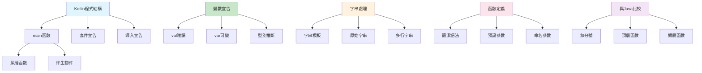

# 第一課：Hello World 與 Kotlin 環境

## 一、課程定位

### 1.1 本課在整本書的位置

本課是「C/Kotlin從入門到精通：打造Hi-Res FFmpeg音樂播放器」Kotlin部分的第一課。作為Kotlin語言的入門課，本課將帶領讀者從零開始理解Kotlin程式的基本結構、Android Studio開發環境的設置，以及Kotlin與Java的關係。

在整個學習路徑中，本課扮演著「Kotlin基石」的角色。後續所有Kotlin課程（型別系統、控制流程、協程、Android開發）都建立在本課所建立的基礎之上。理解Kotlin的程式結構和開發環境，是後續學習Android音訊開發和JNI整合的前提。

### 1.2 前置知識清單

本課假設讀者具備以下基礎知識：

1. **基本電腦操作能力**：能夠使用終端機執行命令
2. **Android Studio基本使用**：能夠創建和運行Android專案
3. **基本程式設計概念**：了解變數、函數等基本概念（有助於但非必須）
4. **C語言基礎**：已完成C語言部分的學習（推薦）

### 1.3 學完本課後能解決的實際問題

完成本課學習後，讀者將能夠：

1. **創建Kotlin程式**：使用Android Studio創建Kotlin專案
2. **理解Kotlin語法**：掌握Kotlin的基本程式結構
3. **使用Kotlin REPL**：在互動環境中測試Kotlin程式碼
4. **理解main函數**：理解Kotlin程式的入口點
5. **使用字串模板**：掌握Kotlin的字串插值功能

---

## 二、核心概念地圖



上圖展示了Kotlin程式的基本結構和核心概念。與C語言相比，Kotlin提供了更簡潔的語法和更強大的型別推斷能力。

---

## 三、概念深度解析

### 3.1 main函數（Main Function）

**定義**：`main`函數是Kotlin程式的入口點，JVM在啟動程式時會尋找並執行這個函數。

**內部原理**：

Kotlin的`main`函數與Java不同，它不需要放在類別中。Kotlin編譯器會將頂層函數（包括`main`）包裝在一個自動生成的類別中。例如：

```kotlin
// Kotlin原始碼
fun main() {
    println("Hello, World!")
}

// 編譯後的Java等效程式碼
public class MainKt {
    public static void main(String[] args) {
        System.out.println("Hello, World!");
    }
}
```

**兩種main函數形式**：

1. **無參數形式**：
```kotlin
fun main() {
    println("Hello, World!")
}
```

2. **帶參數形式**：
```kotlin
fun main(args: Array<String>) {
    println("Arguments: ${args.joinToString()}")
}
```

**限制**：
- 一個Kotlin檔案只能有一個`main`函數
- `main`函數必須是頂層函數或伴生物件中的函數
- 參數類型必須是`Array<String>`

**編譯器行為**：
- Kotlin編譯器會將頂層`main`函數編譯為`static main`方法
- 檔名會影響生成的類別名稱（如`Main.kt`生成`MainKt`類別）

**JVM視角**：
```kotlin
// Main.kt
fun main() {
    println("Hello")
}

// 生成的位元組碼等效於：
// public class MainKt {
//     public static void main(String[] args) {
//         System.out.println("Hello");
//     }
// }
```

### 3.2 變數宣告（Variable Declaration）

**定義**：Kotlin使用`val`和`var`關鍵字宣告變數，分別表示唯讀和可變變數。

**內部原理**：

Kotlin的變數宣告採用「宣告即初始化」的模式，編譯器會根據初始值推斷變數型別：

```kotlin
val name = "Kotlin"      // 型別推斷為 String
var count = 42           // 型別推斷為 Int
val pi = 3.14159         // 型別推斷為 Double
```

**val vs var**：

| 特性 | val | var |
|------|-----|-----|
| 可重新賦值 | 否 | 是 |
| 參考不可變 | 是 | 否 |
| 類似Java | `final`變數 | 普通變數 |
| 執行緒安全 | 更安全 | 需要同步 |

**限制**：
- `val`變數不能重新賦值，但如果是可變物件，其內容可以修改
- 變數必須在宣告時初始化（除非使用`lateinit`）
- 型別推斷不能推斷「任何」型別

**編譯器行為**：
```kotlin
// Kotlin
val name = "Kotlin"

// 編譯後的Java
final String name = "Kotlin";
```

**最佳實踐**：
```kotlin
// 優先使用val
val message = "Hello"    // 推薦
var counter = 0          // 只在需要修改時使用var

// 明確型別（當型別不明顯時）
val timeout: Long = 30_000L  // 明確Long型別
val bytes: ByteArray = ByteArray(1024)  // 明確陣列型別
```

### 3.3 字串模板（String Templates）

**定義**：Kotlin支援在字串中嵌入變數和表達式，稱為字串模板或字串插值。

**內部原理**：

字串模板在編譯時轉換為字串拼接或`StringBuilder`呼叫：

```kotlin
// Kotlin
val name = "World"
val message = "Hello, $name!"

// 編譯後的Java
String name = "World";
String message = "Hello, " + name + "!";
```

**語法形式**：

1. **簡單變數**：`$variable`
```kotlin
val name = "Kotlin"
println("Hello, $name")  // Hello, Kotlin
```

2. **表達式**：`${expression}`
```kotlin
val a = 10
val b = 20
println("Sum: ${a + b}")  // Sum: 30
println("List size: ${listOf(1, 2, 3).size}")  // List size: 3
```

3. **原始字串**：`"""..."""`
```kotlin
val text = """
    |Hello,
    |Kotlin!
""".trimMargin()
```

**限制**：
- 大括號在簡單變數引用中可省略
- 複雜表達式必須使用大括號
- 原始字串中的模板同樣有效

**最佳實踐**：
```kotlin
// 簡單變數：省略大括號
val user = "Alice"
println("User: $user")

// 複雜表達式：使用大括號
val items = listOf(1, 2, 3)
println("First: ${items.first()}, Last: ${items.last()}")

// 格式化數字
val pi = 3.14159
println("Pi: ${"%.2f".format(pi)}")  // Pi: 3.14
```

### 3.4 函數定義（Function Definition）

**定義**：Kotlin使用`fun`關鍵字定義函數，支援多種簡潔語法。

**內部原理**：

Kotlin函數在JVM層面轉換為Java方法：

```kotlin
// Kotlin
fun add(a: Int, b: Int): Int {
    return a + b
}

// 編譯後的Java
public static int add(int a, int b) {
    return a + b;
}
```

**函數語法形式**：

1. **標準語法**：
```kotlin
fun functionName(param1: Type1, param2: Type2): ReturnType {
    // function body
    return result
}
```

2. **表達式體函數**：
```kotlin
fun add(a: Int, b: Int) = a + b
```

3. **無返回值函數**：
```kotlin
fun printMessage(message: String): Unit {
    println(message)
}
// Unit可以省略
fun printMessage(message: String) {
    println(message)
}
```

**參數特性**：

1. **預設參數**：
```kotlin
fun greet(name: String, greeting: String = "Hello") {
    println("$greeting, $name!")
}

greet("Alice")              // Hello, Alice!
greet("Alice", "Hi")        // Hi, Alice!
```

2. **命名參數**：
```kotlin
fun createAudioConfig(
    sampleRate: Int = 44100,
    channels: Int = 2,
    bitDepth: Int = 16
) { /* ... */ }

createAudioConfig(
    sampleRate = 192000,
    bitDepth = 24
)
```

**限制**：
- 函數參數是唯讀的（val）
- 預設參數不能放在可變參數之後
- 命名參數不能用於Java呼叫

### 3.5 println函數

**定義**：`println`是Kotlin的標準輸出函數，對應Java的`System.out.println`。

**內部原理**：

`println`是Kotlin標準庫中的內聯函數：

```kotlin
// Kotlin標準庫定義
public inline fun println(message: Any?) {
    System.out.println(message)
}

// 使用
println("Hello")  // 等價於 System.out.println("Hello")
```

**格式化輸出**：

```kotlin
// 使用字串模板
val name = "Kotlin"
println("Hello, $name")

// 使用format函數
val pi = 3.14159
println("%.2f".format(pi))  // 3.14

// 使用print函數（不換行）
print("Hello, ")
print("Kotlin")  // 輸出：Hello, Kotlin
```

---

## 四、語法完整規格

### 4.1 套件宣告

**BNF語法**：
```
package-declaration ::= "package" qualified-name(opt) ";"
qualified-name ::= identifier | qualified-name "." identifier
```

**語法說明**：

```kotlin
// 套件宣告（檔案頂部）
package com.example.audio

// 不宣告套件時，使用預設套件
// 預設套件名稱為空字串
```

**邊界條件**：
- 套件宣告必須在檔案頂部（註釋除外）
- 一個檔案只能有一個套件宣告
- 套件名稱通常與目錄結構對應

**最佳實踐**：
```kotlin
// 使用反向域名命名
package com.example.union.player.audio

// 套件名稱全小寫
package com.example.audioplayer.decoder
```

### 4.2 導入宣告

**BNF語法**：
```
import-declaration ::= "import" import-path ("." "*" | "as" alias)? ";"
import-path ::= identifier | import-path "." identifier
```

**語法說明**：

```kotlin
// 單一導入
import java.io.File

// 萬用字元導入
import java.io.*

// 別名導入
import java.io.File as JFile

// Kotlin標準庫自動導入
// 以下套件無需顯式導入：
// - kotlin.*
// - kotlin.annotation.*
// - kotlin.collections.*
// - kotlin.io.*
// - kotlin.text.*
```

**邊界條件**：
- 導入必須在套件宣告之後
- 別名可以解決命名衝突
- 萬用字元導入不推薦用於生產程式碼

**最佳實踐**：
```kotlin
// 明確導入
import java.io.File
import java.io.InputStream

// 使用別名解決衝突
import android.media.AudioFormat as AndroidAudioFormat
import com.example.audio.AudioFormat as MyAudioFormat
```

### 4.3 變數宣告

**BNF語法**：
```
variable-declaration ::= ("val" | "var") variable-declaration-entry ("," variable-declaration-entry)*
variable-declaration-entry ::= simple-identifier (":" type)? ("=" expression)?
```

**語法說明**：

```kotlin
// 唯讀變數（val）
val name = "Kotlin"
val pi: Double = 3.14159

// 可變變數（var）
var counter = 0
var message: String = "Hello"

// 延遲初始化
lateinit var config: AudioConfig

// 惰性初始化
val heavyObject: HeavyObject by lazy {
    HeavyObject()
}
```

**邊界條件**：
- `val`必須在宣告時或建構子中初始化
- `lateinit`只能用於`var`和非原始型別
- `lazy`只能用於`val`

**最佳實踐**：
```kotlin
// 優先使用val
val sampleRate = 192000

// 使用明確型別（當型別不明顯時）
val buffer: ByteArray = ByteArray(4096)

// 使用下劃線分隔數字
val largeNumber = 1_000_000

// 使用十六進位或二進位
val hexValue = 0xFF
val binaryValue = 0b1010
```

### 4.4 函數定義

**BNF語法**：
```
function-definition ::= "fun" function-name type-parameters? function-value-parameters
                        (":" type)? function-body
function-body ::= block | "=" expression
function-value-parameters ::= "(" (function-value-parameter ("," function-value-parameter)*)? ")"
function-value-parameter ::= parameter-name ":" type ("=" expression)?
```

**語法說明**：

```kotlin
// 標準函數
fun add(a: Int, b: Int): Int {
    return a + b
}

// 表達式體函數
fun add(a: Int, b: Int) = a + b

// 無返回值
fun log(message: String): Unit {
    println(message)
}

// 預設參數
fun greet(name: String, greeting: String = "Hello") {
    println("$greeting, $name!")
}

// 可變參數
fun sum(vararg numbers: Int): Int {
    return numbers.sum()
}
```

**邊界條件**：
- 函數參數是唯讀的
- 預設參數必須在最後
- 可變參數只能有一個，且必須是最後一個參數

**最佳實踐**：
```kotlin
// 使用表達式體函數（簡單邏輯）
fun double(x: Int) = x * 2

// 使用命名參數（多參數函數）
fun createBuffer(
    size: Int,
    initial: Byte = 0,
    direct: Boolean = false
): ByteBuffer { /* ... */ }

createBuffer(size = 1024, direct = true)

// 使用可變參數
fun printAll(vararg items: String) {
    items.forEach { println(it) }
}

printAll("A", "B", "C")
```

---

## 五、範例逐行註解

### 5.1 範例一：HelloWorld.kt

```kotlin
// File: HelloWorld.kt
// Purpose: Basic Hello World program in Kotlin
// Run:     kotlinc HelloWorld.kt -include-runtime -d HelloWorld.jar
//          java -jar HelloWorld.jar

// No package declaration needed for simple programs

/**
 * Main entry point of the program.
 * This function is called when the program starts.
 */
fun main() {
    // println: prints a line to standard output
    // String template: $name is replaced with the value
    val language = "Kotlin"
    println("Hello, $language!")
    
    // Expression body function call
    val result = add(10, 20)
    println("10 + 20 = $result")
}

/**
 * Adds two integers and returns the result.
 * This is an expression body function.
 */
fun add(a: Int, b: Int) = a + b
```

**逐行解析**：

**第1-4行**：註解區塊
- 記錄檔案名稱、用途、編譯和執行指令
- Kotlin支援與Java相同的註解格式

**第7-11行**：main函數
- `fun main()`是Kotlin程式的入口點
- 不需要`static`關鍵字，因為Kotlin支援頂層函數
- 不需要包裹在類別中

**第13行**：`val language = "Kotlin"`
- 使用`val`宣告唯讀變數
- 型別推斷為`String`
- Kotlin偏好使用`val`而非`var`

**第14行**：`println("Hello, $language!")`
- 使用字串模板`$language`
- 編譯器會將其轉換為字串拼接

**第19行**：`fun add(a: Int, b: Int) = a + b`
- 表達式體函數，省略大括號和`return`
- 返回型別自動推斷為`Int`

### 5.2 範例二：HelloWorldConcise.kt

```kotlin
// File: HelloWorldConcise.kt
// Purpose: Minimal Hello World in Kotlin
// Run:     kotlinc -e 'println("Hello, World!")'

// Single-line main function
fun main() = println("Hello, World!")
```

**逐行解析**：

**第6行**：`fun main() = println("Hello, World!")`
- 最簡潔的Kotlin程式
- 使用表達式體函數語法
- `println`返回`Unit`，所以函數返回型別為`Unit`

### 5.3 範例三：CommandLineArgs.kt

```kotlin
// File: CommandLineArgs.kt
// Purpose: Demonstrate command-line argument handling
// Run:     kotlinc CommandLineArgs.kt -include-runtime -d Args.jar
//          java -jar Args.jar arg1 arg2 arg3

/**
 * Main function with command-line arguments.
 * args: Array of strings passed from command line.
 */
fun main(args: Array<String>) {
    // Check if arguments were provided
    if (args.isEmpty()) {
        println("Usage: program <arguments>")
        println("Example: program arg1 arg2 arg3")
        return
    }
    
    // Print all arguments
    println("Number of arguments: ${args.size}")
    
    // Using indices
    for (i in args.indices) {
        println("args[$i] = ${args[i]}")
    }
    
    // Using withIndex
    for ((index, value) in args.withIndex()) {
        println("Argument $index: $value")
    }
    
    // Using forEach
    args.forEach { arg ->
        println("Argument: $arg")
    }
    
    // Using forEach with implicit it
    args.forEach {
        println("Arg: $it")
    }
}

/**
 * Alternative: main with vararg
 */
fun main(vararg args: String) {
    // args is treated as Array<out String>
    args.forEach { println(it) }
}
```

**逐行解析**：

**第9行**：`fun main(args: Array<String>)`
- 帶參數的main函數
- 參數型別是`Array<String>`，不是Java的`String[]`

**第11-15行**：參數檢查
- `args.isEmpty()`檢查是否有參數
- 使用`return`提前退出函數

**第20-22行**：使用索引遍歷
- `args.indices`返回`IntRange`
- 使用`${args[i]}`訪問陣列元素

**第25-27行**：使用`withIndex`
- 解構語法`(index, value)`
- 同時獲取索引和值

**第30-32行**：使用`forEach`
- Lambda表達式`{ arg -> ... }`
- 明確命名參數`arg`

**第35-37行**：使用隱式`it`
- 單參數Lambda可以省略參數宣告
- 使用`it`關鍵字引用參數

### 5.4 範例四：StringTemplates.kt

```kotlin
// File: StringTemplates.kt
// Purpose: Demonstrate string templates and raw strings
// Run:     kotlinc StringTemplates.kt -include-runtime -d Templates.jar

fun main() {
    // Basic string template
    val name = "Kotlin"
    println("Hello, $name!")
    
    // Expression in template
    val a = 10
    val b = 20
    println("Sum: ${a + b}")
    println("Max: ${if (a > b) a else b}")
    
    // Nested template
    val items = listOf("apple", "banana", "cherry")
    println("Items: ${items.joinToString(", ")}")
    
    // Raw string (multi-line)
    val text = """
        |Hello,
        |Kotlin
        |World!
    """.trimMargin()
    println(text)
    
    // Raw string with template
    val lang = "Kotlin"
    val code = """
        fun main() {
            println("Hello, $lang!")
        }
    """.trimIndent()
    println(code)
    
    // Dollar sign escape
    val price = "Price: \$100"
    println(price)
    
    // String formatting
    val pi = 3.14159265359
    println("Pi: ${"%.2f".format(pi)}")
    println("Pi: %.2f".format(pi))
}

/**
 * Audio configuration example using string templates
 */
fun audioConfigExample() {
    val sampleRate = 192000
    val bitDepth = 24
    val channels = 2
    
    // Formatted output
    println("""
        |Audio Configuration:
        |  Sample Rate: $sampleRate Hz
        |  Bit Depth: $bitDepth bits
        |  Channels: $channels
        |  Data Rate: ${sampleRate * bitDepth * channels / 8} bytes/sec
    """.trimMargin())
}
```

**逐行解析**：

**第7行**：`println("Hello, $name!")`
- 簡單變數模板，使用`$`前綴
- 不需要大括號

**第12-13行**：表達式模板
- `${a + b}`計算表達式
- `${if (a > b) a else b}`支援複雜表達式

**第17行**：嵌套模板
- `${items.joinToString(", ")}`呼叫方法
- 模板中可以使用任意表達式

**第20-25行**：原始字串
- `"""..."""`定義多行字串
- `trimMargin()`移除邊距標記`|`
- 保留換行和縮排

**第28-33行**：帶模板的原始字串
- 原始字串中可以使用模板
- `trimIndent()`移除公共縮排

**第36行**：跳脫美元符號
- `\$`表示字面美元符號

**第39-40行**：字串格式化
- `"%.2f".format(pi)`格式化浮點數
- 兩種寫法等效

### 5.5 範例五：AudioCalculations.kt

```kotlin
// File: AudioCalculations.kt
// Purpose: Audio-related calculations demonstrating Kotlin features
// Run:     kotlinc AudioCalculations.kt -include-runtime -d Audio.jar

/**
 * Audio format constants
 */
object AudioConstants {
    const val SAMPLE_RATE_CD = 44100
    const val SAMPLE_RATE_HIRES = 192000
    const val BIT_DEPTH_CD = 16
    const val BIT_DEPTH_HIRES = 24
    const val CHANNELS_STEREO = 2
}

/**
 * Audio format data class
 */
data class AudioFormat(
    val sampleRate: Int,
    val bitDepth: Int,
    val channels: Int
) {
    /**
     * Calculate data rate in bytes per second
     */
    fun dataRate(): Int = sampleRate * bitDepth * channels / 8
    
    /**
     * Calculate buffer size for given duration
     */
    fun bufferSize(durationMs: Int): Int = dataRate() * durationMs / 1000
    
    /**
     * Format as string
     */
    override fun toString(): String {
        return "$sampleRate Hz, $bitDepth-bit, $channels channels"
    }
}

/**
 * Extension function for AudioFormat
 */
fun AudioFormat.isHiRes(): Boolean {
    return sampleRate >= 96000 || bitDepth >= 24
}

/**
 * Main function demonstrating audio calculations
 */
fun main() {
    // CD Quality
    val cd = AudioFormat(
        sampleRate = AudioConstants.SAMPLE_RATE_CD,
        bitDepth = AudioConstants.BIT_DEPTH_CD,
        channels = AudioConstants.CHANNELS_STEREO
    )
    
    println("CD Quality: $cd")
    println("Data Rate: ${cd.dataRate()} bytes/sec")
    println("1-minute size: ${cd.bufferSize(60000)} bytes")
    println("Is Hi-Res: ${cd.isHiRes()}")
    
    println()
    
    // Hi-Res Quality
    val hires = AudioFormat(
        sampleRate = AudioConstants.SAMPLE_RATE_HIRES,
        bitDepth = AudioConstants.BIT_DEPTH_HIRES,
        channels = AudioConstants.CHANNELS_STEREO
    )
    
    println("Hi-Res Quality: $hires")
    println("Data Rate: ${hires.dataRate()} bytes/sec")
    println("1-minute size: ${hires.bufferSize(60000)} bytes")
    println("Is Hi-Res: ${hires.isHiRes()}")
    
    println()
    
    // Comparison
    println("Hi-Res is ${hires.dataRate() / cd.dataRate()}x larger than CD")
    
    // Using named arguments
    val custom = AudioFormat(
        sampleRate = 96000,
        bitDepth = 32,
        channels = 2
    )
    println("\nCustom: $custom")
}

/**
 * Calculate file size for audio
 */
fun calculateFileSize(
    format: AudioFormat,
    durationSeconds: Int
): Long {
    return format.dataRate().toLong() * durationSeconds
}

/**
 * Format file size as human-readable string
 */
fun formatFileSize(bytes: Long): String {
    return when {
        bytes < 1024 -> "$bytes B"
        bytes < 1024 * 1024 -> "${bytes / 1024} KB"
        bytes < 1024 * 1024 * 1024 -> "${bytes / (1024 * 1024)} MB"
        else -> "${bytes / (1024 * 1024 * 1024)} GB"
    }
}
```

**逐行解析**：

**第7-14行**：`object AudioConstants`
- 單例物件，用於存放常數
- `const val`編譯時常數

**第19-40行**：`data class AudioFormat`
- 資料類別，自動生成`equals`、`hashCode`、`copy`等
- 包含計算函數

**第45-47行**：擴展函數
- 為`AudioFormat`添加`isHiRes`方法
- 不修改原始類別

**第52-58行**：命名參數
- 使用命名參數提高可讀性
- 參數順序可以改變

**第95-100行**：`when`表達式
- Kotlin的`when`比Java的`switch`更強大
- 可以作為表達式使用

---

## 六、錯誤案例對照表

### 6.1 語法錯誤

| 錯誤程式碼 | 錯誤訊息 | 根本原因 | 正確寫法 |
|-----------|---------|---------|---------|
| `val x` | `Error: Property must be initialized` | 變數未初始化 | `val x = 0` |
| `var x = 1; x = "string"` | `Type mismatch` | 型別不匹配 | 使用正確型別 |
| `fun add(a, b) = a + b` | `Error: A type annotation is required` | 參數缺少型別 | `fun add(a: Int, b: Int) = a + b` |
| `val x = if (true) 1` | `Error: 'if' must have both main and 'else' branches` | if表達式缺少else | `val x = if (true) 1 else 0` |

### 6.2 型別錯誤

| 錯誤程式碼 | 錯誤訊息 | 根本原因 | 正確寫法 |
|-----------|---------|---------|---------|
| `val x: Int = "string"` | `Type mismatch: inferred type is String but Int was expected` | 型別不匹配 | `val x: Int = 42` |
| `val list: List<String> = listOf(1, 2, 3)` | `Type mismatch` | 泛型型別不匹配 | `val list: List<Int> = listOf(1, 2, 3)` |
| `val x: Long = 42` | `The integer literal does not conform to the expected type Long` | 整數字面值預設為Int | `val x: Long = 42L` |

### 6.3 空值錯誤

| 錯誤程式碼 | 錯誤訊息 | 根本原因 | 正確寫法 |
|-----------|---------|---------|---------|
| `val x: String = null` | `Null can not be a value of a non-null type String` | 非空型別不能賦值null | `val x: String? = null` |
| `val len = x?.length` | `len`型別為`Int?` | 安全呼叫返回可空型別 | `val len = x?.length ?: 0` |
| `val len = x!!.length` | `NullPointerException`（運行時） | 強制非空斷言失敗 | 使用安全呼叫或檢查 |

### 6.4 函數錯誤

| 錯誤程式碼 | 錯誤訊息 | 根本原因 | 正確寫法 |
|-----------|---------|---------|---------|
| `fun add(a: Int, b = 0: Int)` | `Error: Parameter with default value must come after parameter without default value` | 預設參數順序錯誤 | `fun add(a: Int, b: Int = 0)` |
| `fun add(a: Int, vararg b: Int, c: Int)` | `Error: Multiple vararg parameters are prohibited` | 可變參數後還有參數 | `fun add(a: Int, c: Int, vararg b: Int)` |
| `fun add(a: Int): Int = a + b` | `Unresolved reference: b` | 未定義的變數 | `fun add(a: Int, b: Int): Int = a + b` |

---

## 七、效能與記憶體分析

### 7.1 Kotlin與Java效能比較

| 特性 | Kotlin | Java | 說明 |
|------|--------|------|------|
| 執行速度 | 相當 | 相當 | 都編譯為JVM位元組碼 |
| 記憶體使用 | 略高 | 基準 | Kotlin標準庫有額外開銷 |
| 啟動時間 | 相當 | 相當 | 相同的JVM啟動過程 |
| APK大小 | 略大 | 基準 | Kotlin執行時庫約1MB |

### 7.2 內聯函數效能

Kotlin的`inline`關鍵字可以消除函數呼叫開銷：

```kotlin
// 內聯函數
inline fun measureTime(block: () -> Unit): Long {
    val start = System.nanoTime()
    block()
    return System.nanoTime() - start
}

// 使用
val time = measureTime {
    // 執行程式碼
}
```

**內聯的好處**：
- 消除Lambda創建開銷
- 允許Lambda內使用`return`
- 減少方法呼叫次數

### 7.3 資料類別效能

`data class`自動生成的方法有輕微開銷：

```kotlin
data class AudioFormat(
    val sampleRate: Int,
    val bitDepth: Int,
    val channels: Int
)

// 生成的equals()、hashCode()、toString()、copy()
// 這些方法在大量物件比較時有開銷
```

### 7.4 字串模板效能

字串模板在編譯時優化：

```kotlin
// Kotlin
val name = "Kotlin"
val message = "Hello, $name!"

// 編譯後（簡化）
String message = "Hello, " + name + "!";

// 或使用StringBuilder（複雜情況）
StringBuilder sb = new StringBuilder();
sb.append("Hello, ");
sb.append(name);
sb.append("!");
String message = sb.toString();
```

---

## 八、Hi-Res音訊實戰連結

### 8.1 Kotlin在Android音訊開發中的角色

Kotlin在Hi-Res音訊播放器中主要負責：

1. **UI層**：Jetpack Compose介面
2. **業務邏輯**：播放控制、狀態管理
3. **JNI橋接**：呼叫C層FFmpeg解碼
4. **協程**：非同步音訊處理

### 8.2 音訊配置範例

```kotlin
// AudioConfig.kt
package com.example.audio

/**
 * Audio format configuration
 */
data class AudioConfig(
    val sampleRate: Int = 44100,
    val channels: Int = 2,
    val bitDepth: Int = 16
) {
    val bytesPerSample: Int
        get() = bitDepth / 8
    
    val dataRate: Int
        get() = sampleRate * channels * bytesPerSample
    
    fun bufferSize(durationMs: Int): Int {
        return dataRate * durationMs / 1000
    }
    
    companion object {
        // CD Quality presets
        val CD = AudioConfig(44100, 2, 16)
        
        // Hi-Res presets
        val HIRES_96 = AudioConfig(96000, 2, 24)
        val HIRES_192 = AudioConfig(192000, 2, 24)
        val HIRES_384 = AudioConfig(384000, 2, 32)
    }
}
```

### 8.3 JNI介面範例

```kotlin
// NativeAudio.kt
package com.example.audio

/**
 * JNI interface for FFmpeg audio decoding
 */
object NativeAudio {
    init {
        System.loadLibrary("native-audio")
    }
    
    /**
     * Initialize the native audio decoder
     */
    external fun initDecoder(config: AudioConfig): Int
    
    /**
     * Decode audio file
     */
    external fun decode(filePath: String): ByteArray?
    
    /**
     * Get audio format info
     */
    external fun getFormat(filePath: String): AudioConfig?
    
    /**
     * Release native resources
     */
    external fun release()
}
```

### 8.4 協程音訊處理範例

```kotlin
// AudioProcessor.kt
package com.example.audio

import kotlinx.coroutines.Dispatchers
import kotlinx.coroutines.withContext

/**
 * Audio processing with coroutines
 */
class AudioProcessor(private val config: AudioConfig) {
    
    /**
     * Process audio file asynchronously
     */
    suspend fun processFile(filePath: String): Result<ByteArray> = withContext(Dispatchers.IO) {
        try {
            val data = NativeAudio.decode(filePath)
                ?: return@withContext Result.failure(Exception("Decode failed"))
            
            // Process audio data
            val processed = processSamples(data)
            Result.success(processed)
        } catch (e: Exception) {
            Result.failure(e)
        }
    }
    
    private fun processSamples(data: ByteArray): ByteArray {
        // Audio processing logic
        return data
    }
}
```

---

## 九、練習題與解答

### 9.1 基礎練習

**題目**：撰寫一個Kotlin程式，計算並輸出各種音訊格式的資料率。

**解答**：
```kotlin
// File: exercise_01.kt
// Purpose: Calculate data rates for various audio formats

fun main() {
    // Define audio formats
    val formats = listOf(
        AudioFormat("CD Quality", 44100, 16, 2),
        AudioFormat("Hi-Res 96kHz", 96000, 24, 2),
        AudioFormat("Hi-Res 192kHz", 192000, 24, 2),
        AudioFormat("Studio 384kHz", 384000, 32, 2)
    )
    
    // Print header
    println("%-15s %10s %8s %8s %15s".format(
        "Format", "Rate", "Bits", "Ch", "Bytes/sec"
    ))
    println("-".repeat(60))
    
    // Calculate and print data rates
    formats.forEach { fmt ->
        val dataRate = fmt.dataRate()
        println("%-15s %10d %8d %8d %,15d".format(
            fmt.name,
            fmt.sampleRate,
            fmt.bitDepth,
            fmt.channels,
            dataRate
        ))
    }
}

data class AudioFormat(
    val name: String,
    val sampleRate: Int,
    val bitDepth: Int,
    val channels: Int
) {
    fun dataRate(): Int = sampleRate * bitDepth * channels / 8
}
```

### 9.2 進階練習

**題目**：實作一個音訊緩衝區類別，使用Kotlin的特性。

**解答**：
```kotlin
// File: exercise_02.kt
// Purpose: Audio buffer implementation in Kotlin

fun main() {
    // Create buffer
    val buffer = AudioBuffer(
        capacity = 4096,
        sampleRate = 192000,
        channels = 2
    )
    
    // Fill with test data
    for (i in 0 until buffer.capacity) {
        buffer[i] = (i % 65536 - 32768).toShort()
    }
    
    // Print buffer info
    println("Buffer: $buffer")
    println("Size: ${buffer.size}")
    println("First 5 samples: ${buffer.samples.take(5).toList()}")
    
    // Process buffer
    val processed = buffer.process { sample -> (sample / 2).toShort() }
    println("Processed first 5: ${processed.samples.take(5).toList()}")
}

/**
 * Audio buffer class
 */
class AudioBuffer(
    val capacity: Int,
    val sampleRate: Int,
    val channels: Int
) {
    val samples: ShortArray = ShortArray(capacity)
    var size: Int = 0
        private set
    
    val dataRate: Int
        get() = sampleRate * channels * 2  // 16-bit = 2 bytes
    
    operator fun get(index: Int): Short {
        require(index in 0 until capacity) { "Index out of bounds" }
        return samples[index]
    }
    
    operator fun set(index: Int, value: Short) {
        require(index in 0 until capacity) { "Index out of bounds" }
        samples[index] = value
        if (index >= size) size = index + 1
    }
    
    fun process(transform: (Short) -> Short): AudioBuffer {
        val result = AudioBuffer(capacity, sampleRate, channels)
        for (i in 0 until size) {
            result[i] = transform(samples[i])
        }
        return result
    }
    
    override fun toString(): String {
        return "AudioBuffer(capacity=$capacity, size=$size, rate=$sampleRate, ch=$channels)"
    }
}
```

### 9.3 FFmpeg實戰練習

**題目**：設計一個JNI介面類別，用於呼叫FFmpeg解碼。

**解答**：
```kotlin
// File: exercise_03.kt
// Purpose: JNI interface for FFmpeg audio decoding

package com.example.audio

/**
 * Audio decoder using FFmpeg via JNI
 */
class AudioDecoder private constructor(
    private val nativePtr: Long
) {
    /**
     * Decode audio file to PCM samples
     */
    fun decode(): ShortArray? {
        val result = nativeDecode(nativePtr)
        return result
    }
    
    /**
     * Get audio format information
     */
    fun getFormat(): AudioFormatInfo? {
        return nativeGetFormat(nativePtr)
    }
    
    /**
     * Release native resources
     */
    fun release() {
        nativeRelease(nativePtr)
    }
    
    companion object {
        init {
            System.loadLibrary("ffmpeg-audio")
        }
        
        /**
         * Create decoder for file
         */
        fun create(filePath: String): AudioDecoder? {
            val ptr = nativeInit(filePath)
            return if (ptr != 0L) AudioDecoder(ptr) else null
        }
        
        @JvmStatic private external fun nativeInit(filePath: String): Long
        @JvmStatic private external fun nativeDecode(ptr: Long): ShortArray?
        @JvmStatic private external fun nativeGetFormat(ptr: Long): AudioFormatInfo?
        @JvmStatic private external fun nativeRelease(ptr: Long)
    }
}

/**
 * Audio format information from FFmpeg
 */
data class AudioFormatInfo(
    val sampleRate: Int,
    val channels: Int,
    val bitDepth: Int,
    val durationUs: Long,
    val codecName: String
) {
    val durationSec: Double
        get() = durationUs / 1_000_000.0
    
    override fun toString(): String {
        return "$codecName: $sampleRate Hz, $channels ch, $bitDepth-bit, ${"%.2f".format(durationSec)}s"
    }
}

// Usage example
fun main() {
    val decoder = AudioDecoder.create("/path/to/audio.flac")
    
    decoder?.use { d ->
        val format = d.getFormat()
        println("Format: $format")
        
        val samples = d.decode()
        samples?.let { s ->
            println("Decoded ${s.size} samples")
        }
    }
}

// Extension function for AutoCloseable-like usage
inline fun <T : AudioDecoder, R> T.use(block: (T) -> R): R {
    try {
        return block(this)
    } finally {
        release()
    }
}
```

---

## 十、下一課銜接橋樑

### 10.1 本課知識在下一課的應用

本課學習的Kotlin基礎知識，將在下一課「型別系統」中得到深入應用：

1. **可空型別**：理解`?`運算子和空值安全
2. **型別推斷**：深入理解編譯器的型別推斷機制
3. **資料類別**：學習更多關於資料類別的特性
4. **泛型基礎**：為後續泛型課程做準備

### 10.2 預告：下一課核心內容

下一課「型別系統」將深入探討：

- **基本型別**：`Int`、`Long`、`Float`、`Double`等
- **可空型別**：`String?`、`Int?`等
- **型別轉換**：顯式轉換和隱式轉換
- **智慧型別轉換**：`is`和`as`運算子
- **型別別名**：`typealias`關鍵字

### 10.3 學習建議

在進入下一課之前，建議讀者：

1. **練習基本語法**：熟練`val`、`var`、函數定義
2. **使用Kotlin REPL**：在互動環境中測試程式碼
3. **閱讀Kotlin文件**：了解Kotlin官方編碼規範
4. **準備Android專案**：為後續Android開發課程做準備

### 10.4 延伸閱讀

- **Kotlin官方文件**：https://kotlinlang.org/docs/
- **Kotlin編碼規範**：https://kotlinlang.org/docs/coding-conventions.html
- **Android Kotlin指南**：https://developer.android.com/kotlin
