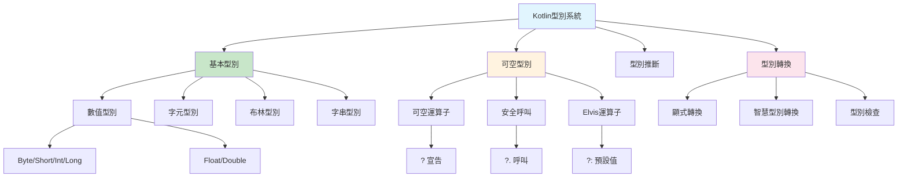

# 第二課：型別系統

## 一、課程定位

### 1.1 本課在整本書的位置

本課「型別系統」是Kotlin系列的第二課，緊接著第一課的Hello World，深入探討Kotlin的型別系統。Kotlin的型別系統與C語言有顯著不同，特別是空值安全（Null Safety）和型別推斷（Type Inference）等特性。

在整個學習路徑中，本課扮演著「型別基石」的角色。理解Kotlin的型別系統對於後續學習協程、Android開發和JNI整合至關重要。特別是在處理FFmpeg音訊資料時，正確理解型別轉換和空值安全可以避免許多運行時錯誤。

### 1.2 前置知識清單

本課假設讀者已經掌握：

1. **第一課內容**：理解Kotlin程式結構、main函數、變數宣告
2. **基本程式設計概念**：了解變數、型別、函數等基本概念
3. **C語言型別系統**：已完成C語言型別課程（推薦）

### 1.3 學完本課後能解解決的實際問題

完成本課學習後，讀者將能夠：

1. **選擇正確的型別**：根據資料範圍選擇適當的數值型別
2. **處理空值安全**：使用`?`、`?.`、`?:`等運算子安全處理可空型別
3. **理解型別推斷**：掌握Kotlin編譯器的型別推斷規則
4. **進行型別轉換**：正確使用顯式轉換和智慧型別轉換
5. **使用型別別名**：使用`typealias`提高程式碼可讀性

---

## 二、核心概念地圖



---

## 三、概念深度解析

### 3.1 數值型別（Numeric Types）

**定義**：Kotlin提供與Java類似的數值型別，但所有型別都是物件（除了在JVM中優化為原始型別）。

**內部原理**：

Kotlin的數值型別在JVM中會被編譯為對應的Java原始型別（當可能的情況下）：

| Kotlin型別 | Java原始型別 | 位元數 | 範圍 |
|-----------|-------------|--------|------|
| `Byte` | `byte` | 8 | -128 ~ 127 |
| `Short` | `short` | 16 | -32768 ~ 32767 |
| `Int` | `int` | 32 | -2147483648 ~ 2147483647 |
| `Long` | `long` | 64 | -9.2×10¹⁸ ~ 9.2×10¹⁸ |
| `Float` | `float` | 32 | IEEE 754單精度 |
| `Double` | `double` | 64 | IEEE 754雙精度 |

**字面值表示**：

```kotlin
// 整數字面值
val decimal = 42           // 十進位
val hex = 0xFF             // 十六進位
val binary = 0b1010        // 二進位

// 長整數字面值
val longValue = 42L        // L後綴表示Long

// 浮點字面值
val doubleValue = 3.14     // 預設為Double
val floatValue = 3.14f     // f後綴表示Float

// 數字分隔符
val million = 1_000_000    // 下劃線分隔，提高可讀性
```

**型別推斷規則**：

```kotlin
val a = 42          // 推斷為Int
val b = 42L         // 推斷為Long
val c = 0xFF        // 推斷為Int（即使使用十六進位）
val d = 3.14        // 推斷為Double
val e = 3.14f       // 推斷為Float

// 超出Int範圍自動推斷為Long
val bigNumber = 9_000_000_000  // 推斷為Long
```

**限制**：
- 數值型別之間不自動轉換（需要顯式轉換）
- 溢位不會拋出異常（與Java相同）
- `Float`和`Double`有精度問題

**最佳實踐**：
```kotlin
// 使用適當的型別
val sampleRate: Int = 192000      // 取樣率使用Int
val fileSize: Long = 1073741824L  // 大檔案使用Long
val normalized: Float = 0.5f      // 音訊歸一化使用Float

// 使用數字分隔符
val buffer = 4_096
val hiresRate = 192_000

// 避免精度問題
val price = 19.99
val total = price * 100  // 可能不精確
val totalCents = (price * 100).toInt()  // 可能不是1999
```

### 3.2 可空型別（Nullable Types）

**定義**：Kotlin區分可空型別和不可空型別，從型別系統層面解決空指標異常問題。

**內部原理**：

Kotlin的可空型別在JVM層面使用包裝類別：

```kotlin
// Kotlin
val name: String = "Kotlin"    // 不可空
val nullableName: String? = null  // 可空

// 編譯後的Java（簡化）
String name = "Kotlin";
@Nullable String nullableName = null;
```

**可空運算子**：

1. **`?`宣告運算子**：
```kotlin
val name: String? = null  // 可空型別宣告
```

2. **`?.`安全呼叫運算子**：
```kotlin
val length = name?.length  // 如果name為null，返回null
```

3. **`?:`Elvis運算子**：
```kotlin
val length = name?.length ?: 0  // 如果為null，使用預設值0
```

4. **`!!`非空斷言運算子**：
```kotlin
val length = name!!.length  // 強制斷言非空，如果為null拋出NPE
```

**限制**：
- 可空型別不能直接賦值給不可空型別
- 可空型別的成員訪問需要特殊處理
- `!!`運算子可能導致運行時異常

**最佳實踐**：
```kotlin
// 優先使用?.和?:
val name: String? = getName()
val length = name?.length ?: 0

// 避免使用!!
// 不好的做法
val length = name!!.length  // 可能NPE

// 好的做法
val length = if (name != null) name.length else 0

// 使用let處理可空值
name?.let {
    println("Name: $it")
}

// 使用requireNotNull進行參數檢查
fun process(name: String?) {
    requireNotNull(name) { "Name cannot be null" }
    // 這裡name自動轉換為不可空型別
}
```

### 3.3 型別推斷（Type Inference）

**定義**：Kotlin編譯器能夠根據上下文自動推斷變數或表達式的型別。

**內部原理**：

Kotlin的型別推斷在編譯時進行，不影響運行時效能：

```kotlin
// 編譯器推斷過程
val x = 42          // 推斷為Int
val y = x + 1L      // 推斷為Long（因為運算結果是Long）
val z = listOf(1, 2, 3)  // 推斷為List<Int>

// 編譯後的Java
int x = 42;
long y = x + 1L;
List<Integer> z = Arrays.asList(1, 2, 3);
```

**推斷規則**：

1. **整數字面值**：
   - 預設推斷為`Int`
   - 超出`Int`範圍自動推斷為`Long`
   - 有`L`後綴推斷為`Long`

2. **浮點字面值**：
   - 預設推斷為`Double`
   - 有`f`或`F`後綴推斷為`Float`

3. **表達式**：
   - 根據運算元型別推斷結果型別
   - 混合型別運算推斷為較大型別

**限制**：
- 推斷型別必須是確定的
- 不能推斷「任何」型別
- 泛型型別有時需要明確指定

**最佳實踐**：
```kotlin
// 簡單情況：省略型別
val name = "Kotlin"
val count = 42

// 複雜情況：明確型別
val result: Result<AudioData> = processAudio()
val config: Map<String, Any> = mapOf(
    "sampleRate" to 192000,
    "channels" to 2
)

// 公開API：明確型別
fun processData(data: ByteArray): AudioFormat {
    // ...
}
```

### 3.4 型別轉換（Type Conversion）

**定義**：Kotlin不支援隱式型別轉換，必須使用顯式轉換函數。

**內部原理**：

Kotlin的型別轉換是函數呼叫：

```kotlin
// Kotlin
val a: Int = 42
val b: Long = a.toLong()

// 編譯後的Java
int a = 42;
long b = (long)a;  // 實際上是調用Intrinsics.longValue(a)
```

**轉換函數**：

| 來源型別 | 目標型別 | 函數 |
|---------|---------|------|
| `Byte` | 其他 | `toShort()`, `toInt()`, `toLong()`, `toFloat()`, `toDouble()` |
| `Short` | 其他 | `toByte()`, `toInt()`, `toLong()`, `toFloat()`, `toDouble()` |
| `Int` | 其他 | `toByte()`, `toShort()`, `toLong()`, `toFloat()`, `toDouble()` |
| `Long` | 其他 | `toByte()`, `toShort()`, `toInt()`, `toFloat()`, `toDouble()` |
| `Float` | 其他 | `toByte()`, `toShort()`, `toInt()`, `toLong()`, `toDouble()` |
| `Double` | 其他 | `toByte()`, `toShort()`, `toInt()`, `toLong()`, `toFloat()` |

**字串轉換**：

```kotlin
// 數值轉字串
val num = 42
val str = num.toString()  // "42"

// 字串轉數值
val str = "42"
val num = str.toInt()     // 42
val numOrNull = str.toIntOrNull()  // 42 或 null（如果轉換失敗）

// 格式化轉換
val pi = 3.14159
val formatted = "%.2f".format(pi)  // "3.14"
```

**智慧型別轉換**：

```kotlin
// 自動轉換
val obj: Any = "Kotlin"
if (obj is String) {
    // 這裡obj自動轉換為String
    println(obj.length)
}

// 不需要顯式轉換
when (obj) {
    is String -> println(obj.length)  // 自動轉換
    is Int -> println(obj + 1)        // 自動轉換
}
```

**最佳實踐**：
```kotlin
// 使用安全的轉換函數
val input = "192000"
val sampleRate = input.toIntOrNull() ?: 44100

// 使用智慧型別轉換
fun process(data: Any) {
    when (data) {
        is ByteArray -> processBytes(data)
        is ShortArray -> processShorts(data)
        is IntArray -> processInts(data)
    }
}

// 避免不安全的轉換
val largeNumber = 2147483648L
val truncated = largeNumber.toInt()  // 可能溢位
```

### 3.5 型別別名（Type Alias）

**定義**：`typealias`關鍵字用於為現有型別創建別名，提高程式碼可讀性。

**內部原理**：

型別別名在編譯時被替換為原始型別，不創建新型別：

```kotlin
// Kotlin
typealias SampleRate = Int
typealias AudioBuffer = ByteArray

val rate: SampleRate = 192000
val buffer: AudioBuffer = ByteArray(4096)

// 編譯後的Java
int rate = 192000;
byte[] buffer = new byte[4096];
```

**使用場景**：

1. **簡化複雜型別**：
```kotlin
typealias AudioCallback = (ByteArray, Int) -> Unit
typealias Predicate<T> = (T) -> Boolean
```

2. **語意化命名**：
```kotlin
typealias SampleRate = Int
typealias BitDepth = Int
typealias ChannelCount = Int
```

3. **區分相同型別**：
```kotlin
typealias Username = String
typealias Password = String
typealias Email = String

fun login(username: Username, password: Password): Boolean {
    // ...
}
```

**限制**：
- 不創建新的型別，只是別名
- 不能用於運算子重載
- 不能用於型別檢查（`is`）

**最佳實踐**：
```kotlin
// 音訊相關型別別名
typealias SampleRate = Int
typealias BitDepth = Int
typealias ChannelCount = Int
typealias AudioSamples = ShortArray

// 函數型別別名
typealias AudioProcessor = (ShortArray) -> ShortArray
typealias AudioCallback = (AudioSamples) -> Unit

// 使用
fun createAudioConfig(
    sampleRate: SampleRate,
    bitDepth: BitDepth,
    channels: ChannelCount
): AudioConfig {
    // ...
}
```

---

## 四、語法完整規格

### 4.1 變數宣告

**BNF語法**：
```
variable-declaration ::= ("val" | "var") variable-declaration-entry ("," variable-declaration-entry)*
variable-declaration-entry ::= simple-identifier (":" type)? ("=" expression)?
```

**語法說明**：

```kotlin
// 唯讀變數
val name = "Kotlin"
val pi: Double = 3.14159

// 可變變數
var counter = 0
var message: String = "Hello"

// 延遲初始化
lateinit var config: AudioConfig

// 惰性初始化
val heavyObject: HeavyObject by lazy {
    HeavyObject()
}

// 委託屬性
var observed by Delegates.observable(0) { prop, old, new ->
    println("$old -> $new")
}
```

### 4.2 可空型別宣告

**BNF語法**：
```
nullable-type ::= type "?"
```

**語法說明**：

```kotlin
// 可空型別宣告
val name: String? = null
val length: Int? = name?.length

// 安全呼叫鏈
val city = user?.address?.city

// Elvis運算子
val length = name?.length ?: 0

// 非空斷言
val length = name!!.length  // 可能拋出NPE
```

### 4.3 型別轉換函數

**語法說明**：

```kotlin
// 數值轉換
val a: Int = 42
val b: Long = a.toLong()
val c: Double = a.toDouble()

// 字串轉換
val str = "42"
val num: Int? = str.toIntOrNull()

// 陣列轉換
val bytes = "Hello".toByteArray()
val str2 = bytes.toString(Charsets.UTF_8)
```

### 4.4 型別檢查與智慧轉換

**BNF語法**：
```
type-check ::= expression "is" type | expression "!is" type
smart-cast ::= (variable | expression) // 自動轉換為檢查後的型別
```

**語法說明**：

```kotlin
// is運算子
val obj: Any = "Kotlin"
if (obj is String) {
    // obj自動轉換為String
    println(obj.length)
}

// !is運算子
if (obj !is String) {
    return
}
// 這裡obj自動轉換為String

// when中的智慧轉換
when (obj) {
    is String -> println(obj.length)
    is Int -> println(obj + 1)
    is List<*> -> println(obj.size)
    else -> println("Unknown type")
}
```

---

## 五、範例逐行註解

### 5.1 範例一：BasicTypes.kt

```kotlin
// File: BasicTypes.kt
// Purpose: Demonstrate Kotlin basic types
// Run:     kotlinc BasicTypes.kt -include-runtime -d BasicTypes.jar

fun main() {
    // Integer types
    val byte: Byte = 127           // 8-bit
    val short: Short = 32767       // 16-bit
    val int: Int = 2147483647      // 32-bit
    val long: Long = 9223372036854775807L  // 64-bit
    
    println("Integer types:")
    println("  Byte: $byte")
    println("  Short: $short")
    println("  Int: $int")
    println("  Long: $long")
    
    // Floating-point types
    val float: Float = 3.14159f    // 32-bit
    val double: Double = 3.141592653589793  // 64-bit
    
    println("\nFloating-point types:")
    println("  Float: $float")
    println("  Double: $double")
    
    // Type inference
    val inferredInt = 42           // Int
    val inferredLong = 42L         // Long
    val inferredDouble = 3.14      // Double
    val inferredFloat = 3.14f      // Float
    
    println("\nType inference:")
    println("  inferredInt: ${inferredInt::class.simpleName}")
    println("  inferredLong: ${inferredLong::class.simpleName}")
    println("  inferredDouble: ${inferredDouble::class.simpleName}")
    println("  inferredFloat: ${inferredFloat::class.simpleName}")
    
    // Number literals
    val decimal = 42
    val hex = 0xFF
    val binary = 0b1010
    val million = 1_000_000
    
    println("\nNumber literals:")
    println("  Decimal: $decimal")
    println("  Hex: $hex")
    println("  Binary: $binary")
    println("  Million: $million")
    
    // Boolean type
    val bool: Boolean = true
    println("\nBoolean: $bool")
    
    // Character type
    val char: Char = 'K'
    println("Character: $char")
    
    // String type
    val string: String = "Kotlin"
    println("String: $string")
}
```

### 5.2 範例二：AudioTypes.kt

```kotlin
// File: AudioTypes.kt
// Purpose: Audio-specific type usage in Kotlin
// Run:     kotlinc AudioTypes.kt -include-runtime -d AudioTypes.jar

// Type aliases for audio
typealias SampleRate = Int
typealias BitDepth = Int
typealias ChannelCount = Int
typealias AudioSamples = ShortArray

/**
 * Audio format configuration
 */
data class AudioFormat(
    val sampleRate: SampleRate,
    val bitDepth: BitDepth,
    val channels: ChannelCount
) {
    val bytesPerSample: Int
        get() = bitDepth / 8
    
    val dataRate: Int
        get() = sampleRate * channels * bytesPerSample
    
    fun bufferSize(durationMs: Int): Int {
        return dataRate * durationMs / 1000
    }
    
    override fun toString(): String {
        return "$sampleRate Hz, $bitDepth-bit, $channels ch"
    }
}

/**
 * Check if format is Hi-Res
 */
fun AudioFormat.isHiRes(): Boolean {
    return sampleRate >= 96000 || bitDepth >= 24
}

fun main() {
    // CD Quality
    val cd = AudioFormat(
        sampleRate = 44100,
        bitDepth = 16,
        channels = 2
    )
    
    println("CD Quality: $cd")
    println("  Data rate: ${cd.dataRate} bytes/sec")
    println("  1-minute size: ${cd.bufferSize(60000)} bytes")
    println("  Is Hi-Res: ${cd.isHiRes()}")
    
    // Hi-Res Quality
    val hires = AudioFormat(
        sampleRate = 192000,
        bitDepth = 24,
        channels = 2
    )
    
    println("\nHi-Res Quality: $hires")
    println("  Data rate: ${hires.dataRate} bytes/sec")
    println("  1-minute size: ${hires.bufferSize(60000)} bytes")
    println("  Is Hi-Res: ${hires.isHiRes()}")
    
    // Type-safe calculations
    val sampleRate: SampleRate = 192000
    val bitDepth: BitDepth = 24
    val channels: ChannelCount = 2
    
    // Using type aliases for clarity
    val dataRate: Int = sampleRate * bitDepth * channels / 8
    println("\nData rate calculation:")
    println("  $sampleRate Hz * $bitDepth bits * $channels ch / 8 = $dataRate bytes/sec")
    
    // Audio samples
    val samples: AudioSamples = ShortArray(4096)
    for (i in samples.indices) {
        samples[i] = (i % 65536 - 32768).toShort()
    }
    println("\nAudio samples:")
    println("  Size: ${samples.size}")
    println("  First 5: ${samples.take(5).toList()}")
}
```

### 5.3 範例三：TypeConversions.kt

```kotlin
// File: TypeConversions.kt
// Purpose: Demonstrate type conversions in Kotlin
// Run:     kotlinc TypeConversions.kt -include-runtime -d TypeConversions.jar

fun main() {
    // Numeric conversions
    val intVal: Int = 42
    val longVal: Long = intVal.toLong()
    val doubleVal: Double = intVal.toDouble()
    val floatVal: Float = intVal.toFloat()
    
    println("Numeric conversions:")
    println("  Int: $intVal")
    println("  toLong: $longVal")
    println("  toDouble: $doubleVal")
    println("  toFloat: $floatVal")
    
    // String conversions
    val numStr = "192000"
    val num = numStr.toInt()
    val numSafe = numStr.toIntOrNull()
    
    println("\nString to number:")
    println("  String: $numStr")
    println("  toInt: $num")
    println("  toIntOrNull: $numSafe")
    
    // Safe conversion with default
    val invalidStr = "abc"
    val safeNum = invalidStr.toIntOrNull() ?: 0
    println("\nSafe conversion:")
    println("  Invalid string: $invalidStr")
    println("  Default value: $safeNum")
    
    // Smart cast
    val obj: Any = "Kotlin"
    if (obj is String) {
        println("\nSmart cast:")
        println("  obj is String: true")
        println("  Length: ${obj.length}")
    }
    
    // When with smart cast
    val data: Any = 42
    val result = when (data) {
        is String -> "String: $data"
        is Int -> "Int: ${data + 1}"
        is Double -> "Double: ${data * 2}"
        else -> "Unknown type"
    }
    println("\nWhen with smart cast:")
    println("  Result: $result")
    
    // Audio-specific conversions
    val sampleRate = 192000
    val sampleRateStr = sampleRate.toString()
    val parsedRate = sampleRateStr.toInt()
    
    println("\nAudio conversions:")
    println("  Sample rate: $sampleRate")
    println("  As string: $sampleRateStr")
    println("  Parsed back: $parsedRate")
    
    // Byte array conversions
    val text = "Hello"
    val bytes = text.toByteArray()
    val backToString = bytes.toString(Charsets.UTF_8)
    
    println("\nByte array conversions:")
    println("  Text: $text")
    println("  Bytes: ${bytes.toList()}")
    println("  Back to string: $backToString")
}
```

---

## 六、錯誤案例對照表

### 6.1 型別不匹配錯誤

| 錯誤程式碼 | 錯誤訊息 | 根本原因 | 正確寫法 |
|-----------|---------|---------|---------|
| `val x: Long = 42` | `The integer literal does not conform to the expected type Long` | 整數字面值預設為Int | `val x: Long = 42L` |
| `val x: Int = 3.14` | `Type mismatch` | Double不能賦值給Int | `val x: Int = 3.14.toInt()` |
| `val x: String = null` | `Null can not be a value of a non-null type String` | 非空型別不能賦值null | `val x: String? = null` |

### 6.2 空值安全錯誤

| 錯誤程式碼 | 錯誤訊息 | 根本原因 | 正確寫法 |
|-----------|---------|---------|---------|
| `val len = name.length` | `Only safe (?.) or non-null asserted (!!.) calls are allowed` | 可空型別不能直接訪問成員 | `val len = name?.length` |
| `val x: String = nullableString` | `Type mismatch: inferred type is String? but String was expected` | 可空型別不能賦值給不可空型別 | `val x: String = nullableString ?: ""` |
| `name!!` | `NullPointerException` | 強制非空斷言失敗 | 使用`?.`或`?:` |

### 6.3 型別轉換錯誤

| 錯誤程式碼 | 錯誤訊息 | 根本原因 | 正確寫法 |
|-----------|---------|---------|---------|
| `val x: Long = intVal` | `Type mismatch` | Kotlin不支援隱式轉換 | `val x: Long = intVal.toLong()` |
| `"abc".toInt()` | `NumberFormatException` | 字串不是有效數字 | `"abc".toIntOrNull() ?: 0` |
| `val x = 9223372036854775808` | `The value is too large` | 超出Long範圍 | 使用BigInteger |

---

## 七、效能與記憶體分析

### 7.1 基本型別效能

Kotlin的基本型別在JVM中優化為原始型別：

| Kotlin型別 | JVM表示 | 記憶體大小 |
|-----------|---------|-----------|
| `Byte` | `byte` | 1 byte |
| `Short` | `short` | 2 bytes |
| `Int` | `int` | 4 bytes |
| `Long` | `long` | 8 bytes |
| `Float` | `float` | 4 bytes |
| `Double` | `double` | 8 bytes |
| `Boolean` | `boolean` | 1 byte |
| `Char` | `char` | 2 bytes |

### 7.2 可空型別開銷

可空型別有額外的記憶體開銷：

```kotlin
// 不可空型別：使用原始型別
val x: Int = 42  // 4 bytes

// 可空型別：使用包裝類別
val y: Int? = 42  // 16 bytes (Integer物件)

// 大量使用可空型別會增加記憶體使用
val samples: Array<Int?> = Array(1000) { null }  // 較大開銷
val samples2: IntArray = IntArray(1000)  // 較小開銷
```

### 7.3 型別推斷效能

型別推斷在編譯時完成，不影響運行時效能：

```kotlin
// 這兩種寫法運行時效能相同
val x = 42
val x: Int = 42

// 編譯後的位元組碼完全相同
```

---

## 八、Hi-Res音訊實戰連結

### 8.1 音訊型別定義

```kotlin
// AudioTypes.kt
package com.example.audio

// Type aliases for audio
typealias SampleRate = Int
typealias BitDepth = Int
typealias ChannelCount = Int
typealias AudioSamples = ShortArray

/**
 * Audio format constants
 */
object AudioFormat {
    val CD = AudioConfig(44100, 16, 2)
    val HIRES_96 = AudioConfig(96000, 24, 2)
    val HIRES_192 = AudioConfig(192000, 24, 2)
    val HIRES_384 = AudioConfig(384000, 32, 2)
}

/**
 * Audio configuration
 */
data class AudioConfig(
    val sampleRate: SampleRate,
    val bitDepth: BitDepth,
    val channels: ChannelCount
) {
    val bytesPerSample: Int
        get() = bitDepth / 8
    
    val dataRate: Int
        get() = sampleRate * channels * bytesPerSample
    
    fun bufferSize(durationMs: Int): Int {
        return dataRate * durationMs / 1000
    }
}
```

### 8.2 JNI型別映射

```kotlin
// JniTypes.kt
package com.example.audio

/**
 * JNI type mappings for audio
 */
object JniTypes {
    // Java/Kotlin -> JNI -> C
    // Byte -> jbyte -> int8_t
    // Short -> jshort -> int16_t
    // Int -> jint -> int32_t
    // Long -> jlong -> int64_t
    // Float -> jfloat -> float
    // Double -> jdouble -> double
    
    /**
     * Convert Kotlin array to JNI-compatible format
     */
    fun prepareForJni(samples: ShortArray): ByteArray {
        val buffer = ByteBuffer.allocate(samples.size * 2)
        samples.forEach { buffer.putShort(it) }
        return buffer.array()
    }
    
    /**
     * Convert JNI result to Kotlin array
     */
    fun fromJniResult(data: ByteArray): ShortArray {
        val buffer = ByteBuffer.wrap(data).order(ByteOrder.nativeOrder())
        val result = ShortArray(data.size / 2)
        for (i in result.indices) {
            result[i] = buffer.short
        }
        return result
    }
}
```

---

## 九、練習題與解答

### 9.1 基礎練習

**題目**：撰寫一個Kotlin程式，計算並輸出各種音訊格式的資料率。

**解答**：
```kotlin
// exercise_01.kt
fun main() {
    val formats = listOf(
        AudioFormat("CD", 44100, 16, 2),
        AudioFormat("Hi-Res 96kHz", 96000, 24, 2),
        AudioFormat("Hi-Res 192kHz", 192000, 24, 2)
    )
    
    formats.forEach { fmt ->
        println("${fmt.name}: ${fmt.dataRate()} bytes/sec")
    }
}

data class AudioFormat(
    val name: String,
    val sampleRate: Int,
    val bitDepth: Int,
    val channels: Int
) {
    fun dataRate(): Int = sampleRate * bitDepth * channels / 8
}
```

### 9.2 進階練習

**題目**：實作一個型別安全的音訊緩衝區類別。

**解答**：
```kotlin
// exercise_02.kt
class AudioBuffer(
    val capacity: Int,
    val sampleRate: Int,
    val channels: Int
) {
    private val data: ShortArray = ShortArray(capacity)
    var size: Int = 0
        private set
    
    operator fun get(index: Int): Short {
        require(index in 0 until size)
        return data[index]
    }
    
    operator fun set(index: Int, value: Short) {
        require(index in 0 until capacity)
        data[index] = value
        if (index >= size) size = index + 1
    }
    
    fun process(transform: (Short) -> Short): AudioBuffer {
        val result = AudioBuffer(capacity, sampleRate, channels)
        for (i in 0 until size) {
            result[i] = transform(data[i])
        }
        return result
    }
}
```

---

## 十、下一課銜接橋樑

### 10.1 本課知識在下一課的應用

本課學習的型別系統知識，將在下一課「控制流程」中得到應用：

1. **條件判斷**：`if`和`when`表達式使用型別檢查
2. **迴圈計數**：使用`Int`和範圍型別
3. **智慧型別轉換**：在條件分支中自動轉換型別

### 10.2 預告：下一課核心內容

下一課「控制流程」將深入探討：

- **條件表達式**：`if`、`when`表達式
- **迴圈語句**：`for`、`while`、`do-while`
- **範圍表達式**：`..`、`until`、`downTo`、`step`
- **跳轉語句**：`break`、`continue`、`return`
- **標籤跳轉**：巢狀迴圈控制
