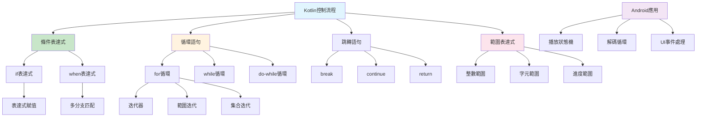

# 第三課：控制流程

## 一、課程定位

### 1.1 本課在整本書的位置

本課「控制流程」是Kotlin系列的第三課，緊接著第二課的型別系統，深入探討Kotlin的控制流程機制。Kotlin的控制流程與C語言有相似之處，但增加了許多現代特性，如`when`表達式、範圍表達式、以及更強大的`for`循環。

在整個學習路徑中，本課扮演著「邏輯骨架」的角色。後續課程（函數、空值安全、集合、協程）都依賴於對控制流程的深入理解。特別是在Android音訊開發中，正確使用控制流程對於處理播放狀態、解碼循環、UI邏輯至關重要。

### 1.2 前置知識清單

本課假設讀者已經掌握：

1. **第一課內容**：理解Kotlin程式結構、main函數、變數宣告
2. **第二課內容**：理解型別系統、型別推斷、空值安全基礎
3. **基本程式設計概念**：了解條件判斷、循環等基本概念
4. **C語言控制流程**：已完成C語言控制流程課程（推薦）

### 1.3 學完本課後能解決的實際問題

完成本課學習後，讀者將能夠：

1. **編寫條件表達式**：使用`if`表達式和`when`表達式實現複雜邏輯
2. **設計循環結構**：使用`for`、`while`處理迭代任務
3. **使用範圍表達式**：利用Kotlin的範圍特性簡化代碼
4. **實現狀態機**：為Android播放器設計狀態機邏輯
5. **處理錯誤流程**：設計健壯的錯誤處理和異常流程

---

## 二、核心概念地圖



上圖展示了Kotlin控制流程的完整結構。與C語言相比，Kotlin的控制流程更加強大，特別是`when`表達式和範圍表達式，為Android音訊開發提供了更簡潔的語法。

---

## 三、概念深度解析

### 3.1 if表達式（If Expression）

**定義**：在Kotlin中，`if`是一個表達式（expression），它會返回一個值。這與C語言不同，C語言的`if`是一個語句（statement）。

**內部原理**：

Kotlin的`if`表達式編譯為Java的三元運算符（當可能時）或if語句：

```kotlin
// Kotlin代碼
val max = if (a > b) a else b

// 編譯後的Java代碼
int max = a > b ? a : b;
```

**編譯器行為**：

1. 當`if`用作表達式時，必須有`else`分支
2. 所有分支的返回類型必須相容
3. 編譯器會進行類型推斷，確定表達式的返回類型

**與C語言的比較**：

| 特性 | C語言 | Kotlin |
|------|-------|--------|
| 語法類型 | 語句（statement） | 表達式（expression） |
| 返回值 | 無 | 有 |
| 三元運算符 | `? :` | 不需要（直接用if） |
| 賦值 | 不能直接賦值 | 可以直接賦值 |

**代碼示例**：

```kotlin
// if作為表達式
val max: Int = if (a > b) {
    println("a is greater")
    a  // 最後一行是返回值
} else {
    println("b is greater or equal")
    b  // 最後一行是返回值
}

// 簡潔寫法
val max = if (a > b) a else b

// 多分支
val description = if (sampleRate >= 192000) {
    "Hi-Res Ultra"
} else if (sampleRate >= 96000) {
    "Hi-Res"
} else if (sampleRate >= 44100) {
    "CD Quality"
} else {
    "Low Quality"
}
```

### 3.2 when表達式（When Expression）

**定義**：`when`是Kotlin的強大多分支表達式，類似於C語言的`switch`，但更加強大和靈活。

**內部原理**：

Kotlin編譯器會根據`when`的使用方式選擇不同的實現：

1. **枚舉或有限值**：編譯為`tableswitch`或`lookupswitch`指令
2. **複雜條件**：編譯為一系列`if-else`語句
3. **密封類**：編譯器可以檢查是否覆蓋所有情況

**與C語言switch的比較**：

| 特性 | C語言 switch | Kotlin when |
|------|-------------|-------------|
| 參數類型 | 整數、字元、枚舉 | 任意類型 |
| case條件 | 常量值 | 任意表達式 |
| 類型檢查 | 不支持 | 支持`is`檢查 |
| 範圍匹配 | 不支持 | 支持`in`範圍 |
| fall-through | 需要`break` | 自動break |
| 表達式 | 否 | 是 |

**代碼示例**：

```kotlin
// 基本用法
when (codecId) {
    CodecId.MP3 -> "MPEG Audio Layer 3"
    CodecId.FLAC -> "Free Lossless Audio Codec"
    CodecId.AAC -> "Advanced Audio Coding"
    else -> "Unknown"
}

// 範圍匹配
when (sampleRate) {
    in 192000..Int.MAX_VALUE -> "Hi-Res Ultra"
    in 96000..191999 -> "Hi-Res"
    in 44100..95999 -> "CD Quality"
    else -> "Low Quality"
}

// 類型檢查
when (audioData) {
    is ByteArray -> decodeByteArray(audioData)
    is ByteBuffer -> decodeByteBuffer(audioData)
    is File -> decodeFile(audioData)
    else -> throw IllegalArgumentException("Unsupported data type")
}

// 複雜條件
when {
    sampleRate >= 192000 && bitDepth >= 24 -> "Hi-Res Ultra"
    sampleRate >= 96000 && bitDepth >= 24 -> "Hi-Res"
    else -> "Standard"
}

// 多值匹配
when (codecId) {
    CodecId.MP3, CodecId.AAC -> "Lossy"
    CodecId.FLAC, CodecId.ALAC -> "Lossless"
    else -> "Unknown"
}
```

### 3.3 for循環（For Loop）

**定義**：Kotlin的`for`循環使用`in`關鍵字迭代任何提供迭代器的對象。

**內部原理**：

Kotlin的`for`循環編譯為對迭代器的調用：

```kotlin
// Kotlin代碼
for (item in collection) {
    println(item)
}

// 編譯後的Java代碼（偽代碼）
Iterator<Item> iterator = collection.iterator();
while (iterator.hasNext()) {
    Item item = iterator.next();
    System.out.println(item);
}
```

**迭代器協議**：

要使類型可迭代，需要實現：

```kotlin
interface Iterable<T> {
    operator fun iterator(): Iterator<T>
}

interface Iterator<T> {
    operator fun next(): T
    operator fun hasNext(): Boolean
}
```

**範圍迭代**：

```kotlin
// 整數範圍
for (i in 0..9) {
    println(i)  // 0, 1, 2, ..., 9
}

// 不包含結束值
for (i in 0 until 10) {
    println(i)  // 0, 1, 2, ..., 9
}

// 遞減
for (i in 9 downTo 0) {
    println(i)  // 9, 8, 7, ..., 0
}

// 步長
for (i in 0..100 step 10) {
    println(i)  // 0, 10, 20, ..., 100
}

// 字元範圍
for (c in 'a'..'z') {
    println(c)
}
```

**集合迭代**：

```kotlin
// 列表迭代
val samples = listOf(0.1f, 0.2f, 0.3f)
for (sample in samples) {
    println(sample)
}

// 帶索引迭代
for ((index, sample) in samples.withIndex()) {
    println("Sample $index: $sample")
}

// Map迭代
val codecMap = mapOf("mp3" to "MPEG", "flac" to "FLAC")
for ((key, value) in codecMap) {
    println("$key -> $value")
}
```

### 3.4 while循環（While Loop）

**定義**：`while`和`do-while`循環與C語言類似，但Kotlin中它們是語句而非表達式。

**語法**：

```kotlin
// while循環
while (condition) {
    // body
}

// do-while循環
do {
    // body
} while (condition)
```

**與C語言的比較**：

Kotlin的`while`循環與C語言幾乎相同，主要區別在於：

1. 條件表達式必須是布爾類型（Kotlin沒有隱式布爾轉換）
2. 不能在條件中使用賦值表達式

**代碼示例**：

```kotlin
// 讀取音訊數據
var bytesRead = 0
while (bytesRead < totalBytes) {
    val read = inputStream.read(buffer)
    if (read == -1) break
    bytesRead += read
}

// 解碼循環
var packet: AVPacket? = av_read_frame(formatContext)
while (packet != null) {
    processPacket(packet)
    packet = av_read_frame(formatContext)
}

// do-while示例
var retryCount = 0
do {
    val result = tryDecode()
    retryCount++
} while (result.isFailure && retryCount < MAX_RETRIES)
```

### 3.5 範圍表達式（Range Expressions）

**定義**：Kotlin提供了強大的範圍表達式，用於表示區間和進行區間檢查。

**內部原理**：

範圍表達式實現為`ClosedRange<T>`接口：

```kotlin
interface ClosedRange<T: Comparable<T>> {
    val start: T
    val endInclusive: T
    operator fun contains(value: T): Boolean
}
```

**範圍操作符**：

| 操作符 | 含義 | 示例 |
|--------|------|------|
| `..` | 閉區間 | `1..10` (1到10，包含10) |
| `until` | 半開區間 | `1 until 10` (1到9) |
| `downTo` | 遞減 | `10 downTo 1` (10到1) |
| `step` | 步長 | `1..10 step 2` (1, 3, 5, 7, 9) |
| `in` | 包含檢查 | `x in 1..10` |
| `!in` | 不包含檢查 | `x !in 1..10` |

**代碼示例**：

```kotlin
// 範圍檢查
val sampleRate = 192000
if (sampleRate in 96000..192000) {
    println("Hi-Res audio")
}

// 字元範圍
if (extension.lowercase() in setOf("flac", "wav", "aiff")) {
    println("Lossless format")
}

// 進度範圍
val progress = 0.75f
if (progress in 0.0f..1.0f) {
    println("Valid progress: ${progress * 100}%")
}

// 自定義範圍
class SampleRateRange(override val start: Int, override val endInclusive: Int) : ClosedRange<Int>

val hiResRange = SampleRateRange(96000, 192000)
if (sampleRate in hiResRange) {
    println("Hi-Res")
}
```

### 3.6 跳轉語句（Jump Statements）

**定義**：Kotlin提供`break`、`continue`和`return`三種跳轉語句。

**break和continue**：

與C語言類似，但Kotlin支持標籤（label）：

```kotlin
// 標籤跳轉
outer@ for (i in 0..10) {
    for (j in 0..10) {
        if (i + j > 15) {
            break@outer  // 跳出外層循環
        }
    }
}

// continue標籤
outer@ for (i in 0..10) {
    for (j in 0..10) {
        if (j == 5) {
            continue@outer  // 跳到外層循環的下一次迭代
        }
    }
}
```

**return與標籤**：

Kotlin支持從lambda表達式返回：

```kotlin
// 普通return
fun processSamples(samples: List<Float>) {
    samples.forEach { sample ->
        if (sample < 0) return  // 從processSamples函數返回
        println(sample)
    }
}

// 標籤return
fun processSamples(samples: List<Float>) {
    samples.forEach lit@{ sample ->
        if (sample < 0) return@lit  // 從lambda返回，繼續forEach
        println(sample)
    }
}

// 隱式標籤
fun processSamples(samples: List<Float>) {
    samples.forEach { sample ->
        if (sample < 0) return@forEach  // 使用函數名作為標籤
        println(sample)
    }
}
```

---

## 四、語法完整規格

### 4.1 if表達式語法

```bnf
if-expression ::= 'if' '(' expression ')' (block | statement)
                  ('else' (block | statement))?
```

**邊界條件**：

1. 條件表達式必須是布爾類型
2. 用作表達式時，必須有`else`分支
3. 所有分支的返回類型必須相容

**最佳實踐**：

```kotlin
// Good: 使用if表達式賦值
val status = if (isPlaying) "Playing" else "Paused"

// Good: 多行if表達式
val description = if (sampleRate >= 192000) {
    log("Hi-Res detected")
    "Hi-Res Ultra"
} else {
    "Standard"
}

// Avoid: 過於複雜的嵌套
// 使用when表達式替代
```

### 4.2 when表達式語法

```bnf
when-expression ::= 'when' ('(' expression ')')? '{' when-entry* '}'
when-entry ::= when-condition (',' when-condition)* '->' (block | expression)
              | 'else' '->' (block | expression)
when-condition ::= expression
                 | 'in' expression
                 | '!in' expression
                 | 'is' type
                 | '!is' type
```

**邊界條件**：

1. 用作表達式時，必須覆蓋所有可能的情況（或有`else`）
2. 分支按順序匹配，第一個匹配的分支被執行
3. `else`分支必須放在最後

**最佳實踐**：

```kotlin
// Good: 使用when處理密封類
when (state) {
    is PlayerState.Idle -> showIdle()
    is PlayerState.Playing -> showPlaying()
    is PlayerState.Paused -> showPaused()
    is PlayerState.Error -> showError(state.message)
}

// Good: 使用when替代多個if-else
when {
    sampleRate >= 192000 -> "Hi-Res Ultra"
    sampleRate >= 96000 -> "Hi-Res"
    else -> "Standard"
}

// Good: 範圍匹配
when (progress) {
    in 0.0f..0.25f -> "Starting"
    in 0.25f..0.75f -> "In Progress"
    in 0.75f..1.0f -> "Almost Done"
    else -> "Invalid"
}
```

### 4.3 for循環語法

```bnf
for-statement ::= 'for' '(' (variable-declaration | variable) 'in' expression ')' (block | statement)
```

**邊界條件**：

1. 表達式必須提供迭代器或實現`Iterable`接口
2. 循環變數的作用域僅限於循環體
3. 可以使用解構聲明

**最佳實踐**：

```kotlin
// Good: 使用範圍迭代
for (i in 0 until samples.size) {
    process(samples[i])
}

// Good: 直接迭代
for (sample in samples) {
    process(sample)
}

// Good: 帶索引迭代
for ((index, sample) in samples.withIndex()) {
    println("[$index] = $sample")
}

// Good: 解構聲明
for ((key, value) in codecMap) {
    println("$key: $value")
}
```

### 4.4 while循環語法

```bnf
while-statement ::= 'while' '(' expression ')' (block | statement)
do-while-statement ::= 'do' (block | statement) 'while' '(' expression ')'
```

**邊界條件**：

1. 條件表達式必須是布爾類型
2. `do-while`至少執行一次循環體

**最佳實踐**：

```kotlin
// Good: 使用while處理未知次數的迭代
var packet = readPacket()
while (packet != null) {
    process(packet)
    packet = readPacket()
}

// Good: 使用do-while處理至少執行一次的情況
var result: Result
do {
    result = tryConnect()
} while (result.isFailure && shouldRetry())
```

---

## 五、範例逐行註解

### 5.1 Conditionals.kt - 條件表達式範例

```kotlin
/*
 * Conditionals.kt - Conditional expressions demonstration
 * Compile: kotlinc Conditionals.kt -include-runtime -d Conditionals.jar
 * Run: java -jar Conditionals.jar
 */

// Audio quality level enumeration
enum class AudioQuality {
    HI_RES_ULTRA,   // 192kHz/24bit and above
    HI_RES,         // 96kHz/24bit
    CD_QUALITY,     // 44.1kHz/16bit
    LOW_QUALITY     // Below CD quality
}

// Audio codec enumeration
enum class AudioCodec {
    MP3, AAC, FLAC, WAV, OPUS, VORBIS, UNKNOWN
}

/**
 * Detects audio quality level based on sample rate and bit depth.
 * Demonstrates if-else if-else chain as an expression.
 */
fun detectAudioQuality(sampleRate: Int, bitDepth: Int): AudioQuality {
    // if expression with multiple branches
    // Each branch returns a value directly
    return if (sampleRate >= 192000 && bitDepth >= 24) {
        AudioQuality.HI_RES_ULTRA
    } else if (sampleRate >= 96000 && bitDepth >= 24) {
        AudioQuality.HI_RES
    } else if (sampleRate >= 44100 && bitDepth >= 16) {
        AudioQuality.CD_QUALITY
    } else {
        AudioQuality.LOW_QUALITY
    }
}

/**
 * Gets a human-readable description of audio quality.
 * Demonstrates if expression with block body.
 */
fun getQualityDescription(quality: AudioQuality): String {
    // if expression with block body
    // The last expression in each block is the return value
    return if (quality == AudioQuality.HI_RES_ULTRA) {
        println("Detected Hi-Res Ultra")
        "Ultra High Resolution (192kHz/24bit or higher)"
    } else if (quality == AudioQuality.HI_RES) {
        println("Detected Hi-Res")
        "High Resolution (96kHz/24bit)"
    } else if (quality == AudioQuality.CD_QUALITY) {
        println("Detected CD Quality")
        "CD Quality (44.1kHz/16bit)"
    } else {
        println("Detected Low Quality")
        "Low Quality Audio"
    }
}

/**
 * Gets codec name using when expression.
 * Demonstrates basic when usage with enum.
 */
fun getCodecName(codec: AudioCodec): String = when (codec) {
    AudioCodec.MP3 -> "MPEG Audio Layer 3"
    AudioCodec.AAC -> "Advanced Audio Coding"
    AudioCodec.FLAC -> "Free Lossless Audio Codec"
    AudioCodec.WAV -> "Waveform Audio File Format"
    AudioCodec.OPUS -> "Opus Interactive Audio Codec"
    AudioCodec.VORBIS -> "Vorbis Audio Codec"
    AudioCodec.UNKNOWN -> "Unknown Codec"
}

/**
 * Classifies codec as lossy or lossless.
 * Demonstrates multiple values in a single branch.
 */
fun getCodecType(codec: AudioCodec): String = when (codec) {
    AudioCodec.MP3, AudioCodec.AAC, AudioCodec.OPUS, AudioCodec.VORBIS -> "Lossy"
    AudioCodec.FLAC, AudioCodec.WAV -> "Lossless"
    AudioCodec.UNKNOWN -> "Unknown"
}

/**
 * Checks if sample rate is valid for Hi-Res audio.
 * Demonstrates range checking with when.
 */
fun checkSampleRate(sampleRate: Int): String = when (sampleRate) {
    in 192000..Int.MAX_VALUE -> "Hi-Res Ultra range"
    in 96000..191999 -> "Hi-Res range"
    in 44100..95999 -> "Standard range"
    in 1..44099 -> "Low quality range"
    0 -> "Invalid (zero)"
    else -> "Invalid (negative)"
}

/**
 * Processes audio data based on type.
 * Demonstrates type checking with when.
 */
fun processAudioData(data: Any): String = when (data) {
    is ByteArray -> "Processing byte array: ${data.size} bytes"
    is IntArray -> "Processing int array: ${data.size} samples"
    is FloatArray -> "Processing float array: ${data.size} samples"
    is String -> "Processing file path: $data"
    else -> "Unsupported data type: ${data::class.simpleName}"
}

/**
 * Determines audio format based on multiple conditions.
 * Demonstrates complex when condition without subject.
 */
fun determineAudioFormat(
    sampleRate: Int,
    bitDepth: Int,
    channels: Int,
    isLossless: Boolean
): String = when {
    sampleRate >= 192000 && bitDepth >= 24 && isLossless -> "Hi-Res Lossless"
    sampleRate >= 192000 && bitDepth >= 24 -> "Hi-Res (possibly lossy)"
    sampleRate >= 96000 && bitDepth >= 24 && isLossless -> "Hi-Res Lossless"
    sampleRate >= 96000 && bitDepth >= 24 -> "Hi-Res (possibly lossy)"
    channels > 2 -> "Multi-channel audio"
    sampleRate >= 44100 && bitDepth >= 16 -> "CD Quality"
    else -> "Low Quality"
}

/**
 * Main function demonstrating conditional expressions.
 */
fun main() {
    println("=== Kotlin Conditional Expressions Demo ===\n")
    
    // Test audio quality detection
    println("Audio Quality Detection:")
    val testCases = listOf(
        Pair(192000, 24),
        Pair(96000, 24),
        Pair(44100, 16),
        Pair(22050, 8)
    )
    
    for ((sampleRate, bitDepth) in testCases) {
        val quality = detectAudioQuality(sampleRate, bitDepth)
        println("  ${sampleRate}Hz/${bitDepth}bit: $quality")
    }
    
    // Test codec name and type
    println("\nCodec Information:")
    for (codec in AudioCodec.values()) {
        println("  $codec: ${getCodecName(codec)} (${getCodecType(codec)})")
    }
    
    // Test sample rate checking
    println("\nSample Rate Classification:")
    val sampleRates = listOf(192000, 96000, 44100, 22050, 0, -1)
    for (rate in sampleRates) {
        println("  $rate Hz: ${checkSampleRate(rate)}")
    }
    
    // Test type checking
    println("\nType-based Processing:")
    val dataTypes = listOf(
        ByteArray(1024),
        FloatArray(512),
        "audio.flac",
        42
    )
    for (data in dataTypes) {
        println("  ${processAudioData(data)}")
    }
    
    // Test complex conditions
    println("\nComplex Format Determination:")
    println("  192kHz/24bit/2ch/lossless: ${determineAudioFormat(192000, 24, 2, true)}")
    println("  96kHz/24bit/2ch/lossy: ${determineAudioFormat(96000, 24, 2, false)}")
    println("  44.1kHz/16bit/5.1ch: ${determineAudioFormat(44100, 16, 6, true)}")
}
```

**逐行解析**：

1. **第7-12行**：定義音訊品質枚舉，展示Kotlin的enum class
2. **第15-17行**：定義音訊編解碼器枚舉
3. **第20-33行**：`detectAudioQuality`函數展示if表達式作為返回值
4. **第40-55行**：`getQualityDescription`展示帶塊的if表達式
5. **第60-70行**：`getCodecName`展示基本when表達式
6. **第76-80行**：`getCodecType`展示多值匹配
7. **第86-93行**：`checkSampleRate`展示範圍匹配
8. **第99-106行**：`processAudioData`展示類型檢查
9. **第113-124行**：`determineAudioFormat`展示無主題when表達式

### 5.2 Loops.kt - 循環語句範例

```kotlin
/*
 * Loops.kt - Loop statements demonstration
 * Compile: kotlinc Loops.kt -include-runtime -d Loops.jar
 * Run: java -jar Loops.jar
 */

/**
 * Generates a sine wave sample at the given parameters.
 */
fun generateSineWave(
    sampleRate: Int,
    frequency: Double,
    durationSeconds: Double,
    amplitude: Double = 1.0
): DoubleArray {
    val numSamples = (sampleRate * durationSeconds).toInt()
    val samples = DoubleArray(numSamples)
    
    // For loop with range: iterate through all samples
    for (i in 0 until numSamples) {
        val t = i.toDouble() / sampleRate
        samples[i] = amplitude * kotlin.math.sin(2.0 * kotlin.math.PI * frequency * t)
    }
    
    return samples
}

/**
 * Calculates the peak amplitude of audio samples.
 * Demonstrates for loop with direct iteration.
 */
fun calculatePeakAmplitude(samples: DoubleArray): Double {
    var peak = 0.0
    
    // Direct iteration over array elements
    for (sample in samples) {
        val absValue = kotlin.math.abs(sample)
        if (absValue > peak) {
            peak = absValue
        }
    }
    
    return peak
}

/**
 * Calculates RMS (Root Mean Square) level.
 * Demonstrates for loop with index.
 */
fun calculateRms(samples: DoubleArray): Double {
    var sumSquares = 0.0
    
    // Iteration with index using withIndex()
    for ((index, sample) in samples.withIndex()) {
        sumSquares += sample * sample
    }
    
    return kotlin.math.sqrt(sumSquares / samples.size)
}

/**
 * Finds the first sample above threshold.
 * Demonstrates early exit with break.
 */
fun findFirstAboveThreshold(samples: DoubleArray, threshold: Double): Int {
    for (i in samples.indices) {
        if (kotlin.math.abs(samples[i]) > threshold) {
            return i  // Early return
        }
    }
    return -1  // Not found
}

/**
 * Counts samples within a range.
 * Demonstrates continue usage.
 */
fun countSamplesInRange(
    samples: DoubleArray,
    minVal: Double,
    maxVal: Double
): Int {
    var count = 0
    
    for (sample in samples) {
        // Skip samples outside range
        if (sample < minVal || sample > maxVal) {
            continue
        }
        count++
    }
    
    return count
}

/**
 * Processes multi-channel audio.
 * Demonstrates nested loops with labels.
 */
fun processMultiChannel(
    channels: List<DoubleArray>,
    gain: Double
): List<DoubleArray> {
    val result = mutableListOf<DoubleArray>()
    
    // Outer loop: channels
    for ((channelIndex, channel) in channels.withIndex()) {
        val processedChannel = DoubleArray(channel.size)
        
        // Inner loop: samples
        for (sampleIndex in channel.indices) {
            processedChannel[sampleIndex] = channel[sampleIndex] * gain
        }
        
        result.add(processedChannel)
        println("Processed channel $channelIndex")
    }
    
    return result
}

/**
 * Demonstrates labeled break.
 * Finds a specific sample pattern across channels.
 */
fun findPatternInChannels(channels: List<DoubleArray>, pattern: Double): Boolean {
    found@ for ((channelIndex, channel) in channels.withIndex()) {
        for (sampleIndex in channel.indices) {
            if (kotlin.math.abs(channel[sampleIndex] - pattern) < 0.001) {
                println("Pattern found at channel $channelIndex, sample $sampleIndex")
                break@found  // Exit both loops
            }
        }
    }
    
    return true
}

/**
 * Simulates FFmpeg decode loop.
 * Demonstrates while loop pattern.
 */
fun simulateDecodeLoop(maxPackets: Int): DecodeResult {
    var packetsProcessed = 0
    var framesDecoded = 0
    var errors = 0
    
    // While loop for unknown iteration count
    while (packetsProcessed < maxPackets) {
        // Simulate packet processing
        val success = Math.random() > 0.1  // 90% success rate
        
        if (!success) {
            errors++
            if (errors > 3) {
                println("Too many errors, stopping")
                break
            }
            continue
        }
        
        // Simulate frame decoding
        val framesInPacket = (1..3).random()
        repeat(framesInPacket) {
            framesDecoded++
        }
        
        packetsProcessed++
    }
    
    return DecodeResult(packetsProcessed, framesDecoded, errors)
}

data class DecodeResult(
    val packetsProcessed: Int,
    val framesDecoded: Int,
    val errors: Int
)

/**
 * Demonstrates do-while for retry logic.
 */
fun connectWithRetry(maxRetries: Int): ConnectionResult {
    var retryCount = 0
    var connected = false
    
    // Do-while: at least one attempt
    do {
        retryCount++
        println("Connection attempt $retryCount")
        
        // Simulate connection (succeeds after 2 attempts)
        connected = retryCount >= 2
        
        if (!connected && retryCount < maxRetries) {
            Thread.sleep(100)  // Wait before retry
        }
    } while (!connected && retryCount < maxRetries)
    
    return ConnectionResult(connected, retryCount)
}

data class ConnectionResult(
    val success: Boolean,
    val attempts: Int
)

/**
 * Main function demonstrating loop statements.
 */
fun main() {
    println("=== Kotlin Loop Statements Demo ===\n")
    
    // Generate test audio
    println("Generating 1kHz sine wave at 192kHz...")
    val samples = generateSineWave(192000, 1000.0, 1.0, 0.8)
    println("Generated ${samples.size} samples\n")
    
    // Calculate metrics
    println("Audio Metrics:")
    println("  Peak amplitude: ${calculatePeakAmplitude(samples)}")
    println("  RMS level: ${calculateRms(samples)}")
    
    // Find threshold
    val threshold = 0.7
    val firstAbove = findFirstAboveThreshold(samples, threshold)
    println("  First sample above $threshold: index $firstAbove")
    
    // Count in range
    val inRange = countSamplesInRange(samples, -0.5, 0.5)
    println("  Samples in [-0.5, 0.5]: $inRange (${100.0 * inRange / samples.size}%)\n")
    
    // Multi-channel processing
    println("Multi-channel Processing:")
    val channels = listOf(
        DoubleArray(100) { Math.random() },
        DoubleArray(100) { Math.random() }
    )
    val processed = processMultiChannel(channels, 0.5)
    println("  Processed ${processed.size} channels\n")
    
    // Decode simulation
    println("Decode Simulation:")
    val decodeResult = simulateDecodeLoop(10)
    println("  Packets: ${decodeResult.packetsProcessed}")
    println("  Frames: ${decodeResult.framesDecoded}")
    println("  Errors: ${decodeResult.errors}\n")
    
    // Connection retry
    println("Connection Retry:")
    val connectionResult = connectWithRetry(5)
    println("  Connected: ${connectionResult.success}")
    println("  Attempts: ${connectionResult.attempts}")
}
```

**逐行解析**：

1. **第12-24行**：`generateSineWave`展示for循環與範圍
2. **第30-41行**：`calculatePeakAmplitude`展示直接迭代
3. **第47-55行**：`calculateRms`展示withIndex()迭代
4. **第61-70行**：`findFirstAboveThreshold`展示早期返回
5. **第77-90行**：`countSamplesInRange`展示continue使用
6. **第97-115行**：`processMultiChannel`展示嵌套循環
7. **第122-135行**：`findPatternInChannels`展示標籤break
8. **第142-170行**：`simulateDecodeLoop`展示while循環
9. **第180-198行**：`connectWithRetry`展示do-while循環

### 5.3 AudioControlFlow.kt - Android音訊控制流程範例

```kotlin
/*
 * AudioControlFlow.kt - Audio control flow for Android
 * This file demonstrates control flow patterns used in Android audio apps
 * 
 * Note: This is a demonstration file. In a real Android app, you would:
 * - Use lifecycle-aware components
 * - Implement proper error handling
 * - Use coroutines for async operations
 */

/**
 * Player state sealed class for state machine.
 * Sealed classes are perfect for when expressions.
 */
sealed class PlayerState {
    object Idle : PlayerState()
    object Loading : PlayerState()
    data class Playing(val position: Long, val duration: Long) : PlayerState()
    data class Paused(val position: Long) : PlayerState()
    data class Error(val message: String, val code: Int) : PlayerState()
    object Completed : PlayerState()
}

/**
 * Audio format information.
 */
data class AudioFormat(
    val sampleRate: Int,
    val bitDepth: Int,
    val channels: Int,
    val codec: String
) {
    /**
     * Determines if this is Hi-Res audio.
     * Uses when expression with range checking.
     */
    fun isHiRes(): Boolean = when {
        sampleRate >= 96000 && bitDepth >= 24 -> true
        else -> false
    }
    
    /**
     * Gets quality description using when expression.
     */
    fun getQualityDescription(): String = when {
        sampleRate >= 192000 && bitDepth >= 24 -> "Hi-Res Ultra (192kHz/24bit)"
        sampleRate >= 96000 && bitDepth >= 24 -> "Hi-Res (96kHz/24bit)"
        sampleRate >= 48000 && bitDepth >= 24 -> "High Quality (48kHz/24bit)"
        sampleRate >= 44100 && bitDepth >= 16 -> "CD Quality (44.1kHz/16bit)"
        else -> "Low Quality"
    }
    
    /**
     * Gets channel configuration string.
     */
    fun getChannelConfig(): String = when (channels) {
        1 -> "Mono"
        2 -> "Stereo"
        in 3..5 -> "Surround"
        6 -> "5.1 Surround"
        8 -> "7.1 Surround"
        else -> "Unknown ($channels channels)"
    }
}

/**
 * Audio buffer processor using control flow.
 */
class AudioBufferProcessor {
    /**
     * Processes audio buffer with gain and limiting.
     * Demonstrates for loop with early exit.
     */
    fun processBuffer(
        buffer: FloatArray,
        gain: Float,
        limitThreshold: Float = 1.0f
    ): ProcessResult {
        var clippedSamples = 0
        var peakLevel = 0.0f
        
        for (i in buffer.indices) {
            // Apply gain
            var sample = buffer[i] * gain
            
            // Check peak
            val absSample = kotlin.math.abs(sample)
            if (absSample > peakLevel) {
                peakLevel = absSample
            }
            
            // Apply limiting
            when {
                sample > limitThreshold -> {
                    sample = limitThreshold
                    clippedSamples++
                }
                sample < -limitThreshold -> {
                    sample = -limitThreshold
                    clippedSamples++
                }
            }
            
            buffer[i] = sample
        }
        
        return ProcessResult(
            processedSamples = buffer.size,
            clippedSamples = clippedSamples,
            peakLevel = peakLevel
        )
    }
    
    /**
     * Finds silence regions in audio.
     * Demonstrates state machine pattern.
     */
    fun findSilenceRegions(
        buffer: FloatArray,
        threshold: Float,
        minSilenceSamples: Int
    ): List<SilenceRegion> {
        val regions = mutableListOf<SilenceRegion>()
        var silenceStart = -1
        var silenceCount = 0
        
        for (i in buffer.indices) {
            val isSilent = kotlin.math.abs(buffer[i]) < threshold
            
            when {
                isSilent && silenceStart == -1 -> {
                    // Start of silence
                    silenceStart = i
                    silenceCount = 1
                }
                isSilent -> {
                    // Continue silence
                    silenceCount++
                }
                !isSilent && silenceStart != -1 -> {
                    // End of silence
                    if (silenceCount >= minSilenceSamples) {
                        regions.add(SilenceRegion(silenceStart, i - 1))
                    }
                    silenceStart = -1
                    silenceCount = 0
                }
            }
        }
        
        // Handle trailing silence
        if (silenceCount >= minSilenceSamples) {
            regions.add(SilenceRegion(silenceStart, buffer.size - 1))
        }
        
        return regions
    }
}

data class ProcessResult(
    val processedSamples: Int,
    val clippedSamples: Int,
    val peakLevel: Float
)

data class SilenceRegion(
    val startIndex: Int,
    val endIndex: Int
)

/**
 * Player state machine handler.
 * Demonstrates when expression with sealed class.
 */
class PlayerStateMachine {
    private var state: PlayerState = PlayerState.Idle
    private var listeners = mutableListOf<(PlayerState) -> Unit>()
    
    fun addListener(listener: (PlayerState) -> Unit) {
        listeners.add(listener)
    }
    
    /**
     * Handles state transitions using when expression.
     */
    fun handleEvent(event: PlayerEvent) {
        val newState = when (event) {
            is PlayerEvent.Load -> {
                when (state) {
                    is PlayerState.Idle, 
                    is PlayerState.Completed,
                    is PlayerState.Error -> PlayerState.Loading
                    else -> state  // Invalid transition, stay in current state
                }
            }
            is PlayerEvent.Play -> {
                when (state) {
                    is PlayerState.Loading -> PlayerState.Playing(0, event.duration)
                    is PlayerState.Paused -> PlayerState.Playing(event.position, event.duration)
                    else -> state
                }
            }
            is PlayerEvent.Pause -> {
                when (state) {
                    is PlayerState.Playing -> PlayerState.Paused(state.position)
                    else -> state
                }
            }
            is PlayerEvent.Seek -> {
                when (state) {
                    is PlayerState.Playing -> state.copy(position = event.position)
                    is PlayerState.Paused -> state.copy(position = event.position)
                    else -> state
                }
            }
            is PlayerEvent.Complete -> {
                when (state) {
                    is PlayerState.Playing -> PlayerState.Completed
                    else -> state
                }
            }
            is PlayerEvent.Error -> {
                PlayerState.Error(event.message, event.code)
            }
            is PlayerEvent.Stop -> {
                PlayerState.Idle
            }
        }
        
        if (newState != state) {
            state = newState
            notifyListeners()
        }
    }
    
    /**
     * Gets UI state based on current player state.
     */
    fun getUiState(): UiState = when (state) {
        is PlayerState.Idle -> UiState(
            showPlayButton = true,
            showPauseButton = false,
            showProgress = false,
            statusText = "Ready to play"
        )
        is PlayerState.Loading -> UiState(
            showPlayButton = false,
            showPauseButton = false,
            showProgress = true,
            statusText = "Loading..."
        )
        is PlayerState.Playing -> {
            val playing = state as PlayerState.Playing
            UiState(
                showPlayButton = false,
                showPauseButton = true,
                showProgress = true,
                statusText = "Playing ${formatTime(playing.position)} / ${formatTime(playing.duration)}"
            )
        }
        is PlayerState.Paused -> {
            val paused = state as PlayerState.Paused
            UiState(
                showPlayButton = true,
                showPauseButton = false,
                showProgress = true,
                statusText = "Paused at ${formatTime(paused.position)}"
            )
        }
        is PlayerState.Error -> {
            val error = state as PlayerState.Error
            UiState(
                showPlayButton = true,
                showPauseButton = false,
                showProgress = false,
                statusText = "Error: ${error.message}"
            )
        }
        is PlayerState.Completed -> UiState(
            showPlayButton = true,
            showPauseButton = false,
            showProgress = true,
            statusText = "Completed"
        )
    }
    
    private fun notifyListeners() {
        for (listener in listeners) {
            listener(state)
        }
    }
    
    private fun formatTime(ms: Long): String {
        val seconds = (ms / 1000) % 60
        val minutes = (ms / (1000 * 60)) % 60
        return String.format("%02d:%02d", minutes, seconds)
    }
}

sealed class PlayerEvent {
    data class Load(val url: String) : PlayerEvent()
    data class Play(val position: Long = 0, val duration: Long = 0) : PlayerEvent()
    data class Pause(val position: Long) : PlayerEvent()
    data class Seek(val position: Long) : PlayerEvent()
    object Complete : PlayerEvent()
    data class Error(val message: String, val code: Int) : PlayerEvent()
    object Stop : PlayerEvent()
}

data class UiState(
    val showPlayButton: Boolean,
    val showPauseButton: Boolean,
    val showProgress: Boolean,
    val statusText: String
)

/**
 * Main function demonstrating audio control flow.
 */
fun main() {
    println("=== Audio Control Flow Demo ===\n")
    
    // Test audio format
    println("Audio Format Testing:")
    val formats = listOf(
        AudioFormat(192000, 24, 2, "FLAC"),
        AudioFormat(96000, 24, 2, "FLAC"),
        AudioFormat(44100, 16, 2, "WAV"),
        AudioFormat(48000, 16, 6, "AC3")
    )
    
    for (format in formats) {
        println("  ${format.codec}: ${format.getQualityDescription()}, ${format.getChannelConfig()}")
    }
    
    // Test buffer processing
    println("\nBuffer Processing:")
    val processor = AudioBufferProcessor()
    val buffer = FloatArray(1000) { (Math.random() * 2 - 1).toFloat() }
    val result = processor.processBuffer(buffer, 1.5f, 1.0f)
    println("  Processed: ${result.processedSamples} samples")
    println("  Clipped: ${result.clippedSamples} samples")
    println("  Peak: ${result.peakLevel}")
    
    // Test silence detection
    println("\nSilence Detection:")
    val testBuffer = FloatArray(100) { i ->
        when {
            i < 20 -> 0.0f  // Silence
            i < 80 -> 0.5f  // Audio
            else -> 0.0f    // Silence
        }
    }
    val silenceRegions = processor.findSilenceRegions(testBuffer, 0.01f, 10)
    for (region in silenceRegions) {
        println("  Silence: ${region.startIndex} - ${region.endIndex}")
    }
    
    // Test state machine
    println("\nState Machine:")
    val stateMachine = PlayerStateMachine()
    stateMachine.addListener { state ->
        println("  State changed to: ${state::class.simpleName}")
    }
    
    stateMachine.handleEvent(PlayerEvent.Load("test.flac"))
    stateMachine.handleEvent(PlayerEvent.Play(0, 300000))
    stateMachine.handleEvent(PlayerEvent.Pause(50000))
    stateMachine.handleEvent(PlayerEvent.Play(50000, 300000))
    stateMachine.handleEvent(PlayerEvent.Complete())
    
    println("\nFinal UI State: ${stateMachine.getUiState().statusText}")
}
```

**逐行解析**：

1. **第14-22行**：定義密封類`PlayerState`，展示when表達式的完美搭配
2. **第28-55行**：`AudioFormat`展示when表達式與範圍檢查
3. **第64-110行**：`processBuffer`展示for循環與when表達式組合
4. **第117-160行**：`findSilenceRegions`展示狀態機模式
5. **第178-230行**：`handleEvent`展示密封類when表達式
6. **第235-275行**：`getUiState`展示完整的when表達式覆蓋

---

## 六、錯誤案例對照表

### 6.1 條件表達式錯誤

| 錯誤代碼 | 錯誤訊息 | 根本原因 | 正確寫法 |
|---------|---------|---------|---------|
| `val x = if (a > b) a` | 'if' must have both main and 'else' branches if used as an expression | if表達式需要else分支 | `val x = if (a > b) a else b` |
| `if (a = b)` | Assignment is not an expression, and only expressions are allowed in this context | Kotlin不允許賦值作為條件 | `if (a == b)` |
| `if (a) ...` where a is Int | The integer literal does not conform to the expected type Boolean | Kotlin沒有隱式布爾轉換 | `if (a != 0) ...` |
| `if (str)` where str is String | Type mismatch: inferred type is String but Boolean was expected | 字串不能隱式轉換為布爾 | `if (str.isNotEmpty())` |

### 6.2 when表達式錯誤

| 錯誤代碼 | 錯誤訊息 | 根本原因 | 正確寫法 |
|---------|---------|---------|---------|
| `when(x) { 1 -> "one" }` as expression | 'when' expression must be exhaustive | when表達式需要覆蓋所有情況 | 添加`else -> ...` |
| `when(x) { in 1..10, 20 -> ... }` | Mixing range and value checks | 不能混合不同類型的條件 | 分開處理 |
| `when(x) { is Int -> ...; in 1..10 -> ... }` | Unreachable code | 分支順序問題 | 調整分支順序 |

### 6.3 循環語句錯誤

| 錯誤代碼 | 錯誤訊息 | 根本原因 | 正確寫法 |
|---------|---------|---------|---------|
| `for (i in 10..1)` | Empty range | 遞增範圍不能從大到小 | `for (i in 10 downTo 1)` |
| `for (i in list)` where list is MutableList | Type inference failed | 需要指定類型或使用正確的迭代器 | `for (i: Int in list)` |
| `break@outer` without label | Unresolved reference | 標籤未定義 | 定義標籤`outer@` |

---

## 七、效能與記憶體分析

### 7.1 when表達式效能

**編譯優化**：

Kotlin編譯器會根據when的使用方式選擇最優實現：

1. **枚舉或有限值**：編譯為`tableswitch`或`lookupswitch`
2. **密封類**：編譯器檢查完整性，無需else分支
3. **複雜條件**：編譯為if-else鏈

**性能比較**：

```kotlin
// 最快：枚舉when
when (codec) {
    Codec.MP3 -> ...
    Codec.FLAC -> ...
}

// 中等：範圍when
when (sampleRate) {
    in 192000..Int.MAX_VALUE -> ...
    in 96000..191999 -> ...
}

// 較慢：複雜條件when
when {
    sampleRate >= 192000 && bitDepth >= 24 -> ...
    sampleRate >= 96000 -> ...
}
```

### 7.2 for循環效能

**迭代器開銷**：

Kotlin的for循環使用迭代器，有輕微開銷：

```kotlin
// 有迭代器開銷
for (item in list) { ... }

// 無迭代器開銷（使用索引）
for (i in list.indices) { list[i] }

// 編譯器優化：IntArray等原生數組
for (item in intArray) { ... }  // 編譯為無迭代器的循環
```

**範圍效能**：

```kotlin
// 編譯為簡單的整數循環
for (i in 0..1000000) { ... }

// 編譯為帶步長的循環
for (i in 0..1000000 step 10) { ... }

// 編譯為遞減循環
for (i in 1000000 downTo 0) { ... }
```

### 7.3 Android音訊處理優化

**避免在循環中創建對象**：

```kotlin
// Bad: 在循環中創建對象
for (sample in samples) {
    val info = SampleInfo(sample)  // 創建對象
    process(info)
}

// Good: 重用對象
val info = SampleInfo()
for (sample in samples) {
    info.update(sample)
    process(info)
}
```

**使用內聯函數**：

```kotlin
// 內聯函數消除lambda開銷
inline fun processSamples(samples: FloatArray, block: (Float) -> Unit) {
    for (sample in samples) {
        block(sample)
    }
}

// 使用時無lambda開銷
processSamples(buffer) { sample ->
    // 直接內聯
}
```

---

## 八、Hi-Res音訊實戰連結

### 8.1 Android播放狀態機

```kotlin
// Android MediaPlayer狀態機
sealed class PlaybackState {
    object Idle : PlaybackState()
    object Preparing : PlaybackState()
    object Prepared : PlaybackState()
    data class Playing(val position: Long) : PlaybackState()
    data class Paused(val position: Long) : PlaybackState()
    object Completed : PlaybackState()
    data class Error(val message: String) : PlaybackState()
}

fun handlePlaybackEvent(event: PlaybackEvent): PlaybackState = when (state) {
    is PlaybackState.Idle -> when (event) {
        is PlaybackEvent.SetDataSource -> {
            mediaPlayer.setDataSource(event.url)
            PlaybackState.Preparing
        }
        else -> state
    }
    is PlaybackState.Preparing -> when (event) {
        is PlaybackEvent.Prepared -> PlaybackState.Prepared
        is PlaybackEvent.Error -> PlaybackState.Error(event.message)
        else -> state
    }
    // ... more states
}
```

### 8.2 AudioTrack緩衝區管理

```kotlin
// AudioTrack寫入循環
fun writeAudioTrack(
    audioTrack: AudioTrack,
    buffer: FloatArray,
    sampleRate: Int
) {
    val bufferSize = audioTrack.bufferSizeInFrames
    val writeBuffer = FloatArray(bufferSize)
    var readPosition = 0
    
    while (readPosition < buffer.size) {
        // Calculate how many samples to copy
        val samplesToWrite = minOf(bufferSize, buffer.size - readPosition)
        
        // Copy samples to write buffer
        for (i in 0 until samplesToWrite) {
            writeBuffer[i] = buffer[readPosition + i]
        }
        
        // Write to AudioTrack
        val written = audioTrack.write(
            writeBuffer,
            0,
            samplesToWrite,
            AudioTrack.WRITE_BLOCKING
        )
        
        if (written < 0) {
            // Handle error
            when (written) {
                AudioTrack.ERROR_INVALID_OPERATION -> {
                    // AudioTrack not properly initialized
                    break
                }
                AudioTrack.ERROR_BAD_VALUE -> {
                    // Invalid parameters
                    break
                }
                else -> {
                    // Unknown error
                    break
                }
            }
        }
        
        readPosition += written
    }
}
```

### 8.3 ExoPlayer狀態處理

```kotlin
// ExoPlayer狀態監聽
override fun onPlaybackStateChanged(state: Int) {
    when (state) {
        ExoPlayer.STATE_IDLE -> {
            updateUiState(UiState.Idle)
        }
        ExoPlayer.STATE_BUFFERING -> {
            updateUiState(UiState.Buffering)
        }
        ExoPlayer.STATE_READY -> {
            updateUiState(UiState.Ready(player.duration))
        }
        ExoPlayer.STATE_ENDED -> {
            updateUiState(UiState.Completed)
        }
    }
}

// 使用when表達式處理播放錯誤
override fun onPlayerError(error: PlaybackException) {
    val errorMessage = when (error.errorCode) {
        PlaybackException.ERROR_CODE_IO_NETWORK_CONNECTION_FAILED ->
            "Network connection failed"
        PlaybackException.ERROR_CODE_IO_NETWORK_CONNECTION_TIMEOUT ->
            "Network timeout"
        PlaybackException.ERROR_CODE_DECODER_INIT_FAILED ->
            "Decoder initialization failed"
        PlaybackException.ERROR_CODE_DECODING_FAILED ->
            "Decoding failed"
        PlaybackException.ERROR_CODE_AUDIO_TRACK_INIT_FAILED ->
            "Audio track initialization failed"
        PlaybackException.ERROR_CODE_AUDIO_TRACK_WRITE_FAILED ->
            "Audio track write failed"
        else -> "Unknown error: ${error.errorCode}"
    }
    
    showErrorDialog(errorMessage)
}
```

### 8.4 JNI數據傳輸控制流程

```kotlin
// JNI音訊解碼控制
class NativeAudioDecoder {
    private var nativeContext: Long = 0
    
    fun decodeLoop(onFrameDecoded: (FloatArray) -> Unit) {
        var frameCount = 0
        val maxFrames = 1000
        
        while (frameCount < maxFrames) {
            val samples = nativeDecodeFrame(nativeContext)
            
            when {
                samples == null -> {
                    // End of stream or error
                    break
                }
                samples.isEmpty() -> {
                    // Need more data
                    Thread.sleep(10)
                    continue
                }
                else -> {
                    onFrameDecoded(samples)
                    frameCount++
                }
            }
        }
    }
    
    private external fun nativeDecodeFrame(context: Long): FloatArray?
}
```

---

## 九、練習題與解答

### 9.1 基礎練習

**題目1**：編寫一個函數，使用when表達式根據音訊採樣率返回品質等級。

**解答**：

```kotlin
fun getAudioQualityLevel(sampleRate: Int): String = when (sampleRate) {
    in 192000..Int.MAX_VALUE -> "Hi-Res Ultra"
    in 96000..191999 -> "Hi-Res"
    in 48000..95999 -> "High Quality"
    in 44100..47999 -> "CD Quality"
    in 1..44099 -> "Low Quality"
    0 -> "Invalid"
    else -> "Invalid (negative)"
}
```

**題目2**：編寫一個函數，使用for循環計算音訊樣本的峰值。

**解答**：

```kotlin
fun calculatePeak(samples: FloatArray): Float {
    var peak = 0.0f
    for (sample in samples) {
        val absValue = kotlin.math.abs(sample)
        if (absValue > peak) {
            peak = absValue
        }
    }
    return peak
}
```

### 9.2 進階練習

**題目3**：實現一個播放器狀態機，使用密封類和when表達式。

**解答**：

```kotlin
sealed class PlayerState {
    object Idle : PlayerState()
    object Loading : PlayerState()
    data class Playing(val position: Long) : PlayerState()
    data class Paused(val position: Long) : PlayerState()
    object Completed : PlayerState()
    data class Error(val message: String) : PlayerState()
}

sealed class PlayerEvent {
    data class Load(val url: String) : PlayerEvent()
    object Play : PlayerEvent()
    object Pause : PlayerEvent()
    object Stop : PlayerEvent()
    object Complete : PlayerEvent()
    data class Error(val message: String) : PlayerEvent()
}

fun transition(state: PlayerState, event: PlayerEvent): PlayerState = when (state) {
    is PlayerState.Idle -> when (event) {
        is PlayerEvent.Load -> PlayerState.Loading
        else -> state
    }
    is PlayerState.Loading -> when (event) {
        is PlayerEvent.Play -> PlayerState.Playing(0)
        is PlayerEvent.Error -> PlayerState.Error(event.message)
        else -> state
    }
    is PlayerState.Playing -> when (event) {
        is PlayerEvent.Pause -> PlayerState.Paused(state.position)
        is PlayerEvent.Stop -> PlayerState.Idle
        is PlayerEvent.Complete -> PlayerState.Completed
        is PlayerEvent.Error -> PlayerState.Error(event.message)
        else -> state
    }
    is PlayerState.Paused -> when (event) {
        is PlayerEvent.Play -> PlayerState.Playing(state.position)
        is PlayerEvent.Stop -> PlayerState.Idle
        else -> state
    }
    is PlayerState.Completed -> when (event) {
        is PlayerEvent.Load -> PlayerState.Loading
        is PlayerEvent.Stop -> PlayerState.Idle
        else -> state
    }
    is PlayerState.Error -> when (event) {
        is PlayerEvent.Load -> PlayerState.Loading
        is PlayerEvent.Stop -> PlayerState.Idle
        else -> state
    }
}
```

**題目4**：實現一個音訊緩衝區處理器，使用控制流程處理增益和限制。

**解答**：

```kotlin
data class ProcessResult(
    val processedSamples: Int,
    val clippedSamples: Int,
    val peakLevel: Float
)

fun processAudioBuffer(
    buffer: FloatArray,
    gain: Float,
    threshold: Float = 1.0f
): ProcessResult {
    var clippedSamples = 0
    var peakLevel = 0.0f
    
    for (i in buffer.indices) {
        // Apply gain
        var sample = buffer[i] * gain
        
        // Track peak
        val absSample = kotlin.math.abs(sample)
        if (absSample > peakLevel) {
            peakLevel = absSample
        }
        
        // Apply limiting
        when {
            sample > threshold -> {
                sample = threshold
                clippedSamples++
            }
            sample < -threshold -> {
                sample = -threshold
                clippedSamples++
            }
        }
        
        buffer[i] = sample
    }
    
    return ProcessResult(buffer.size, clippedSamples, peakLevel)
}
```

### 9.3 Android實戰練習

**題目5**：實現一個完整的Android音訊播放狀態機，包含錯誤處理和UI狀態更新。

**解答**：

```kotlin
// State definitions
sealed class AudioState {
    object Idle : AudioState()
    data class Loading(val url: String) : AudioState()
    data class Prepared(val duration: Long) : AudioState()
    data class Playing(val position: Long, val duration: Long) : AudioState()
    data class Paused(val position: Long, val duration: Long) : AudioState()
    data class Seeking(val position: Long, val duration: Long) : AudioState()
    object Completed : AudioState()
    data class Error(val code: Int, val message: String) : AudioState()
}

// Events
sealed class AudioEvent {
    data class Load(val url: String) : AudioEvent()
    object Prepare : AudioEvent()
    data class Prepared(val duration: Long) : AudioEvent()
    object Play : AudioEvent()
    object Pause : AudioEvent()
    data class Seek(val position: Long) : AudioEvent()
    object SeekComplete : AudioEvent()
    object Complete : AudioEvent()
    object Stop : AudioEvent()
    data class Error(val code: Int, val message: String) : AudioEvent()
    data class PositionUpdate(val position: Long) : AudioEvent()
}

// State machine
class AudioStateMachine {
    private var state: AudioState = AudioState.Idle
    private val listeners = mutableListOf<(AudioState) -> Unit>()
    
    fun addListener(listener: (AudioState) -> Unit) {
        listeners.add(listener)
    }
    
    fun handleEvent(event: AudioEvent) {
        val newState = when (state) {
            is AudioState.Idle -> when (event) {
                is AudioEvent.Load -> AudioState.Loading(event.url)
                else -> null
            }
            is AudioState.Loading -> when (event) {
                is AudioEvent.Prepared -> AudioState.Prepared(event.duration)
                is AudioEvent.Error -> AudioState.Error(event.code, event.message)
                is AudioEvent.Stop -> AudioState.Idle
                else -> null
            }
            is AudioState.Prepared -> when (event) {
                is AudioEvent.Play -> {
                    val prepared = state as AudioState.Prepared
                    AudioState.Playing(0, prepared.duration)
                }
                is AudioEvent.Seek -> {
                    val prepared = state as AudioState.Prepared
                    AudioState.Seeking(event.position, prepared.duration)
                }
                is AudioEvent.Stop -> AudioState.Idle
                else -> null
            }
            is AudioState.Playing -> when (event) {
                is AudioEvent.Pause -> {
                    val playing = state as AudioState.Playing
                    AudioState.Paused(playing.position, playing.duration)
                }
                is AudioEvent.Seek -> {
                    val playing = state as AudioState.Playing
                    AudioState.Seeking(event.position, playing.duration)
                }
                is AudioEvent.PositionUpdate -> {
                    val playing = state as AudioState.Playing
                    AudioState.Playing(event.position, playing.duration)
                }
                is AudioEvent.Complete -> AudioState.Completed
                is AudioEvent.Error -> AudioState.Error(event.code, event.message)
                is AudioEvent.Stop -> AudioState.Idle
                else -> null
            }
            is AudioState.Paused -> when (event) {
                is AudioEvent.Play -> {
                    val paused = state as AudioState.Paused
                    AudioState.Playing(paused.position, paused.duration)
                }
                is AudioEvent.Seek -> {
                    val paused = state as AudioState.Paused
                    AudioState.Seeking(event.position, paused.duration)
                }
                is AudioEvent.Stop -> AudioState.Idle
                else -> null
            }
            is AudioState.Seeking -> when (event) {
                is AudioEvent.SeekComplete -> {
                    val seeking = state as AudioState.Seeking
                    AudioState.Playing(seeking.position, seeking.duration)
                }
                is AudioEvent.Error -> AudioState.Error(event.code, event.message)
                is AudioEvent.Stop -> AudioState.Idle
                else -> null
            }
            is AudioState.Completed -> when (event) {
                is AudioEvent.Play -> {
                    val prepared = AudioState.Prepared(0) // Would need actual duration
                    AudioState.Playing(0, prepared.duration)
                }
                is AudioEvent.Stop -> AudioState.Idle
                else -> null
            }
            is AudioState.Error -> when (event) {
                is AudioEvent.Load -> AudioState.Loading(event.url)
                is AudioEvent.Stop -> AudioState.Idle
                else -> null
            }
        }
        
        newState?.let {
            state = it
            notifyListeners()
        }
    }
    
    private fun notifyListeners() {
        listeners.forEach { it(state) }
    }
    
    fun getState(): AudioState = state
}
```

---

## 十、下一課銜接橋樑

### 10.1 本課知識總結

本課學習了Kotlin的控制流程，包括：

1. **if表達式**：Kotlin的if是表達式，可以直接賦值
2. **when表達式**：強大的多分支表達式，支持類型檢查、範圍匹配
3. **for循環**：使用`in`關鍵字迭代，支持範圍、集合、解構聲明
4. **while循環**：與C語言類似，但條件必須是布爾類型
5. **範圍表達式**：強大的範圍語法，簡化區間檢查

### 10.2 與下一課的關聯

下一課「函數」將深入探討：

1. **函數定義**：如何將控制流程封裝為可重用的函數
2. **高階函數**：函數作為參數和返回值
3. **Lambda表達式**：匿名函數和閉包
4. **內聯函數**：消除lambda開銷

### 10.3 預習建議

1. 理解函數的基本概念
2. 了解Lambda表達式的語法
3. 預習高階函數的概念

### 10.4 Android應用預告

在Android開發中，函數是組織代碼的基本單元：

```kotlin
// Android音訊處理函數示例
fun processAudioFrame(
    frame: AudioFrame,
    gain: Float,
    onProcessed: (FloatArray) -> Unit
) {
    val processed = frame.samples.map { it * gain }.toFloatArray()
    onProcessed(processed)
}
```

下一課將詳細講解如何設計和實現這樣的函數。

---

**課程完成！**

本課詳細講解了Kotlin的控制流程，為後續學習函數、空值安全、集合、協程奠定了堅實的基礎。通過理解控制流程的現代特性，讀者將能夠編寫更簡潔、更安全的Android音訊處理代碼。
